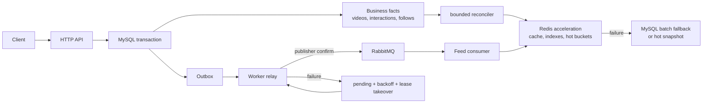

# GoFeed Feed 核心演进方案

> 更新日期：2026-09-30
>
> 状态：**规划，尚未进入实现**。本文件把工作区根目录的 Feed 演进设计校准到当前 GoFeed；当前 API、路由、迁移和已提交功能事实仍以 `AGENTS.md`、`README.md`、`API.md`、`backend/internal/router/router.go` 与 `backend/db/migrations` 为准。

本方案让 GoFeed 在不破坏现有可靠发布链路的前提下，逐步获得 Timeline 缓存、Following、Hot 与规则推荐能力。它借鉴 GCFeed 的读模型、缓存和场景拆分，以及 feedsystem 的队列隔离和消费者运行方式；不复制二者把 Redis 或 RabbitMQ 当业务事实源的做法。

## 1. 校准后的基线

截至本文更新时，以下是已经存在的能力而非本方案的目标：

- `GET /api/video` 是唯一的公共视频流入口，按 `(published_at DESC, id DESC)` 游标读取；`router.go` 尚未注册 `/api/feed`。
- `backend/internal/feed` 尚不存在。公开视频读取仍位于 `video` 包，并通过 `PublicVideoQuery` 保证已发布、未软删除、发布时间和完整媒体字段等不变量。
- `video_outbox_events` 当前只承载 `video.process`：发布事务受理 `draft → processing` 后写入，worker relay 在 publisher confirm 后标记派发，consumer 将视频 CAS 为 `published` 或 `rejected`。
- Redis Runtime 当前只服务注册/登录限流；连接故障会短路并按该用途 fail-open，`/ready` 只依赖 MySQL。

因此，本文中的 Feed Outbox、缓存页、Following 索引、热榜、曝光与推荐均为后续设计，不能出现在当前 API 文档、架构图或完成状态中。现有 `GET /api/video`、草稿状态机、Outbox 租约、Worker 重试/DLQ 和 Vue Feed 是演进基线，不重写为 React，也不进行全仓 DDD 搬迁。

## 2. 不可变的事实来源与恢复原则



| 组件 | 地位 | 必须满足的约束 |
| --- | --- | --- |
| MySQL | 唯一业务事实源 | 视频、互动、关注、曝光和 Outbox 状态都能独立恢复；MySQL 故障不伪造成功，只在超时边界返回安全错误 |
| Redis | 可丢失的加速层 | Key 必须可由 MySQL 重建；不得把 Feed 页、ZSET、限流计数或队列深度当作唯一业务记录；不使用 `FLUSHDB` 作为恢复手段 |
| RabbitMQ | 派生任务传输层 | API 只在 MySQL 事务中写事实和 Outbox；relay 收到 confirm 后才能更新派发状态；consumer 先完成持久化/派生动作再 ACK |

现有 `video.process` 可靠链路继续只处理媒体校验。F2 新增 Feed 事件前，必须先让 relay 和 Worker 支持明确的事件类型/消费者规格；当前 relay 会跳过未知事件类型，因此不能仅在现有表插入 `video.published`、`interaction.changed` 或 `follow.changed`。

## 3. 从参考项目吸收的边界

| 来源 | 吸收 | 明确不照搬 |
| --- | --- | --- |
| GCFeed | 卡片/统计拆分、分钟热榜、发布后预热、大小作者推拉混合、推荐场景拆分 | Redis 先写互动再异步落 MySQL；生产请求直接投递 MQ 而没有 Outbox + confirm 闭环 |
| feedsystem_video_go | 事件隔离、独立 Worker 消费、QoS、重连、延迟重试与 DLQ | 业务请求先投 MQ、失败再直写 MySQL 的双写路径 |
| 当前 GoFeed | MySQL 事务 + Outbox、publisher confirm、租约接管、消费端 CAS 幂等、受控重试/DLQ | 不把已有可靠发布链路改成 API 直连 MQ |

## 4. 读模型、缓存和降级约束

Feed 读模型分为轻量视频 ID 页、视频卡片和互动统计三层。无论是否命中缓存，公开数据始终沿用现有公开视频不变量；卡片、作者和统计必须按 ID 批量读取，禁止 N+1。

| 场景 | Redis 加速 | Redis 不可用时 | 恢复方式 |
| --- | --- | --- | --- |
| Timeline | 匿名 ID 页、卡片和统计 | 按当前 `(published_at, id)` 游标批量查询 MySQL | 成功响应后限量 cache-aside 回填 |
| Following | 小作者粉丝 Inbox；大作者 Author Outbox | `user_follows + videos` 的游标合并查询 | Worker 从关注关系和已发布视频按水位限批重建 |
| Hot | 分钟窗口 ZSET | MySQL 热榜快照；无快照时显式降为 Timeline | 从稳定互动事件/快照重建分钟桶 |
| Recommend | 候选集 | 规则候选（关注、热度、新鲜度、近期曝光去重、作者打散），再降为 Timeline | 行为数据与规则候选仍以 MySQL 重算 |

依赖保护必须按“依赖 + 用途”隔离：Feed 缓存、Following 索引、热榜与限流不能共用一个全局开关。Redis 连续失败时跳过连接等待并进入 Open；冷却结束后只允许一个 Half-open 探针，成功后按流量回填。限流沿用已实现的 fail-open；Feed 读取改为 MySQL 回源；MQ relay 的失败保留 pending 事件并退避；Consumer 的短暂失败经 `1s → 5s → 30s` 延迟队列重试，载荷/版本错误或耗尽后进入 DLQ。

匿名公共页缓存不得承载登录用户状态。个性化 `liked`、`following`、推荐结果必须绑定用户和场景，响应采用 `Vary: Authorization` 与 `Cache-Control: private, no-store`；必要时直接跳过公共页缓存。

## 5. 渐进的 Feed 边界

现有 Controller → Service → Repository 仍是已有领域的主干。只在 Feed 核心使用绞杀式迁移，不搬迁或重命名 `video`、`social`、`user`、`auth` 包。

```text
backend/internal/feed/
  domain/                 # Scene、Cursor、候选、排序/去重/打散、领域错误
  application/            # Timeline/Following/Hot/Recommend 用例与窄端口
  infra/
    persistence/          # MySQL 查询、Feed 事件、快照、消费幂等记录
    cache/                # Redis Key、TTL、重建
    mq/                   # Feed 事件编解码与消费者适配
  interfaces/
    http/                 # Gin Handler
    worker/               # Worker Handler
```

依赖始终向内：`interfaces → application → domain`；`infra` 实现由 `application` 定义的窄端口。路由和 Worker 启动代码仍是组合根，负责注入实现。Feed 只能通过 `PublishedVideoReader`、`FollowReader`、`InteractionReader` 等读接口访问既有领域，不能反向依赖其 Repository、GORM 模型或内部实体细节。

F0 不为目录而完整拆出所有层：只创建当前 Timeline 所需的 `interfaces/http`、`application` 和最小读接口；`domain`、Redis/MQ 适配层随能力进入。后续每次只迁移一个读场景或一条派生链路，保留旧入口作为回退。

## 6. F0–F6 实施顺序

| 阶段 | 独立交付 | 当前状态与关键停留条件 |
| --- | --- | --- |
| F0 | Feed 契约与 Timeline 兼容边界 | **未开始**。新增 `internal/feed` 的最小边界并设计 `GET /api/feed`；`GET /api/video` 原样保留，响应仍复用当前展示模型 |
| F1 | Timeline cache-aside | **未开始**。先证明 MySQL 正确路径、批量查询和游标稳定，再接入 ID 页/卡片/统计缓存；Redis 失败必须不改变 HTTP 成功语义 |
| F2 | Feed 事件与发布预热 | **未开始**。发布成功转为 `published` 的同一事务写入 Feed 派生事件；扩展通用 relay/consumer 后才预热卡片、统计和首页 |
| F3 | Following 推拉混合 | **未开始**。先实现 MySQL Following 回退，再引入小作者 Inbox、大作者 Author Outbox、关注补偿和取关过滤 |
| F4 | Hot | **未开始**。互动仍先写 MySQL 并写派生事件；Consumer 幂等聚合分钟桶，MySQL 热榜快照作为故障回退 |
| F5 | 曝光与规则推荐 | **未开始**。以 `request_id` 记录曝光/有效观看/完播；先提供可解释规则推荐，数据充分后才评估向量召回 |
| F6 | Reconciler、观测与运维 | **未开始**。按水位限批重建缓存、热榜和索引；增加命中率、降级、回源、快照年龄、fanout 延迟、重建滞后与 DLQ 指标 |

### F0 契约冻结

计划中的新入口为 `GET /api/feed?scene=timeline|following|hot|recommend&cursor=&limit=`。F0 只实现 `timeline`；其余场景的未启用响应必须在编码前写入 `API.md`，不能让客户端猜测。新游标保持不透明，至少绑定版本、场景、排序版本以及必要的用户/资源范围，防止跨场景或跨用户复用。F0 不修改现有 `GET /api/video` 的参数、顺序或响应；新入口稳定后才单独评估兼容转发或废弃窗口。

### F2 数据与幂等约束

Feed 派生事件与业务事实必须在同一 MySQL 事务提交。落地时先检查迁移最高版本，不预占编号，并明确以下内容：

- 事件唯一 ID 与消费者幂等键（例如 `consumer_name + event_id` 唯一，或可证明等价的业务 CAS）
- 事件版本、队列、重试/DLQ 规格及 ACK 时机
- 热榜原始事件或按窗口唯一的 MySQL 快照，作为 Redis 不可用时的有界回退来源
- 曝光记录的 `user_id + request_id + video_id` 唯一约束，避免同一拉取重复归因

不能把现有视频处理 Outbox 的 `dispatched` 状态误解释为 Feed 预热已经完成；派发和每个 Feed consumer 的处理水位/幂等结果需要各自可追踪。

### F3–F6 的容量与回滚边界

- 大小作者阈值、Inbox 长度、补偿窗口、热榜窗口、缓存 TTL、Reconciler 批量上限都必须配置化、记录指标并可独立回滚。
- 不在 API 请求中执行大规模 fanout、热榜全表聚合或全库 Redis 清理。
- DLQ 不是自动丢弃区：保留事件 ID、失败原因、重放入口和处置记录。
- 监控平台、阈值、告警接收人需要单独决策；在此之前，stdout 事件只能证明日志存在，不能写成已告警。

## 7. 每个模块的交付门槛

每个 F 阶段拆为独立提交、独立 review 的小模块。设计契约至少写清：

1. MySQL 事实表、事务边界、迁移与幂等键；
2. Redis Key、TTL、失效/回填逻辑和故障返回；
3. MQ 事件版本、队列、retry/DLQ、ACK 和重放语义；
4. 新旧 API 的兼容策略、游标范围与个性化缓存边界；
5. 重建来源、水位、批量上限、可观测事件和告警责任；
6. 后端契约测试、真实 MySQL/Redis/RabbitMQ 证据、前端门禁与真实联合验收分别覆盖的范围。

F0 的第一个实现模块只允许包含 Feed 契约、最小依赖边界和 Timeline 兼容读模型。Following、热榜、推荐、Redis Feed 索引、Feed MQ 事件和 Reconciler 必须留在后续独立模块中。

## 8. 与保留文档的关系

- [`README.md`](./README.md) 是已完成能力的简要概述、当前工作状态和本文入口；不再保留已完成任务的独立方案或架构文档。
- 本文是唯一保留的未实施 Feed 路线，负责 F0–F6 的详细边界、降级和交付规则。
- [`API.md`](./API.md) 在 F0 契约冻结前不增加 `/api/feed`；路由实际注册后才写入接口细节。
- [`AGENTS.md`](./AGENTS.md) 约束实现、迁移、验证与提交；新任务仍须以当前路由、迁移和源码核对本文的规划前提。
