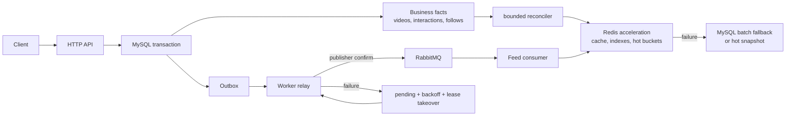

# GoFeed Feed 核心演进方案

> 更新日期：2026-09-30
>
> 状态：**F0 后端已分模块提交；F1-A 批量公开卡片读取已按用户指令提交为 `a7e2bd4`，缓存尚未接入；F2–F6 仍为规划**。运行验收仍待完成。本轮不修改前端、不编写 `*_test.go`、不运行测试或联调；前端接入与单元测试已列为明确待办，因此不能把实现状态记为验收通过。本文件是 F0–F6 编号与实施边界的唯一详细方案；工作区根目录路线作为参考，当前事实以源码、迁移、`README.md` 和 `API.md` 为准。

本方案让 GoFeed 在不破坏现有可靠发布链路的前提下，逐步获得 Timeline 缓存、Following、Hot 与规则推荐能力。它借鉴 GCFeed 的读模型、缓存和场景拆分，以及 feedsystem 的队列隔离和消费者运行方式；不复制二者把 Redis 或 RabbitMQ 当业务事实源的做法。

## 1. 校准后的基线

截至本文更新时，以下是已经存在的能力而非本方案的目标：

- `GET /api/video` 是保持兼容的公共视频流入口，按 `(published_at DESC, id DESC)` 游标读取；`router.go` 另外注册 `GET /api/feed`，当前只启用匿名 Timeline。前端仍使用 `/api/video`。
- Feed 已采用 GCFeed 的按层目录：`domain/feed`、`application/feed`、`infra/persistence/feed`、`interfaces/http/feed`。应用层负责 `limit+1` 探测、截断、批量作者/统计组装和下一页游标；HTTP DTO 单独维护展示字段。
- `infra/persistence/feed/legacy_reader.go` 实现领域读取接口，复用现有 video Repository、作者读取适配器和 social 聚合；不再调用 `video.Service`，也不进行新旧外部游标转换。SQL、GORM 实体与公开过滤规则继续留在既有模块中。
- `video_outbox_events` 当前只承载 `video.process`：发布事务受理 `draft → processing` 后写入，worker relay 在 publisher confirm 后标记派发，consumer 将视频 CAS 为 `published` 或 `rejected`。
- Redis Runtime 当前只服务注册/登录限流；连接故障会短路并按该用途 fail-open，`/ready` 只依赖 MySQL。

因此，本文中的 Feed Outbox、缓存页、Following 索引、热榜、曝光与推荐均为后续设计，不能标记为已完成。现有 `GET /api/video`、草稿状态机、Outbox 租约、Worker 重试/DLQ 和 Vue Feed 是演进基线，不重写为 React，也不进行全仓 DDD 搬迁。下图描述含 F2 以后能力的目标链路，不是当前运行架构。

## 2. 不可变的事实来源与恢复原则



| 组件 | 地位 | 必须满足的约束 |
| --- | --- | --- |
| MySQL | 唯一业务事实源 | 视频、互动、关注、曝光和 Outbox 状态都能独立恢复；MySQL 故障不伪造成功，只在超时边界返回安全错误 |
| Redis | 可丢失的加速层 | Key 必须可由 MySQL 重建；不得把 Feed 页、ZSET、限流计数或队列深度当作唯一业务记录；不使用 `FLUSHDB` 作为恢复手段 |
| RabbitMQ | 派生任务传输层 | API 只在 MySQL 事务中写事实和 Outbox；relay 收到 confirm 后才能更新派发状态；consumer 先完成持久化/派生动作再 ACK |

现有 `video.process` 可靠链路继续只处理媒体校验。F2 新增 Feed 事件前，必须先让 relay 和 Worker 支持明确的事件类型/消费者规格；当前 relay 会跳过未知事件类型，因此不能仅在现有表插入 `video.published`、`interaction.changed` 或 `follow.changed`。

## 3. 从参考项目吸收的边界

| 来源 | 吸收 | 明确不照搬 |
| --- | --- | --- |
| GCFeed | 卡片/统计拆分、分钟热榜、发布后预热、大小作者推拉混合、推荐场景拆分 | Redis 先写互动再异步落 MySQL；生产请求直接投递 MQ 而没有 Outbox + confirm 闭环 |
| feedsystem_video_go | 事件隔离、独立 Worker 消费、QoS、重连、延迟重试与 DLQ | 业务请求先投 MQ、失败再直写 MySQL 的双写路径 |
| 当前 GoFeed | MySQL 事务 + Outbox、publisher confirm、租约接管、消费端 CAS 幂等、受控重试/DLQ | 不把已有可靠发布链路改成 API 直连 MQ |

## 4. 读模型、缓存和降级约束

Feed 读模型分为轻量视频 ID 页、视频卡片和互动统计三层。无论是否命中缓存，公开数据始终沿用现有公开视频不变量；卡片、作者和统计必须按 ID 批量读取，禁止 N+1。

F1 先冻结删除、作者资料和互动变化的失效规则，以及并发旧请求再次回填的防护；不能仅依靠发布预热和 TTL 保证公开状态。首个缓存模块可先缓存 ID 页，再用 MySQL 批量校验公开状态，后续逐项接入卡片、统计缓存。缓存超时、回填队列和并发回源都必须有界。

| 场景 | Redis 加速 | Redis 不可用时 | 恢复方式 |
| --- | --- | --- | --- |
| Timeline | 匿名 ID 页、卡片和统计 | 按当前 `(published_at, id)` 游标批量查询 MySQL | 成功响应后限量 cache-aside 回填 |
| Following | 小作者粉丝 Inbox；大作者 Author Outbox | `user_follows + videos` 的游标合并查询 | Worker 从关注关系和已发布视频按水位限批重建 |
| Hot | 分钟窗口 ZSET | MySQL 热榜快照；无快照时显式降为 Timeline | 从稳定互动事件/快照重建分钟桶 |
| Recommend | 候选集 | 规则候选（关注、热度、新鲜度、近期曝光去重、作者打散），再降为 Timeline | 行为数据与规则候选仍以 MySQL 重算 |

依赖保护必须按“依赖 + 用途”隔离：Feed 缓存、Following 索引、热榜与限流不能共用一个全局开关。Redis 连续失败时跳过连接等待并进入 Open；冷却结束后只允许一个 Half-open 探针，成功后按流量回填。限流沿用已实现的 fail-open；Feed 读取改为 MySQL 回源；MQ relay 的失败保留 pending 事件并退避；Consumer 的短暂失败经 `1s → 5s → 30s` 延迟队列重试，载荷/版本错误或耗尽后进入 DLQ。

匿名公共页缓存不得承载登录用户状态。个性化 `liked`、`following`、推荐结果必须绑定用户和场景，响应采用 `Vary: Authorization` 与 `Cache-Control: private, no-store`；必要时直接跳过公共页缓存。

## 5. 渐进的 Feed 边界

现有 Controller → Service → Repository 仍是已有领域的主干。Feed 按 GCFeed 的“先分层、再分模块”组织，小步迁移读取职责；不搬迁或重命名 `video`、`social`、`user`、`auth` 包。

```text
backend/internal/
  domain/feed/
    entity.go             # 场景、结构化位置、页条目、卡片、作者、统计
    errors.go             # 领域错误
    repository.go         # Timeline 与批量读取接口
  application/feed/
    service.go            # 场景选择、分页、批量组装
    cursor.go             # 独立 Feed 游标编解码
  infra/
    persistence/feed/
      legacy_reader.go    # 适配既有仓储，复用 SQL 和公开过滤
      card_reader.go      # F1-A 独立批量公开卡片读取与共享字段转换
  interfaces/http/feed/
    handler.go            # 参数解析、错误映射
    dto.go                # HTTP 响应及显式转换
  router/router.go        # 保留现有组合根
```

依赖向内：`interfaces/http/feed → application/feed → domain/feed`；`infra/persistence/feed → domain/feed` 实现领域 Repository。domain 只依赖标准库，application 只依赖标准库与 Feed domain；二者不导入既有实体、Gin、GORM、Redis 或 MQ。HTTP DTO 不进入领域模型，游标编码继续归应用层。

外层 legacy reader 可依赖既有仓储与实体，但只返回纯 Feed 读模型。router 注入 `video.Repository`、`video.UserAuthorReader`、`social.Repository`；旧 video 包不再依赖 Feed application。`video.IsPublicVideo` 导出原有实体级判断供适配器复用，SQL 仍沿用 `PublicVideoQuery`，避免复制公开规则。

当前 MySQL 路径一次视频查询同时返回轻量页条目与附带卡片，应用层截断后再批量读取作者、点赞和评论统计。探测用的额外视频不进入作者/统计批次，也不会为拆分卡片再查询一遍视频；非空页的语句结构仍为视频 1 次、作者 1 次、两类统计各 1 次。该预算来自静态代码，尚未执行真实 MySQL 验证。

F0 不新增数据库模型、迁移、Redis/MQ 适配层或其他场景；这些目录随实际能力进入。F1 再设计独立页/卡片缓存缺失读取与公开状态校验，保持回源有界。后续每次只迁移一个读场景或一条派生链路，保留旧入口作为回退。

## 6. F0–F6 实施顺序

| 阶段 | 独立交付 | 当前状态与关键停留条件 |
| --- | --- | --- |
| F0 | Feed 契约与 Timeline 四层读取边界 | **后端代码已分模块提交，未测试或联调**。按 GCFeed 目录归位，Feed 接管分页及批量组装；前端接入和单元测试待补齐 |
| F1 | Timeline cache-aside | **F1-A 已提交为 `a7e2bd4`，缓存未接入**。MySQL 正确路径、批量查询和游标仍待运行验收，再接入 ID 页/卡片/统计缓存；Redis 失败必须不改变 HTTP 成功语义 |
| F2 | Feed 事件与发布预热 | **未开始**。发布成功转为 `published` 的同一事务写入 Feed 派生事件；扩展通用 relay/consumer 后才预热卡片、统计和首页 |
| F3 | Following 推拉混合 | **未开始**。先实现 MySQL Following 回退，再引入小作者 Inbox、大作者 Author Outbox、关注补偿和取关过滤 |
| F4 | Hot | **未开始**。互动仍先写 MySQL 并写派生事件；Consumer 幂等聚合分钟桶，MySQL 热榜快照作为故障回退 |
| F5 | 曝光与规则推荐 | **未开始**。以 `request_id` 记录曝光/有效观看/完播；先提供可解释规则推荐，数据充分后才评估向量召回 |
| F6 | Reconciler、观测与运维 | **未开始**。按水位限批重建缓存、热榜和索引；增加命中率、降级、回源、快照年龄、fanout 延迟、重建滞后与 DLQ 指标 |

### F0 契约冻结

已注册入口为 `GET /api/feed?scene=timeline&cursor=&limit=`。省略或空 `scene` 默认 `timeline`；未知场景返回 `400`，`following`、`hot`、`recommend` 返回 `501` 和 `Cache-Control: no-store`，不静默降为 Timeline。只接受单值的 `scene`、`cursor`、`limit`；`limit` 省略时为 20，显式值为 1–50，其他参数或重复参数返回 `400`。

响应与当前 `VideoListResponse` 的字段一致，空页为 `items: []`，无下一页时省略 `next_cursor`。新游标独立绑定版本 `1`、`timeline`、排序版本 `1` 及 `(published_at, id)` 位置，拒绝未知字段和超过 1024 字符的输入；与旧视频游标不可互换。F0 为匿名全局读取，不返回用户专属状态；后续个性化场景再加入用户范围。完整状态码与参数处理顺序见 `API.md`。

新 Feed 游标 JSON 字段使用完整名称：`version` 表示载荷结构版本，`scene` 表示场景，`sort_version` 表示排序规则版本，`published_at` 与 `video_id` 表示上一页最后一条视频的分页位置。此次命名调整仅作用于新 Feed 游标，旧 `/api/video` 游标格式保持不变。

F0 不改变现有 `GET /api/video` 的参数、顺序、响应或发布时间语义，不新增迁移、Redis/MQ 依赖。后端完成 review 后，前端切换和必要验收须单独安排；新入口稳定后才评估旧入口转发或废弃窗口。

### F0 完成项与本轮暂缓项

- [x] 后端按 GCFeed 四层目录归位，领域模型/接口、应用用例、基础设施适配与 HTTP DTO 分开
- [x] Feed 应用层接管 Timeline 分页、截断、下一页游标及作者/统计批量组装
- [x] 移除旧 `video.FeedReader`，消除旧 Service 委托及新旧外部游标转换
- [x] 更新 API、README 和工作区参考路线，明确源码实现与运行验收的区别
- [x] 本轮仅执行 Go 格式整理、`go build ./...` 编译检查和 Git 差异检查；编译通过，不代表测试或运行验收通过
- [ ] 前端改动：Feed 请求切换至 `/api/feed`，保留现有取消、重试、分页去重和播放可见性管理；当前仍请求 `/api/video`
- [ ] 后端单元测试：补场景/数量/游标校验、分页边界、额外探测行排除、作者/统计批量组装、读取失败及 HTTP DTO/状态码契约；本轮不新增或修改 `*_test.go`
- [ ] 前端单元测试：随新接口接入调整请求及分页状态用例；本轮不修改前端测试文件
- [ ] 运行验收：真实 MySQL 下核对新旧接口的排序、公开过滤、分页和查询预算，并在前端接入后完成联合验收；本轮不运行任何测试或联调
- [x] 后端按领域与应用、仓储适配、HTTP 入口三个模块提交；各提交的暂存后端快照分别通过 `go build ./...`
- [ ] 后端 review；按下列提交边界分别审查

上述暂缓项不是已完成能力。以后实际补齐时，应按执行结果更新对应勾选、验证范围与提交信息。

### F0 提交边界与回归范围

| 提交 | 模块边界 | 前置依赖 | 回归时应核对的能力 |
| --- | --- | --- | --- |
| `8394035` | `domain/feed` 与 `application/feed` | 原后端基线 `59e185a` | 场景、数量、独立游标、分页探测与截断、作者/统计批量组装；尚不装配新 HTTP 入口 |
| `224d8ff` | `infra/persistence/feed` 与原公开视频判断的导出包装 | `8394035` | 仓储接口实现、公开过滤、结构化位置映射、批量读取及错误映射；原视频服务逻辑不变 |
| `7541269` | HTTP Handler、DTO、路由装配与 `API.md` | 前两个提交 | `/api/feed` 参数、响应与错误契约，以及原 `/api/video`、鉴权、发布、互动和媒体路由的兼容性 |

按上述依赖顺序应用提交，可分别检出每个提交检查该阶段的完整后端。提交前均从暂存树导出后端快照编译，未借用后续未提交文件；各快照编译与暂存差异检查通过。自动化测试、真实 MySQL 回归和页面联调均未执行，上表记录的是后续回归范围。README 与本方案的校准另作纯文档提交。

### F1 小步模块与 F1-A 读取契约

| 模块 | 当前状态 | 交付边界 |
| --- | --- | --- |
| F1-A | 已按用户指令提交为 `a7e2bd4`、编译通过，运行验收待补 | 增加当前公开视频批量读取与独立 Feed `CardReader`；不接入用例或路由 |
| F1-B | 未开始 | 定义窄页缓存接口，实现 Key、载荷校验、TTL 和有界读写；暂不装配路由 |
| F1-C | 未开始 | 仅在 `/api/feed` 接入命中、回源、回填、独立故障保护与基础观测；默认关闭，保留旧入口 |

F1-A 在 `video.Repository` 增加 `GetPublishedByIDs`，在 `domain/feed` 定义独立 `CardReader.BatchGetCards`，由 `infra/persistence/feed.NewCardReader` 适配。现有领域 Repository、video Service 的读取接口、Feed 应用用例与路由装配不变；`legacy_reader` 和新卡片读取共用同一字段转换。

- 输入忽略零 ID 并去重，最多接受 51 个有效 ID（页大小上限 50 加一条下一页探测记录）。超过上限整体返回批次错误，不静默截断或拆成无界查询。
- 空输入或全部为零 ID 返回已初始化的空切片或空 map，不查询数据库；非空有效批次使用一次参数化 `WHERE id IN ?` 查询，仅投影卡片及公开判断所需列。
- SQL 沿用 `PublicVideoQuery`，实体再沿用现有公开判断；未找到、未发布、已软删除、缺少完整媒体或有效发布时间的视频不返回。
- Feed 卡片以视频 ID 为键，不依赖 SQL 返回顺序；不返回请求范围之外的实体。后续缓存编排按原页条目排序，不存在的卡片作为缓存失效依据，不能直接解释为分页结束。
- 视频仓储的超限错误映射为 `ErrInvalidCardBatch`；缺少读取依赖或数据库读取失败映射为 `ErrUnavailable`，保留底层错误供内部处理，不以空结果掩盖故障。
- F1-A 尚未被现有请求用例调用，`/api/video` 和 `/api/feed` 的参数、响应、游标和查询次数不变；本模块不新增 HTTP 接口、迁移、配置、Redis 或 MQ 依赖。

本轮实际执行 Go 格式整理、`go build ./...` 与 Git 差异检查；编译通过。后续回归应覆盖空/零/重复 ID、51/52 个有效 ID、乱序返回、部分不可见、已软删除、无效发布时间、数据库错误及完整字段转换；按用户要求，本轮未编写或运行任何测试，也未进行真实 MySQL 验证。F1-A 作为包含代码与本节契约的一个独立模块提交。

F1 的后续缓存方案仍需冻结：首屏走 MySQL，先缓存带游标的后续页；命中后批量校验当前公开状态，发现缺失或不一致则从原请求游标回源重建整页。缓存操作使用短超时子上下文，Feed 故障状态与限流隔离，缓存读写失败不改变 MySQL 成功结果。ID 页缓存通常不减少当前每页的 SQL 数量，其收益需另行验证；卡片和统计缓存按各自失效规则分别推进。

### F1-B 下一模块边界

F1-B 只交付可注入的页缓存端口与读写适配器，不构造 Redis Runtime、不修改配置、启动、路由、`Service.New` 或 `GetFeed`。实现完成后保留改动等待用户 review，收到提交指令后才提交。F1-C 再负责真实依赖装配与缓存请求编排。

| 内容 | 约定 |
| --- | --- |
| 目录与依赖 | 在 `application/feed` 定义页缓存端口及轻量载荷，在 `infra/cache/feed` 实现；内层不导入 Redis 库，底层依赖只要求可注入的 `Get`、`Set` 能力 |
| 缓存内容 | 仅保存有序页条目（视频 ID、作者 ID、发布时间），保留最多 `limit+1` 条探测数据；不保存整页 HTTP 响应、卡片、作者资料、互动统计或用户专属状态 |
| 查询标识与 Key | 使用结构化场景、页大小、规范化的游标位置及版本生成 Key；包含缓存载荷版本与排序版本，不依赖客户端原始游标字符串的不同编码形式 |
| 命中语义 | 读取接口显式返回载荷、是否命中与错误；键不存在表示未命中，有效空页表示命中，连接失败或非法载荷保留错误，由后续用例决定回源 |
| 载荷校验 | 数量最多为 `limit+1`，视频 ID 非零且不重复、发布时间有效；条目严格按 `(published_at DESC, id DESC)` 排列，并符合请求游标范围；编码结构和版本不匹配视为非法缓存 |
| 有界操作 | TTL、操作超时和载荷字节上限必须明确；拒绝无期限缓存和超大载荷。具体默认值在 F1-B 实现及 review 时确认，不以未经验证的值宣称性能收益 |

现有 Redis Client/Runtime 已提供 `Get`、`Set`，无需为了 F1-B 增加通用 Redis 功能或改造限流；Redis 的键不存在错误在外层适配器转换为未命中。F1-C 装配时使用独立 Feed Runtime，保持故障与恢复状态同限流隔离；构造适配器本身不发起连接或请求。

F1-C 的调用顺序应为：校验请求与游标 → 仅尝试后续页缓存 → 命中后用 F1-A 批量读取当前公开卡片 → 卡片缺失或位置不一致时按原请求游标读取 MySQL 整页 → 应用层探测、截断、作者/统计组装及生成下一页游标。回填只能使用完整且已校验的页条目，不能把截断后的响应页写回以免丢失探测记录。首版可使用同步、限时回填，避免在请求中创建无界后台任务；写入失败不改变 HTTP 成功结果。

F1-B 后续回归范围为未命中、有效空页、载荷往返、Key 规范化、版本/数量/重复 ID/排序/位置校验、超大载荷、超时、底层读取与写入错误。本轮仅完成下一步分析和文档记录，F1-B 未实现，也未编写或运行测试。

### F2 数据与幂等约束

Feed 派生事件与业务事实必须在同一 MySQL 事务提交。落地时先检查迁移最高版本，不预占编号，并明确以下内容：

当前 `CompleteVideoProcessing` 只执行状态 CAS；F2 要把实际成功的 `processing → published` 与 Feed 事件插入合为一个事务，仅在 CAS 生效时生成事件。先扩展 relay 的类型路由、认领范围与消费者规格，再启用新事件，避免旧 relay 反复认领无法处理的事件；视频处理事件的 `dispatched` 不能作为 Feed 消费完成标记。

- 事件唯一 ID 与消费者幂等键（例如 `consumer_name + event_id` 唯一，或可证明等价的业务 CAS）
- 事件版本、队列、重试/DLQ 规格及 ACK 时机
- 热榜原始事件或按窗口唯一的 MySQL 快照，作为 Redis 不可用时的有界回退来源
- 曝光记录的 `user_id + request_id + video_id` 唯一约束，避免同一拉取重复归因

不能把现有视频处理 Outbox 的 `dispatched` 状态误解释为 Feed 预热已经完成；派发和每个 Feed consumer 的处理水位/幂等结果需要各自可追踪。

### F3–F6 的容量与回滚边界

- 大小作者阈值、Inbox 长度、补偿窗口、热榜窗口、缓存 TTL、Reconciler 批量上限都必须配置化、记录指标并可独立回滚。
- 不在 API 请求中执行大规模 fanout、热榜全表聚合或全库 Redis 清理。
- DLQ 不是自动丢弃区：保留事件 ID、失败原因、重放入口和处置记录。
- 监控平台、阈值、告警接收人需要单独决策；在此之前，stdout 事件只能证明日志存在，不能写成已告警。

## 7. 每个模块的交付门槛

恢复路径和最低限度的命中、降级、积压、水位指标随每个模块交付；不能把 Redis 索引重建和基础观测全部推迟到 F6。F6 负责完善、整合与运维收口。当前 F0 按用户要求不编写或执行测试，后续验收需要另行安排，不以编译结果替代运行证据。

每个 F 阶段拆为独立提交、独立 review 的小模块。设计契约至少写清：

1. MySQL 事实表、事务边界、迁移与幂等键；
2. Redis Key、TTL、失效/回填逻辑和故障返回；
3. MQ 事件版本、队列、retry/DLQ、ACK 和重放语义；
4. 新旧 API 的兼容策略、游标范围与个性化缓存边界；
5. 重建来源、水位、批量上限、可观测事件和告警责任；
6. 后端契约测试、真实 MySQL/Redis/RabbitMQ 证据、前端门禁与真实联合验收分别覆盖的范围。

F0 的第一个实现模块只允许包含 Feed 契约、最小依赖边界和 Timeline 兼容读模型。Following、热榜、推荐、Redis Feed 索引、Feed MQ 事件和 Reconciler 必须留在后续独立模块中。

## 8. 与保留文档的关系

- [`README.md`](./README.md) 是已完成能力的简要概述、当前工作状态和本文入口；不再保留已完成任务的独立方案或架构文档。
- 本文是 Feed 路线的权威详细方案，统一 F0–F6 编号、实现进度、降级和交付规则；工作区根目录路线保留为参考入口。
- [`API.md`](./API.md) 已随 F0 路由注册更新 `/api/feed` 契约；后续接口仍只在实际实现时记为可用。
- [`AGENTS.md`](./AGENTS.md) 约束实现、迁移、验证与提交；新任务仍须以当前路由、迁移和源码核对本文的规划前提。
