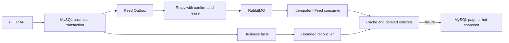

# GoFeed 开发计划

> 更新日期：2026-10-02。源码基线：`509c123`。本文统一后续任务、设计边界与待补验收；已完成能力简述见 [README](../README.md)，已实现接口见 [API](../API.md)，协作规则见 [AGENTS](../AGENTS.md)。

本次合并了原 Feed 演进方案、跨项目参考路线及被忽略的分步方案，校正其中过时的状态。历史文档中的测试记录不作为当前环境的验收结论。本轮只整理文档，不修改前后端代码，不编写或运行测试、联调。

## 1. 当前基线与优先顺序

MySQL 是唯一业务事实源；Redis 用于可丢失的加速和限流，RabbitMQ 用于至少一次投递。现有发布链路是事务写业务状态与 Outbox、relay 确认派发、consumer CAS 幂等完成处理。`video.process` 已有连接恢复、租约、退避、分级重试与 DLQ，不再重复安排旧 MQ 方案中的基础实现。

| 模块 | 当前状态 | 后续动作 |
| --- | --- | --- |
| F0：匿名 Timeline 四层边界 | `8394035`、`224d8ff`、`7541269` 已提交 | 前端接入、单元测试及真实运行验收待补 |
| F1-A：批量公开视频卡片 | `a7e2bd4` 已提交，当前请求未调用 | 缓存命中时读取当前公开状态 |
| F1-B：轻量页缓存端口与适配 | `509c123` 已提交，未装配 Runtime 或请求用例 | 保留现有读写契约，进入 F1-C |
| F1-C：Timeline 缓存接入 | 未开始，下一项后端模块 | 默认关闭，只接入 `/api/feed` |
| F2：Feed 事件与预热 | 未开始 | 先支持事件类型路由，再写新的 Outbox 事件 |
| F3：Following | 未开始 | 先 MySQL 正确查询，再推拉索引 |
| F4：Hot | 未开始 | 互动事件、分钟桶和 MySQL 快照 |
| F5：曝光与规则推荐 | 未开始 | 持久化归因、规则候选，向量召回另行评估 |
| F6：重建与运维收口 | 未开始 | 整合恢复水位、容量、重放、指标和告警 |

Feed 是按 GCFeed 目录逐步迁移的业务边界：`domain/feed` 定义读模型与读取接口，`application/feed` 编排分页及缓存端口，`infra/persistence/feed` 适配既有仓储，`infra/cache/feed` 适配 Redis，`interfaces/http/feed` 负责 HTTP。内层只依赖标准库和 Feed domain；不搬迁 `video`、`social`、`user`、`auth`。

当前 `/api/video` 与 `/api/feed` 均直接读取 MySQL，前端仍使用旧入口。新接口只启用 Timeline；未知场景为 400，已知但未启用的 Following、Hot、Recommend 为 501。游标独立绑定场景、结构版本、排序版本与 `(published_at, video_id)`，不与旧视频游标混用。现有接口必须保持可用，每次只迁移一个读取场景或派生链路。

## 2. F1-C：Timeline 缓存接入

### 已冻结的读取与缓存契约

- F1-A 的 `CardReader.BatchGetCards` 忽略零 ID、去重后最多接受 51 个有效 ID，超限整体报错；空批次不执行 SQL。一次参数化批量查询复用 `PublicVideoQuery` 和 `IsPublicVideo`；返回以视频 ID 为键的当前公开卡片，不依赖 SQL 顺序。数据库故障保留错误，缺失或不可见视频不返回。
- 原 MySQL 路径一次视频查询同时取得页条目与附带卡片，避免重复读取。`legacy_reader` 复用既有仓储，不委托旧 Service；Feed 应用层保留 `limit+1`、截断、作者/统计批量组装和下一页游标。
- F1-B 的 `PageCacheQuery` 仅接受 Timeline、响应页大小 1–50 和合法结构化游标。`CachedPage` 只保存视频 ID、作者 ID、发布时间，保留最多 `limit+1` 条探测记录。缓存 JSON 编解码位于 `infra/cache/feed/page_codeco.go`，不使用 HTTP DTO。
- Key：`gofeed:feed:page:v1:timeline:s1:l{limit}:{position}`；位置是 `start` 或 `{UTC RFC3339Nano}:{video_id}`，不使用客户端原始游标字符串。结构版本和排序版本隔离旧数据，同一时间点的时区表达不会生成不同 Key。
- `GetPage` 返回页、命中标志和错误：`redis.Nil` 是未命中，合法 `items: []` 是命中；连接/取消/超时归 `ErrPageCacheUnavailable` 并保留原因，非法输入归 `ErrInvalidPageCacheQuery`，非法载荷归 `ErrInvalidCachedPage`。
- 读写校验数量、非零且唯一的视频 ID、有效时间、严格倒序和请求游标范围；解码拒绝未知字段、额外 JSON 值、错误版本及缺失/null 的 items 或 author_id。作者 ID 可为零，沿用既有占位作者语义。
- 默认 TTL 30 秒、单次 Get/Set 超时 100 毫秒、载荷上限 16 KiB；可注入覆盖值，硬上限为 5 分钟、1 秒、64 KiB。零配置采用默认值，负值或超限拒绝构造；空页使用相同 TTL。
- 字节上限限制编码结果和读取后的解码，不能阻止底层 Get 先接收大值。注入依赖必须遵守 context；既有 Redis Client 已开启 `ContextTimeoutEnabled` 并禁用重试。构造适配器不连接、不请求。

### 接入顺序与兼容性

1. 校验请求和游标；首屏继续走 MySQL，只尝试带游标的后续页缓存。
2. 命中后用 F1-A 批量读取整份页条目的当前公开卡片，包括探测记录。
3. 卡片缺失、作者 ID 或发布时间不一致时，按原请求游标读取 MySQL 整页，不能丢掉失效项后继续使用缓存分页结果。
4. 应用层统一探测、截断、批量读取最终页作者与统计、生成下一页游标；探测行不进入作者/统计批次。
5. 回填使用完整且已校验的轻量页，保留额外探测记录。首版采用同步、短超时回填，不创建无界后台任务；缓存写失败不改变 MySQL 成功结果。

组合根注入独立 Feed Redis Runtime，与登录/注册限流分开维护故障、冷却与单探针恢复状态。配置默认关闭，关闭时保持现有查询路径；`/ready` 仍只依赖 MySQL。缓存命中、未命中、失效、读写失败和 MySQL 回源要有基础观测，内部错误不写入 HTTP 响应。

首版通过 MySQL 逐页校验公开状态，不依赖 TTL 保证删除或状态变化后的可见性；作者资料和互动统计仍实时批量读取。并发旧请求回填轻量页仍需再次校验，后续卡片/统计缓存必须各自定义失效与旧回填防护。缓存操作及回源并发均须有界。

当前非空页的静态查询结构为视频 1 次、作者 1 次、点赞/评论聚合各 1 次；ID 页缓存通常不会减少 SQL 数量。上线收益需另行证明，不把命中率或编译结果当作性能证据。

## 3. F2–F6：Feed 派生能力

| 阶段 | 最小交付及必须保留的约束 |
| --- | --- |
| F2：Feed 事件 | `processing → published` 实际 CAS 成功时，在同一 MySQL 事务写 `video.published`。当前 `CompleteVideoProcessing` 只更新状态，relay 跳过未知类型，必须先扩展事件路由与消费者规格，不能直接插入新类型。Consumer 幂等预热卡片、统计和首页，派发状态不能当作消费完成水位 |
| F3：Following | 使用真实 `user_follows(follower_id, followee_id)`、活动作者与公开规则查询 MySQL，建立按观看者绑定的游标。现有公开视频规则不自动排除注销作者，活动作者过滤归关注场景。再增加小作者粉丝 Inbox、大作者 Author Outbox、关注补最近视频与取关过滤 |
| F4：Hot | 点赞/评论仍同步落 MySQL，同事务写 `interaction.changed`。事件去重后更新分钟 ZSET；MySQL 保存有界快照或可重算事件窗口。Redis 故障先读快照，快照缺失再显式降为 Timeline，禁止每次请求实时全表聚合 |
| F5：曝光与推荐 | 持久化 `request_id`、曝光、有效观看与完播归因，唯一键至少绑定 `user_id + request_id + video_id`。规则先覆盖新鲜度、热度、关注、近期去重与作者打散；规则稳定且数据足够后才评估内容/兴趣向量召回 |
| F6：重建与运维 | 水位扫描、限批修复、事件重放与容量告警；基础恢复和观测随各模块交付，不能全部推迟到本阶段。大小作者阈值、Inbox 长度、补偿窗口、热榜窗口和重建批次需配置化、可观测、可回滚 |

新增 Feed Outbox、消费幂等/水位、热榜事件或快照、曝光记录时，实施前按迁移目录和目标库状态分配新版本，不预占迁移号。现有迁移最高为 `000009`，不能据此声称某个目标数据库已经应用。

原独立关注流方案归入 F3，目标入口优先评审 `/api/feed?scene=following` 的鉴权和观看者范围，不同时新增两套关注流编排。关注/取关、作者注销、发布/删除使结果集合动态变化，keyset 不保证跨页冻结快照。

参考 GCFeed 的卡片/统计拆分、分钟热榜、大小作者推拉和推荐分场景；参考 feedsystem 的队列隔离、独立消费者、QoS 和运行方式。保留 GoFeed 的 Outbox + confirm + lease + CAS + retry/DLQ，不复制 Redis 先写互动再异步落库或 API 先发 MQ 再直接写库的路径。

下图是 F2 以后目标架构，尚未实现：

| 依赖/用途 | 故障路径 | 恢复边界 |
| --- | --- | --- |
| Timeline 页缓存 | 跳过 Redis，按原游标批量回源 MySQL | 独立冷却、单探针、按流量回填 |
| Following 索引 | MySQL 关注集合查询 | 按水位限批重建 Inbox/Author Outbox |
| Hot / Recommend | 快照或规则候选，再显式降为 Timeline | 从事实事件、快照和行为数据重建 |
| RabbitMQ 派发/消费 | 保留 Outbox；重试消息确认前不 ACK 原消息 | 稳定 event_id、租约接管、连接恢复、幂等重投 |
| MySQL | 返回安全错误，不伪造业务成功 | `/ready` 以 MySQL 为准 |

不得全库清理 Redis、在请求中无界 fanout 或建立热循环重试。新队列只有业务吞吐、SLA、隔离或重试差异明确时才引入，并同时定义 schema、事务来源、幂等键、ACK、有限重试、DLQ 和受控重放。日志存在不代表监控告警已接通，平台、阈值和接收人仍待决策。

## 4. 其他待开发与评估模块

以下均未实现，按产品或容量需求单独立项。除 SSE 依赖通知持久化、会话缓存复用现有 Redis 能力外，不设置人为的硬前置依赖。

### pprof 诊断

默认关闭，API/worker 各使用独立 HTTP server 和显式 `ServeMux`，不注册到 Gin 或 `DefaultServeMux`，sweeper 暂不接入。只接受字面量 IPv4/IPv6 loopback 加端口，拒绝公网、wildcard 和主机名；配置示例里未生效的占位开关不能作为上线默认。复用 `observability`、配置加载与进程生命周期，设置 `ReadHeaderTimeout` 和独立 3 秒关闭上下文；配置错误或监听失败不终止业务进程。

### 会话校验缓存（C2，指标成立才实施）

先归因 `auth_sessions` 查询量与固定端点 p95，不能仅从请求总查询数判断收益；阈值在评估前明确，没有收益就记录不做。若立项，Key 为 `gofeed:session:{session_id}`，只缓存已校验 user ID、会话到期与结构版本，TTL 取 `min(5m, token 剩余时间, session 剩余时间)`；不缓存 refresh token 或用户资料。

未命中、用户不匹配、非法载荷或 Redis 故障回退 MySQL；登出提交成功后删除当前 Key。改密/注销要在现有事务锁定并收集实际撤销的 session ID，提交后逐项失效，禁止 SCAN 或全局通配删除。上线前明确登录发会话与撤销的并发锁定/版本契约，以及删除失败和旧请求回填造成的撤销窗口；没有证明时不能宣称缓存使所有旧 token 立即失效。`/ready` 不变。

### 分片上传与断点续传

- 保留原单请求上传、200 MB 视频上限；初版固定 5 MB 分片，只对视频媒体新增 JWT 保护的创建会话、传片、查状态、complete 端点，封面分片/秒传/内容去重不在范围内。
- MySQL 持久化 owner、draft、元数据、SHA-256、分片索引、过期、租约和预留最终对象；唯一键 `(upload_id, chunk_index)`。状态为 `uploading → assembling → completed`，失败/到期进入不可逆 `purging`。
- 临时片与 staging 必须在 `/static` 上传根目录之外。预留对象键先持久化再写文件，使移动成功、数据库绑定失败或崩溃时仍可追踪清理。
- 初始化锁定可写草稿和活动会话，相同元数据可恢复，冲突返回 409；分片流式校验长度与 SHA-256，重复片只有内容一致才幂等。complete 用 CAS/租约控制并发，完整校验后绑定草稿与会话同事务提交。
- `UpdateDraftMedia` 当前自行开启事务，不能嵌套调用后宣称原子；在 video Repository 抽取接受事务句柄的共同校验，由直传与分片共用。文件系统与 MySQL 没有共同事务，补偿失败保留可重试记录。
- 复用 `video`、`LocalStorage` 和现有 sweeper，不另起常驻分片服务。后续覆盖缺片、并发完成、草稿变化、崩溃恢复、补偿与过期清扫。

### 话题标签与话题流

在现有发布事务中从标题/描述提取 Unicode 字母、标记、数字、下划线构成的标签，NFC 与大小写规范化，最多 64 rune、每视频前 10 个去重标签。新增 `tags` 的规范名唯一键和 `video_tags` 复合主键/话题读取索引；并发 upsert 获取稳定 ID，关联与发布状态/Outbox 一起回滚，不让客户端提交标签事实。

规划 `GET /api/video?tag=...`，初版与 author_id 互斥；使用独立、绑定规范名的 TagCursor，已有 public/author/mine 游标保持兼容。话题条件放进列表 SQL，复用公开过滤与批量组装；没有公开视频返回空页。视频硬删除级联清除关联，无引用标签暂留为词典。索引收益用 EXPLAIN 证明；不同时开发热门标签、搜索建议或响应 tags 字段。

### 累计点赞榜（可选，区别于 F4 近期热度）

如产品需要，规划 `/api/video/likes`，从 `video_likes` 聚合，只包含有点赞关系的公开视频；不恢复已删除的冗余视频计数列。按 `(likes_count DESC, video_id DESC)` 使用独立游标，聚合子查询兼容 `ONLY_FULL_GROUP_BY`，复用公开与批量组装。

排序时点的聚合计数可能与响应组装时重读的计数不同，点赞/取消使排序动态变化，不承诺跨页快照。需要稳定结果时再设计 as_of/物化快照。实时聚合、索引与 Redis 窗口榜分别评估，不以同一名称混淆两种产品语义。

### 通知与 SSE

- 通知归 `social`：先把互动有效性检查、关系/评论创建与通知插入收敛为同一事务。仅真实新建且非自互动产生通知；重复 like/follow 不重复通知，通知失败回滚互动，软删除收件人跳过通知。
- 建议 `notifications` 保存收发人、类型、实际关系/评论 source_id、跳转线索、文案快照、已读状态及时间；唯一键 `(event_type, source_id)`，索引覆盖本人倒序列表及未读数。用户硬删除级联通知，视频/评论跳转线索不设阻止清扫的外键。
- JWT 保护本人通知列表、未读数、单条已读及全部已读；游标绑定 recipient，非本人资源为 404，已读幂等。单收件人同步通知不新增 MQ；广播等扇出再单独设计 Outbox。
- SSE 只在通知持久化后实施。JWT 端点签发 60 秒用途隔离 HMAC 票据，独立 stream 端点验证票据并复核 session，不把 access token 放 query。票据有效期内可重放，不能称为一次性凭据。
- 复用 social 的进程内 Hub：每用户最多 5 条连接、有限缓冲、满时丢帧、不阻塞互动；每 30 秒心跳。事务提交后才推送，不实现 Last-Event-ID 重放，多实例漏帧由通知列表/未读数重拉收敛。
- 票据采用 HMAC-SHA256 与常量时间签名比较，载荷绑定版本、用途、user/session 和到期时间。响应设置 `Cache-Control: no-store`、`Referrer-Policy: no-referrer`、`X-Accel-Buffering: no`，代理须对 ticket query 脱敏；登出前端主动关流，新连接检查撤销，已建立连接强制撤销及跨实例广播另立模块。列表、通知 UI、EventSource 页面接入需独立交付。

### 私信

独立 message 领域，同步写 MySQL；首版仅发送、按对端线程分页、标记已读与总未读数，SSE 不是前置条件。将会话对规范化为 `(participant_low_id, participant_high_id)`，保留 sender/recipient 方向、最多 2000 rune 内容、read_at 与时间；索引分别覆盖线程 keyset、总未读和对端已读更新，避免双向 OR 查询。

发送要求活动收件人且非本人；历史读取不要求对端仍活动，硬删除按账户清理语义级联。JWT 取本人 ID，游标绑定规范化会话对；已读仅更新发给本人的未读消息。迁移 CHECK 需验证 MySQL 版本支持，否则采用兼容 DDL 与服务端校验。会话摘要 inbox、附件、撤回、回执、全文搜索和实时推送另立模块。

### 公开 Feed 登录态（可选）

只有产品明确需要或逐视频查询点赞态产生实际压力时立项，目标入口优先评审新 Feed，旧公开接口保持兼容。无 Authorization 保持匿名响应，有凭据则校验 token/session，失败为 401 而不静默降成匿名；批量查询最终页点赞关系，不逐视频读状态。

观看者态用可选 `viewer.liked` 表达，不改变公开过滤、排序和游标。响应设置 `Vary: Authorization`；登录态和凭据失败响应采用 `private, no-store`，不写入匿名公共缓存。原直接 MySQL 列表的静态 4 条查询加 session 与点赞关系各 1 条为 6；新缓存编排需重新核对预算，不套用旧数字。详情、following 状态和推荐排序分别规划。

共享媒体存储、跨进程时区一致性与 `gorm.io/gen` 保留为独立评估项，当前没有已冻结实施方案。

## 5. 待补验证与交付门槛

源码实现、提交、编译、自动化测试和真实依赖验收分别记录。用户当前排除前端代码、`*_test.go` 和所有测试/联调，以下均为后续待办，不在文档整理中执行：

- [ ] F0：场景/数量/游标、分页探测与截断、作者/统计批量组装、错误和 HTTP DTO 契约。
- [ ] F1-A：空/零/重复 ID、51/52 边界、乱序返回、部分不可见或软删除、时间/媒体字段与数据库错误。
- [ ] F1-B：未命中/有效空页、JSON 往返、Key 规范化、版本/重复/排序/位置、字节上限、超时/取消、Get/Set 错误和非法配置；真实 Redis 过期及故障语义。
- [ ] F1-C：默认关闭兼容、命中再校验、失效整页回源、保留探测记录、缓存写失败不改变成功结果、故障状态隔离与恢复。
- [ ] 前端：从 `/api/video` 切换新 Feed 入口，保留取消、重试、去重和播放可见性管理；同步前端单元测试与真实联合验收。
- [ ] API 错误复用：补公共映射/cause 保留、user/video/social 状态与安全文案矩阵、未知错误脱敏、201/202/204 成功状态不变；原完成方案中的测试缺口继续保留。
- [ ] 原发布链路验收收口：目标数据库升级、索引/回填和 dirty 状态；真实 broker 的 confirm 丢失、标记失败、重复投递、进程重启、重试/DLQ 与故障恢复矩阵；真实后端浏览器联调。历史文档曾记录部分隔离发布/拒绝/清扫和浏览器回归，本轮不重跑，不能直接视为当前验收通过。
- [ ] 运维：processing/pending 不一致、积压最老年龄、DLQ、水位、回源延迟、容量与告警阈值；stdout 观测与告警平台接通分别确认。
- [ ] Outbox 归档/清理与异常事件处置策略：定义保留期、可重放范围和消费终态依据，不能仅凭 dispatched 将尚未处理完的事件当作可清理事实。

未来真实故障验证只使用隔离数据库、临时媒体目录和随机专用 RabbitMQ 拓扑，不破坏业务数据或共享队列。依赖不可用明确记录跳过，TCP 可达不代表闭环成功。

每个模块先核对 Git、路由、迁移与可复用代码，再冻结事实表/事务、Key/TTL/失效、队列/schema/幂等、API/游标/用户范围和恢复/观测边界。完成授权范围内验证后暂停 review，明确指令后独立提交，不提前实施下一模块。完成任务从本计划移除，将必要结果简述入 README；已有接口契约继续归 API.md。
