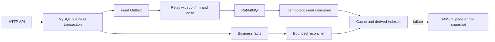

# GoFeed 开发计划

> 更新日期：2026-10-02。F1-C 已提交为 `f772349`；首页 Timeline 接入为 `896f4e1`，隔离浏览器联调工具为 `f4af6b8`，首页验收见第 5.5 节。F2-A 事件类型路由为 `48ce8df`，独立验收见第 5.6 节。本文统一后续任务、设计边界与待补验收；已实现能力简述见 [README](../README.md)，已实现接口见 [API](../API.md)，协作规则见 [AGENTS](../AGENTS.md)。

本文已合并原 Feed 演进方案、跨项目参考路线及分步方案。F1-C 默认关闭的缓存接入已按用户指令提交；F0–F1-C 补测、旧业务兼容、MySQL/迁移、发布链路与浏览器回归按模块独立验证。第 5 节区分首轮补测记录与审查修复后的实际验证，历史测试记录不作为当前环境的验收结论。

## 1. 当前基线与优先顺序

MySQL 是唯一业务事实源；Redis 用于可丢失的加速和限流，RabbitMQ 用于至少一次投递。现有发布链路是事务写业务状态与 Outbox、relay 确认派发、consumer CAS 幂等完成处理。`video.process` 已有连接恢复、租约、退避、分级重试与 DLQ，不再重复安排旧 MQ 方案中的基础实现。

| 模块 | 当前状态 | 后续动作 |
| --- | --- | --- |
| F0：匿名 Timeline 四层边界 | `8394035`、`224d8ff`、`7541269` 已提交；首页接入 `896f4e1` | 首页 mock 与隔离真实浏览器链路验收通过（第 5.5 节） |
| F1-A：批量公开视频卡片 | `a7e2bd4` 已提交，F1-C 开启后的缓存命中路径调用 | 真实数据库批量读取验收已完成（第 5 节） |
| F1-B：轻量页缓存端口与适配 | `509c123` 已提交，F1-C 已装配 | 适配器单测与真实 Redis 回归通过（第 5 节） |
| F1-C：Timeline 缓存接入 | `f772349` 已提交，默认关闭 | 自动化开关、命中校验、回源与兼容回归通过；收益与容量压测待补 |
| F2：Feed 事件与预热 | F2-A 事件类型路由 `48ce8df` 已提交；新事件与预热未开始 | 先确定新事件的消费者与派生数据契约，再实现同事务 Outbox 写入 |
| F3：Following | 未开始 | 先 MySQL 正确查询，再推拉索引 |
| F4：Hot | 未开始 | 互动事件、分钟桶和 MySQL 快照 |
| F5：曝光与规则推荐 | 未开始 | 持久化归因、规则候选，向量召回另行评估 |
| F6：重建与运维收口 | 未开始 | 整合恢复水位、容量、重放、指标和告警 |

Feed 是按 GCFeed 目录逐步迁移的业务边界：`domain/feed` 定义读模型与读取接口，`application/feed` 编排分页及缓存端口，`infra/persistence/feed` 适配既有仓储，`infra/cache/feed` 适配 Redis，`interfaces/http/feed` 负责 HTTP。内层只依赖标准库和 Feed domain；不搬迁 `video`、`social`、`user`、`auth`。

当前首页使用 `/api/feed?scene=timeline&limit=12`；作者主页继续使用直接读取 MySQL 的旧 `/api/video?author_id=...`。`/api/feed` 默认同样直接读取 MySQL，开启缓存后仅后续页使用轻量页缓存并校验当前公开卡片。新接口只启用 Timeline；未知场景为 400，已知但未启用的 Following、Hot、Recommend 为 501。游标独立绑定场景、结构版本、排序版本与 `(published_at, video_id)`，不与旧视频游标混用。现有接口必须保持可用，每次只迁移一个读取场景或派生链路。

## 2. Feed 缓存后续工作

F1-C 已提交的读取行为见 README 与 API；默认关闭，不改变旧接口。基础 `feed_page_cache` 事件日志已接入，指标与告警仍未接通。并发容量与取消释放有应用层单元覆盖，开关、首屏绕过、命中校验、整页回源与兼容性有真实 Redis/MySQL 装配回归；首页接入后，缓存关闭与开启后的第二页已通过真实浏览器验收（第 5.5 节）。生产默认 TTL 的端到端回源、多实例同 Key 竞争与容量压测仍待补。

- 当前非空页的静态查询结构为视频 1 次、作者 1 次、点赞/评论聚合各 1 次；ID 页缓存通常不会减少 SQL 数量。需比较开关前后的查询成本、p95、回源与缓存操作耗时，证明收益后再决定开启范围，不把命中率或编译结果当作性能证据。
- 卡片、作者资料与统计缓存尚未实现。F2 预热前先定义对应端口、版本、Key/TTL、批量读取和写入；删除/状态变化、资料更新和互动变更需要各自的失效及旧请求回填防护。不能仅复制 GCFeed 的长 TTL 后宣称可见性安全。
- 当前并发上限为每实例 32 个启用缓存的 Feed 请求、16 次缓存操作；请求容量耗尽返回安全 503，缓存容量耗尽跳过缓存。应用层并发/取消/释放单测已通过，真实容量压测仍待补；上限配置化和同 Key 请求合并按容量证据另行评估。
- 现有载荷上限只限制编码结果和 Get 后解码，不能阻止驱动先接收大值；后续若出现实际内存压力，再评估 Redis 端有界读取。

## 3. F2–F6：Feed 派生能力

| 阶段 | 最小交付及必须保留的约束 |
| --- | --- |
| F2：Feed 事件 | F2-A 已支持显式事件类型路由，生产仅注册 `video.process`。`CompleteVideoProcessing` 仍只更新状态；后续在 `processing → published` 实际 CAS 成功的同一 MySQL 事务写 `video.published`，须先确定并装配对应拓扑、消费者与幂等派生目标。卡片、统计和首页预热仍待设计，派发状态不能当作消费完成水位 |
| F3：Following | 使用真实 `user_follows(follower_id, followee_id)`、活动作者与公开规则查询 MySQL，建立按观看者绑定的游标。现有公开视频规则不自动排除注销作者，活动作者过滤归关注场景。再增加小作者粉丝 Inbox、大作者 Author Outbox、关注补最近视频与取关过滤 |
| F4：Hot | 点赞/评论仍同步落 MySQL，同事务写 `interaction.changed`。事件去重后更新分钟 ZSET；MySQL 保存有界快照或可重算事件窗口。Redis 故障先读快照，快照缺失再显式降为 Timeline，禁止每次请求实时全表聚合 |
| F5：曝光与推荐 | 持久化 `request_id`、曝光、有效观看与完播归因，唯一键至少绑定 `user_id + request_id + video_id`。规则先覆盖新鲜度、热度、关注、近期去重与作者打散；规则稳定且数据足够后才评估内容/兴趣向量召回 |
| F6：重建与运维 | 水位扫描、限批修复、事件重放与容量告警；基础恢复和观测随各模块交付，不能全部推迟到本阶段。大小作者阈值、Inbox 长度、补偿窗口、热榜窗口和重建批次需配置化、可观测、可回滚 |

### 3.1 F2-A：Outbox 事件类型路由

`worker.NewRelay` 保留原构造签名，默认只有 `VideoProcessRoute()`。`NewRelayWithRoutes` 接收完整路由列表，按 `event_type` 建立独立映射，拒绝空列表、不完整的 `mq.EventSpec`、空准备函数和重复类型，并复制注册表。装配多个类型时须显式包含 `VideoProcessRoute()`；此入口不自动声明队列或启动消费者。

每个 `RelayRoute` 提供发布目标和只基于本轮快照的检查、载荷构造。通用轮询继续负责 claim、租约接管日志、发布失败的有界指数退避、确认后标记与 attempt 围栏。未知类型或快照不一致按原有五分钟退避释放租约，并继续处理同批其他事件。视频处理载荷的版本、字段和目标不变；缺失快照、不完整处理状态仍拒绝派发，接管已由消费者完成的 published/rejected 事件仍直接收口。该终态规则仅属于视频处理路由，不能套到其他类型。

生产 worker 的装配、业务状态更新、迁移和 RabbitMQ 拓扑均未改变；新增测试事件只存在于独立测试库和随机隔离拓扑。后续 `video.published` 必须先确定消息版本、消费目标、幂等和消费完成观测，再实现实际 CAS 成功时的同事务 Outbox 写入。当前首页首屏绕过页缓存，卡片/作者/统计缓存尚未实现，不能把路由完成或第二页命中当作预热能力已经交付。

新增 Feed Outbox、消费幂等/水位、热榜事件或快照、曝光记录时，实施前按迁移目录和目标库状态分配新版本，不预占迁移号。现有迁移最高为 `000009`，不能据此声称某个目标数据库已经应用。F2-A 不新增迁移。

原独立关注流方案归入 F3，目标入口优先评审 `/api/feed?scene=following` 的鉴权和观看者范围，不同时新增两套关注流编排。关注/取关、作者注销、发布/删除使结果集合动态变化，keyset 不保证跨页冻结快照。

参考 GCFeed 的卡片/统计拆分、分钟热榜、大小作者推拉和推荐分场景；参考 feedsystem 的队列隔离、独立消费者、QoS 和运行方式。保留 GoFeed 的 Outbox + confirm + lease + CAS + retry/DLQ，不复制 Redis 先写互动再异步落库或 API 先发 MQ 再直接写库的路径。

下图是 F2 以后目标架构，尚未实现：

| 依赖/用途 | 故障路径 | 恢复边界 |
| --- | --- | --- |
| Timeline 页缓存 | 跳过 Redis，按原游标批量回源 MySQL | 独立冷却、单探针、按流量回填 |
| Following 索引 | MySQL 关注集合查询 | 按水位限批重建 Inbox/Author Outbox |
| Hot / Recommend | 快照或规则候选，再显式降为 Timeline | 从事实事件、快照和行为数据重建 |
| RabbitMQ 派发/消费 | 保留 Outbox；重试消息确认前不 ACK 原消息 | 稳定 event_id、租约接管、连接恢复、幂等重投 |
| MySQL | 返回安全错误，不伪造业务成功 | `/ready` 以 MySQL 为准 |

不得全库清理 Redis、在请求中无界 fanout 或建立热循环重试。新队列只有业务吞吐、SLA、隔离或重试差异明确时才引入，并同时定义 schema、事务来源、幂等键、ACK、有限重试、DLQ 和受控重放。日志存在不代表监控告警已接通，平台、阈值和接收人仍待决策。

## 4. 其他待开发与评估模块

以下均未实现，按产品或容量需求单独立项。除 SSE 依赖通知持久化、会话缓存复用现有 Redis 能力外，不设置人为的硬前置依赖。

### pprof 诊断

默认关闭，API/worker 各使用独立 HTTP server 和显式 `ServeMux`，不注册到 Gin 或 `DefaultServeMux`，sweeper 暂不接入。只接受字面量 IPv4/IPv6 loopback 加端口，拒绝公网、wildcard 和主机名；配置示例里未生效的占位开关不能作为上线默认。复用 `observability`、配置加载与进程生命周期，设置 `ReadHeaderTimeout` 和独立 3 秒关闭上下文；配置错误或监听失败不终止业务进程。

### 会话校验缓存（C2，指标成立才实施）

先归因 `auth_sessions` 查询量与固定端点 p95，不能仅从请求总查询数判断收益；阈值在评估前明确，没有收益就记录不做。若立项，Key 为 `gofeed:session:{session_id}`，只缓存已校验 user ID、会话到期与结构版本，TTL 取 `min(5m, token 剩余时间, session 剩余时间)`；不缓存 refresh token 或用户资料。

未命中、用户不匹配、非法载荷或 Redis 故障回退 MySQL；登出提交成功后删除当前 Key。改密/注销要在现有事务锁定并收集实际撤销的 session ID，提交后逐项失效，禁止 SCAN 或全局通配删除。上线前明确登录发会话与撤销的并发锁定/版本契约，以及删除失败和旧请求回填造成的撤销窗口；没有证明时不能宣称缓存使所有旧 token 立即失效。`/ready` 不变。

### 分片上传与断点续传

- 保留原单请求上传、200 MB 视频上限；初版固定 5 MB 分片，只对视频媒体新增 JWT 保护的创建会话、传片、查状态、complete 端点，封面分片/秒传/内容去重不在范围内。
- MySQL 持久化 owner、draft、元数据、SHA-256、分片索引、过期、租约和预留最终对象；唯一键 `(upload_id, chunk_index)`。状态为 `uploading → assembling → completed`，失败/到期进入不可逆 `purging`。
- 临时片与 staging 必须在 `/static` 上传根目录之外。预留对象键先持久化再写文件，使移动成功、数据库绑定失败或崩溃时仍可追踪清理。
- 初始化锁定可写草稿和活动会话，相同元数据可恢复，冲突返回 409；分片流式校验长度与 SHA-256，重复片只有内容一致才幂等。complete 用 CAS/租约控制并发，完整校验后绑定草稿与会话同事务提交。
- `UpdateDraftMedia` 当前自行开启事务，不能嵌套调用后宣称原子；在 video Repository 抽取接受事务句柄的共同校验，由直传与分片共用。文件系统与 MySQL 没有共同事务，补偿失败保留可重试记录。
- 复用 `video`、`LocalStorage` 和现有 sweeper，不另起常驻分片服务。后续覆盖缺片、并发完成、草稿变化、崩溃恢复、补偿与过期清扫。

### 话题标签与话题流

在现有发布事务中从标题/描述提取 Unicode 字母、标记、数字、下划线构成的标签，NFC 与大小写规范化，最多 64 rune、每视频前 10 个去重标签。新增 `tags` 的规范名唯一键和 `video_tags` 复合主键/话题读取索引；并发 upsert 获取稳定 ID，关联与发布状态/Outbox 一起回滚，不让客户端提交标签事实。

规划 `GET /api/video?tag=...`，初版与 author_id 互斥；使用独立、绑定规范名的 TagCursor，已有 public/author/mine 游标保持兼容。话题条件放进列表 SQL，复用公开过滤与批量组装；没有公开视频返回空页。视频硬删除级联清除关联，无引用标签暂留为词典。索引收益用 EXPLAIN 证明；不同时开发热门标签、搜索建议或响应 tags 字段。

### 累计点赞榜（可选，区别于 F4 近期热度）

如产品需要，规划 `/api/video/likes`，从 `video_likes` 聚合，只包含有点赞关系的公开视频；不恢复已删除的冗余视频计数列。按 `(likes_count DESC, video_id DESC)` 使用独立游标，聚合子查询兼容 `ONLY_FULL_GROUP_BY`，复用公开与批量组装。

排序时点的聚合计数可能与响应组装时重读的计数不同，点赞/取消使排序动态变化，不承诺跨页快照。需要稳定结果时再设计 as_of/物化快照。实时聚合、索引与 Redis 窗口榜分别评估，不以同一名称混淆两种产品语义。

### 通知与 SSE

- 通知归 `social`：先把互动有效性检查、关系/评论创建与通知插入收敛为同一事务。仅真实新建且非自互动产生通知；重复 like/follow 不重复通知，通知失败回滚互动，软删除收件人跳过通知。
- 建议 `notifications` 保存收发人、类型、实际关系/评论 source_id、跳转线索、文案快照、已读状态及时间；唯一键 `(event_type, source_id)`，索引覆盖本人倒序列表及未读数。用户硬删除级联通知，视频/评论跳转线索不设阻止清扫的外键。
- JWT 保护本人通知列表、未读数、单条已读及全部已读；游标绑定 recipient，非本人资源为 404，已读幂等。单收件人同步通知不新增 MQ；广播等扇出再单独设计 Outbox。
- SSE 只在通知持久化后实施。JWT 端点签发 60 秒用途隔离 HMAC 票据，独立 stream 端点验证票据并复核 session，不把 access token 放 query。票据有效期内可重放，不能称为一次性凭据。
- 复用 social 的进程内 Hub：每用户最多 5 条连接、有限缓冲、满时丢帧、不阻塞互动；每 30 秒心跳。事务提交后才推送，不实现 Last-Event-ID 重放，多实例漏帧由通知列表/未读数重拉收敛。
- 票据采用 HMAC-SHA256 与常量时间签名比较，载荷绑定版本、用途、user/session 和到期时间。响应设置 `Cache-Control: no-store`、`Referrer-Policy: no-referrer`、`X-Accel-Buffering: no`，代理须对 ticket query 脱敏；登出前端主动关流，新连接检查撤销，已建立连接强制撤销及跨实例广播另立模块。列表、通知 UI、EventSource 页面接入需独立交付。

### 私信

独立 message 领域，同步写 MySQL；首版仅发送、按对端线程分页、标记已读与总未读数，SSE 不是前置条件。将会话对规范化为 `(participant_low_id, participant_high_id)`，保留 sender/recipient 方向、最多 2000 rune 内容、read_at 与时间；索引分别覆盖线程 keyset、总未读和对端已读更新，避免双向 OR 查询。

发送要求活动收件人且非本人；历史读取不要求对端仍活动，硬删除按账户清理语义级联。JWT 取本人 ID，游标绑定规范化会话对；已读仅更新发给本人的未读消息。迁移 CHECK 需验证 MySQL 版本支持，否则采用兼容 DDL 与服务端校验。会话摘要 inbox、附件、撤回、回执、全文搜索和实时推送另立模块。

### 公开 Feed 登录态（可选）

只有产品明确需要或逐视频查询点赞态产生实际压力时立项，目标入口优先评审新 Feed，旧公开接口保持兼容。无 Authorization 保持匿名响应，有凭据则校验 token/session，失败为 401 而不静默降成匿名；批量查询最终页点赞关系，不逐视频读状态。

观看者态用可选 `viewer.liked` 表达，不改变公开过滤、排序和游标。响应设置 `Vary: Authorization`；登录态和凭据失败响应采用 `private, no-store`，不写入匿名公共缓存。原直接 MySQL 列表的静态 4 条查询加 session 与点赞关系各 1 条为 6；新缓存编排需重新核对预算，不套用旧数字。详情、following 状态和推荐排序分别规划。

共享媒体存储、跨进程时区一致性与 `gorm.io/gen` 保留为独立评估项，当前没有已冻结实施方案。

## 5. 待补验证与交付门槛

源码实现、提交、编译、自动化测试和真实依赖验收分别记录。2026-10-02 完成一次测试补齐与兼容验收（新增/修改测试文件，执行单元测试、真实 MySQL/Redis/RabbitMQ 集成测试与浏览器回归），下表为实际执行结果；所有 `PASS` 均来自本机真实运行输出，未执行或不可达的项目留在 5.3 作为显式缺口。

### 5.1 首轮补测记录（审查修复前）

以下保留另一个 agent 在 2026-10-02 的执行记录，其中前端只补测试。审查修复后的模块验证见 5.4；本轮未复跑业务库只读报告或全部浏览器内核，不将首轮结果写成当前复跑结论。

| 范围 | 新增/修改测试 | 执行命令 | 结果 |
| --- | --- | --- | --- |
| F0 HTTP/DTO | `interfaces/http/feed/handler_test.go`、`dto_test.go` | `go test -count=1 -v ./internal/interfaces/http/feed/...` | PASS 14 顶层 + 39 子测试 |
| F1-C 开关配置 | `config/config_test.go`（追加 5 Test） | `go test -count=1 -v ./internal/config/...` | PASS 10 顶层 + 12 子测试 |
| F1-B 适配器 | `infra/cache/feed/page_cache_test.go`、`page_codeco_test.go` | `go test -count=1 -v ./internal/infra/cache/feed/...` | PASS 28 顶层 + 48 子测试，SKIP 0 |
| F1-B 真实 Redis | `infra/cache/feed/redis_integration_test.go` | 同上 | 真实 Redis 4 例全 PASS，未 SKIP |
| F0/F1-A/F1-C 装配 | `router/feed_http_integration_test.go`、`router/feed_legacy_compat_test.go` | `go test -count=1 -v -run 'Feed' ./internal/router/...` | PASS 22（20 新增 + 2 既有），真实 MySQL + Redis |
| 迁移与模型对齐 | `testutil/migration_alignment_test.go`、`migration_integration_test.go` | `go test -count=1 -v ./internal/testutil/...` | PASS 22 / SKIP 1（真实 MySQL 8.0.45）；业务库只读核对另跑 `GOFEED_BUSINESS_DB_REPORT=1` → PASS |
| API 错误与旧业务 | `error/api_error_contract_test.go`、`user/session_http_integration_test.go`、`video/video_http_integration_test.go`、`social/social_http_integration_test.go` | `go test -count=1 -v ./internal/error/... ./internal/user/... ./internal/video/... ./internal/social/...` | PASS 171 / FAIL 0 / SKIP 0，全部走真实 MySQL |
| 发布链路可靠性 | `worker/consumer_loop_test.go`、`worker/retry_confirm_integration_test.go`、`mq/main_test.go` | `go test -count=1 -v -timeout 20m ./internal/worker/... ./internal/mq/...` | PASS 76 / FAIL 0 / SKIP 0，真实 RabbitMQ 参与 |
| 前端单元 | `usePublishedFeedPagination.spec.ts`、`FeedView.integration.spec.ts` | `pnpm.cmd run test:unit -- --run` | PASS 25 文件 / 145 用例（基线 23/131） |
| 前端浏览器 | `e2e/feed-flow.spec.ts`、`e2e/fixtures/playable.webm` | `pnpm.cmd run test:e2e` | PASS 70 / FAIL 0 / SKIP 6（基线 31 passed / 9 failed，均为 webkit 环境抖动） |
| 全量竞态兼容回归 | 本轮全部新增/修改测试 | `go test -race -count=1 -timeout 25m ./...` | PASS 22 个测试包全部 `ok`，FAIL 0，`WARNING: DATA RACE` 0（真实 MySQL/Redis/RabbitMQ 参与） |

- 覆盖清单：场景/数量/查询参数校验与 501 不查库、游标往返与跨接口隔离、同发布时间按 `video_id` 倒序与 limit+1 探测、空页 `items: []` 与末页省略 `next_cursor`、探测记录不进作者/统计批次；批量卡片空/零/重复/51/52 边界、乱序按 ID 映射、软删/非 published/媒体不完整/时间缺失过滤、`author_id=0` 占位；页缓存 Key 规范化与版本隔离、载荷形状校验、字节上限、TTL/超时/载荷默认与非法配置、`redis.Nil` 与 Get/Set 错误语义；开关默认关闭与环境变量覆盖、首屏绕过、命中整页校验（含探测记录）与失效整页回源、缓存写失败不改变成功响应、Redis 读取失败不在同一请求继续回填、非法载荷被正确结果覆盖、作者与统计只查最终响应页、并发容量上限与 503/跳过缓存、Feed Runtime 与限流 Runtime 故障隔离、Redis 初始不可用不阻止启动且恢复后可读写、`/ready` 仍只依赖 MySQL、关闭生命周期释放资源。
- 兼容性：缓存开关关闭/开启时旧 `/api/video` 的参数、响应体、游标与公开过滤逐字节一致；新 Timeline 与原公开查询在内容、排序、展示字段（含媒体原始文件名）和可见性语义（删除/媒体不完整/同发布时间/注销作者占位）上一致；互动统计在缓存命中路径上仍实时读取。查询预算以 `db.RegisterQueryCounter` 的**真实 SQL 语句数**断言（公开视频列表 4、详情 4 等）；**ID 页缓存命中仍需查 MySQL，未断言 SQL 减少，也不主张性能提升**。
- 数据库与迁移：源码迁移现场核对为 18 文件 / 9 版本，最高 `000009`，up/down 成对连续；业务库 `feedsystem`（MySQL 8.0.45）`schema_migrations` 为 `version=9 dirty=false`，列差异 0、索引差异 0（含降序方向）、排序规则差异 0。业务库全程只读，未执行任何迁移或回滚。
- 发布链路：业务状态与 Outbox 同一事务、publisher confirm、确认丢失与标记失败后的重复派发、publishing 租约接管与退避、重复投递 CAS 幂等、进程重启恢复、RabbitMQ 重连与拓扑重建、`1s/5s/30s` 重试且在确认前不 ACK 原消息、有限重试与 DLQ、发布成功/拒绝/到期清扫闭环均有通过用例；新增用例用真实 broker 观测到「原消息在确认前仍留在主队列」和 broker 重投后的幂等。
- 前端：首屏/分页、重试、失效请求取消与迟到结果丢弃、并发分页与视频 ID 去重、离开路由与页面隐藏时暂停播放、错误态与空态区分、桌面与移动视口均有通过用例。**新用例全部 mock 公共 Feed API，只验证页面行为，不等于真实后端联调。**

### 5.2 本轮发现并处置的缺陷

- **游标时间渲染不稳定（已最小修复）**：命中页缓存时 `next_cursor.published_at` 输出 `Z`，未命中时输出本地偏移（如 `+08:00`），同一分页位置在开关前后文本不同。最小修复为 `application/feed/cursor.go` 的 `encodeTimelineCursor` 统一按 UTC 渲染；探针实测两种时间表示对 MySQL 查询等价（同一位置返回相同两行），`decodeTimelineCursor` 与页缓存 Key 均不受影响。修复后命中与未命中的响应体逐字节一致。
- **`internal/mq` 缺少 `TestMain`（已最小修复）**：该包不加载被忽略的 `backend/.env`，导致仅有的两个真实 broker 用例在标准命令下静默 SKIP。新增 `internal/mq/main_test.go` 加载 `backend/.env` 后 SKIP 归零；不覆盖已注入的环境变量，不引入新依赖，也不给纯 broker 包强加 MySQL 依赖。
- **前端分页错误态被滚动自动重试（已修复）**：`FeedView.vue` 的 `handleScroll` 增加错误态门控。浏览器回归进一步发现强制滚动吸附会把错误按钮留在视口外，因此为错误状态增加 `scroll-snap-align: end`。分页失败后滚动保留已加载卡片和错误态，重试按钮进入视口，点击才重新请求同一游标；单元和桌面/移动浏览器用例验证该行为。首页 API 入口未切换。
- **缓存单测绑定 MySQL（已修复）**：Redis 缓存包的 `TestMain` 只加载 `.env` 后运行测试，不再调用建库的 `testutil.Main`。MySQL 端口不可用时纯缓存单测通过。
- **Redis TTL 计时起点滞后（已修复）**：从写入前记录时间，避免把 SET 和首次 GET 的耗时排除；测试 TTL 为 1 秒，增加调度余量，真实 Redis 连续十次通过。
- **共享 Redis 全库扫描（已修复）**：移除 Lua 内循环 SCAN，改用已记录精确键的 EXISTS 检查与 DEL 清理；直接注入的坏值也纳入记录。新增真实 Redis 用例验证重复键只计一次、注入键被清理、未记录的对照键保留。
- **测试侧日志缓冲数据竞争（已最小修复，仅测试代码）**：首次全量 `go test -race` 在 `internal/worker` 报出 6 个用例 `WARNING: DATA RACE`。竞争点是本轮新增测试自身的日志捕获：被测后台协程里的 `log.Printf` 经 `log.(*Logger).output()` 写入 `strings.Builder`，而用例协程的等待闭包同时调用 `String()`；`strings.Builder` 非并发安全，属测试缺陷而非生产缺陷。最小修复为 `internal/worker/observability_test.go` 引入带 `sync.Mutex` 的 `syncLogBuffer` 并让 `captureWorkerLogs` 返回它，`Write`/`String` 各自加锁；调用点签名兼容，无需改动调用方，竞态断言未放宽、未删除、未 Skip。修复后 `internal/worker`、`internal/router` 与全量 `-race` 均干净通过。

### 5.3 仍未完成（保留待办）

- [ ] F1-C 剩余缺口：页缓存 TTL（默认 30s）自然过期回源、多实例写同一键竞争、`maxCachedFeedReads`/`maxCacheOperations` 容量饱和路径（`read_busy`/`cache_busy`）与槽泄漏的并发压测。
- [ ] 真实 Redis 故障注入（断连、服务端超时）、Redis 主动过期扫描；`NewPageCache` 非法参数返回裸错误未包装哨兵。
- [ ] 迁移 down 路径未对真实库执行（仅静态互逆校验）；`dirty=1` 中断语义未覆盖；EXPLAIN 索引选择未断言。
- [ ] 首轮只读报告记录了陈旧临时库及 MQ 残留资源，本次未复查或清理。后续需依据明确的测试归属记录与资源清单处理；仅凭年龄或本机 PID 不存在不足以确认共享实例上的资源可以删除。
- [ ] 仓库换行符：`core.autocrlf=true` 且无 `.gitattributes`，20 个未修改的既有 Go 文件被 `gofmt -l` 命中（其中 17 个含 CRLF）；建议新增 `*.go text eol=lf`（仓库级改动，需决策）。
- [ ] 413 大文件上传端到端、429 限流真实触发链路、refresh 并发轮换竞态、broker 主动 nack 路径未覆盖（原因见交付说明）。
- [ ] 运维缺口（未因测试而新增功能）：指标/告警平台未接通（仅有 stdout 的 `feed_page_cache` 与 sweeper 事件日志）、恢复水位、Outbox 归档清理与异常事件处置策略未实现；processing/pending 不一致、积压最老年龄、DLQ 深度仍无自动告警。不能把 stdout 日志当作告警已接通，也不能凭 `dispatched` 判断消费完成。

### 5.4 审查修复后的模块验证（2026-10-02）

按用户明确指令分模块提交。每个代码模块从 Git 暂存区导出到被忽略的 `.run/module-review-20261002`，只包含此前提交与本模块文件；在该副本验证通过后提交，避免依赖后续未提交的源码或测试。测试沿用隔离 MySQL 临时库和精确记录的 Redis/MQ 测试资源，未修改业务库或私有配置。下面的后端命令均从 `backend` 运行。

| 模块 | 提交 | 独立回归命令 | 本次结果 |
| --- | --- | --- | --- |
| Feed 游标与读取契约 | `9a9b2f5` | `go test -race -count=1 ./internal/application/feed ./internal/infra/persistence/feed ./internal/interfaces/http/feed ./internal/video` | 4 包通过；`go build ./...` 通过，真实 MySQL 参与 |
| 页缓存契约与适配 | `0ae78e1` | `go test -race -count=1 -v ./internal/application/feed ./internal/infra/cache/feed` | 2 包通过，4 个真实 Redis 用例通过；MySQL 不可用时纯缓存单测通过，TTL 重复 10 次通过 |
| F1-C 配置与请求装配 | `f772349` | `go test -race -count=1 ./internal/application/feed ./internal/config ./internal/router` | 3 包通过；构建通过，真实 MySQL/Redis 参与，包括精确键清理与旧接口兼容 |
| MySQL 迁移与模型对齐 | `d73056e` | `go test -race -count=1 -v ./internal/testutil` | 包通过；业务库只读报告未开启，明确跳过；迁移仅在隔离测试库执行 |
| 鉴权、视频与社交接口 | `1a80c2e` | `go test -race -count=1 ./internal/error ./internal/user ./internal/video ./internal/social` | 4 包通过，真实 MySQL 参与 |
| MQ 确认、重试与消费 | `6e0f28c` | `go test -race -count=1 ./internal/mq ./internal/worker` | 2 包通过，真实 RabbitMQ/MySQL 参与 |
| Feed 分页错误态与页面回归 | `6104efc` | 从 `frontend` 运行 `pnpm.cmd run lint`、`node node_modules/vitest/vitest.mjs run`、`pnpm.cmd run build`，以及 `pnpm.cmd exec playwright test --project=chromium --project="Mobile Chrome" --workers=1 --reporter=line` | lint/构建通过，25 文件 145 单元用例通过；桌面/移动浏览器 36 通过、2 个真实后端用例跳过 |

组合后的后端检查：`go vet ./...` 通过；`go test -race -count=1 -json -timeout 15m ./...` 的 22 个测试包通过，无失败、无数据竞争。5 个测试明确跳过：未设置 `GOFEED_REDIS_INTEGRATION=1` 的 2 个既有限流/Redis 用例、未设置 `GOFEED_REDIS_PROCESS_INTEGRATION=1` 的 2 个专用 Redis 重启用例，以及未开启 `GOFEED_BUSINESS_DB_REPORT=1` 的业务库只读报告；本次未启停共享 Redis 或修改业务库。

前端复跑设置 `PW_HEADLESS=1`，使用项目本地 Vitest 入口；所测公共 Feed 请求为 mock，未开启 `GOFEED_E2E_REAL_API=1`。首次浏览器验证发现重试按钮被滚动吸附留在视口外，补齐错误状态吸附点后，该用例在两个视口单独通过，随后完整桌面/移动回归通过。当前运行日志位于被忽略的 `.run/module-review-*.log` 与 `.run/module-review-backend-final.jsonl`。

### 5.5 首页 Timeline 接入与真实浏览器验收（2026-10-02）

开始时实际 HEAD 为 `881d56a5e3203c9e7fa06c20e507ae8ccadeb75f`，工作树干净。首页及配套自动化测试提交为 `896f4e1`；独立隔离联调工具提交为 `f4af6b8`。前一提交在加入联调工具前已完整回归，后一提交在提交前独立执行真实浏览器验收、lint、单测、构建和后端回归，不依赖后续文档。每次提交前均检查明确暂存路径和 `git diff --cached --check`。

新增首页专用 `listTimelineFeed`，显式发送 `scene=timeline`、默认 `limit=12`，支持游标、数量和 AbortSignal，复用 `VideoItem` / `VideoListResponse`，参数类型没有作者筛选。首屏和重新加载不带游标，分页原样传递 `next_cursor`；不会解码、拼造游标或在失败后切回旧接口。作者主页、详情、我的视频、发布和社交保留原路径，页面布局及后端生产配置、迁移、MQ 均未修改。

测试逐项保留失效首屏、迟到响应、请求取消、并发分页、按 ID 去重、有界重试、空页/末页、已有卡片与错误态、手动重试和播放暂停。首页路由 mock 精确匹配 `/api/feed`；作者主页及其分页继续断言 `/api/video`、`author_id` 和旧游标。桌面和移动视口均验证分页失败后滚动不重发、按钮在视口内可点击、点击重试同一游标。浏览器播放用例同时断言隐藏页面和离开路由后暂停。

本机终端缺少 Node PATH；仅在本轮进程补充 `$env:PATH = 'C:\Program Files\nodejs;' + $env:PATH`，浏览器设置 `$env:PW_HEADLESS='1'`，未持久化环境或改动 `.env`。

| 执行目录 | 实际命令 | 本轮结果及依赖边界 |
| --- | --- | --- |
| `frontend` | `pnpm.cmd run lint` | 通过；联调工具提交前复跑，无 lint 错误/警告 |
| `frontend` | `pnpm.cmd exec vitest run` | 25 文件、149 用例通过，API/hook/页面均为 mock；专用 Playwright 目录在 Vitest 中精确排除 |
| `frontend` | `pnpm.cmd run build` | 类型检查与生产构建通过 |
| `frontend` | `pnpm.cmd exec playwright test --project=chromium --project="Mobile Chrome" --workers=1 --reporter=line` | 38 通过、2 跳过；公共 Feed 为 mock，真实限流用例因未设置 `GOFEED_E2E_REAL_API=1` 跳过 |
| `backend` | `go test -race -count=1 ./internal/application/feed ./internal/interfaces/http/feed ./internal/router` | 三包通过；现有 router 集成用例使用真实 MySQL 临时库及真实 Redis |
| `backend` | `go test -race -count=1 -json ./internal/application/feed ./internal/interfaces/http/feed ./internal/router` | 工具加入后三包通过，无数据竞争；3 个跳过分别为未启用专用 Redis 重启、未启用真实限流、未启用独立浏览器开关；浏览器另行显式验收如下 |
| `backend` | `go vet ./internal/router` | 通过 |
| `backend` | `$env:GOFEED_TIMELINE_BROWSER='1'` 后运行 `go test -race -count=1 -v -run '^TestTimelineBrowserLive$' ./internal/router` | 通过，未跳过；缓存关闭/开启各 2 个桌面/移动浏览器用例，实际 MySQL / Redis 参与 |

独立浏览器工具复用 `testutil.Main` 创建、迁移、销毁临时库，复用 router 测试装配和发布 fixture 准备 13 条可见视频；其中两条发布时间相同，验证 `(published_at DESC, id DESC)` 的完整排序。该 fixture 不启动 MQ，不代表验证异步消费发布链路。每种缓存装配在桌面和移动浏览器中各从首页读取 12 条、滚动读取最后 1 条，再刷新页面重复首屏与分页；JSON 与游标全部经过 Vite 代理来自真实 Go API / MySQL，只有视频和封面响应使用本地媒体夹具。标题、作者、媒体 URL、排序、游标、末页和卡片数量均有断言；开关前后两次遍历的首屏/分页响应逐字节一致。

缓存只通过测试 router 的 `Options.FeedPageCache` 临时注入，未修改生产开关（仍默认关闭）或共享 Redis。关闭时页缓存零访问。开启时采集生产应用层 `feed_page_cache` 事件，实际结果为 `first_page=4`、`miss=1`、`mysql_read=5`、`write_ok=1`、`hit=3`；其中 4 次 MySQL 读取是首屏，1 次是第二页未命中回源。真实 Redis 记录 4 次 GET、1 次 SET，访问同一随机前缀下的精确键，并检查该键实际存在。第二页的重复查询命中由生产事件及真实键访问证明，未用两次响应相同推断。命中仍查询实时卡片、作者和互动数据，本轮不证明 SQL 数量减少或性能收益。

清理结果：router 的 `httptest.Server` 自动关闭；两个 Vite Node 进程退出（最终轮 PID `49596`、`45408`），本轮 API/Vite 四个端口均无监听。Redis 使用随机前缀，只按记录的精确键 EXISTS/DEL 并验证残留为零，无 SCAN、FLUSHDB 或服务重启。最终轮隔离库 `feedsystem_test_50208_1790923728479845200` 已由 `testutil.Main` 删除，退出后另以参数化 `information_schema.SCHEMATA` 精确查询验证 `remaining=0`；成功的前一轮临时库也已精确确认不存在。测试媒体、Vite 日志和响应比较文件位于 `t.TempDir`，退出时清理；只保留被忽略的验收日志和浏览器失败产物，未修改业务库、私有 `.env` 或共享服务。

验收日志：`.run/timeline-browser-live-final.log`、`.run/timeline-contract.jsonl`、`frontend/test-results/timeline-mock-run.log`（均不提交）。首次新增作者分页用例的按钮文案及首次真实联调的标题选择器写错，修正为既有页面文案/结构后重跑通过；加入独立浏览器目录后发现 Vitest 错误收集 Playwright 文件，精确排除该目录后全量单测通过，未减少原有断言。Vite 配置加载和 Node localStorage 的既有提示未影响验证结果。

回滚：恢复 `896f4e1` 之前 `usePublishedFeed` 调用 `listPublishedVideos` 的首页实现，重新构建并重新加载页面清空分页状态，禁止跨接口沿用游标。需要撤销整个代码/工具模块时，先 `git revert f4af6b8`，再 `git revert 896f4e1`，并同步 README/API/本计划。这里记录回滚步骤，未实际执行回滚。

本次首页模块没有真实链路阻塞。剩余边界仍在第 5.3 节：生产默认 TTL 自然过期、多实例竞争、容量与性能、运维告警等；本次首页验收不覆盖真实限流窗口、MQ 异步发布或 Firefox/WebKit，也未实施 F2、Following、Hot 和推荐。后续 F2-A 的独立验收另记第 5.6 节。

### 5.6 F2-A 事件类型路由验收（2026-10-02）

开始时核对 HEAD 为 `8b830c7`，工作树干净；功能与测试提交为 `48ce8df`。仅修改 `backend/internal/worker` 的路由实现、契约断言和隔离测试装配，未改变生产 worker 入口、业务事件写入、前端、HTTP 契约、迁移、私有配置或缓存默认开关。完成该模块后停止，不推送远端。

以下均从 `backend` 实际执行，不复用历史验收结果：

| 命令 | 实际结果与范围 |
| --- | --- |
| `go vet ./...` | 通过 |
| `go test -count=1 -json ./...` | 22 个测试包通过，500 个顶层用例及 298 个子用例通过记录；6 个专项用例跳过，4 个无测试包正常编译 |
| `go test -race -count=1 -json ./...` | 同范围通过，无竞态；跳过项同上 |
| `go test -race -count=1 -run '^(TestRelay\|TestVideoProcessRoute\|TestWorkerUsesMQSpec)' -v ./internal/worker` | 最终定向回归通过，包括实际 MySQL/RabbitMQ 多路由用例；测试中的未到期退避夹具固定到未来一分钟，避免机器调度延迟导致误到期 |

全量测试输出保存于被忽略的 `.run/f2-a-test.jsonl`、`.run/f2-a-race.jsonl`，最终定向结果为 `.run/f2-a-relay-final.log`。提交前检查精确暂存路径、`git diff --cached --check` 和整体差异，功能提交无需依赖后续文档改动即可回归。

依赖与验证证据：

- 纯路由单元验证注册表校验、输入切片隔离、原处理消息的完整载荷及 processing/published/rejected、缺失快照/发布时间、接管终态规则。
- 真实 MySQL + 模拟 publisher 验证未知类型、快照不一致和同批后续事件不被阻断，已派发或退避中的事件不重发；自定义载荷发布失败后保持 pending 并释放租约，恢复后使用同一事件标识、载荷和目标，attempt 递增且成功后才标记 dispatched。
- `TestRelayMultipleRoutesIntegration` 使用真实 MySQL 与 RabbitMQ，同时派发 `video.process` 和测试专用 `test.snapshot`。两个随机交换机/队列分别收到原视频处理载荷与标题快照载荷，逐项检查交换机、路由键、事件 ID 与视频 ID；已发布测试快照的过期租约接管仍走自身路由，实际收到消息，未套用旧处理事件的终态收口。broker 发布确认后两条事件均为 dispatched，attempt 分别为 1、2；测试接收器验证载荷并 ACK，生产新事件消费者仍待实现。
- 原真实发布成功、媒体拒绝/草稿清扫、消费重复 CAS、重试/DLQ、5 秒与 30 秒 TTL、confirm 后崩溃及租约接管恢复均通过全量普通/race 回归。全量 race 中 confirm 后进程崩溃恢复为 33.74 秒，多路由真实投递为 0.55 秒；这些时长不作为吞吐或性能证据。
- 测试连接只读取已有环境或 `backend/.env`；`testutil` 为每个测试包创建独立临时 MySQL 库、应用已有迁移，结束后删库。拓扑夹具按创建的随机精确名称删除本轮队列和交换机，子进程由原测试管理并退出；未出现清理失败。F2-A 新测试不读写 Redis，全量既有 Redis 测试沿用原夹具及清理，不重启共享服务或修改业务库。

6 个专项跳过项：`TestRuntimeRecoversAfterDedicatedRedisRestart` 与 `TestLoginRateLimitFailsOpenAndRecoversWithDedicatedRedis` 未开启 `GOFEED_REDIS_PROCESS_INTEGRATION`；`TestRealRedis` 与 `TestRegisterAndLoginRateLimitAgainstRealRedis` 未开启 `GOFEED_REDIS_INTEGRATION`；`TestBusinessDatabaseSchemaReadOnlyReport` 未开启 `GOFEED_BUSINESS_DB_REPORT`；`TestTimelineBrowserLive` 未开启 `GOFEED_TIMELINE_BROWSER`。其余自动装配的真实 MySQL、Redis 页缓存及 RabbitMQ 测试照常执行；不将这些跳过项算作通过。前端源码和交互未修改，本模块未重跑前端 lint、单测、构建或浏览器专项，第 5.5 节仍是上一模块的记录。

回滚：`git revert 48ce8df`，同步 README 与本计划的进度记录，重新构建并重启 worker；恢复原固定 `video.process` 派发器，无新迁移或业务事件需要回收。F2-B 的 `video.published` 原子写入、对应拓扑/消费者、派生数据缓存与预热均未实现；F1 缓存收益、容量及运维缺口继续保留。

每个模块先核对 Git、路由、迁移与可复用代码，再冻结事实表/事务、Key/TTL/失效、队列/schema/幂等、API/游标/用户范围和恢复/观测边界。按当前授权完成验证与独立提交；用户要求逐模块 review 时，完成一个模块后停止等待。完成任务从本计划移除，将必要结果简述入 README；已有接口契约继续归 API.md。
