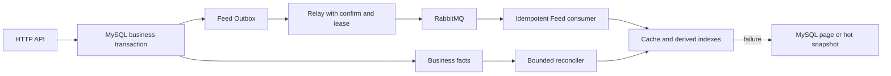
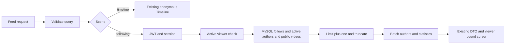

# GoFeed 开发计划

> 更新日期：2026-10-03。F1-C 已提交为 `f772349`；首页 Timeline 接入为 `896f4e1`，隔离浏览器联调工具为 `f4af6b8`，首页验收见第 5.5 节。F2-A 事件类型路由为 `48ce8df`，独立验收见第 5.6 节；F2-B 契约设计为 `ecef426`，当前分支的 F2-B1、F2-B2 后端分别提交为 `98f9df2`、`0c68c82`。测试与前端本次排除，7 个补测文件保留未提交；编译检查与历史运行记录分别见第 5.8、5.9 节，下一步顺序见第 3.3 节。2026-10-03 同日第二轮在用户测试授权下补做 F2-B2 后端可靠性验收（新增 6 个后端测试文件、1 处最小配置校验修复，均未提交），结果与剩余缺口见第 5.10 节。本文统一后续任务、设计边界与待补验收；已实现能力简述见 [README](../README.md)，已实现接口见 [API](../API.md)，协作规则见 [AGENTS](../AGENTS.md)。

本文已合并原 Feed 演进方案、跨项目参考路线及分步方案。F1-C 默认关闭的缓存接入已按用户指令提交；F0–F1-C 补测、旧业务兼容、MySQL/迁移、发布链路与浏览器回归按模块独立验证。第 5 节区分首轮补测记录与审查修复后的实际验证，历史测试记录不作为当前环境的验收结论。

## 1. 当前基线与优先顺序

MySQL 是唯一业务事实源；Redis 用于可丢失的加速和限流，RabbitMQ 用于至少一次投递。现有发布链路是事务写业务状态与 Outbox、relay 确认派发、consumer CAS 幂等完成处理。`video.process` 已有连接恢复、租约、退避、分级重试与 DLQ，不再重复安排旧 MQ 方案中的基础实现。

| 模块 | 当前状态 | 后续动作 |
| --- | --- | --- |
| F0：匿名 Timeline 四层边界 | `8394035`、`224d8ff`、`7541269` 已提交；首页接入 `896f4e1` | 首页 mock 与隔离真实浏览器链路验收通过（第 5.5 节） |
| F1-A：批量公开视频卡片 | `a7e2bd4` 已提交，F1-C 开启后的缓存命中路径调用 | 真实数据库批量读取验收已完成（第 5 节） |
| F1-B：轻量页缓存端口与适配 | `509c123` 已提交，F1-C 已装配 | 适配器单测与真实 Redis 回归通过（第 5 节） |
| F1-C：Timeline 缓存接入 | `f772349` 已提交，默认关闭 | 自动化开关、命中校验、回源与兼容回归通过；收益与容量压测待补 |
| F2：Feed 事件与预热 | F2-A 路由 `48ce8df`、F2-B1 后端 `98f9df2`、F2-B2 后端 `0c68c82` 已提交；F2-B2 后端可靠性验收已执行（第 5.10 节，未提交） | 生产开关仍关闭；收益、真实容量、浏览器与性能缺口保留 |
| F3：Following | F3-A 契约设计已完成（第 3.4 节），业务未实现 | 先 review 契约并收口 F2-B2 补测提交，再实现 MySQL 关注流；推拉索引另立模块 |
| F4：Hot | 未开始 | 互动事件、分钟桶和 MySQL 快照 |
| F5：曝光与规则推荐 | 未开始 | 持久化归因、规则候选，向量召回另行评估 |
| F6：重建与运维收口 | 未开始 | 整合恢复水位、容量、重放、指标和告警 |

Feed 是按 GCFeed 目录逐步迁移的业务边界：`domain/feed` 定义读模型与读取接口，`application/feed` 编排分页及缓存端口，`infra/persistence/feed` 适配既有仓储，`infra/cache/feed` 适配 Redis，`interfaces/http/feed` 负责 HTTP。内层只依赖标准库和 Feed domain；不搬迁 `video`、`social`、`user`、`auth`。

当前首页使用 `/api/feed?scene=timeline&limit=12`；作者主页继续使用直接读取 MySQL 的旧 `/api/video?author_id=...`。`/api/feed` 默认同样直接读取 MySQL，开启缓存后仅后续页使用轻量页缓存并校验当前公开卡片。新接口只启用 Timeline；未知场景为 400，已知但未启用的 Following、Hot、Recommend 为 501。游标独立绑定场景、结构版本、排序版本与 `(published_at, video_id)`，不与旧视频游标混用。现有接口必须保持可用，每次只迁移一个读取场景或派生链路。

## 2. Feed 缓存后续工作

F1-C 已提交的读取行为见 README 与 API；默认关闭，不改变旧接口。基础 `feed_page_cache` 事件日志已接入，指标与告警仍未接通。并发容量与取消释放有应用层单元覆盖，开关、首屏绕过、命中校验、整页回源与兼容性有真实 Redis/MySQL 装配回归；首页接入后，缓存关闭与开启后的第二页已通过真实浏览器验收（第 5.5 节）。生产默认 TTL 的端到端回源、多实例同 Key 竞争与容量压测仍待补。

- 当前非空页的静态查询结构为视频 1 次、作者 1 次、点赞/评论聚合各 1 次；ID 页缓存通常不会减少 SQL 数量。需比较开关前后的查询成本、p95、回源与缓存操作耗时，证明收益后再决定开启范围，不把命中率或编译结果当作性能证据。
- F2-B1 基础卡片缓存已实现，端口、版本、Key/TTL、公开验证与迟到回填防护见 README 和第 5.8 节。作者资料与统计缓存尚未实现，仍实时读取；未来实施须定义各自的失效与旧请求回填防护。不能仅复制 GCFeed 的长 TTL 后宣称可见性安全。
- 当前并发上限为每实例 32 个启用缓存的 Feed 请求、16 次缓存操作；请求容量耗尽返回安全 503，缓存容量耗尽跳过缓存。应用层并发/取消/释放单测已通过，真实容量压测仍待补；上限配置化和同 Key 请求合并按容量证据另行评估。
- 页缓存载荷上限仍只限制编码与 Get 后解码。F2-B1 卡片读取用 Redis 批量脚本先检查 STRLEN，超大值只返回标记，不将大字符串传给驱动；这不代表页缓存同样已经具备 Redis 端有界读取。

## 3. F2–F6：Feed 派生能力

| 阶段 | 最小交付及必须保留的约束 |
| --- | --- |
| F2：Feed 事件 | F2-A 已支持显式事件类型路由，生产仅注册 `video.process`。B1 基础卡片读写已提交，B2 后端代码已实现并完成后端可靠性验收（第 5.10 节，未提交）；默认关闭新事件，开启时 `CompleteVideoProcessing` 的实际 CAS 与发布事件同事务，独立预热消费和拓扑已装配。统计缓存与首页预热另行规划，派发状态不能当作消费完成水位 |
| F3：Following | 使用真实 `user_follows(follower_id, followee_id)`、活动作者与公开规则查询 MySQL，建立按观看者绑定的游标。现有公开视频规则不自动排除注销作者，活动作者过滤归关注场景。再增加小作者粉丝 Inbox、大作者 Author Outbox、关注补最近视频与取关过滤 |
| F4：Hot | 点赞/评论仍同步落 MySQL，同事务写 `interaction.changed`。事件去重后更新分钟 ZSET；MySQL 保存有界快照或可重算事件窗口。Redis 故障先读快照，快照缺失再显式降为 Timeline，禁止每次请求实时全表聚合 |
| F5：曝光与推荐 | 持久化 `request_id`、曝光、有效观看与完播归因，唯一键至少绑定 `user_id + request_id + video_id`。规则先覆盖新鲜度、热度、关注、近期去重与作者打散；规则稳定且数据足够后才评估内容/兴趣向量召回 |
| F6：重建与运维 | 水位扫描、限批修复、事件重放与容量告警；基础恢复和观测随各模块交付，不能全部推迟到本阶段。大小作者阈值、Inbox 长度、补偿窗口、热榜窗口和重建批次需配置化、可观测、可回滚 |

### 3.1 F2-A：Outbox 事件类型路由

`worker.NewRelay` 保留原构造签名，默认只有 `VideoProcessRoute()`。`NewRelayWithRoutes` 接收完整路由列表，按 `event_type` 建立独立映射，拒绝空列表、不完整的 `mq.EventSpec`、空准备函数和重复类型，并复制注册表。装配多个类型时须显式包含 `VideoProcessRoute()`；此入口不自动声明队列或启动消费者。

每个 `RelayRoute` 提供发布目标和只基于本轮快照的检查、载荷构造。通用轮询继续负责 claim、租约接管日志、发布失败的有界指数退避、确认后标记与 attempt 围栏。未知类型或快照不一致按原有五分钟退避释放租约，并继续处理同批其他事件。视频处理载荷的版本、字段和目标不变；缺失快照、不完整处理状态仍拒绝派发，接管已由消费者完成的 published/rejected 事件仍直接收口。该终态规则仅属于视频处理路由，不能套到其他类型。

F2-A 提交本身未改变生产 worker 装配、业务状态、迁移或 RabbitMQ 拓扑；该阶段测试事件只存在于隔离测试资源。后续 B2 的默认关闭装配和同事务发布事件代码现已实现，见第 3.2、5.9 节；运行验收已在 2026-10-03 同日第二轮按测试授权补做（第 5.10 节）。首页首屏仍绕过页缓存，基础卡片缓存由 B1 实现，作者/统计缓存仍未实现；不能把读取命中当作预热验收已经完成。

新增 Feed Outbox、消费幂等/水位、热榜事件或快照、曝光记录时，实施前按迁移目录和目标库状态分配新版本，不预占迁移号。现有迁移最高为 `000009`，不能据此声称某个目标数据库已经应用。F2-A 不新增迁移。

### 3.2 F2-B：发布事件与单视频卡片预热契约（B1/B2 后端已提交，B2 后端可靠性验收见第 5.10 节）

契约设计已提交为 `ecef426`，F2-B1 基础卡片读写和公开状态端口后端提交为 `98f9df2`；历史完整工作树运行记录见第 5.8 节。下述 F2-B2 发布消息、队列、生产者和消费者后端提交为 `0c68c82`。本次按“提交并分析下一步”完成分模块提交，沿用上一轮不修改或运行测试、前端且不提交 `*_test.go` 的范围；真实链路验收仍待补，不把 B1 命中或 B2 编译通过作为事件预热验收。该缺口已在 2026-10-03 同日第二轮的测试授权下于第 5.10 节补做。

**消费目标与交付顺序**

首个消费目标限定为按视频 ID 预热基础 `FeedCard`，字段沿用现有 [domain/feed/entity.go](../backend/internal/domain/feed/entity.go)。作者资料、点赞/评论统计继续批量读取 MySQL；本阶段不建立作者/统计缓存，不预热任意游标页，不改变首页首屏绕过页缓存的行为。

预热必须有实际读取用途：先交付可选的基础卡片缓存与读取装配，再交付可靠发布事件闭环。缓存读取装配只作用于开启 F1 页缓存后调用的 `CardReader`，旧 `/api/video`、详情、作者主页及关闭缓存时的读取继续走现有路径。缓存缺失、损坏或不可用时按原批量契约回源，命中仍校验当前 MySQL 公开可见性。基础卡片缓存的默认开关同样关闭，不能把写入无人读取的 Redis 值作为模块完成。

| 独立模块 | 完整交付范围 | 停止点 |
| --- | --- | --- |
| F2-B1：基础卡片缓存读写 | 已实现批量端口、Redis 适配、公开状态验证和 `CardReader` 装配；回源/取消/容量/删除并发与真实浏览器结果属于历史完整工作树 | 后端 `98f9df2` 已提交，7 个补测文件排除；默认关闭 |
| F2-B2：发布事件闭环 | 后端已实现实际 CAS 与 Outbox 同事务、发布路由、完整重连拓扑、专用消费、ACK/重试/DLQ 和默认关闭开关；后端可靠性验收已执行（第 5.10 节） | 后端 `0c68c82` 已提交；先收口验收，不单独开启生产者 |

F2-B1 不写 `video.published`，F2-B2 不补发历史所有已发布视频，也不实现 Following、Hot 或推荐。基础卡片缓存是否值得生产启用仍需 F1 的查询成本、容量与 p95 证据；预热存在和命中率不证明收益。

**业务事务与稳定消息**

事务来源为 [CompleteVideoProcessing](../backend/internal/video/outbox_repo.go)：保持 `(bool, error)` 契约，在一个 MySQL 事务内执行未软删除视频的 `processing → published` CAS。仅在实际变更一行且发布事件开关启用时，创建一个新 UUID 的 `video.published` pending 事件；该 UUID 与原 `video.process` 事件 ID 不同。插入或提交失败必须回滚发布状态并返回错误，原处理消息走基础设施重试；返回零行时不插入事件，按原重复消息逻辑确认。拒绝分支不产生发布事件。

沿用发布请求已写入的 `published_at`，不使用处理完成时间改写 Timeline 排序。并发的两个处理投递只允许实际 CAS 成功者写事件。原媒体校验、草稿到 processing 的事务和 HTTP `202` 契约保持不变；API 仍不直接调用 RabbitMQ。

已实现消息结构如下，发布事件使用独立的结构版本常量，不改变现有处理消息的 `mq.SchemaVersion`：

```json
{"schema_version":1,"event_id":"<new UUID>","video_id":123}
```

JSON 仅携带可验证的标识。事件 ID 在事务中持久化，Relay 重投保留同一值；视频 ID 必须非零，事件 ID 必须是合法 UUID，消费者拒绝损坏载荷和未知版本。标题、作者资料、统计、媒体路径和游标均不作为 MQ 事实传递；消费者重新读取当前 MySQL 卡片。

现有 [000006 Outbox](../backend/db/migrations/000006_video_outbox.up.sql) 与 [000009 租约](../backend/db/migrations/000009_outbox_publishing_lease.up.sql) 已有类型字段、事件 ID 唯一键和租约字段，能够容纳该标识消息。此设计不要求新增持久化载荷、卡片事实表或消费记录表，也不预占迁移号；业务实施前仍须只读核对目标库版本、列、索引与外键。未来若增加持久化消费水位或内容版本，另行评审迁移。

**Relay、拓扑与重连**

发布目标为 `gofeed.events` / `video.published`，消费队列为 `feed.card.warm`，通过默认关闭的预热开关装配。独立队列的隔离依据是 Redis 预热故障不能阻塞现有媒体处理消费者；新队列使用自身 `ConsumerSpec`，初始 QoS 为 4，保留最多三次 `1s/5s/30s` 延迟重试及专用死信队列。原 `video.process` 的目标、QoS 16、消息版本与重试规格不变。

发布路由只检查事件标识并构造稳定消息，不套用处理路由的 processing 状态检查或 published/rejected 接管收口。事件写入证明曾完成发布；即使当前视频已经软删除，仍应把事件交给消费者按当前可见性跳过，而不是在 Relay 中固定退避到永久 pending。硬删除会按现有外键级联删除尚存 Outbox，此事件用于可丢失的缓存加速，不承诺硬删除后的审计保留。

`mq.WithConsumerSpecs` 持有完整规格副本，初次连接及每次重连均调用 `DeclareConsumerTopology` / `DeclareTopologyFor`；未启用时仍走原 `DeclareTopology`。`cmd/worker` 在预热开启时同时装配两个路由、两个消费者及队列观测，纳入原关闭/等待生命周期。代码包含主队列、重试队列和 DLQ 深度日志；恢复及关闭行为本轮未做实际故障验证。

默认旧链路保留 `mandatory=false`。预热开启时 `WithMandatoryPublishing(true)` 为该 worker Runtime 的全部发布（含旧处理与新事件重试）启用 mandatory，注册缓冲 Return 通知，并串行发布；在 broker confirm 后检查 Return，缺失绑定返回错误并交由原 Runtime 断开重建、Outbox 退避或消费重投处理。已核对当前本地 amqp091-go 源码的 Return/confirm 通知顺序，本轮未做真实 broker 验收；不能将编译通过或 dispatched 称为消息已进入目标队列或已完成预热。

**缓存端口、版本与公开边界**

F2-B1 已提供应用层卡片批量 Get/Set/Delete 端口与 MySQL 批量公开状态读取端口，内层不依赖 Redis/GORM。读取/删除 ID 忽略零值、去重，最多 51 个有效 ID，写入卡片必须满足公开展示字段契约，返回值仍是按 ID 映射的卡片。复用现有取消、Feed Runtime 和缓存操作容量。F2-B2 暖缓存单次仅读取消息指定视频，不展开作者全部视频或粉丝集合。

F2-B1 Redis Key 为 `gofeed:feed:card:v1:<video_id>`；值携带结构版本和基础卡片（含视频 ID、作者 ID、原 `published_at`），默认 TTL 30 秒、单条编码上限 16 KiB。作者资料、统计、登录态和 `isLiked` 不进入卡片值。超大卡片记录 `skipped_oversized` 并继续 MySQL 读取；批量 Lua 在返回字符串前检查长度，超大已存值只返回无效标记。B1 不包含发布事件；B2 预热处理器复用同一缓存端口，不缓存作者资料或统计。

读取缓存前，`GetPublicVideoStates` 用与 `PublicVideoQuery` / `IsPublicVideo` 一致的完整公开规则批量查询 MySQL，只选择 `id`、`author_id`、`published_at`；检查 published、未软删除、非空有效发布时间及全部媒体字段完整性。缓存 ID、作者 ID、发布时间必须与本次结果匹配，不可见行不得由缓存补回。已用真实 MySQL 对齐旧 `GetPublishedByIDs`，包括作者零标识兼容；命中沿用 MySQL 的时间表示以保持响应兼容。

命中允许省去基础卡片大字段读取，但仍访问 MySQL；缓存关闭、首屏排序、作者批量读取和统计聚合保持原契约。允许旧请求在删除后留下有限 TTL 的无效 Redis 值，读取时的 MySQL 公开检查必须拦住它，不能复活对外可见卡片。删除成功后的精确 Key 删除可减少无效值，失败不回滚 MySQL 删除；Redis 故障期间也不允许绕过公开检查。发布时间不等于内容版本：目前没有已发布内容编辑入口，未来新增该能力前必须补内容版本、失效及旧写入围栏，不得沿用当前发布时间匹配规则作为编辑一致性保障。

**消费幂等、结果与确认**

| 情况 | 消费结果与 ACK 规则 |
| --- | --- |
| 消息合法且当前卡片公开 | 读取 MySQL 后写入相同版本 Key；SET 成功后记录 `warmed` 并 ACK |
| 视频已删除、不存在或不再公开 | 不预热，按精确 Key 尝试清理；清理成功或键不存在后记录 `skipped_not_public` 并 ACK，Redis 故障走有限重试 |
| 同一事件重复投递，或 SET 后 ACK 丢失 | 用同一视频 Key 再读取当前 MySQL 并覆盖当前卡片，允许刷新 TTL；不重复业务状态更新，不因 Redis 去重标识跳过公开检查 |
| MySQL 或 Redis 暂态失败、单次处理超时 | 安排下一档重试；broker 确认重试消息前不 ACK 原消息，重试发布失败保留原投递 |
| 载荷损坏、版本不支持、重试耗尽 | 明确记录原因并进入该队列 DLQ，受控重放沿用原事件 ID |
| 卡片超出载荷上限 | 记录 `skipped_oversized` 并 ACK；真实读取继续回源，不误记为缓存成功 |
| 进程关闭或上下文取消 | 停止取新投递，未完成处理不伪造成功；按原信道关闭/重投生命周期收口 |

处理器采用天然可重放的按视频 Key 覆盖，不用 Redis `SETNX event_id` 代替业务幂等。Redis 是派生加速，可在成功后丢失；读路径仍回源和按流量填充，因此无需为了缓存预热建立第二份 MySQL 卡片事实。

消费日志包含 `event_type`、`event_id`、`video_id`、`result`、`attempt` 和耗时；区分 `warmed`、不可见/超大跳过、重试、死信。日志不是持久化消费水位，Outbox 的 dispatched 仍仅表示派发确认，不表示完成预热。需要断电后可查询的消费完成账本时，再增加独立持久化设计。

**开启、验收与回滚**

基础卡片读取已使用默认关闭的 `feed.card_cache_enabled` / `FEED_CARD_CACHE_ENABLED`，且必须同时启用页缓存。发布事件生产和预热消费已采用 `feed.published_event_enabled` / `FEED_PUBLISHED_EVENT_ENABLED`、`feed.card_warmup_enabled` / `FEED_CARD_WARMUP_ENABLED` 两个独立默认关闭开关；worker 拒绝只开生产而未开本进程消费的配置，生产关闭而消费开启可继续排空。首次部署先准备缓存读路径、路由、消费者和启动/重连拓扑，再完成所有处理 worker 升级，最后开启生产者。生产者关闭时发布仍按原流程完成，不创建新类型；不在缺少消费者时开生产者，也不混用旧处理 worker 声称所有新发布都生成了事件。

F2-B1 验收至少包括批量上限、空/重叠 ID、缓存缺失/损坏/超大/超时、取消与容量释放、整页兼容、软删除与迟到回填、作者注销占位和实时统计。用独立 MySQL 库与随机 Redis 前缀证明真实卡片读取命中、精确 Key 清理；保持旧作者列表、详情和首页游标契约不变。

F2-B2 验收至少包括 CAS 零行不写事件、并发只写一次、新 UUID、Outbox 插入/提交故障整体回滚、拒绝不写、排序时间不变；真实 MySQL → Relay → RabbitMQ → consumer → Redis 观测到成功写入。还需覆盖发布后软删除、重复投递、SET 后 ACK 丢失、确认/标记失败、未知版本、Redis 故障重试与 DLQ、重试确认前原消息未 ACK、断线重连拓扑恢复及缺失绑定失败。每种结果分别记录实际依赖与故障注入，不能用 mock 或相同响应替代命中/可靠链路证据。

B1 回滚设 `FEED_CARD_CACHE_ENABLED=false` 并重启 API，即恢复页缓存命中时的原 MySQL 卡片读取；不涉及迁移或 MQ，键可等待 TTL。B2 回滚顺序仍为先关发布事件生产，再将已产生的 pending/publishing、主队列和重试队列交由仍认识新类型的 worker 排空或记录受控重放清单；不能给未消费事件直接标记完成来凑清空。存在新类型时保留路由与消费者。只清理本轮持有的精确缓存 Key/测试拓扑或等待 TTL，禁止 SCAN/FLUSHDB 与跨场景游标复用。当前后端提交为 B1 `98f9df2`、B2 `0c68c82`；B2 实现阶段曾只读核对目标库为版本 9、非 dirty，现有列/索引/外键满足需求，无新增迁移。本次未访问数据库，仍需未来独立测试与真实链路验收。

原独立关注流方案归入 F3，目标入口优先评审 `/api/feed?scene=following` 的鉴权和观看者范围，不同时新增两套关注流编排。关注/取关、作者注销、发布/删除使结果集合动态变化，keyset 不保证跨页冻结快照。

参考 GCFeed 的卡片/统计拆分、分钟热榜、大小作者推拉和推荐分场景；参考 feedsystem 的队列隔离、独立消费者、QoS 和运行方式。保留 GoFeed 的 Outbox + confirm + lease + CAS + retry/DLQ，不复制 Redis 先写互动再异步落库或 API 先发 MQ 再直接写库的路径。

下图表示派生链路目标；B2 后端已装配发布预热路径并完成后端可靠性验收（第 5.10 节），其他派生索引和重建仍待后续：



| 依赖/用途 | 故障路径 | 恢复边界 |
| --- | --- | --- |
| Timeline 页缓存 | 跳过 Redis，按原游标批量回源 MySQL | 独立冷却、单探针、按流量回填 |
| Following 索引 | MySQL 关注集合查询 | 按水位限批重建 Inbox/Author Outbox |
| Hot / Recommend | 快照或规则候选，再显式降为 Timeline | 从事实事件、快照和行为数据重建 |
| RabbitMQ 派发/消费 | 保留 Outbox；重试消息确认前不 ACK 原消息 | 稳定 event_id、租约接管、连接恢复、幂等重投 |
| MySQL | 返回安全错误，不伪造业务成功 | `/ready` 以 MySQL 为准 |

不得全库清理 Redis、在请求中无界 fanout 或建立热循环重试。新队列只有业务吞吐、SLA、隔离或重试差异明确时才引入，并同时定义 schema、事务来源、幂等键、ACK、有限重试、DLQ 和受控重放。日志存在不代表监控告警已接通，平台、阈值和接收人仍待决策。

### 3.3 本次提交后的下一步（2026-10-03，仅分析）

当前 B1 解决卡片缓存的实际读取，B2 解决发布后的同事务事件与派生写入；两者后端已提交，新开关仍默认关闭。代码与编译不能补上可靠性证据。2026-10-03 同日第二轮已在测试授权下完成 B2 后端可靠性验收（第 5.10 节），下表的第 1 项据此收口；本次仍不开展新功能，也不开启生产开关。

| 顺序 | 独立范围 | 交付条件 |
| --- | --- | --- |
| 1. F2-B2 验收收口 | 已执行：新增 6 个后端测试文件（事务 CAS 与唯一事件、真实 MySQL→Outbox→Relay→RabbitMQ→consumer→Redis 链路、消费与确认契约、两类规格拓扑与 mandatory 路由、预热卡片被 HTTP 读路径使用、发布开关默认与组合校验）并提取 1 处既有配置校验，见第 5.10 节 | 后端可靠性验收已执行并通过；补测正按本轮提交前审查结果分模块提交，见第 5.11 节；不能用 dispatched 或日志存在代替消费成功 |
| 2. 缓存开启决策 | 分别比较关闭缓存、仅页缓存、页加卡片缓存、事件预热；记录 SQL 成本、p95、Redis 操作、TTL、容量与多实例同键竞争 | 只作为生产开启门槛；没有收益则继续关闭，不人为阻塞独立的 Following 开发 |
| 3. F3-A MySQL 关注流 | 契约与源码复用已整理在第 3.4 节；实现阶段增加观看者上下文、独立游标、MySQL 查询及既有批量作者/统计组装 | 设计完成后先 review；实施前审查 F2-B2 补测与修复，不同时引入 Inbox/Author Outbox、热榜、推荐或前端页面 |

F3-A 可复用现有 `user_follows` 唯一键与关注者索引、用户会话鉴权、完整公开视频作用域以及 Feed 作者/统计批量接口。当前 `/api/feed` 注册为匿名路由，`FeedRequest` 没有观看者字段，Following 仍明确返回 501；已有关注列表不是关注视频流。需从 JWT/session 获取观看者，游标绑定 `following`、观看者、版本和 `(published_at, video_id)`；通过同一查询的关注关系及活动作者过滤，使取关、作者注销或视频删除后的下一次读取反映 MySQL 当前状态。Timeline 匿名契约与旧 `/api/video` 保持原行为，不接入匿名 Timeline 页缓存，也不承诺跨页冻结快照。索引是否需要迁移须依据目标库元数据与 EXPLAIN 再决定。

F3-A 的契约设计和源码复用核对已按后续“那就继续”指令完成，见第 3.4 节；设计阶段未实施关注流。用户随后已授权审查补测、安全后提交并继续下一步；本轮执行记录见第 5.11 节，生产开关保持默认关闭。

### 3.4 F3-A：MySQL 关注流契约（2026-10-03，仅设计，未实现）

本轮范围为关注流契约和源码复用核对。当前真实路由仍只启用匿名 Timeline，Following 仍返回 501；本节描述后续实现目标，不写入 API.md 的已实现接口。用户已确认 F2-B2 验收任务结束、允许更新开发计划；其现有配置修复、测试与第 5.10 节记录原样保留。设计阶段未修改后端、前端、测试、迁移或私有配置，未执行测试、启动服务或提交；后续授权实施的状态另行记录。

**入口、鉴权与响应**

| 项目 | 冻结契约 |
| --- | --- |
| 入口 | 沿用 `GET /api/feed?scene=following&limit=20&cursor=...`，仅新增该场景的处理；不另建 `/api/video/following` |
| 查询参数 | 只接受单值 `scene`、`limit`、`cursor`；重复、未知或 URL 编码非法为 400。省略 limit 为 20，显式 limit 必须为 1–50；省略/空 cursor 为首屏，省略/空 scene 继续指向 Timeline |
| 身份来源 | Following 必须通过现有 Bearer JWT 与活动 session 校验，观看者仅来自 `jwt.UserID`，不接受 query/body 的 viewer_id、user_id 或 author_id，也不从游标读取授权身份 |
| 参数与鉴权顺序 | 先按现有规则校验查询参数、limit 与场景；Following 再鉴权，成功后校验游标。合法 Following 请求缺少凭据或凭据无效为 401，即使其游标也无效；合法凭据加非法游标为 400 |
| 活动观看者 | 在 Following 读适配器复用 `social.Repository.GetActiveUser`；会话有效但用户已注销/缺失仍为 401，不能当成空关注集合。该检查的数据库错误映射为安全的 503 |
| 其他认证语义 | 复用 `jwt.Auth(sessionService)`，不修改所有旧接口的鉴权规则。当前中间件把 session 校验的数据库错误也统一映射为 401；此行为明确保留，不宣称认证阶段的所有数据库故障均为 503。统一鉴权错误分类另立模块 |
| 正常响应 | 复用 `feedItemsResponse`，字段、时间表示与当前 Timeline DTO 一致；空结果为 `{"items":[]}`，末页省略 next_cursor。没有关注、仅关注无公开视频的作者或关注作者均已注销时均为合法空页 |
| 个性化字段 | 不新增 isLiked、viewer、following 等响应字段；作者资料、点赞/评论数量继续实时批量读取 |
| 错误 | 错误体仍为 `{"error":"<public message>"}`。非法场景/参数/游标为 400；认证失败或活动观看者缺失为 401；业务读取/组装依赖错误为 503；已知但未启用的 Hot、Recommend 继续为 501，不伪造空页或回退 Timeline |
| HTTP 缓存 | 可识别的 Following 请求及其错误响应设置 `Cache-Control: private, no-store`，合并 `Vary: Authorization`，保留已有 Vary 值；不写公共页缓存 |

HTTP handler 增加可注入的 Following 鉴权选项，由 router 传入现有 `jwt.Auth(sessionService)`；参数校验后仅在 Following 分支调用，认证中止后不继续业务处理。router 仍负责 session 依赖装配，应用层只接收可信观看者 ID，不依赖 Gin、JWT、GORM 或 Redis。未装配认证器的 Following 请求必须拒绝；实现时验证手动调用中间件后的 `IsAborted` 与处理顺序，不能忽略认证中止。

Timeline 保持当前匿名行为：不因携带 Authorization 增加 session 查询、登录态字段或新错误；其现有参数、响应、游标和缓存容量规则保持兼容。旧 `/api/video`、作者页和社交列表保留原入口。

**独立游标与动态集合**

Following 游标采用独立载荷，不修改现有 Timeline 游标：

```json
{"version":1,"scene":"following","sort_version":1,"viewer_id":123,"published_at":"2026-10-03T00:00:00Z","video_id":456}
```

编码沿用严格无填充 URL-safe Base64，发布时间统一 UTC；最长 1024 字符。解码校验版本、following 场景、排序版本、非零观看者/视频 ID、非零时间、未知字段、尾随 JSON 和 viewer_id 与已认证观看者的一致性。跨观看者、Timeline、旧视频或 social 关注列表游标均为 400。limit 不绑定游标，允许在 1–50 范围内改变页大小。

游标只定位查询，不是授权凭据；查询始终使用已认证观看者，不能用载荷中的 viewer_id 替换它。初版不新增签名或 session 绑定，相同活动用户重新登录后可继续同一游标。切换用户、场景或回滚接口后须重新拉首屏；客户端不得混用游标。

排序固定为 `(videos.published_at DESC, videos.id DESC)`，续页条件为 `published_at < p OR (published_at = p AND id < i)`，发布时间沿用既有发布流程，不按关注时间或处理完成时间排序。不增加“仅关注后发布”的限制：新增关注会把该作者当前可见历史视频纳入集合，但续页只读取原边界之后的行，更早排序位置需刷新首屏。取关、作者注销、视频删除在各次查询的当前 MySQL 状态下过滤；不承诺跨页冻结快照，也不在读请求中补发历史事件。

**MySQL 查询与数据边界**

新增视频仓储方法 `GetFollowingVideoList(ctx, viewerID, position, fetchLimit)`，保留 `GetPublishedVideoList` 原行为。查询以 `PublicVideoQuery(db.WithContext(ctx))` 为起点，在同一视频 SELECT 内：

1. JOIN `user_follows`，限制 `follower_id = 已认证观看者` 且 `followee_id = videos.author_id`
2. JOIN `users` 的作者别名，限制作者存在且 `deleted_at IS NULL`
3. 保留 published、视频未软删除、非空发布时间及六个完整媒体字段的公开作用域
4. 明确 `SELECT videos.*`，分页、排序使用限定表名的 `videos.published_at`、`videos.id`，避免 JOIN 的同名 id 覆盖映射或形成歧义
5. 使用参数化 keyset 条件和 `LIMIT limit+1`，不先加载全部关注 ID、不逐作者查询、不在客户端过滤

`user_follows` 的 `(follower_id, followee_id)` 唯一键保证同一视频不会因关注关系重复出现在结果中。活动作者限定只属于 Following，不修改通用公开作用域；Timeline 继续允许已注销作者占位。自关注已由既有服务拒绝，读路径按真实关系查询，不自动插入“本人视频”。

外层适配器复用 `IsPublicVideo` 与卡片映射，查询结果若出现违反公开读模型的异常行（例如解码为零值的发布时间），返回安全的 503 并记录原因，不能在 LIMIT 后静默丢行并据此生成错误分页。正常数据的可见性过滤在 SQL 中完成。作者在视频查询后、批量资料读取前注销时，既有作者读取可能返回“已注销用户”占位；这属于不同查询时点的并发变化，下一次 Following 查询将排除该作者，不宣称响应完成时的全局快照。

**端口、装配与复用**

| 文件/边界 | 后续最小改动 |
| --- | --- |
| [domain/feed/entity.go](../backend/internal/domain/feed/entity.go)、[repository.go](../backend/internal/domain/feed/repository.go)、[errors.go](../backend/internal/domain/feed/errors.go) | 新增结构化 FollowingCursor、窄 FollowingReader 及观看者错误；FollowingReader 的 ListFollowingPage 接收可信 viewerID 与结构化位置，复用现有 TimelinePage 作为条目/卡片容器，不改变原 Repository 的方法集合 |
| [application/feed/service.go](../backend/internal/application/feed/service.go) 与本包新增 following.go | FeedRequest 增加内部 ViewerID；用 WithFollowingReader 装配窄端口，Following 分支在进入 Timeline 的游标解码和缓存容量逻辑前分流；未装配必需读取依赖时返回不可用，不自动回退 |
| [application/feed/cursor.go](../backend/internal/application/feed/cursor.go) 与独立 Following 编解码 | 保留 Timeline 载荷与编码逐字节兼容；新编解码检查观看者绑定，不把结构化 Following 位置交给 Timeline 解码器 |
| [infra/persistence/feed/legacy_reader.go](../backend/internal/infra/persistence/feed/legacy_reader.go)、[card_reader.go](../backend/internal/infra/persistence/feed/card_reader.go) 与本包新增 following_reader.go | 适配器组合活动用户检查与视频窄读取接口，复用 feedCardFromVideo；BatchGetAuthors、BatchGetStats 继续由现有 Feed Repository 提供，避免扩展其视频读取接口破坏既有 fake |
| [video/video_repo.go](../backend/internal/video/video_repo.go)、[video_scope.go](../backend/internal/video/video_scope.go)、[social/repo.go](../backend/internal/social/repo.go) | 在 video.Repository 增加专用关联查询；复用公开作用域、social.GetActiveUser 和真实关注表；不调用 social.GetFollowingList 再循环查作者视频 |
| [interfaces/http/feed/handler.go](../backend/internal/interfaces/http/feed/handler.go)、[dto.go](../backend/internal/interfaces/http/feed/dto.go)、[router/router.go](../backend/internal/router/router.go) | 注入按场景使用的现有认证器、读取 jwt.UserID、设置私有响应头、装配 Following 读适配器；复用 DTO 与错误请求层，不新建单一适配器包 |
| [middleware/jwt/jwt.go](../backend/internal/middleware/jwt/jwt.go)、[auth/session.go](../backend/internal/auth/session.go)、[video/user_author_reader.go](../backend/internal/video/user_author_reader.go) | 使用现有会话校验、可信上下文与批量作者读取，不改共享实现；用户正常注销的同事务会话撤销保持原流程 |

FollowingPage 的读取端口以 fetchLimit 接收 `limit+1`（最大 51）。应用层只根据探测行决定 hasMore，先截断为最多 limit 行，再复用 assembleFeedItems 对最终页一次批量读作者及点赞/评论聚合；next_cursor 从最终页最后一条行生成。所有读取传递请求 context；失败不返回伪成功，空页不读取作者/统计。

F3-A 全程直接查询 MySQL，不使用 Timeline 的页/卡片缓存、32 个缓存读取名额或 16 个缓存操作名额，不写 Inbox/Author Outbox，不新增 MQ 事件、Redis Key、配置开关、事实表或读请求内补偿。已有缓存及事件开关无论开启或关闭，关注流的集合与读路径保持相同。

**查询成本、索引与后续页面入口**

静态查询预算（不是已验证性能结论）：非空有效 Following 请求为 session 校验 1 次、活动观看者 1 次、关注/作者/视频 JOIN 1 次、批量作者 1 次、点赞/评论聚合各 1 次，共 6 次；合法空页只做前三项，共 3 次。JWT 解析、游标校验不访问数据库，探测行不参与作者/统计组装。实施后用真实查询记录核对预算，不用返回条数证明数据库扫描量有界。

迁移源码已有 `uq_user_follows_follower_followee`、关注者索引、`idx_videos_published_id`、`idx_videos_author_published`。本轮未访问真实数据库或执行 EXPLAIN，不声明这些索引已证明关联查询成本。本模块不预占迁移号；实施前只读核对实际版本/列/索引，再用无关注、少量/大量关注、同时间视频、低可见比例等数据形态检查计划与成本，确有必要才新增递增迁移，不能修改已应用迁移。

当前首页入口为 `listTimelineFeed → usePublishedFeed → FeedView`，作者页使用旧 `listPublishedVideos`；本轮不改它们。后续页面接入需新增首页/关注场景专用 listFollowingFeed，通过 withAuthenticatedSession 传 Bearer 凭据，并处理取消、用户切换清游标及独立分页状态，不全局替换原请求函数。该页面模块在 F3-A 后端稳定后单独 review。



**实施验收与回滚门槛**

- 先 review 本节，审查 F2-B2 补测/修复及第 5.10 节未覆盖项并独立提交；随后以该实际 HEAD 为基线实施 F3-A，不把本节设计算作关注流上线
- 覆盖匿名 Timeline 与原响应/游标、非法 Authorization 不改变 Timeline、Hot/Recommend 501；Following 查询校验、缺凭据/过期/撤销/跨用户/注销用户 401、跨场景与跨观看者游标 400、私有响应头及认证中止不继续业务
- 在独立 MySQL 中覆盖无关注空页、历史视频、同时间 keyset、limit+1、取关/重新关注、作者注销/视频软删、六个媒体缺陷、异常时间、取消与数据库故障；证明最终查询只包含本观看者关注的活动作者，作者和统计是批量当前读取
- 明确验证 Following 不触发任何 Timeline 缓存读写或名额获取；视频响应字段无 JOIN 覆盖，返回/探测 ID 无重复，查询预算与 EXPLAIN 有实际证据
- 按实现改动执行后端定向及常规回归，届时同步 API.md 的已实现契约；不要求本轮设计执行测试，不用 mock 代替真实 MySQL 或新增浏览器验收
- 回滚后续 F3-A 功能提交并同步文档，Following 恢复原 501，Timeline 和旧接口保留；F3-A 没有写入事实或派生队列可排空。若实施时另增索引迁移，按实际迁移与运行状态单独评审回滚，不在本设计虚构 down 命令

## 4. 其他待开发与评估模块

以下均未实现，按产品或容量需求单独立项。除 SSE 依赖通知持久化、会话缓存复用现有 Redis 能力外，不设置人为的硬前置依赖。

### pprof 诊断

默认关闭，API/worker 各使用独立 HTTP server 和显式 `ServeMux`，不注册到 Gin 或 `DefaultServeMux`，sweeper 暂不接入。只接受字面量 IPv4/IPv6 loopback 加端口，拒绝公网、wildcard 和主机名；配置示例里未生效的占位开关不能作为上线默认。复用 `observability`、配置加载与进程生命周期，设置 `ReadHeaderTimeout` 和独立 3 秒关闭上下文；配置错误或监听失败不终止业务进程。

### 会话校验缓存（C2，指标成立才实施）

先归因 `auth_sessions` 查询量与固定端点 p95，不能仅从请求总查询数判断收益；阈值在评估前明确，没有收益就记录不做。若立项，Key 为 `gofeed:session:{session_id}`，只缓存已校验 user ID、会话到期与结构版本，TTL 取 `min(5m, token 剩余时间, session 剩余时间)`；不缓存 refresh token 或用户资料。

未命中、用户不匹配、非法载荷或 Redis 故障回退 MySQL；登出提交成功后删除当前 Key。改密/注销要在现有事务锁定并收集实际撤销的 session ID，提交后逐项失效，禁止 SCAN 或全局通配删除。上线前明确登录发会话与撤销的并发锁定/版本契约，以及删除失败和旧请求回填造成的撤销窗口；没有证明时不能宣称缓存使所有旧 token 立即失效。`/ready` 不变。

### 分片上传与断点续传

- 保留原单请求上传、200 MB 视频上限；初版固定 5 MB 分片，只对视频媒体新增 JWT 保护的创建会话、传片、查状态、complete 端点，封面分片/秒传/内容去重不在范围内。
- MySQL 持久化 owner、draft、元数据、SHA-256、分片索引、过期、租约和预留最终对象；唯一键 `(upload_id, chunk_index)`。状态为 `uploading → assembling → completed`，失败/到期进入不可逆 `purging`。
- 临时片与 staging 必须在 `/static` 上传根目录之外。预留对象键先持久化再写文件，使移动成功、数据库绑定失败或崩溃时仍可追踪清理。
- 初始化锁定可写草稿和活动会话，相同元数据可恢复，冲突返回 409；分片流式校验长度与 SHA-256，重复片只有内容一致才幂等。complete 用 CAS/租约控制并发，完整校验后绑定草稿与会话同事务提交。
- `UpdateDraftMedia` 当前自行开启事务，不能嵌套调用后宣称原子；在 video Repository 抽取接受事务句柄的共同校验，由直传与分片共用。文件系统与 MySQL 没有共同事务，补偿失败保留可重试记录。
- 复用 `video`、`LocalStorage` 和现有 sweeper，不另起常驻分片服务。后续覆盖缺片、并发完成、草稿变化、崩溃恢复、补偿与过期清扫。

### 话题标签与话题流

在现有发布事务中从标题/描述提取 Unicode 字母、标记、数字、下划线构成的标签，NFC 与大小写规范化，最多 64 rune、每视频前 10 个去重标签。新增 `tags` 的规范名唯一键和 `video_tags` 复合主键/话题读取索引；并发 upsert 获取稳定 ID，关联与发布状态/Outbox 一起回滚，不让客户端提交标签事实。

规划 `GET /api/video?tag=...`，初版与 author_id 互斥；使用独立、绑定规范名的 TagCursor，已有 public/author/mine 游标保持兼容。话题条件放进列表 SQL，复用公开过滤与批量组装；没有公开视频返回空页。视频硬删除级联清除关联，无引用标签暂留为词典。索引收益用 EXPLAIN 证明；不同时开发热门标签、搜索建议或响应 tags 字段。

### 累计点赞榜（可选，区别于 F4 近期热度）

如产品需要，规划 `/api/video/likes`，从 `video_likes` 聚合，只包含有点赞关系的公开视频；不恢复已删除的冗余视频计数列。按 `(likes_count DESC, video_id DESC)` 使用独立游标，聚合子查询兼容 `ONLY_FULL_GROUP_BY`，复用公开与批量组装。

排序时点的聚合计数可能与响应组装时重读的计数不同，点赞/取消使排序动态变化，不承诺跨页快照。需要稳定结果时再设计 as_of/物化快照。实时聚合、索引与 Redis 窗口榜分别评估，不以同一名称混淆两种产品语义。

### 通知与 SSE

- 通知归 `social`：先把互动有效性检查、关系/评论创建与通知插入收敛为同一事务。仅真实新建且非自互动产生通知；重复 like/follow 不重复通知，通知失败回滚互动，软删除收件人跳过通知。
- 建议 `notifications` 保存收发人、类型、实际关系/评论 source_id、跳转线索、文案快照、已读状态及时间；唯一键 `(event_type, source_id)`，索引覆盖本人倒序列表及未读数。用户硬删除级联通知，视频/评论跳转线索不设阻止清扫的外键。
- JWT 保护本人通知列表、未读数、单条已读及全部已读；游标绑定 recipient，非本人资源为 404，已读幂等。单收件人同步通知不新增 MQ；广播等扇出再单独设计 Outbox。
- SSE 只在通知持久化后实施。JWT 端点签发 60 秒用途隔离 HMAC 票据，独立 stream 端点验证票据并复核 session，不把 access token 放 query。票据有效期内可重放，不能称为一次性凭据。
- 复用 social 的进程内 Hub：每用户最多 5 条连接、有限缓冲、满时丢帧、不阻塞互动；每 30 秒心跳。事务提交后才推送，不实现 Last-Event-ID 重放，多实例漏帧由通知列表/未读数重拉收敛。
- 票据采用 HMAC-SHA256 与常量时间签名比较，载荷绑定版本、用途、user/session 和到期时间。响应设置 `Cache-Control: no-store`、`Referrer-Policy: no-referrer`、`X-Accel-Buffering: no`，代理须对 ticket query 脱敏；登出前端主动关流，新连接检查撤销，已建立连接强制撤销及跨实例广播另立模块。列表、通知 UI、EventSource 页面接入需独立交付。

### 私信

独立 message 领域，同步写 MySQL；首版仅发送、按对端线程分页、标记已读与总未读数，SSE 不是前置条件。将会话对规范化为 `(participant_low_id, participant_high_id)`，保留 sender/recipient 方向、最多 2000 rune 内容、read_at 与时间；索引分别覆盖线程 keyset、总未读和对端已读更新，避免双向 OR 查询。

发送要求活动收件人且非本人；历史读取不要求对端仍活动，硬删除按账户清理语义级联。JWT 取本人 ID，游标绑定规范化会话对；已读仅更新发给本人的未读消息。迁移 CHECK 需验证 MySQL 版本支持，否则采用兼容 DDL 与服务端校验。会话摘要 inbox、附件、撤回、回执、全文搜索和实时推送另立模块。

### 公开 Feed 登录态（可选）

只有产品明确需要或逐视频查询点赞态产生实际压力时立项，目标入口优先评审新 Feed，旧公开接口保持兼容。无 Authorization 保持匿名响应，有凭据则校验 token/session，失败为 401 而不静默降成匿名；批量查询最终页点赞关系，不逐视频读状态。

观看者态用可选 `viewer.liked` 表达，不改变公开过滤、排序和游标。响应设置 `Vary: Authorization`；登录态和凭据失败响应采用 `private, no-store`，不写入匿名公共缓存。原直接 MySQL 列表的静态 4 条查询加 session 与点赞关系各 1 条为 6；新缓存编排需重新核对预算，不套用旧数字。详情、following 状态和推荐排序分别规划。

共享媒体存储、跨进程时区一致性与 `gorm.io/gen` 保留为独立评估项，当前没有已冻结实施方案。

## 5. 待补验证与交付门槛

源码实现、提交、编译、自动化测试和真实依赖验收分别记录。2026-10-02 完成一次测试补齐与兼容验收（新增/修改测试文件，执行单元测试、真实 MySQL/Redis/RabbitMQ 集成测试与浏览器回归），下表为实际执行结果；所有 `PASS` 均来自本机真实运行输出，未执行或不可达的项目留在 5.3 作为显式缺口。

### 5.1 首轮补测记录（审查修复前）

以下保留另一个 agent 在 2026-10-02 的执行记录，其中前端只补测试。审查修复后的模块验证见 5.4；本轮未复跑业务库只读报告或全部浏览器内核，不将首轮结果写成当前复跑结论。

| 范围 | 新增/修改测试 | 执行命令 | 结果 |
| --- | --- | --- | --- |
| F0 HTTP/DTO | `interfaces/http/feed/handler_test.go`、`dto_test.go` | `go test -count=1 -v ./internal/interfaces/http/feed/...` | PASS 14 顶层 + 39 子测试 |
| F1-C 开关配置 | `config/config_test.go`（追加 5 Test） | `go test -count=1 -v ./internal/config/...` | PASS 10 顶层 + 12 子测试 |
| F1-B 适配器 | `infra/cache/feed/page_cache_test.go`、`page_codeco_test.go` | `go test -count=1 -v ./internal/infra/cache/feed/...` | PASS 28 顶层 + 48 子测试，SKIP 0 |
| F1-B 真实 Redis | `infra/cache/feed/redis_integration_test.go` | 同上 | 真实 Redis 4 例全 PASS，未 SKIP |
| F0/F1-A/F1-C 装配 | `router/feed_http_integration_test.go`、`router/feed_legacy_compat_test.go` | `go test -count=1 -v -run 'Feed' ./internal/router/...` | PASS 22（20 新增 + 2 既有），真实 MySQL + Redis |
| 迁移与模型对齐 | `testutil/migration_alignment_test.go`、`migration_integration_test.go` | `go test -count=1 -v ./internal/testutil/...` | PASS 22 / SKIP 1（真实 MySQL 8.0.45）；业务库只读核对另跑 `GOFEED_BUSINESS_DB_REPORT=1` → PASS |
| API 错误与旧业务 | `error/api_error_contract_test.go`、`user/session_http_integration_test.go`、`video/video_http_integration_test.go`、`social/social_http_integration_test.go` | `go test -count=1 -v ./internal/error/... ./internal/user/... ./internal/video/... ./internal/social/...` | PASS 171 / FAIL 0 / SKIP 0，全部走真实 MySQL |
| 发布链路可靠性 | `worker/consumer_loop_test.go`、`worker/retry_confirm_integration_test.go`、`mq/main_test.go` | `go test -count=1 -v -timeout 20m ./internal/worker/... ./internal/mq/...` | PASS 76 / FAIL 0 / SKIP 0，真实 RabbitMQ 参与 |
| 前端单元 | `usePublishedFeedPagination.spec.ts`、`FeedView.integration.spec.ts` | `pnpm.cmd run test:unit -- --run` | PASS 25 文件 / 145 用例（基线 23/131） |
| 前端浏览器 | `e2e/feed-flow.spec.ts`、`e2e/fixtures/playable.webm` | `pnpm.cmd run test:e2e` | PASS 70 / FAIL 0 / SKIP 6（基线 31 passed / 9 failed，均为 webkit 环境抖动） |
| 全量竞态兼容回归 | 本轮全部新增/修改测试 | `go test -race -count=1 -timeout 25m ./...` | PASS 22 个测试包全部 `ok`，FAIL 0，`WARNING: DATA RACE` 0（真实 MySQL/Redis/RabbitMQ 参与） |

- 覆盖清单：场景/数量/查询参数校验与 501 不查库、游标往返与跨接口隔离、同发布时间按 `video_id` 倒序与 limit+1 探测、空页 `items: []` 与末页省略 `next_cursor`、探测记录不进作者/统计批次；批量卡片空/零/重复/51/52 边界、乱序按 ID 映射、软删/非 published/媒体不完整/时间缺失过滤、`author_id=0` 占位；页缓存 Key 规范化与版本隔离、载荷形状校验、字节上限、TTL/超时/载荷默认与非法配置、`redis.Nil` 与 Get/Set 错误语义；开关默认关闭与环境变量覆盖、首屏绕过、命中整页校验（含探测记录）与失效整页回源、缓存写失败不改变成功响应、Redis 读取失败不在同一请求继续回填、非法载荷被正确结果覆盖、作者与统计只查最终响应页、并发容量上限与 503/跳过缓存、Feed Runtime 与限流 Runtime 故障隔离、Redis 初始不可用不阻止启动且恢复后可读写、`/ready` 仍只依赖 MySQL、关闭生命周期释放资源。
- 兼容性：缓存开关关闭/开启时旧 `/api/video` 的参数、响应体、游标与公开过滤逐字节一致；新 Timeline 与原公开查询在内容、排序、展示字段（含媒体原始文件名）和可见性语义（删除/媒体不完整/同发布时间/注销作者占位）上一致；互动统计在缓存命中路径上仍实时读取。查询预算以 `db.RegisterQueryCounter` 的**真实 SQL 语句数**断言（公开视频列表 4、详情 4 等）；**ID 页缓存命中仍需查 MySQL，未断言 SQL 减少，也不主张性能提升**。
- 数据库与迁移：源码迁移现场核对为 18 文件 / 9 版本，最高 `000009`，up/down 成对连续；业务库 `feedsystem`（MySQL 8.0.45）`schema_migrations` 为 `version=9 dirty=false`，列差异 0、索引差异 0（含降序方向）、排序规则差异 0。业务库全程只读，未执行任何迁移或回滚。
- 发布链路：业务状态与 Outbox 同一事务、publisher confirm、确认丢失与标记失败后的重复派发、publishing 租约接管与退避、重复投递 CAS 幂等、进程重启恢复、RabbitMQ 重连与拓扑重建、`1s/5s/30s` 重试且在确认前不 ACK 原消息、有限重试与 DLQ、发布成功/拒绝/到期清扫闭环均有通过用例；新增用例用真实 broker 观测到「原消息在确认前仍留在主队列」和 broker 重投后的幂等。
- 前端：首屏/分页、重试、失效请求取消与迟到结果丢弃、并发分页与视频 ID 去重、离开路由与页面隐藏时暂停播放、错误态与空态区分、桌面与移动视口均有通过用例。**新用例全部 mock 公共 Feed API，只验证页面行为，不等于真实后端联调。**

### 5.2 本轮发现并处置的缺陷

- **游标时间渲染不稳定（已最小修复）**：命中页缓存时 `next_cursor.published_at` 输出 `Z`，未命中时输出本地偏移（如 `+08:00`），同一分页位置在开关前后文本不同。最小修复为 `application/feed/cursor.go` 的 `encodeTimelineCursor` 统一按 UTC 渲染；探针实测两种时间表示对 MySQL 查询等价（同一位置返回相同两行），`decodeTimelineCursor` 与页缓存 Key 均不受影响。修复后命中与未命中的响应体逐字节一致。
- **`internal/mq` 缺少 `TestMain`（已最小修复）**：该包不加载被忽略的 `backend/.env`，导致仅有的两个真实 broker 用例在标准命令下静默 SKIP。新增 `internal/mq/main_test.go` 加载 `backend/.env` 后 SKIP 归零；不覆盖已注入的环境变量，不引入新依赖，也不给纯 broker 包强加 MySQL 依赖。
- **前端分页错误态被滚动自动重试（已修复）**：`FeedView.vue` 的 `handleScroll` 增加错误态门控。浏览器回归进一步发现强制滚动吸附会把错误按钮留在视口外，因此为错误状态增加 `scroll-snap-align: end`。分页失败后滚动保留已加载卡片和错误态，重试按钮进入视口，点击才重新请求同一游标；单元和桌面/移动浏览器用例验证该行为。首页 API 入口未切换。
- **缓存单测绑定 MySQL（已修复）**：Redis 缓存包的 `TestMain` 只加载 `.env` 后运行测试，不再调用建库的 `testutil.Main`。MySQL 端口不可用时纯缓存单测通过。
- **Redis TTL 计时起点滞后（已修复）**：从写入前记录时间，避免把 SET 和首次 GET 的耗时排除；测试 TTL 为 1 秒，增加调度余量，真实 Redis 连续十次通过。
- **共享 Redis 全库扫描（已修复）**：移除 Lua 内循环 SCAN，改用已记录精确键的 EXISTS 检查与 DEL 清理；直接注入的坏值也纳入记录。新增真实 Redis 用例验证重复键只计一次、注入键被清理、未记录的对照键保留。
- **测试侧日志缓冲数据竞争（已最小修复，仅测试代码）**：首次全量 `go test -race` 在 `internal/worker` 报出 6 个用例 `WARNING: DATA RACE`。竞争点是本轮新增测试自身的日志捕获：被测后台协程里的 `log.Printf` 经 `log.(*Logger).output()` 写入 `strings.Builder`，而用例协程的等待闭包同时调用 `String()`；`strings.Builder` 非并发安全，属测试缺陷而非生产缺陷。最小修复为 `internal/worker/observability_test.go` 引入带 `sync.Mutex` 的 `syncLogBuffer` 并让 `captureWorkerLogs` 返回它，`Write`/`String` 各自加锁；调用点签名兼容，无需改动调用方，竞态断言未放宽、未删除、未 Skip。修复后 `internal/worker`、`internal/router` 与全量 `-race` 均干净通过。

### 5.3 仍未完成（保留待办）

- [ ] F1-C 剩余缺口：页缓存 TTL（默认 30s）自然过期回源、多实例写同一键竞争、`maxCachedFeedReads`/`maxCacheOperations` 容量饱和路径（`read_busy`/`cache_busy`）与槽泄漏的并发压测。
- [ ] 真实 Redis 故障注入（断连、服务端超时）、Redis 主动过期扫描；`NewPageCache` 非法参数返回裸错误未包装哨兵。
- [ ] 迁移 down 路径未对真实库执行（仅静态互逆校验）；`dirty=1` 中断语义未覆盖；EXPLAIN 索引选择未断言。
- [ ] 首轮只读报告记录了陈旧临时库及 MQ 残留资源，本次未复查或清理。后续需依据明确的测试归属记录与资源清单处理；仅凭年龄或本机 PID 不存在不足以确认共享实例上的资源可以删除。
- [ ] 仓库换行符：`core.autocrlf=true` 且无 `.gitattributes`，20 个未修改的既有 Go 文件被 `gofmt -l` 命中（其中 17 个含 CRLF）；建议新增 `*.go text eol=lf`（仓库级改动，需决策）。
- [ ] 413 大文件上传端到端、429 限流真实触发链路、refresh 并发轮换竞态、broker 主动 nack 路径未覆盖（原因见交付说明）。
- [ ] 运维缺口（未因测试而新增功能）：指标/告警平台未接通（仅有 stdout 的 `feed_page_cache` 与 sweeper 事件日志）、恢复水位、Outbox 归档清理与异常事件处置策略未实现；processing/pending 不一致、积压最老年龄、DLQ 深度仍无自动告警。不能把 stdout 日志当作告警已接通，也不能凭 `dispatched` 判断消费完成。

### 5.4 审查修复后的模块验证（2026-10-02）

按用户明确指令分模块提交。每个代码模块从 Git 暂存区导出到被忽略的 `.run/module-review-20261002`，只包含此前提交与本模块文件；在该副本验证通过后提交，避免依赖后续未提交的源码或测试。测试沿用隔离 MySQL 临时库和精确记录的 Redis/MQ 测试资源，未修改业务库或私有配置。下面的后端命令均从 `backend` 运行。

| 模块 | 提交 | 独立回归命令 | 本次结果 |
| --- | --- | --- | --- |
| Feed 游标与读取契约 | `9a9b2f5` | `go test -race -count=1 ./internal/application/feed ./internal/infra/persistence/feed ./internal/interfaces/http/feed ./internal/video` | 4 包通过；`go build ./...` 通过，真实 MySQL 参与 |
| 页缓存契约与适配 | `0ae78e1` | `go test -race -count=1 -v ./internal/application/feed ./internal/infra/cache/feed` | 2 包通过，4 个真实 Redis 用例通过；MySQL 不可用时纯缓存单测通过，TTL 重复 10 次通过 |
| F1-C 配置与请求装配 | `f772349` | `go test -race -count=1 ./internal/application/feed ./internal/config ./internal/router` | 3 包通过；构建通过，真实 MySQL/Redis 参与，包括精确键清理与旧接口兼容 |
| MySQL 迁移与模型对齐 | `d73056e` | `go test -race -count=1 -v ./internal/testutil` | 包通过；业务库只读报告未开启，明确跳过；迁移仅在隔离测试库执行 |
| 鉴权、视频与社交接口 | `1a80c2e` | `go test -race -count=1 ./internal/error ./internal/user ./internal/video ./internal/social` | 4 包通过，真实 MySQL 参与 |
| MQ 确认、重试与消费 | `6e0f28c` | `go test -race -count=1 ./internal/mq ./internal/worker` | 2 包通过，真实 RabbitMQ/MySQL 参与 |
| Feed 分页错误态与页面回归 | `6104efc` | 从 `frontend` 运行 `pnpm.cmd run lint`、`node node_modules/vitest/vitest.mjs run`、`pnpm.cmd run build`，以及 `pnpm.cmd exec playwright test --project=chromium --project="Mobile Chrome" --workers=1 --reporter=line` | lint/构建通过，25 文件 145 单元用例通过；桌面/移动浏览器 36 通过、2 个真实后端用例跳过 |

组合后的后端检查：`go vet ./...` 通过；`go test -race -count=1 -json -timeout 15m ./...` 的 22 个测试包通过，无失败、无数据竞争。5 个测试明确跳过：未设置 `GOFEED_REDIS_INTEGRATION=1` 的 2 个既有限流/Redis 用例、未设置 `GOFEED_REDIS_PROCESS_INTEGRATION=1` 的 2 个专用 Redis 重启用例，以及未开启 `GOFEED_BUSINESS_DB_REPORT=1` 的业务库只读报告；本次未启停共享 Redis 或修改业务库。

前端复跑设置 `PW_HEADLESS=1`，使用项目本地 Vitest 入口；所测公共 Feed 请求为 mock，未开启 `GOFEED_E2E_REAL_API=1`。首次浏览器验证发现重试按钮被滚动吸附留在视口外，补齐错误状态吸附点后，该用例在两个视口单独通过，随后完整桌面/移动回归通过。当前运行日志位于被忽略的 `.run/module-review-*.log` 与 `.run/module-review-backend-final.jsonl`。

### 5.5 首页 Timeline 接入与真实浏览器验收（2026-10-02）

开始时实际 HEAD 为 `881d56a5e3203c9e7fa06c20e507ae8ccadeb75f`，工作树干净。首页及配套自动化测试提交为 `896f4e1`；独立隔离联调工具提交为 `f4af6b8`。前一提交在加入联调工具前已完整回归，后一提交在提交前独立执行真实浏览器验收、lint、单测、构建和后端回归，不依赖后续文档。每次提交前均检查明确暂存路径和 `git diff --cached --check`。

新增首页专用 `listTimelineFeed`，显式发送 `scene=timeline`、默认 `limit=12`，支持游标、数量和 AbortSignal，复用 `VideoItem` / `VideoListResponse`，参数类型没有作者筛选。首屏和重新加载不带游标，分页原样传递 `next_cursor`；不会解码、拼造游标或在失败后切回旧接口。作者主页、详情、我的视频、发布和社交保留原路径，页面布局及后端生产配置、迁移、MQ 均未修改。

测试逐项保留失效首屏、迟到响应、请求取消、并发分页、按 ID 去重、有界重试、空页/末页、已有卡片与错误态、手动重试和播放暂停。首页路由 mock 精确匹配 `/api/feed`；作者主页及其分页继续断言 `/api/video`、`author_id` 和旧游标。桌面和移动视口均验证分页失败后滚动不重发、按钮在视口内可点击、点击重试同一游标。浏览器播放用例同时断言隐藏页面和离开路由后暂停。

本机终端缺少 Node PATH；仅在本轮进程补充 `$env:PATH = 'C:\Program Files\nodejs;' + $env:PATH`，浏览器设置 `$env:PW_HEADLESS='1'`，未持久化环境或改动 `.env`。

| 执行目录 | 实际命令 | 本轮结果及依赖边界 |
| --- | --- | --- |
| `frontend` | `pnpm.cmd run lint` | 通过；联调工具提交前复跑，无 lint 错误/警告 |
| `frontend` | `pnpm.cmd exec vitest run` | 25 文件、149 用例通过，API/hook/页面均为 mock；专用 Playwright 目录在 Vitest 中精确排除 |
| `frontend` | `pnpm.cmd run build` | 类型检查与生产构建通过 |
| `frontend` | `pnpm.cmd exec playwright test --project=chromium --project="Mobile Chrome" --workers=1 --reporter=line` | 38 通过、2 跳过；公共 Feed 为 mock，真实限流用例因未设置 `GOFEED_E2E_REAL_API=1` 跳过 |
| `backend` | `go test -race -count=1 ./internal/application/feed ./internal/interfaces/http/feed ./internal/router` | 三包通过；现有 router 集成用例使用真实 MySQL 临时库及真实 Redis |
| `backend` | `go test -race -count=1 -json ./internal/application/feed ./internal/interfaces/http/feed ./internal/router` | 工具加入后三包通过，无数据竞争；3 个跳过分别为未启用专用 Redis 重启、未启用真实限流、未启用独立浏览器开关；浏览器另行显式验收如下 |
| `backend` | `go vet ./internal/router` | 通过 |
| `backend` | `$env:GOFEED_TIMELINE_BROWSER='1'` 后运行 `go test -race -count=1 -v -run '^TestTimelineBrowserLive$' ./internal/router` | 通过，未跳过；缓存关闭/开启各 2 个桌面/移动浏览器用例，实际 MySQL / Redis 参与 |

独立浏览器工具复用 `testutil.Main` 创建、迁移、销毁临时库，复用 router 测试装配和发布 fixture 准备 13 条可见视频；其中两条发布时间相同，验证 `(published_at DESC, id DESC)` 的完整排序。该 fixture 不启动 MQ，不代表验证异步消费发布链路。每种缓存装配在桌面和移动浏览器中各从首页读取 12 条、滚动读取最后 1 条，再刷新页面重复首屏与分页；JSON 与游标全部经过 Vite 代理来自真实 Go API / MySQL，只有视频和封面响应使用本地媒体夹具。标题、作者、媒体 URL、排序、游标、末页和卡片数量均有断言；开关前后两次遍历的首屏/分页响应逐字节一致。

缓存只通过测试 router 的 `Options.FeedPageCache` 临时注入，未修改生产开关（仍默认关闭）或共享 Redis。关闭时页缓存零访问。开启时采集生产应用层 `feed_page_cache` 事件，实际结果为 `first_page=4`、`miss=1`、`mysql_read=5`、`write_ok=1`、`hit=3`；其中 4 次 MySQL 读取是首屏，1 次是第二页未命中回源。真实 Redis 记录 4 次 GET、1 次 SET，访问同一随机前缀下的精确键，并检查该键实际存在。第二页的重复查询命中由生产事件及真实键访问证明，未用两次响应相同推断。命中仍查询实时卡片、作者和互动数据，本轮不证明 SQL 数量减少或性能收益。

清理结果：router 的 `httptest.Server` 自动关闭；两个 Vite Node 进程退出（最终轮 PID `49596`、`45408`），本轮 API/Vite 四个端口均无监听。Redis 使用随机前缀，只按记录的精确键 EXISTS/DEL 并验证残留为零，无 SCAN、FLUSHDB 或服务重启。最终轮隔离库 `feedsystem_test_50208_1790923728479845200` 已由 `testutil.Main` 删除，退出后另以参数化 `information_schema.SCHEMATA` 精确查询验证 `remaining=0`；成功的前一轮临时库也已精确确认不存在。测试媒体、Vite 日志和响应比较文件位于 `t.TempDir`，退出时清理；只保留被忽略的验收日志和浏览器失败产物，未修改业务库、私有 `.env` 或共享服务。

验收日志：`.run/timeline-browser-live-final.log`、`.run/timeline-contract.jsonl`、`frontend/test-results/timeline-mock-run.log`（均不提交）。首次新增作者分页用例的按钮文案及首次真实联调的标题选择器写错，修正为既有页面文案/结构后重跑通过；加入独立浏览器目录后发现 Vitest 错误收集 Playwright 文件，精确排除该目录后全量单测通过，未减少原有断言。Vite 配置加载和 Node localStorage 的既有提示未影响验证结果。

回滚：恢复 `896f4e1` 之前 `usePublishedFeed` 调用 `listPublishedVideos` 的首页实现，重新构建并重新加载页面清空分页状态，禁止跨接口沿用游标。需要撤销整个代码/工具模块时，先 `git revert f4af6b8`，再 `git revert 896f4e1`，并同步 README/API/本计划。这里记录回滚步骤，未实际执行回滚。

本次首页模块没有真实链路阻塞。剩余边界仍在第 5.3 节：生产默认 TTL 自然过期、多实例竞争、容量与性能、运维告警等；本次首页验收不覆盖真实限流窗口、MQ 异步发布或 Firefox/WebKit，也未实施 F2、Following、Hot 和推荐。后续 F2-A 的独立验收另记第 5.6 节。

### 5.6 F2-A 事件类型路由验收（2026-10-02）

开始时核对 HEAD 为 `8b830c7`，工作树干净；功能与测试提交为 `48ce8df`。仅修改 `backend/internal/worker` 的路由实现、契约断言和隔离测试装配，未改变生产 worker 入口、业务事件写入、前端、HTTP 契约、迁移、私有配置或缓存默认开关。完成该模块后停止，不推送远端。

以下均从 `backend` 实际执行，不复用历史验收结果：

| 命令 | 实际结果与范围 |
| --- | --- |
| `go vet ./...` | 通过 |
| `go test -count=1 -json ./...` | 22 个测试包通过，500 个顶层用例及 298 个子用例通过记录；6 个专项用例跳过，4 个无测试包正常编译 |
| `go test -race -count=1 -json ./...` | 同范围通过，无竞态；跳过项同上 |
| `go test -race -count=1 -run '^(TestRelay\|TestVideoProcessRoute\|TestWorkerUsesMQSpec)' -v ./internal/worker` | 最终定向回归通过，包括实际 MySQL/RabbitMQ 多路由用例；测试中的未到期退避夹具固定到未来一分钟，避免机器调度延迟导致误到期 |

全量测试输出保存于被忽略的 `.run/f2-a-test.jsonl`、`.run/f2-a-race.jsonl`，最终定向结果为 `.run/f2-a-relay-final.log`。提交前检查精确暂存路径、`git diff --cached --check` 和整体差异，功能提交无需依赖后续文档改动即可回归。

依赖与验证证据：

- 纯路由单元验证注册表校验、输入切片隔离、原处理消息的完整载荷及 processing/published/rejected、缺失快照/发布时间、接管终态规则。
- 真实 MySQL + 模拟 publisher 验证未知类型、快照不一致和同批后续事件不被阻断，已派发或退避中的事件不重发；自定义载荷发布失败后保持 pending 并释放租约，恢复后使用同一事件标识、载荷和目标，attempt 递增且成功后才标记 dispatched。
- `TestRelayMultipleRoutesIntegration` 使用真实 MySQL 与 RabbitMQ，同时派发 `video.process` 和测试专用 `test.snapshot`。两个随机交换机/队列分别收到原视频处理载荷与标题快照载荷，逐项检查交换机、路由键、事件 ID 与视频 ID；已发布测试快照的过期租约接管仍走自身路由，实际收到消息，未套用旧处理事件的终态收口。broker 发布确认后两条事件均为 dispatched，attempt 分别为 1、2；测试接收器验证载荷并 ACK，生产新事件消费者仍待实现。
- 原真实发布成功、媒体拒绝/草稿清扫、消费重复 CAS、重试/DLQ、5 秒与 30 秒 TTL、confirm 后崩溃及租约接管恢复均通过全量普通/race 回归。全量 race 中 confirm 后进程崩溃恢复为 33.74 秒，多路由真实投递为 0.55 秒；这些时长不作为吞吐或性能证据。
- 测试连接只读取已有环境或 `backend/.env`；`testutil` 为每个测试包创建独立临时 MySQL 库、应用已有迁移，结束后删库。拓扑夹具按创建的随机精确名称删除本轮队列和交换机，子进程由原测试管理并退出；未出现清理失败。F2-A 新测试不读写 Redis，全量既有 Redis 测试沿用原夹具及清理，不重启共享服务或修改业务库。

6 个专项跳过项：`TestRuntimeRecoversAfterDedicatedRedisRestart` 与 `TestLoginRateLimitFailsOpenAndRecoversWithDedicatedRedis` 未开启 `GOFEED_REDIS_PROCESS_INTEGRATION`；`TestRealRedis` 与 `TestRegisterAndLoginRateLimitAgainstRealRedis` 未开启 `GOFEED_REDIS_INTEGRATION`；`TestBusinessDatabaseSchemaReadOnlyReport` 未开启 `GOFEED_BUSINESS_DB_REPORT`；`TestTimelineBrowserLive` 未开启 `GOFEED_TIMELINE_BROWSER`。其余自动装配的真实 MySQL、Redis 页缓存及 RabbitMQ 测试照常执行；不将这些跳过项算作通过。前端源码和交互未修改，本模块未重跑前端 lint、单测、构建或浏览器专项，第 5.5 节仍是上一模块的记录。

回滚：`git revert 48ce8df`，同步 README 与本计划的进度记录，重新构建并重启 worker；恢复原固定 `video.process` 派发器，无新迁移或业务事件需要回收。F2-B 的 `video.published` 原子写入、对应拓扑/消费者、派生数据缓存与预热均未实现；F1 缓存收益、容量及运维缺口继续保留。

### 5.7 F2-B 契约设计核对（2026-10-02，仅文档）

开始时核对 HEAD 为 `5905860`，工作树干净。范围选择尚未收到回复，本轮按已说明的推荐范围完成契约设计，业务实现留在 F2-B1/B2；修改仅为 README 与本计划。没有修改代码、测试、配置或迁移，也没有启动服务、访问业务库或写入 Redis/RabbitMQ。

通过 `git status --short`、`rg` 和 `Get-Content` 核对当前 CAS、发布请求写入的排序时间、Outbox 迁移、Relay 注册表、Runtime 重连拓扑、worker 装配、公开卡片规则及首屏绕过行为；额外核对了现有 AMQP 发布的 `mandatory=false`。已执行 `git diff --check`、本地文档链接存在性检查及七处关键源码字符串核对，全部通过；提交前再检查精确暂存路径和 `git diff --cached --check`。

本轮不运行 Go/前端测试或真实依赖联调，第 5.6 节结果属于上一功能模块。消息、拓扑、缓存命中、删除并发、消费故障和性能均须按第 3.2 节在实现时实际验证；不将设计审查称为新发布事件或缓存已经可用。回滚本轮只需撤销对应文档提交，不涉及进程或数据库操作。

### 5.8 F2-B1 基础卡片缓存（2026-10-02 实现，2026-10-03 后端提交）

2026-10-03 本次沿用上一轮排除测试、前端与 `*_test.go` 提交的边界，不运行任何 Go/前端/浏览器测试，不修改前端或测试实现。以下 7 个既有测试改动原样保留在工作树：`backend/internal/config/config_test.go`、`backend/internal/router/feed_http_integration_test.go`、`backend/internal/router/timeline_browser_live_test.go`、`backend/internal/application/feed/cached_card_reader_test.go`、`backend/internal/infra/cache/feed/card_cache_test.go`、`backend/internal/router/feed_card_cache_integration_test.go`、`backend/internal/video/public_state_test.go`。不新增 Git 忽略规则，也不删除或还原这些文件。未覆盖项仅记录在本文，不把编译通过称为回归或真实链路验收通过。

B1 历史实现阶段开始时实际 HEAD 为 `ecef426`，工作树干净。用户授权继续 B1，该阶段完成后停在未提交状态，没有实施 B2。范围为应用层批量卡片缓存端口与装配、Redis 批量适配器、MySQL 轻量公开状态仓储、默认关闭配置、相关单元/真实依赖/浏览器验证及 README/API/本计划。没有修改前端业务源码、页面布局、旧视频/作者/详情/发布/社交路由、数据库迁移、MQ 或私有配置。以下实现与运行结果属于历史完整工作树，当前提交与排除范围单独记录。

实施前只读核对业务库，`schema_migrations version=9 dirty=false`，实际表与迁移一致；写入只发生在 testutil 创建的独立临时库。MySQL 公开校验使用原完整作用域（published、软删除、有效发布时间与六个媒体字段），只选择三个字段。Redis Get/Set/Delete 单次批量最多 51 个有效 ID，读取/删除忽略零值并去重；卡片值严格校验版本、字段、标识、作者字段存在性和媒体完整性，作者零标识仍保持兼容。读之前先校验 MySQL，缓存元数据必须匹配；缺失或坏值仅批量回源缺失卡片，缓存读取故障不继续回填，写故障不改变成功响应，事实源故障不伪装成空页。页缓存缺失或失效仍按原游标整页回源。

两个开关默认均为 false。只有 `FEED_PAGE_CACHE_ENABLED=true` 且 `FEED_CARD_CACHE_ENABLED=true` 时，卡片读取装配才参与页缓存命中；首屏和页缓存未命中保持原路径。卡片与页缓存共享每实例 16 次缓存操作容量，原 32 个 Feed 请求容量保持不变。Key 为 `gofeed:feed:card:v1:<video_id>`，TTL 30 秒、单条 16 KiB、缓存操作 100ms；Lua 先检查 STRLEN 后返回有界字符串，超大值返回标记，超大写入记录跳过。新增 `feed_card_cache` stdout 观测不代表接通指标或告警平台。

以下为 2026-10-02 完整工作树的历史命令与结果（输出位于被忽略的 `.run/f2-b1-*`），不是 2026-10-03 排除测试文件后的提交状态回归：

| 目录 | 命令 | 实际结果 |
| --- | --- | --- |
| `backend` | 设置 `GOFEED_BUSINESS_DB_REPORT=1` 后 `go test -count=1 -v -run '^TestBusinessDatabaseSchemaReadOnlyReport$' ./internal/testutil` | PASS，业务库只读，版本 9 且非 dirty；随后移除本进程专项变量 |
| `backend` | `go test -count=1 ./internal/application/feed ./internal/config ./internal/video ./internal/infra/cache/feed ./internal/router` | 初轮发现发布时间表示不一致及故障 fixture 用错装配；已修复，下列定向与全量回归通过 |
| `backend` | `go test -count=1 -v -run 'TestFeedCardCache\|TestPublicVideoStates' ./internal/router ./internal/video` | 2 包 PASS，真实 MySQL/Redis；修复后验证 |
| `backend` | `go test -race -count=1 -v -run 'TestCachedCardReader\|TestFeedCardCache\|TestPublicVideoStates\|TestCard' ./internal/application/feed ./internal/router ./internal/video ./internal/infra/cache/feed` | 4 包 PASS，包含公开状态、故障、取消与并发装配验证 |
| `backend` | `go vet ./...` | PASS |
| `backend` | `go test -count=1 -json ./...` | 22 包 PASS，516 个顶层 + 318 个子测试 PASS，6 个专项 SKIP |
| `backend` | `go test -race -count=1 -json ./...` | 22 包 PASS，同样 516 个顶层 + 318 个子测试 PASS，6 个专项 SKIP，无 race |
| `backend` | `go test -race -count=1 -v ./internal/application/feed ./internal/infra/cache/feed ./internal/infra/persistence/feed` | 最终源码 3 包 PASS；全量后补充缺失作者字段校验及子测试，按受影响模块重跑 |
| `backend` | 设置 `GOFEED_TIMELINE_BROWSER=1` 后 `go test -race -count=1 -v -run '^(TestTimelineBrowserLive\|TestFeedCardCache.*)$' ./internal/router` | 最终源码 PASS，3 个真实卡片 router 用例 + 浏览器专项；浏览器三种装配各桌面/移动 2 例，总 6 例全 PASS，无跳过 |
| `frontend` | `pnpm.cmd run lint` | PASS |
| `frontend` | `pnpm.cmd exec vitest run` | 25 文件、149 测试 PASS |
| `frontend` | `pnpm.cmd run build` | PASS |
| `frontend` | `pnpm.cmd exec playwright test --project=chromium --project="Mobile Chrome" --workers=1 --reporter=line` | mock 页面回归 38 PASS、2 SKIP，分页错误不被滚动重发、桌面/移动重试可点击、取消/去重/播放暂停等原断言保留 |

Node 只在测试进程 PATH 中补入 `C:\Program Files\nodejs`，浏览器使用 `PW_HEADLESS=1`。全量 Go 的 6 个 SKIP 与 B1 无新增故障：两个专用 Redis 重启专项未开启 `GOFEED_REDIS_PROCESS_INTEGRATION`，两个显式 Redis/限流专项未开启 `GOFEED_REDIS_INTEGRATION`；只读业务库及真实浏览器未在全量进程开启对应开关，已分别单独执行通过。前端 2 个 SKIP 是真实登录限流专项未开启 `GOFEED_E2E_REAL_API`，不算通过。默认装配的真实 MySQL、Redis 与原 RabbitMQ 回归实际参与全量测试，B1 不新增 MQ 消费链路，也未重启共享依赖。

真实验收：四种页/卡片开关组合均验证，单独开启卡片不访问 Redis；轻量状态与旧完整公开读取在真实 MySQL 中对齐，含作者零标识、状态、软删除、缺失时间和六个不完整媒体字段。真实 router 验证全命中/部分坏值/独立无监听 Redis 故障、MySQL 校验错误 503、作者头像更新、注销占位及实时点赞/评论；命中路径卡片冷读为 5 条 SQL，全命中为 4 条，视频 SELECT 仅三列。单元用例实际阻塞旧写入并并发删除，真实 MySQL 用例在删除后重写旧 Redis 值，下一次读取不复活视频。缓存适配器在真实 Redis 验证批量命中、超大值保护、精确删除以及默认 30 秒 TTL 自然过期。

真实浏览器复用 13 条可见视频，Feed JSON/游标来自真实 Go API/MySQL，本地夹具只响应媒体。缓存关闭、页缓存开启、页加卡片开启三个装配的桌面/移动首屏、分页和重新加载响应逐字节一致。仅页缓存时记录原观测 `first_page=4, miss=1, mysql_read=5, write_ok=1, hit=3`；页加卡片装配复用已热页键，卡片观测为 `miss=1, mysql_read=1, write_ok=1, hit=3`，真实 Redis 批量卡片读 4 次、写 1 次并检查精确键存在；不是凭响应相同推断命中。命中采用本次 MySQL 时间表示，修复 UTC 缓存编码引入的发布时间文本差异。

清理：测试 router 使用 httptest 并按 Cleanup 关闭；三轮 Vite 测试进程实际退出，浏览器命令完成退出；testutil.Main 成功删除临时数据库。Redis 页/卡片使用各自随机前缀，包装器记录全部已访问精确键，Cleanup 删除后逐个 EXISTS 确认为零；未执行 SCAN/FLUSHDB，没有残留长期测试服务或修改私有 `.env`。最终源码的浏览器专项重跑同样完成上述清理。

剩余缺口：B1 不证明 p95、总查询成本、容量收益或多实例同键竞争；并发 16 个缓存操作、取消及释放有历史确定性单元覆盖，真实容量压测仍待补。历史记录验证了 30 秒卡片 TTL 自然过期，页缓存端到端默认 TTL 回源缺口继续保留。未来发布内容编辑须增加内容版本/失效/旧写入围栏；当前发布时间匹配只校验既有读模型。B1 不包含 `video.published` 事务写入、拓扑、消费者、ACK/重试/DLQ 与预热；这些后端现已由 B2 提交，运行验收仍待补，不因 B1 命中宣称完成。

回滚：设 `FEED_CARD_CACHE_ENABLED=false` 并重启 API，恢复本模块前的页缓存加 MySQL 卡片读取；无需迁移或 MQ 排空，精确卡片键可等待 TTL。若还需回滚首页迁移，恢复迁移前 `usePublishedFeed` 的首页读取实现，重新加载页面清空分页状态，禁止把 Feed 游标交给 `/api/video`。2026-10-03 用户要求先提交后端实现并排除测试、前端及 `*_test.go`；原记录引用的 `52c79be` 不在本次开始时的分支历史中，本次将暂存区中的同一 B1 后端内容重新独立提交为 `98f9df2`。从暂存区导出不含测试文件的后端快照执行 `go build ./...`，PASS；未运行测试或真实联调。

### 5.9 F2-B2 发布事件与卡片预热后端（2026-10-03，已提交，待运行验收）

实现阶段记录的用户指令为“先提交现有代码改动，然后继续，忽略任何测试、前端改动以及 *_test.go 代码，被忽略的内容在文档内标注”。本次指令为“提交并分析下一步”；开始时实际 HEAD 为 `ecef426`，B1 后端与部分文档已暂存，B2 后端位于工作树。旧记录引用的 `52c79be`、`2c608a9` 均不在当前分支祖先中。本次保留工作树，先将 B1 后端独立提交为 `98f9df2`，再将 B2 后端独立提交为 `0c68c82`；仅把文档从暂存区移出后单独维护，没有还原文件或重写历史。每次提交前均检查精确暂存路径和 `git diff --cached --check`，测试与前端仍排除，不推送，不实施 F3。

实现范围：

- `video.WithPublishedEvents` 默认为关闭，仅 worker 根据配置注入；开启时 `CompleteVideoProcessing` 的 processing CAS 与新 UUID 的 `video.published` Outbox 同事务，任一失败返回错误并回滚。CAS 零行不写事件，拒绝分支不写事件，发布时间不变；API 的旧构造和 HTTP 202 契约保持原路径。
- 发布消息为独立版本 1 的 `{schema_version,event_id,video_id}`，新事件使用 `gofeed.events` / `video.published`。发布路由只验证持久化标识；视频软删或快照缺失仍派发，由消费者读取当前 MySQL 判断可见性，避免套用原媒体处理路由的终态收口。
- `feed.card.warm` 独立消费规格 QoS 4，最多三次 1s/5s/30s 延迟重试和专用 DLQ；原处理规格 QoS 16 与消息版本不变。MQ Runtime 持有完整规格副本，首次连接及每次重连均恢复全部主、重试、死信队列和绑定，旧默认拓扑入口保留。
- B2 开启时 MQ Runtime 的全部发布启用 mandatory 与 Return 检查（包括旧处理路由和两类重试）；注册缓冲 Return 通知，同信道串行发送并在 confirm 后检查缺失路由。失败沿用 Runtime 丢弃连接、重连与原 Outbox 租约/退避流程。当前本地 amqp091-go 1.10.0 源码先分发 Return 后分发 confirm；真实 broker 的缺失绑定与确认行为尚未验收。
- 应用层 `CardWarmer` 从无缓存的现有 CardReader 重新读取当前公开基础卡片，复用 B1 Set/Delete；成功写入返回 warmed，不可见时精确清理并 skipped_not_public，超大时 skipped_oversized。每次重复消费都读取当前 MySQL，不新增事件去重键或第二份业务事实，不读作者资料/统计、不预热任意游标页。
- 独立预热消费者严格校验消息版本、非零视频 ID、非零 UUID、未知字段、尾随对象、1 KiB 消息上限及有界重试头；处理上下文 5 秒，Redis 操作沿用 100ms。确定性跳过或成功后 ACK，暂态故障有限重试，重试发布确认前不 ACK 原投递；确认失败关闭该消费信道以重投。非法载荷、未知版本或重试耗尽请求进入 DLQ。进程取消时不伪造成功，等待消费者退出后关闭其 Redis Runtime、broker 与数据库。
- 新增独立默认关闭的 `FEED_PUBLISHED_EVENT_ENABLED` 与 `FEED_CARD_WARMUP_ENABLED`，对应 Feed YAML 字段。worker 拒绝仅开生产而未开本进程预热消费；可只开消费排空旧事件。预热 Redis 使用独立 Runtime，不与媒体处理共享 Redis 故障状态。新增处理结果与主/重试/DLQ 深度 stdout 观测，尚未接入告警平台或持久化消费水位。

实现阶段的历史记录：B1/B2 在 backend 执行 `go build ./...`，PASS，并整理允许范围的 gofmt 与差异。曾以临时 Go 元数据读取命令只读检查现有数据库的 schema_migrations、videos 状态/时间列、Outbox 列、索引和外键，版本 9、dirty=false，event_id 唯一索引及 ON DELETE CASCADE 外键存在；无业务写入、建库、迁移或恢复。临时源码已清理，历史脱敏输出位于被忽略的 `.run/f2-b2-schema-readonly.log`，编译输出为 `.run/f2-b2-build.log`，不作为本次重新验证数据库的结论。

本次实际执行：将 B1 暂存树中的非测试后端文件导出至被忽略的独立 `.run/submit-check-*`，从该快照执行 `go build ./...`，PASS；从完整 backend 对 B1+B2 执行 `go build ./...`，PASS。两份实现按独立模块提交，并检查暂存路径与差异；另核对现有路由、Feed 游标、关注表迁移和复用边界，更新本计划第 3.3 节。本次没有运行测试、启动 API/worker/Vite、访问业务库/MQ 或写入 Redis，没有修改前端、测试实现、私有配置、Compose 或共享服务。

本次排除范围：任何测试执行、前端修改、所有 `*_test.go` 的修改/新增/提交；B1 既有 7 个测试改动按第 5.8 节原样保留，不设置新的 Git 忽略规则。未运行 go test、race 测试、前端 lint/单测/构建、Playwright 或真实依赖联调，未使用旧测试记录证明 B2 正常运行。仅编译通过不能称为可靠发布链路验收通过。

待补验证继续保留：CAS 零行/并发唯一事件、插入和提交故障回滚、拒绝分支、时间保持、真实 MySQL→Relay→RabbitMQ→Redis→浏览器读取；重复投递、SET 后 ACK 丢失、发布后删除、Redis/MySQL 故障、未知版本、重试确认前未 ACK、重试耗尽/DLQ、缺失绑定失败、断线重连完整拓扑、取消与关闭、原媒体处理和旧接口兼容。缓存收益、p95、真实容量与多实例同键竞争仍未验证；当前首屏与页缓存未命中不使用卡片读取，预热不自动改善首屏性能。

上线顺序：先部署生产开关关闭、预热消费开启的新版 worker，确认全部队列、绑定与消费者就绪；全部处理 worker 升级后再开事件生产。API 读取需同时开启页缓存和卡片开关；不自动修改任何生产或私有开关。本轮未实际执行上线。

回滚：先把事件生产设为 false，保留新版发布路由、预热消费及拓扑排空新类型 Outbox、主队列与重试队列；DLQ 记录受控重放清单，不直接把未消费 Outbox 标记完成。API 可独立关卡片读取恢复原 MySQL 卡片路径。有新事件未处理时不回退仅认识旧类型的 worker；无迁移回滚，精确卡片键可等待 TTL，禁止全库扫描或 FLUSHDB。B2 后端提交为 `0c68c82`，排空后才能撤销实现；若连同 B1 撤销，按 B2 后 B1 的顺序同步代码与进度文档，后续功能不在本次范围。

### 5.10 F2-B2 后端可靠性验收（2026-10-03 同日第二轮的历史记录）

本节记录 2026-10-03 同日第二轮，与第 5.9 节的实现提交记录区分：本轮在用户明确测试授权下执行，允许新增、修改和运行后端测试并做最小缺陷修复。开始时实际 HEAD 为 `e0a9fac`（main），第 5.8 节所列 7 个既有补测文件原样保留、未改动。本轮全程未提交、未推送，生产开关保持默认关闭；除下述文件外未修改前端、迁移或共享配置。

该验收阶段的改动（当时未提交；后续提交状态见第 5.11 节）：

- 新增 6 个后端测试文件：`backend/internal/video/published_event_test.go`（8 用例，A1–A8）、`backend/internal/worker/feed_card_warm_chain_integration_test.go`（6 用例，B1–B4/B6/D4）、`backend/internal/router/feed_card_warm_readpath_test.go`（2 用例，B5）、`backend/internal/worker/feed_card_warm_test.go`（11 顶层 + 20 子用例，C1–C7/D5）、`backend/internal/mq/feed_card_warm_topology_test.go`（6 用例，D1/D2）、`backend/internal/config/feed_published_config_test.go`（8 用例，D3）。
- 1 处配置校验提取：`backend/internal/config/config.go` 新增 `ErrPublishedWithoutCardWarmup` 与 `Config.ValidateFeedRuntime`，`backend/cmd/worker/main.go` 改为调用该校验；拒绝「只开发布事件生产而未开本进程预热消费」的启动组合，行为影响仅限启动期，日志文本与原 inline 判断等价。无新增迁移；接口契约无变化，这两个开关属配置项且 `API.md` 只维护已注册接口，故未修改 `API.md`。
- 文档：README 配置表与后续开发段、本计划文首摘要及第 1、3.1、3.2、3.3 节状态表述与本节。

A–E 覆盖与证据类型（完整脱敏日志位于 `backend/.run/f2-b2-acceptance/` 的 lead 与 t1–t5 目录）：

| 要求 | 用例位置（数量） | 依赖与证据类型 |
| --- | --- | --- |
| A1–A8 事务 CAS、唯一事件、回滚、开关关闭 | `video/published_event_test.go`（8） | 真实临时 MySQL；A6/A7 为显式故障注入（GORM 回调对 `video_outbox_events` 注错；连接池层包装 `Commit` 注错） |
| B1–B4、B6、D4 真实派生链路 | `worker/feed_card_warm_chain_integration_test.go`（6） | 真实 MySQL 临时库 + 真实 RabbitMQ + 真实 Redis，全部 RUN 非 SKIP；证据见 `t4/evidence.md` |
| B5 预热卡片被 HTTP 读路径使用 | `router/feed_card_warm_readpath_test.go`（2） | 真实 MySQL/Redis + 生产 `CardWarmer` 预热后把缓存标题改写为哨兵值，断言响应、读写计数与事件日志 |
| C1–C7、D5 消费与确认契约 | `worker/feed_card_warm_test.go`（11 顶层 + 20 子） | 纯 fake 信道，不连 broker/MySQL/Redis；含损坏载荷、非法重试头与消费处理断言；提交前复核已移除结构体字段反射断言 |
| D1/D2 拓扑与 mandatory | `mq/feed_card_warm_topology_test.go`（6） | 假信道逐项断言队列/TTL/绑定/规格恢复；`TestMandatoryRouteRejectsUnroutableOnRealBroker` 为真实 broker |
| D3 开关默认与组合校验 | `config/feed_published_config_test.go`（8） | 配置加载断言 |
| E 原业务兼容 | 复用既有 router 全包与 relay/confirm/重投等用例 | 真实依赖，未新写 |

验证命令（workdir `backend`，`GOCACHE=$PWD/.run/gocache`，均实际执行，命令与退出码逐条记录于 `lead/round2-commands.log`）：

| 命令 | 结果 |
| --- | --- |
| `go build ./...` | EXIT 0，无输出（`lead/build.txt`） |
| `go vet ./...` | EXIT 0，无诊断（`lead/vet.txt`） |
| `go test -count=1 -json ./...` | EXIT 0；26 包 = 22 pass + 4 无测试文件（`gofeed/cmd`、`gofeed/cmd/worker`、`gofeed/internal/domain/feed`、`gofeed/internal/middleware/jwt`）；顶层 557 + 子用例 354 共 911 pass，FAIL 0（`lead/test-all.json`） |
| `go test -race -count=1 -json ./...` | EXIT 0；范围与计数同上，`DATA RACE` 0，`gofeed/internal/worker` PASS（`lead/test-race.json`）。第一轮被人工中断、缺 worker 包的 25 包旧记录另存 `lead/test-race.round1-interrupted.json` |
| `go test -count=1 -run 'FeedCardWarmTopology|MandatoryRoute|ConsumerSpecs' -v ./internal/mq/` | EXIT 0，6 用例 PASS（`t3/mq_topology.log`，为补记第一轮缺失日志而重跑） |

跳过项（6 个顶层用例，均为未开启专项环境开关，与本轮 A–E 无关，不计为通过）：`TestRuntimeRecoversAfterDedicatedRedisRestart`、`TestLoginRateLimitFailsOpenAndRecoversWithDedicatedRedis`（未开 `GOFEED_REDIS_PROCESS_INTEGRATION`）；`TestRealRedis`、`TestRegisterAndLoginRateLimitAgainstRealRedis`（未开 `GOFEED_REDIS_INTEGRATION`）；`TestBusinessDatabaseSchemaReadOnlyReport`（未开 `GOFEED_BUSINESS_DB_REPORT`）；`TestTimelineBrowserLive`（未开 `GOFEED_TIMELINE_BROWSER`）。

真实依赖与隔离：MySQL 写入只发生在 `testutil.Main` 创建的 `feedsystem_test_*` 临时库并在结束时删除；Redis 用随机命名空间前缀，清理按记录的精确键逐个 `DEL` 后 `EXISTS` 校验为 0，禁用 SCAN/FLUSHDB；历史 RabbitMQ 用例实际使用固定 `feed.card.warm` 队列族并执行 `QueuePurge`，该做法不能算独占隔离；提交前审查已发现并改为每用例随机队列族和随机事件交换机，只 `QueueDelete` / `ExchangeDelete` 自有资源，保留共享死信交换机（见第 5.11 节）；本轮所有验证命令由单人串行执行，未在套件之外并行运行任何真实 broker 用例。故障注入边界如实区分：A6/A7 为显式注入，C 组确认语义为纯 fake，其余为真实依赖观测。

未覆盖缺口（保留，不扩大结论）：真实 broker 上断线重连后恢复两类消费规格完整拓扑仅由假信道断言（D1）与既有单规格真实重连用例覆盖，未新增双规格真实重连证据；`video.published` 专门的「Outbox 派发标记失败后恢复」由既有通用 Relay 恢复用例与租约接管重发间接覆盖，未单独新写；浏览器端到端、缓存收益、p95、真实容量与多实例同键竞争仍未验证。

回滚：删除上述 6 个新增测试文件，将 `config.go` 与 `cmd/worker/main.go` 恢复为 `e0a9fac` 原状并撤销文档改动即可；无迁移回滚、无业务库写入、无生产开关变更，测试临时资源已在用例结束时回收（清理记录见 `t4/evidence.md`）。

每个模块先核对 Git、路由、迁移与可复用代码，再冻结事实表/事务、Key/TTL/失效、队列/schema/幂等、API/游标/用户范围和恢复/观测边界。按当前授权完成验证与独立提交；用户要求逐模块 review 时，完成一个模块后停止等待。完成任务从本计划移除，将必要结果简述入 README；已有接口契约继续归 API.md。

### 5.11 补测提交前审查与 F3-A 实施（2026-10-03）

用户已确认外部验收结束，并明确授权“先检查测试代码能否安全提交，如果可以则提交，然后继续下一步”。本轮以 `e0a9fac` 为起点，未修改私有配置、前端或迁移，生产开关继续默认关闭。

提交前发现并修复：发布预热链路 fixture 先清空固定业务队列、后检查消费者，可能删除已有消息。改为每个用例的 UUID 队列族及事件交换机，Relay 路由与消费者使用同一隔离规格，mandatory 发布开启，初始化失败也回收自己创建的资源；不清空固定业务队列，不删除共享死信交换机。消费循环用例等待真实 Ack 成功再取消，防止只观察 warmed 日志就取消导致投递重新入队。mandatory 探针也使用独立事件交换机，避免已有通配绑定改变断言。移除只约束结构体字段名的反射断言，保留消费成功与耗尽失败的行为断言。

`Config.ValidateFeedRuntime` 是对既有 worker inline 校验的提取，启动期拒绝组合与日志文字不变，不视为新功能修复。补测按 B1 卡片读取、B2 发布预热分模块提交；B1 使用 Git 暂存内容导出独立副本回归，确认不依赖未提交的 B2 测试或配置提取。

补测提交为 `5a87830`（B1，7 文件）与 `719e873`（B2，8 文件）。独立副本的 B1 五包回归、B2 构建及定向 race 回归与配置全包 race 回归通过。完整修正版本的 `go build ./...`、`go vet ./...`、`go test -p 1 -count=1 -timeout=5m -json ./...` 和 `go test -p 1 -race -count=1 -timeout=5m -json ./...` 全部 EXIT 0；普通与 race 均 22 测试包、911 顶层及子用例 PASS，FAIL 0，race 报告无竞争。第 5.10 节列出的 6 个专项仍为 SKIP，F2 真实链路六例及 mandatory 探针实际执行。

只读业务库结构报告通过（MySQL 8.0.45，迁移版本 9，非 dirty，无对象差异），不写业务数据。日志位于被忽略的 `backend/.run/f2-review-20261003/`，历史运行日志仍保留。F3-A 后端实施沿用第 3.4 节契约，页面接入仍属于后续独立模块。
