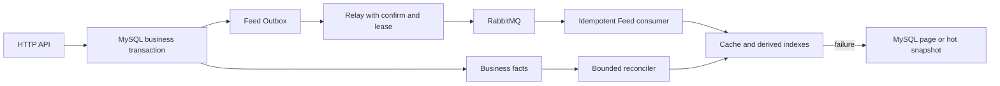
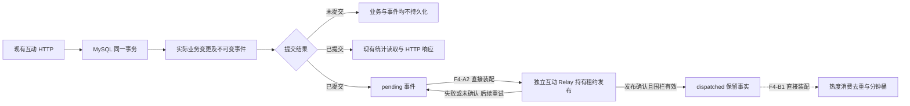

# GoFeed 开发计划

> 更新日期：2026-10-06，后端源码基线为 `8e059e2`（统一默认装配与热度校验），上一轮文档提交为 `5c2d4b5`，当前有待 review 的 R1-A 实现及测试精简改动。页/卡片缓存、发布事件/预热、互动事实/派发/热度消费七项能力直接装配，布尔配置与环境变量入口已删除，见第 5.19 节；worker 参照 GCFeed 在入口内统一编排，热度规则由领域层统一校验，见第 5.21、5.22 节。F4-A1 `82c01d5`、A2 `65cebf6`、B1 `26a3f95` 已提交；真实链路验收、事实重建与 MySQL 快照仍待补，Hot/Recommend 仍为 501。指标仅有配置和请求回调，无采集器或监听装配；容量工具继续暂缓。R1-A 历史验证见第 6.4 节，本轮只校准文档、分析 R1-B1 并给出第 6.8 节 Prompt，不运行测试、迁移或业务服务。已实现摘要见 [README](../README.md)，接口见 [API](../API.md)，规则见 [AGENTS](../AGENTS.md)。

本文统一维护全后端四层架构重构、未完成的 Feed 能力设计与验收缺口。2026-10-06 的目标已扩展为整个后端逐步统一到 GCFeed 的四层结构，执行路线见第 6 节；第 6.4 节的 R1-A 互动 HTTP 读侧已实现待 review，下一实现模块建议为第 6.7 节 R1-B1，之后独立处理 R1-B2，当前都未开始。第 3 节继续维护 Feed 功能路线，其待办不随架构规划删除。第 5.1–5.18 节为历史记录，其中旧功能开关与默认值不代表当前工作树；当前装配见第 5.19 节及 R1-A 路由。历史测试、隔离联调与编译证据不互相替代。

## 1. 当前基线与优先顺序

MySQL 是唯一业务事实源；Redis 用于可丢失的加速和限流，RabbitMQ 用于至少一次投递。现有发布链路是事务写业务状态与 Outbox、relay 确认派发、consumer CAS 幂等完成处理。`video.process` 已有连接恢复、租约、退避、分级重试与 DLQ，不再重复安排旧 MQ 方案中的基础实现。

| 模块 | 当前状态 | 后续动作 |
| --- | --- | --- |
| F0：匿名 Timeline 四层边界 | `8394035`、`224d8ff`、`7541269` 已提交；首页接入 `896f4e1` | 首页 mock 与隔离真实浏览器链路验收通过（第 5.5 节） |
| F1-A：批量公开视频卡片 | `a7e2bd4` 已提交，F1-C 开启后的缓存命中路径调用 | 真实数据库批量读取验收已完成（第 5 节） |
| F1-B：轻量页缓存端口与适配 | `509c123` 已提交，F1-C 已装配 | 适配器单测与真实 Redis 回归通过（第 5 节） |
| F1-C：Timeline 缓存接入 | `f772349` 已提交，当前 API 直接装配页/卡片缓存 | 历史回源及兼容回归已执行；当前变更验收、收益与容量压测待补 |
| F2：Feed 事件与预热 | F2-A `48ce8df`、B1 `98f9df2`、B2 `0c68c82` 已提交；当前 worker 直接装配发布事件与预热 | 历史可靠性见第 5.10、5.11 节；当前变更及性能缺口保留 |
| F3：Following | MySQL 后端 `3a85681`、页面 `c8e88df`、真实联调与脱敏测试 `5e545c9` 已提交（第 5.15 节） | 先完成指标与容量基线，再按收益推进混合推拉（第 3.5 节） |
| F4：Hot | A1 `82c01d5`、A2 `65cebf6`、B1 `26a3f95` 已提交；`8e059e2` 直接装配事实写入、Relay 与热度消费，真实验收待补；Hot 未实现 | 按第 3.8 节分模块推进覆盖契约、扫描、重建与快照；补齐真实验收后再开放 Hot |
| F5：曝光与规则推荐 | 未开始 | 持久化归因、规则候选，向量召回另行评估 |
| F6：重建与运维收口 | 未开始 | 整合恢复水位、容量、重放、指标和告警 |

Feed 是按 GCFeed 目录逐步迁移的业务边界：`domain/feed` 定义读模型与读取接口，`application/feed` 编排分页及缓存端口，`infra/persistence/feed` 适配既有仓储，`infra/cache/feed` 适配 Redis，`interfaces/http/feed` 负责 HTTP。Domain 只依赖标准库，Application 通过领域模型和小接口编排。当前 `video`、`social`、`user`、`auth` 仍采用旧组织方式，后续按第 6 节逐模块迁移；每次只切换一个可独立回归的边界。

互动写入也按相同边界演进：`domain/interaction` 定义内容规则、变更事实及读写/Outbox 端口；`application/interaction` 编排读写、评论游标与租约派发；`infra/persistence/interaction` 实现事务及事实领取，在外层复用既有 social 模型/读取及公开视频规则；`interfaces/http/interaction` 映射 HTTP DTO 与错误。`router` 与 worker 入口负责依赖装配，MQ 编码留在 worker 适配器，不把 GORM、旧模块类型或 MQ 依赖带入内层；点赞状态和评论列表已接入 Interaction，关注与批量统计继续使用原模块。

当前首页使用 `/api/feed?scene=timeline&limit=12`；作者主页继续使用直接读取 MySQL 的旧 `/api/video?author_id=...`。`/api/feed` 首屏直读 MySQL，后续页使用缓存并校验当前公开卡片。新接口启用匿名 Timeline 与认证 Following；未知场景为 400，未启用的 Hot、Recommend 为 501。游标独立绑定场景、结构版本、排序版本与 `(published_at, video_id)`，不与旧视频游标混用。现有接口必须保持可用，每次只迁移一个读取场景或派生链路。

## 2. Feed 缓存后续工作

F1-C 的读取行为见 README 与 API；当前入口直接装配页与卡片缓存，不改变旧接口。`feed_page_cache` 已有日志，指标与告警尚未接通。历史并发、取消、首屏绕过、命中校验和兼容证据见第 5 节；本次装配变更未执行运行验收。端到端回源、多实例同 Key 竞争与容量压测仍待补。

- 当前非空页的静态查询结构为视频 1 次、作者 1 次、点赞/评论聚合各 1 次；ID 页缓存通常不会减少 SQL 数量。需比较缓存与 MySQL 直读的查询成本、p95、回源及缓存耗时，验证实际收益，不把命中率或编译结果当作性能证据。
- F2-B1 基础卡片缓存已实现，端口、版本、Key/TTL、公开验证与迟到回填防护见 README 和第 5.8 节。作者资料与统计缓存尚未实现，仍实时读取；未来实施须定义各自的失效与旧请求回填防护。不能仅复制 GCFeed 的长 TTL 后宣称可见性安全。
- 当前并发上限为每实例 32 个启用缓存的 Feed 请求、16 次缓存操作；请求容量耗尽返回安全 503，缓存容量耗尽跳过缓存。应用层并发/取消/释放单测已通过，真实容量压测仍待补；上限配置化和同 Key 请求合并按容量证据另行评估。
- 页缓存载荷上限仍只限制编码与 Get 后解码。F2-B1 卡片读取用 Redis 批量脚本先检查 STRLEN，超大值只返回标记，不将大字符串传给驱动；这不代表页缓存同样已经具备 Redis 端有界读取。

## 3. F2–F6：Feed 派生能力

| 阶段 | 最小交付及必须保留的约束 |
| --- | --- |
| F2：Feed 事件 | worker 同时注册 `video.process` 与 `video.published`；实际发布 CAS 与 Outbox 同事务，独立预热、完整拓扑与重连直接装配。历史可靠性见第 5.10、5.11 节；统计缓存和首页预热另行规划，派发不能作为消费完成水位 |
| F3：Following | 使用真实 `user_follows(follower_id, followee_id)`、活动作者与公开规则查询 MySQL，建立按观看者绑定的游标。现有公开视频规则不自动排除注销作者，活动作者过滤归关注场景。再增加小作者粉丝 Inbox、大作者 Author Outbox、关注补最近视频与取关过滤 |
| F4：Hot | 点赞/评论仍同步落 MySQL，同事务写 `interaction.changed`。事件去重后更新分钟 ZSET；MySQL 保存有界快照或可重算事件窗口。Redis 故障先读快照，快照缺失再显式降为 Timeline，禁止每次请求实时全表聚合 |
| F5：曝光与推荐 | 持久化 `request_id`、曝光、有效观看与完播归因，唯一键至少绑定 `user_id + request_id + video_id`。规则先覆盖新鲜度、热度、关注、近期去重与作者打散；规则稳定且数据足够后才评估内容/兴趣向量召回 |
| F6：重建与运维 | 水位扫描、限批修复、事件重放与容量告警；基础恢复和观测随各模块交付，不能全部推迟到本阶段。大小作者阈值、Inbox 长度、补偿窗口、热榜窗口和重建批次需配置化、可观测、可回滚 |

### 3.1 F2-A：Outbox 事件类型路由

`worker.NewRelay` 保留原构造签名，默认只有 `VideoProcessRoute()`。`NewRelayWithRoutes` 接收完整路由列表，按 `event_type` 建立独立映射，拒绝空列表、不完整的 `mq.EventSpec`、空准备函数和重复类型，并复制注册表。装配多个类型时须显式包含 `VideoProcessRoute()`；此入口不自动声明队列或启动消费者。

每个 `RelayRoute` 提供发布目标和只基于本轮快照的检查、载荷构造。通用轮询继续负责 claim、租约接管日志、发布失败的有界指数退避、确认后标记与 attempt 围栏。未知类型或快照不一致按原有五分钟退避释放租约，并继续处理同批其他事件。视频处理载荷的版本、字段和目标不变；缺失快照、不完整处理状态仍拒绝派发，接管已由消费者完成的 published/rejected 事件仍直接收口。该终态规则仅属于视频处理路由，不能套到其他类型。

F2-A 提交本身未改变生产 worker 装配、业务状态、迁移或 RabbitMQ 拓扑；该阶段测试事件只存在于隔离测试资源。B2 的同事务发布事件和预热装配已实现，当前入口直接启用，见第 3.2、5.9 节；运行验收已在 2026-10-03 同日第二轮按测试授权补做（第 5.10 节）。首页首屏仍绕过页缓存，基础卡片缓存由 B1 实现，作者/统计缓存仍未实现；不能把读取命中当作预热验收已经完成。

新增 Feed Outbox、消费幂等/水位、热榜事件或快照、曝光记录时，实施前按迁移目录和目标库状态分配新版本，不预占迁移号。现有迁移目录最高为 `000010`，目标库应用状态须单独核对；本机执行记录见第 5.20 节。F2-A 历史模块不新增迁移。

### 3.2 F2-B：发布事件与单视频卡片预热契约（B1/B2 后端已提交，B2 后端可靠性验收见第 5.10 节）

契约设计已提交为 `ecef426`，F2-B1 基础卡片读写和公开状态端口后端提交为 `98f9df2`；历史完整工作树运行记录见第 5.8 节。下述 F2-B2 发布消息、队列、生产者和消费者后端提交为 `0c68c82`。本次按“提交并分析下一步”完成分模块提交，沿用上一轮不修改或运行测试、前端且不提交 `*_test.go` 的范围；真实链路验收仍待补，不把 B1 命中或 B2 编译通过作为事件预热验收。该缺口已在 2026-10-03 同日第二轮的测试授权下于第 5.10 节补做。

**消费目标与交付顺序**

首个消费目标限定为按视频 ID 预热基础 `FeedCard`，字段沿用现有 [domain/feed/entity.go](../backend/internal/domain/feed/entity.go)。作者资料、点赞/评论统计继续批量读取 MySQL；本阶段不建立作者/统计缓存，不预热任意游标页，不改变首页首屏绕过页缓存的行为。

API 页/卡片缓存一起装配，卡片缓存只用于后续页的页缓存命中路径。旧 `/api/video`、详情、作者主页与首屏继续直读 MySQL；缓存缺失、损坏或故障批量回源，命中仍校验当前公开状态。

| 独立模块 | 完整交付范围 | 停止点 |
| --- | --- | --- |
| F2-B1：基础卡片缓存读写 | 批量端口、Redis 适配、公开状态验证及装配已实现 | 后端 `98f9df2` 已提交，当前 API 直接装配；历史验收见第 5 节 |
| F2-B2：发布事件闭环 | CAS 与 Outbox 同事务、发布路由、重连拓扑、预热及 ACK/重试/DLQ 已实现 | 后端 `0c68c82` 已提交，当前 worker 直接装配生产与消费；历史验收见第 5.10 节 |

F2-B1 不写 `video.published`，F2-B2 不补发历史所有已发布视频，也不实现 Following、Hot 或推荐。基础卡片缓存的生产收益仍需 F1 的查询成本、容量与 p95 证据；预热存在和命中率不证明收益。

**业务事务与稳定消息**

事务来源为 [CompleteVideoProcessing](../backend/internal/video/outbox_repo.go)：保持 `(bool, error)` 契约，在一个 MySQL 事务内执行未软删除视频的 `processing → published` CAS。当前 worker 仅在实际变更一行时，创建一个新 UUID 的 `video.published` pending 事件；该 UUID 与原 `video.process` 事件 ID 不同。插入或提交失败必须回滚发布状态并返回错误，原处理消息走基础设施重试；返回零行时不插入事件，按原重复消息逻辑确认。拒绝分支不产生发布事件。

沿用发布请求已写入的 `published_at`，不使用处理完成时间改写 Timeline 排序。并发的两个处理投递只允许实际 CAS 成功者写事件。原媒体校验、草稿到 processing 的事务和 HTTP `202` 契约保持不变；API 仍不直接调用 RabbitMQ。

已实现消息结构如下，发布事件使用独立的结构版本常量，不改变现有处理消息的 `mq.SchemaVersion`：

```json
{"schema_version":1,"event_id":"<new UUID>","video_id":123}
```

JSON 仅携带可验证的标识。事件 ID 在事务中持久化，Relay 重投保留同一值；视频 ID 必须非零，事件 ID 必须是合法 UUID，消费者拒绝损坏载荷和未知版本。标题、作者资料、统计、媒体路径和游标均不作为 MQ 事实传递；消费者重新读取当前 MySQL 卡片。

现有 [000006 Outbox](../backend/db/migrations/000006_video_outbox.up.sql) 与 [000009 租约](../backend/db/migrations/000009_outbox_publishing_lease.up.sql) 已有类型字段、事件 ID 唯一键和租约字段，能够容纳该标识消息。此设计不要求新增持久化载荷、卡片事实表或消费记录表，也不预占迁移号；业务实施前仍须只读核对目标库版本、列、索引与外键。未来若增加持久化消费水位或内容版本，另行评审迁移。

**Relay、拓扑与重连**

发布目标为 `gofeed.events` / `video.published`，消费队列为 `feed.card.warm`，由 worker 直接装配。独立队列的隔离依据是 Redis 预热故障不能阻塞现有媒体处理消费者；新队列使用自身 `ConsumerSpec`，初始 QoS 为 4，保留最多三次 `1s/5s/30s` 延迟重试及专用死信队列。原 `video.process` 的目标、QoS 16、消息版本与重试规格不变。

发布路由只检查事件标识并构造稳定消息，不套用处理路由的 processing 状态检查或 published/rejected 接管收口。事件写入证明曾完成发布；即使当前视频已经软删除，仍应把事件交给消费者按当前可见性跳过，而不是在 Relay 中固定退避到永久 pending。硬删除会按现有外键级联删除尚存 Outbox，此事件用于可丢失的缓存加速，不承诺硬删除后的审计保留。

`mq.WithConsumerSpecs` 持有完整规格，初次连接和重连声明全部消费拓扑。worker 直接装配视频处理/预热，互动 Relay/热度消费使用独立 MQ Runtime；所有循环纳入取消、等待与资源关闭生命周期。队列深度日志不代表覆盖水位，本轮未做实际故障验收。

当前 worker 的视频处理/预热与独立互动 Runtime 均显式使用 `WithMandatoryPublishing(true)`；原 Runtime 构造默认值仍为 `false`，不代表生产入口的装配。mandatory 作用于对应 Runtime 的全部发布（含旧处理与事件重试），配合缓冲 Return 通知及串行发布；在 broker confirm 后检查 Return，缺失绑定返回错误并交由原 Runtime 断开重建、Outbox 退避或消费重投处理。历史真实 broker 验收见第 5.10 节，本次未重新运行；不能将编译通过或 dispatched 称为消费或预热完成。

**缓存端口、版本与公开边界**

F2-B1 已提供应用层卡片批量 Get/Set/Delete 端口与 MySQL 批量公开状态读取端口，内层不依赖 Redis/GORM。读取/删除 ID 忽略零值、去重，最多 51 个有效 ID，写入卡片必须满足公开展示字段契约，返回值仍是按 ID 映射的卡片。复用现有取消、Feed Runtime 和缓存操作容量。F2-B2 暖缓存单次仅读取消息指定视频，不展开作者全部视频或粉丝集合。

F2-B1 Redis Key 为 `gofeed:feed:card:v1:<video_id>`；值携带结构版本和基础卡片（含视频 ID、作者 ID、原 `published_at`），默认 TTL 30 秒、单条编码上限 16 KiB。作者资料、统计、登录态和 `isLiked` 不进入卡片值。超大卡片记录 `skipped_oversized` 并继续 MySQL 读取；批量 Lua 在返回字符串前检查长度，超大已存值只返回无效标记。B1 不包含发布事件；B2 预热处理器复用同一缓存端口，不缓存作者资料或统计。

读取缓存前，`GetPublicVideoStates` 用与 `PublicVideoQuery` / `IsPublicVideo` 一致的完整公开规则批量查询 MySQL，只选择 `id`、`author_id`、`published_at`；检查 published、未软删除、非空有效发布时间及全部媒体字段完整性。缓存 ID、作者 ID、发布时间必须与本次结果匹配，不可见行不得由缓存补回。已用真实 MySQL 对齐旧 `GetPublishedByIDs`，包括作者零标识兼容；命中沿用 MySQL 的时间表示以保持响应兼容。

命中允许省去基础卡片大字段读取，但仍访问 MySQL；缓存关闭、首屏排序、作者批量读取和统计聚合保持原契约。允许旧请求在删除后留下有限 TTL 的无效 Redis 值，读取时的 MySQL 公开检查必须拦住它，不能复活对外可见卡片。删除成功后的精确 Key 删除可减少无效值，失败不回滚 MySQL 删除；Redis 故障期间也不允许绕过公开检查。发布时间不等于内容版本：目前没有已发布内容编辑入口，未来新增该能力前必须补内容版本、失效及旧写入围栏，不得沿用当前发布时间匹配规则作为编辑一致性保障。

**消费幂等、结果与确认**

| 情况 | 消费结果与 ACK 规则 |
| --- | --- |
| 消息合法且当前卡片公开 | 读取 MySQL 后写入相同版本 Key；SET 成功后记录 `warmed` 并 ACK |
| 视频已删除、不存在或不再公开 | 不预热，按精确 Key 尝试清理；清理成功或键不存在后记录 `skipped_not_public` 并 ACK，Redis 故障走有限重试 |
| 同一事件重复投递，或 SET 后 ACK 丢失 | 用同一视频 Key 再读取当前 MySQL 并覆盖当前卡片，允许刷新 TTL；不重复业务状态更新，不因 Redis 去重标识跳过公开检查 |
| MySQL 或 Redis 暂态失败、单次处理超时 | 安排下一档重试；broker 确认重试消息前不 ACK 原消息，重试发布失败保留原投递 |
| 载荷损坏、版本不支持、重试耗尽 | 明确记录原因并进入该队列 DLQ，受控重放沿用原事件 ID |
| 卡片超出载荷上限 | 记录 `skipped_oversized` 并 ACK；真实读取继续回源，不误记为缓存成功 |
| 进程关闭或上下文取消 | 停止取新投递，未完成处理不伪造成功；按原信道关闭/重投生命周期收口 |

处理器采用天然可重放的按视频 Key 覆盖，不用 Redis `SETNX event_id` 代替业务幂等。Redis 是派生加速，可在成功后丢失；读路径仍回源和按流量填充，因此无需为了缓存预热建立第二份 MySQL 卡片事实。

消费日志包含 `event_type`、`event_id`、`video_id`、`result`、`attempt` 和耗时；区分 `warmed`、不可见/超大跳过、重试、死信。日志不是持久化消费水位，Outbox 的 dispatched 仍仅表示派发确认，不表示完成预热。需要断电后可查询的消费完成账本时，再增加独立持久化设计。

**开启、验收与回滚**

API 直接装配页与基础卡片缓存；worker 直接写发布事件并运行预热，旧功能开关已删除。部署前应用迁移并准备认识全部事件的 worker，再启动新版 API；不能混用不认识新类型的旧 worker 声称链路完整。

F2-B1 验收至少包括批量上限、空/重叠 ID、缓存缺失/损坏/超大/超时、取消与容量释放、整页兼容、软删除与迟到回填、作者注销占位和实时统计。用独立 MySQL 库与随机 Redis 前缀证明真实卡片读取命中、精确 Key 清理；保持旧作者列表、详情和首页游标契约不变。

F2-B2 验收至少包括 CAS 零行不写事件、并发只写一次、新 UUID、Outbox 插入/提交故障整体回滚、拒绝不写、排序时间不变；真实 MySQL → Relay → RabbitMQ → consumer → Redis 观测到成功写入。还需覆盖发布后软删除、重复投递、SET 后 ACK 丢失、确认/标记失败、未知版本、Redis 故障重试与 DLQ、重试确认前原消息未 ACK、断线重连拓扑恢复及缺失绑定失败。每种结果分别记录实际依赖与故障注入，不能用 mock 或相同响应替代命中/可靠链路证据。

页/卡片缓存与预热不再通过配置回退。需要回退代码时先停止新事件生产，再由认识新类型的 worker 排空或记录受控重放清单；保留事实、路由与消费者，不伪造完成。只清理明确持有的精确缓存 Key/隔离拓扑或等待 TTL。历史验证见第 5.8–5.11 节；本次未执行部署或回滚。

原独立关注流方案归入 F3，目标入口优先评审 `/api/feed?scene=following` 的鉴权和观看者范围，不同时新增两套关注流编排。关注/取关、作者注销、发布/删除使结果集合动态变化，keyset 不保证跨页冻结快照。

参考 GCFeed 的卡片/统计拆分、分钟热榜、大小作者推拉和推荐分场景；参考 feedsystem 的队列隔离、独立消费者、QoS 和运行方式。保留 GoFeed 的 Outbox + confirm + lease + CAS + retry/DLQ，不复制 Redis 先写互动再异步落库或 API 先发 MQ 再直接写库的路径。

下图表示派生链路目标；B2 后端已装配发布预热路径并完成后端可靠性验收（第 5.10 节），其他派生索引和重建仍待后续：



| 依赖/用途 | 故障路径 | 恢复边界 |
| --- | --- | --- |
| Timeline 页缓存 | 跳过 Redis，按原游标批量回源 MySQL | 独立冷却、单探针、按流量回填 |
| Following 索引 | MySQL 关注集合查询 | 按水位限批重建 Inbox/Author Outbox |
| Hot / Recommend | 快照或规则候选，再显式降为 Timeline | 从事实事件、快照和行为数据重建 |
| RabbitMQ 派发/消费 | 保留 Outbox；重试消息确认前不 ACK 原消息 | 稳定 event_id、租约接管、连接恢复、幂等重投 |
| MySQL | 返回安全错误，不伪造业务成功 | `/ready` 以 MySQL 为准 |

不得全库清理 Redis、在请求中无界 fanout 或建立热循环重试。新队列只有业务吞吐、SLA、隔离或重试差异明确时才引入，并同时定义 schema、事务来源、幂等键、ACK、有限重试、DLQ 和受控重放。日志存在不代表监控告警已接通，平台、阈值和接收人仍待决策。

### 3.3 下一模块顺序

本节列出 Feed 功能路线内的顺序。当前全项目停在第 6.4 节 R1-A 的 review 边界；以下功能与验收缺口继续保留，不在互动读侧重构中顺带实施。

| 顺序 | 状态与动作 | 边界 |
| --- | --- | --- |
| F3-C1 指标与容量基线 | 配置和 Feed 请求回调已提交为 `2ff0364`；无采集器、监听装配或容量工具，容量测量仍暂缓 | 保留 MySQL Following 和缓存默认值，混合推拉仍需收益证据 |
| F3-C2/C3 Following 混合推拉 | 基线证明收益后，先派生写入、再影子比较与读取切换 | 索引不完整整页回源，不能把存在数据或派发完成当覆盖证明 |
| F4-A/B1 互动事实与热度消费 | A1/A2/B1 已提交；真实事务、并发、投递及消费专项仍待验收 | 派发完成不能当作消费或覆盖完成；该功能路线后续在 review 后推进 B2 重建与快照 |
| 既有专项验收 | 独立补齐真实卡片缓存浏览器、移动 UI 登出与 Redis 重启等缺口 | 证据与容量评估分开记录，见第 3.4、5.14、5.15 节 |

### 3.4 Following 剩余专项与容量评估（前后端已提交）

后端接口契约已归入 [API](../API.md) 的 Feed 节。当前页面已通过 `listTimelineFeed/listFollowingFeed → usePublishedFeed → FeedView` 接入两场景，支持 `/?scene=following` 与登录回跳，作者页仍读取旧 `/api/video`；实际提交与验证见第 5.15 节。本节只保留未覆盖范围。

下一步保留以下专项，不重复安排已有实现和已完成的 review：

- 验收证据继续区分前端 mock、真实 Go/MySQL、页缓存装配和纯探针；已有真实联调不能替代 Timeline 真实卡片缓存浏览器验收
- 移动端真实 UI 登出、专用 Redis 进程重启仍待专项；当前移动端联调以登出 API、清会话和重载覆盖登出后的状态
- 正式浏览器运行须显式设置持久证据目录；认证请求与响应的内联、参数及 SHA1 资源均须脱敏，不能只扫描 JWT 前缀
- Inbox/Author Outbox、Redis 集合与生产容量评估尚未实施，依据容量指标另立模块

当前 EXPLAIN ANALYZE 样本仅有 128 名作者、1152 条视频（每作者 1 条公开、8 条 draft），不能代表生产稀疏关注、海量作者历史或并发请求。待评估实际数据分布、首屏/续页扫描量、p95 和资源成本；确有索引缺口才新增递增迁移，不能修改已应用迁移。现有非空 6 条/空页 3 条 SQL 预算只证明查询次数，不能证明扫描量与关注规模无关。

回滚时先撤销页面接入和依赖该页面的联调测试，再撤销后端 Following 并同步 API/README，客户端清空该场景游标；本轮未增加迁移、写入事实或派生队列。后续派生索引按实际提交与未处理事件分别制定回滚步骤。

### 3.5 下一步向 GCFeed 演进的执行计划（2026-10-06 源码核对）

参考本地 `F:\work\Feed\GCFeed` 的提交 `8cf995c`：`apps/api/internal/application/feed/service.go` 已包含场景策略、混合推拉与推荐编排，`application/video/fanout_worker.go` 实现按粉丝规模分流和分批写索引，`infra/cache/feed_cache.go` 实现 Inbox/Author Outbox、分钟热榜与卡片/统计缓存，`infra/metrics/metrics.go` 实现 Feed、缓存和 worker 指标。该仓库文档与源码仍须分别核对；本轮只读参考源码，未运行或迁移其服务。

GoFeed 已完成分层 Feed、Timeline 缓存、发布事件与基础卡片预热，以及 MySQL Following 和页面接入。本节继续维护派生读取和观测能力的功能路线，保持现有 Vue、接口和 MySQL 事实源。全后端四层重构另按第 6 节实施，R1-A 已实现待 review；架构迁移与新 Feed 功能分别 review、分别验证。

**F4-A1/A2/B1 已提交；后续为 F4-B2 事实重建与 MySQL 快照 → F4-C Hot，独立交付边界见第 3.8 节。** F4-A/B1 的真实依赖验收仍待补，不能省略或以历史编译替代。容量基线工具继续暂缓，Following 仍使用已提交的 MySQL 读取；混合推拉和大小作者阈值尚无容量收益证据，已实现缓存当前直接装配。

| 顺序 | 最小交付 | 验收与进入下一步的条件 |
| --- | --- | --- |
| F3-C1：指标与容量基线（容量工具暂缓） | 补齐已有配置/回调到采集器及独立回环监听的装配；后续需要容量判断时再安排隔离测量，本轮不增加或运行 baseline 包 | 区分首屏/续页、Timeline 缓存关/开、Following；记录 p50/p95/p99、错误率、SQL 次数、EXPLAIN 实际扫描量、连接池与 CPU/内存。结果须注明硬件、源码、参数和清理范围；这些证据仍待补 |
| F3-C2：Following 派生写入 | 仅在基线显示收益时设计配置化大小作者阈值、Inbox/Author Outbox 长度与补偿窗口；先独立交付发布事件索引消费及关注回填 | MySQL 成功提交后才派生；粉丝 keyset 分批处理，有批次上限与恢复位置。重复、失败、重试、DLQ、作者跨阈值、关注/取关与删除均有真实依赖证据；该阶段 API 仍读取 MySQL |
| F3-C3：Following 索引读取 | 在写入与重建完整性证明后接入独立派生读端口，沿用观看者绑定游标和公开规则 | 当前关注关系与活动作者仍由 MySQL 校验；缺失、部分覆盖、过期水位、损坏或 Redis 故障整页回源。影子比较与回退证明无漏项、越权或分页顺序变化 |
| F4-A：互动事实事件（已提交） | 独立事实表与租约派发已实现；载荷直接来自已提交行，独立连接声明 `feed.heat`、重试及 DLQ 拓扑，详见第 3.6 节 | 补齐事务、并发、提交结果不确定、未路由/确认丢失、租约接管及重复派发验收；worker 同时装配 Relay 与热度消费，真实专项仍待补 |
| F4-B1：幂等分钟桶消费（已提交 `26a3f95`） | 创建分钟归属、规则指纹、Hash 收据/绝对分数及分钟 ZSET、独立消费/重试/DLQ 已实现，细分范围见第 3.7 节 | 本轮排除测试；重复/乱序/迟到/跨窗口、Redis 故障、ACK 丢失与 DLQ 回放仍待真实验收，覆盖保持 unverified；只覆盖点赞/评论，不开放 Hot |
| F4-B2：事实重建与 MySQL 快照 | 限批重放不可变事实，生成独立代际的 Redis 索引，持久化热榜窗口、版本、覆盖状态及有界快照 | 缺口、Redis 丢失、重建并发和快照到期可识别；有效覆盖经证明后才切换代际，不按最大事件 ID 或 dispatched 推断消费完整 |
| F4-C：Hot 场景 | 注册第三个 Feed 策略，复用批量卡片组装；快照版本与窗口绑定独立游标，随后单独接入页面 | 同分排序、快照到期与跨页一致性明确；Redis 不可用先读 MySQL 快照，快照缺失时冻结并公开降级契约。不能对每个请求实时全表聚合，不能静默混用 Timeline 游标 |
| F5：曝光与规则推荐 | 先持久化请求归因、曝光、有效观看与完播，随后接入新鲜度/热度/关注、去重和作者打散规则 | 行为写入幂等、归因与隐私边界清楚，推荐不足和依赖失败有显式降级；数据与效果基线成立后再评估向量召回 |

F3-C1 的指标标签只使用有限的场景、结果和缓存类别，未知输入归一化；用户、视频 ID、原始游标、request_id、令牌不作为标签。指标出口先冻结默认关闭、独立回环监听及生命周期，采集不可改变业务返回、缓存默认值或 `/ready` 语义；本模块不附带 Grafana 管理后台、pprof、迁移或新 MQ 队列。

容量测量恢复后，先配置多个作者历史量和公开视频比例，覆盖稀疏关注、多关注、热门作者与同发布时间数据；逐级提高并发并记录停止条件，不把单机极限当生产容量。用同一数据和环境比较改动前后再决定是否进入 F3-C2；无收益时保留 MySQL Following，互动事件和 Hot 可按独立业务顺序推进。

GCFeed 的具体实现不能直接成为 GoFeed 的可靠性契约：索引“存在部分数据”不能证明整页覆盖；`dispatched` 不是消费完成水位；参考 ZSET 分数把秒级时间与 `video_id % 1000000` 合成，不能替代 GoFeed 的精确 `(published_at, id)` 顺序。后续必须定义索引覆盖水位、版本、截断后历史回源、限批补足及精确排序。保留 Outbox + confirm + lease + 有限重试/DLQ，互动仍同步提交 MySQL，不引入 Redis 先写事实再异步落库的双事实路径。

每个表格行继续拆成可独立回归的设计、后端、专项验收和必要前端模块，完成后等待 review 再提交。现有剩余专项验收与容量测量分开记录；A1/A2 提交及本轮文档核对见第 5.17 节，第 5.16 节保留为 A1 实现阶段的历史记录。

### 3.6 F4-A：互动事实事件契约（2026-10-05，A1/A2 已提交，待专项运行验收）

A1 实现阶段按当时授权排除测试与前端，交付记录保留在第 5.16 节；后续存储提交为 `82c01d5`，派发提交为 `65cebf6`。本节按当前源码更新实现边界，不将已提交或旧编译结果当作真实依赖验收。F3-C2 的收益、阈值与实现选择仍等待容量结果，互动事实实现不依赖该结果。

**现有源码边界**

- 当前四种写入直接使用互动四层，事务适配器复核活动用户、公开视频与删评归属。点赞关系受 `(video_id, user_id)` 唯一键保护；取消为物理删除，删评为软删除。真实变更与事实共用同一事务，不在 service 返回后追加事件。
- 重复点赞与重复取消仍返回 `200`；重复删除已删评论仍为 `404`。创建评论没有请求幂等键，重复 POST 可以创建两条评论；不能以相同正文或用户/视频组合去重事件并宣称实现了评论请求幂等。
- `video_outbox_events` 只有视频标识、类型与派发状态，没有互动载荷；迁移 `000006` 还规定视频硬删除级联删除该表。`worker.Relay`、`RelayRoute.Prepare` 和 claim 快照均依赖 `video.Repository/OutboxDispatch`，增加一个事件路由不能解决互动事实存储和重放问题。
- 当前点赞统计和评论作者资料在写入后另行读取。读出失败或响应丢失时，业务变更可能已经提交；新增事件不改变这个边界，不能把 HTTP 错误等同于事务回滚。

**事件 v1 与存储选择**

已新增 `interaction_outbox_events` 的 `000010` up/down 迁移，同一行保存不可变事实与可变派发状态，不额外拆表或引入通用事件框架。事件实体及业务规则归 domain，GORM 事件模型与事务归 `infra/persistence/interaction`；既有点赞/评论表和 ORM 模型继续在 social，仅由外层适配器复用。原表 ID 为 unsigned bigint、创建时刻为 DATETIME(3)。2026-10-05 本机 `localhost:3306/feedsystem` 已由迁移 9 升至 10、`dirty=false`，结构核对见第 5.20 节；这是该时点的执行记录，其他目标及后续状态须单独核对。

已实现领域事实、存储及 MQ 编码，版本为 `schema_version=1`，事件类型为 `interaction.changed`；MQ 载荷只由已提交行构造，租约接管与重试保持原事件身份及内容：

| 不可变字段 | 约束与用途 |
| --- | --- |
| `event_id` | 每次真实变更产生一个 UUID，所有租约接管、发布重试及重放保持同一个值 |
| `schema_version`、`event_type` | 固定为 `1`、`interaction.changed`；未知版本/类型不能当作已处理事件丢弃 |
| `video_id` | 来自事务内实际变更的互动行，大于零；不用当前视频快照重建历史载荷 |
| `kind` | 有限枚举 `like.created`、`like.removed`、`comment.created`、`comment.removed` |
| `interaction_id` | 对应点赞行或评论行的持久化 ID；同一点赞取消后重新点赞产生新关系 ID |
| `delta` | created 为 `+1`，removed 为 `-1`；与 kind 不一致即为无效载荷，不在生产者乘热度权重 |
| `occurred_at` | 真实变更事务内记录的时刻，RFC3339 UTC 毫秒；重试不改为发布或消费时刻 |
| `interaction_created_at` | 原互动行的创建时刻，RFC3339 UTC 毫秒；删除前保存，供跨窗口撤销规则与配对核对使用 |

数据库以 `occurred_at_ms`、`interaction_created_at_ms` 的 Unix 毫秒保存两项时刻，领域构造器按 UTC 毫秒规范化；当前 MQ 编码转换为上述 JSON 字段。现有 `db.NewDB` 使用 `time.Local`，原互动时间沿用其读取时区后转换，非 UTC 往返验收仍待补。变更时刻在事务内捕获一次，不从原创建时间推导取消/删除的发生时刻。

事实列使用唯一 `event_id`，另以 `(kind, interaction_id)` 约束当前业务支持的一次创建/一次删除。创建后只更新投递列，不覆写 kind、delta、关联标识和时刻。若将来支持恢复同一评论或复用关系行，须升级变更身份契约，不能沿用此唯一键压掉新事实。事件不携带评论正文、用户资料、JWT/session、请求头或请求 ID。

投递列沿用已有 `pending/publishing/dispatched`、`attempt`、租约、下次尝试、错误分类及派发时刻语义，配置 claim 和重放所需的有界索引。事件表不采用视频、用户或互动行的级联删除外键；原对象删除后事实仍可重放。当前没有按 dispatched 自动删除的清扫器；保留时长、恢复边界、清理水位与容量告警仍需随 F4-B2 设计，不能仅按派发状态删除尚可能用于恢复的事实。

**业务事务与重复操作**

| 操作 | 同事务内的实际变更及事件 |
| --- | --- |
| 点赞 | 插入新点赞行后写 `like.created/+1`；仅点赞唯一键冲突属于重复成功，不写事件；其他插入错误不得吞掉 |
| 取消点赞 | 锁定当前匹配关系，保存 ID/创建时刻，按该行 ID 删除；实际删除一行才写 `like.removed/-1`；关系不存在不写事件 |
| 创建评论 | 插入评论得到 ID 与创建时刻，再写 `comment.created/+1`；不同评论分别产生事件，不按正文去重 |
| 删除评论 | 锁定尚未删除且属于当前作者的评论，保存视频/评论标识与创建时刻；条件软删除实际一行后写 `comment.removed/-1`；失败或零行不写事件，并保留现有 service 错误映射 |

保留既有权限与响应契约。锁定、条件写入和事件插入均使用同一个 `tx`，不能在事务闭包里调用绑定外层连接的 repository 写方法。唯一键冲突只在对应业务插入处分类；事件唯一键冲突及其他事件插入错误应使整个事务失败，不能将其当作重复业务成功。数据库设置了 `clientFoundRows=true`，不得仅依据 UPSERT 的 RowsAffected 判断新建关系。

业务 SQL、事件插入、提交前取消或可确定的提交前故障必须一起回滚。提交响应丢失等情况只保证两者一起提交或一起未提交，不能保证调用方收到错误时数据库一定未提交；验收应读回业务行和事件确认一致性。事务提交后统计/作者读出失败不撤销已提交事件；重试点赞/取消不会再生事件，重试评论 POST 仍按既有非幂等契约执行。

四种操作的并发验收以数据库最终状态及事件集合为准：同一关系并发点赞只有一条创建事件，并发取消只有一条删除事件；点赞→取消→再点赞应保留三个不同事件，其中前两条关联旧关系、第三条关联新关系。并发删评只有一次软删除和一条负事件。物理级联回收、注销与后台清扫不由本模块逐条合成互动删除事件；F4-B/F4-C 必须另外证明对象可见性和重建边界。



提交结果未知时须读回核对业务与事件的持久化状态；发布器和消费端均允许重复，同一个 event_id 由消费端原子去重。

**Relay 与启动顺序**

API 四种互动写入直接记录事实，启动前须应用迁移 `000010_interaction_outbox`；worker 直接装配 Relay 与热度消费。旧环境变量与 YAML 布尔项不再控制行为，派生故障不改变已提交的 API 业务事实。

派发已按 `domain/interaction.OutboxStore` → `application/interaction.Dispatcher` → `worker.InteractionRelay` 装配，复用现有 `EventPublisher` 与日志观测；保留 `NewRelay/NewRelayWithRoutes`、视频快照准备和两类视频事件行为。互动 claim 只读已提交的持久载荷，不读取当前点赞/评论/视频拼装旧事件，也不使用视频处理终态规则推断互动消费完成。每轮最多领取并派发 32 条，逐条 claim，租约 30 秒，单次 claim/发布/标记超时 5 秒，发布失败指数退避上限 5 分钟；这些是源码默认值，不代表吞吐验收。

沿用有界 claim、数据库时钟租约与 attempt 围栏：超期可接管，旧持有者不能标记新租约；confirm 后标记失败应保留同一事件供接管重发。发布失败保留 pending 并采用有上限的指数退避，原事实不丢弃；消费端在后续 F4-B 使用有限延迟重试与 DLQ。`dispatched` 仅表示发布确认，不表示已进入热榜，也不作为完整覆盖或重建完成水位。

独立 MQ Runtime 声明 `interaction.changed` → `feed.heat`、QoS 4、`1s/5s/30s` 重试与 DLQ，初次连接及重连恢复拓扑，发布开启 mandatory/Return 检查。worker 直接运行 Relay、HeatConsumer 与队列观测；配置包只读取参数，热度规则统一由 HeatPolicy.Validate 校验，startWorkers 仅在时间转换前检查溢出。去重及 ACK/重试/DLQ 已实现，真实验收仍待补。API 不连接 RabbitMQ。

启动顺序为核对并应用迁移 → 启动完整 worker → 启动新版 API。本轮未执行部署或迁移。代码回退前停止新事实生产，保留认识事件类型的 Relay/消费者处理存量并记录恢复清单；不在运行期间 down 迁移或删除事实表。历史采集缺口仍需经验证的基线/重建，不能复用未经证明的热榜水位。

**独立交付及验收**

| 交付 | 边界与必须提供的证据 |
| --- | --- |
| F4-A1：同事务事实存储 | 四类写入直接使用事实存储；待真实 MySQL 验证实际变更/零行/重复/并发、事件插入及提交故障、提交结果不确定时读回、原行删除后事实保留、时间往返和既有 HTTP/统计兼容；持久事实不等于已投递或热榜 |
| F4-A2：可靠派发 | Relay 与完整消费拓扑直接装配；待真实 RabbitMQ 验证提交可见性、断连/未路由/confirm 丢失、租约接管、标记失败重发、载荷保持、取消关闭与旧视频链路兼容 |
| F4-B 前的契约检查 | 冻结权重/窗口、正负事件跨窗口归属、迟到界限、去重与更新原子性、事实保留和 MySQL 重建/快照、覆盖起点及缺口恢复；不得按消费时间替代原发生时间，也不能截断负数后声称乱序等价 |

每份交付附实际命令、退出码、真实依赖参与和未运行清单，独立 review 后再按明确指令提交。A1 的编译及静态核对记录见第 5.16 节；A1/A2 当前源码与提交核对见第 5.17 节。本轮仅更新文档，不运行业务测试、容量工具、迁移或服务；以上真实 MySQL 原子性、并发、故障、HTTP 兼容及 RabbitMQ 投递验收仍待补。

### 3.7 F4-B1 幂等分钟桶消费（后端已提交，直接装配，真实验收待补）

用户授权先提交现有后端改动，再编写下一模块，明确不碰前端、测试和单元测试代码。现有两个生产文件提交为 `2ff0364`；本节后端完成后保留待 review，随后按“先提交，再给 feed 流核心类字段加简短注释”的指令提交为 `26a3f95`。当前源码链路为：已提交互动事实 → 现有 Relay → `feed.heat` → 幂等热度消费 → Redis 分钟桶；本轮未实际运行该链路。API 写入继续以 MySQL 事务为成功条件，派生失败不回滚已提交互动；不新增接口或改变 `scene=hot` 的 501 响应。

**当前计算规则与限制**

- 只覆盖 `like.created/removed`、`comment.created/removed`。默认点赞/评论权重为 3/5，窗口 60 分钟、桶保留宽限 10 分钟、去重状态 24 小时；这些是可配置初始值，不是效果或容量验收。默认每分钟最多 10000 视频、100000 事件，超限重试并最终保留在 DLQ。事实表清理和保留水位尚未实施，没有收藏计分。
- 已选择“窗口内新增且尚未撤销的互动”：新增与撤销归属同一 `interaction_created_at` 分钟，`occurred_at` 保留实际变更和迟到信息；例如 70 分钟前的点赞现在取消，不冲减当前窗口内的新点赞。创建与变更跨分钟也使用同一归属规则；原创建时刻晚于变更时刻的事件无效。
- Lua 将事件收据、绝对分数及容量计数在同一状态 Hash 写入，再写分钟 ZSET。重复投递读取当前绝对分数修复 ZSET，不再次累加；同事件在同一归属桶内的载荷变化被拒绝。类型、规则指纹及已有数值先检查，状态丢失但 ZSET 仍在时不猜测累计值。撤销先到保留负贡献，不在写入时截断。
- 桶截止时间为原创建分钟起点 + 1 分钟 + 窗口 + 保留宽限；ZSET 的绝对到期时间不因重投延长。超出该时间跳过；已离开窗口且桶不存在时也不重建。去重 Hash 保留时长至少覆盖窗口、宽限和额外一分钟，可在窗口内重试时延长其 TTL。Redis TIME 判定窗口及未来时间，超过 Redis 时钟 30 秒的事件重试后可进 DLQ。
- 历史关闭采集期间没有完整事实。需要定义覆盖起点、采集缺口与恢复策略；可等待完整窗口经过并证明消费覆盖，或实施经验证的基线加增量重建。不能因为收到第一条事件就将窗口标记为完整。

**F4-B1 的最小交付**

| 边界 | 交付内容 |
| --- | --- |
| 领域与应用 | 热度规则、事件校验、计分/跳过/重复结果和索引写入端口；不将 Redis、GORM 或 AMQP 类型带入内层 |
| Redis 适配 | 有界分钟桶、原子事件去重与增量写入、代际和覆盖标识；TTL 必须覆盖所需窗口、迟到及重放区间，长期重放使用新代际，不能依靠过期去重键保障幂等 |
| Worker 适配 | 复用 InteractionHeatSpec，直接装配解码/校验、有限重试/DLQ、取消与重连；成功后 ACK，ACK 丢失重投仍不重复加分 |
| 运行边界 | 七项能力直接装配，HTTP/游标、旧视频处理与恢复契约不变；coverage=unverified，只记录结果、单事件 lag 与队列深度，不宣称最老积压或完整覆盖 |
| 验收 | 隔离 MySQL → Outbox → Relay → RabbitMQ → Redis 全链路；重复、乱序、跨窗口撤销、Redis 写入故障、ACK 丢失、重连、重试/DLQ 重放及关闭；同时补齐 F4-A1/A2 的事务与投递专项 |

源码入口：[domain/feed/heat.go](../backend/internal/domain/feed/heat.go)、[heat_projector.go](../backend/internal/application/feed/heat_projector.go)、[heat_index.go](../backend/internal/infra/cache/feed/heat_index.go)、[worker/feed_heat.go](../backend/internal/worker/feed_heat.go)、[worker/main.go 的 startWorkers](../backend/cmd/worker/main.go)。直接消费使用独立 Redis Runtime、100ms 操作超时、5 秒处理上下文、QoS 4；载荷上限 4 KiB，拒绝未知字段/尾随 JSON/未知版本/无效身份，依赖错误有限重试，确认重试发布后 ACK 原投递。处理结果和队列深度仅为 stdout，不是持久水位。

Key 为 `gofeed:feed:heat:v1:{<generation>}:state:<minuteUnix>`、`...:minute:<minuteUnix>`、`...:meta`；同一代际使用共同 Redis hash tag。状态 Hash 与 meta 均锁定规则指纹，修改窗口、宽限、去重、权重或容量必须换代际，不能混写旧桶。meta 的 coverage 始终为 `unverified`，不会因消费成功变为完整；Redis 丢失、采集间断、死信或容量拒绝仍需要后续重建，本模块不承诺缓存丢失后仍保有去重记录。

F4-B1 后端已按指令提交，真实 A/B1 链路及故障验收仍待补齐。当前只有 `HeatIndex.ApplyHeat` 写入端口，没有窗口榜读取、事实扫描、代际切换或快照存取；分钟桶写入完成不表示 Hot 场景已经实现。后续边界见第 3.8 节，真实恢复与覆盖验收完成后再开放 Hot。

GCFeed 已有场景策略、分钟桶、推拉索引与推荐候选编排，可作为这些模块的边界参考。其 worker 在 `cmd/worker/main.go:startWorkers` 组合具体依赖，没有独立热度消费者；热榜增量由互动应用服务直接调用 Redis 并忽略写入错误。GoFeed 采用其入口编排方式，热度继续通过现有事务事实与可靠派发消费。Following 混合推拉仍以容量收益为前提；曝光和规则推荐安排在热榜后，向量另行评估。参考项目的 `hash-ngram-v1` 是本地 128 维文本特征，在有界候选池中计算相似度，不应据此直接引入外部向量数据库或宣称已有大规模向量召回。

### 3.8 F4-B2：事实重建与 MySQL 快照的下一步边界（未实现）

目标是让丢失或不完整的热度索引能够从 MySQL 恢复，并为后续 Hot 分页提供稳定结果。`interaction_outbox_events` 是重建的事实来源；MySQL 热榜快照仍是可重算的派生结果，不替代互动事实。以下是后续设计与开发范围，本次不增加代码、迁移、包或配置项。

| 独立交付 | 最小范围 | 完成条件 |
| --- | --- | --- |
| 覆盖契约与事实扫描 | 定义窗口起止、规则指纹、事实读取时点与恢复位置；在既有 interaction 持久化边界增加只读、有界批次读取端口 | 区分固定读取时点的完整性与在线消费水位；明确并发事务、迟到撤销、历史采集缺口及取消后的续跑规则 |
| Redis 代际重建 | 将固定范围内的不可变事实按原创建分钟投影到新代际，保留 event_id 与正负计分规则 | 有批次、总量及超时上限；重复重放不重计；失败保留旧代际，在线增量衔接与覆盖验证完成后才能切换 |
| MySQL 有界榜单快照 | 保存窗口、代际/规则版本、事实边界、覆盖状态、生成/到期时间及固定排名条目 | 固定同分次序和条目上限；快照头与条目同事务提交，读取不到半成品；到期、规则冲突或覆盖不足可识别 |
| F4-C Hot 读取（随后单独交付） | 增加独立 Hot 策略与快照绑定游标，复用卡片、作者、统计批量组装 | 分页绑定同一快照，仍校验当前 MySQL 可见性；Redis 故障先读有效 MySQL 快照，缺失/到期的错误或降级契约先明确再接页面 |

实施前须明确三项恢复约束：

- 自增 ID 只是读取位置，不保证事务提交顺序。不能以一次扫描的最大 ID、`dispatched`、空队列或低 lag 宣称在线窗口完整；需明确一致性读取及增量衔接方案，验收覆盖“小 ID 事务后提交”的情况。
- 迁移 `000010` 没有回填历史创建/撤销事实。旧采集缺口不能靠重放不存在的事件恢复；应选择并验证完整采集窗口起点，或另行设计可与增量衔接的业务基线。未证明覆盖时保持 `unverified`。
- 固定事实时点的快照不等于实时已追平的榜单。事实保留与清理须覆盖恢复、迟到和快照有效期；不能从 Redis 去重键仍在或 Outbox 已派发反推安全删除边界。

业务编排继续放在既有 Feed/interaction 应用层，基础设施适配留在外层，worker 的 `startWorkers` 负责组合与生命周期。不为启动装配新建独立包，也不恢复七项功能开关。每项交付完成后停在 review 边界；前端接入及真实 MySQL/RabbitMQ/Redis 专项仍按各自授权范围执行。

## 4. 其他待开发与评估模块

以下均未实现，按产品或容量需求单独立项。除 SSE 依赖通知持久化、会话缓存复用现有 Redis 能力外，不设置人为的硬前置依赖。

### pprof 诊断

默认关闭，API/worker 各使用独立 HTTP server 和显式 `ServeMux`，不注册到 Gin 或 `DefaultServeMux`，sweeper 暂不接入。只接受字面量 IPv4/IPv6 loopback 加端口，拒绝公网、wildcard 和主机名；配置示例里未生效的占位开关不能作为上线默认。复用 `observability`、配置加载与进程生命周期，设置 `ReadHeaderTimeout` 和独立 3 秒关闭上下文；配置错误或监听失败不终止业务进程。

### 会话校验缓存（C2，指标成立才实施）

先归因 `auth_sessions` 查询量与固定端点 p95，不能仅从请求总查询数判断收益；阈值在评估前明确，没有收益就记录不做。若立项，Key 为 `gofeed:session:{session_id}`，只缓存已校验 user ID、会话到期与结构版本，TTL 取 `min(5m, token 剩余时间, session 剩余时间)`；不缓存 refresh token 或用户资料。

未命中、用户不匹配、非法载荷或 Redis 故障回退 MySQL；登出提交成功后删除当前 Key。改密/注销要在现有事务锁定并收集实际撤销的 session ID，提交后逐项失效，禁止 SCAN 或全局通配删除。上线前明确登录发会话与撤销的并发锁定/版本契约，以及删除失败和旧请求回填造成的撤销窗口；没有证明时不能宣称缓存使所有旧 token 立即失效。`/ready` 不变。

### 分片上传与断点续传

- 保留原单请求上传、200 MB 视频上限；初版固定 5 MB 分片，只对视频媒体新增 JWT 保护的创建会话、传片、查状态、complete 端点，封面分片/秒传/内容去重不在范围内。
- MySQL 持久化 owner、draft、元数据、SHA-256、分片索引、过期、租约和预留最终对象；唯一键 `(upload_id, chunk_index)`。状态为 `uploading → assembling → completed`，失败/到期进入不可逆 `purging`。
- 临时片与 staging 必须在 `/static` 上传根目录之外。预留对象键先持久化再写文件，使移动成功、数据库绑定失败或崩溃时仍可追踪清理。
- 初始化锁定可写草稿和活动会话，相同元数据可恢复，冲突返回 409；分片流式校验长度与 SHA-256，重复片只有内容一致才幂等。complete 用 CAS/租约控制并发，完整校验后绑定草稿与会话同事务提交。
- `UpdateDraftMedia` 当前自行开启事务，不能嵌套调用后宣称原子；在 video Repository 抽取接受事务句柄的共同校验，由直传与分片共用。文件系统与 MySQL 没有共同事务，补偿失败保留可重试记录。
- 复用 `video`、`LocalStorage` 和现有 sweeper，不另起常驻分片服务。后续覆盖缺片、并发完成、草稿变化、崩溃恢复、补偿与过期清扫。

### 话题标签与话题流

在现有发布事务中从标题/描述提取 Unicode 字母、标记、数字、下划线构成的标签，NFC 与大小写规范化，最多 64 rune、每视频前 10 个去重标签。新增 `tags` 的规范名唯一键和 `video_tags` 复合主键/话题读取索引；并发 upsert 获取稳定 ID，关联与发布状态/Outbox 一起回滚，不让客户端提交标签事实。

规划 `GET /api/video?tag=...`，初版与 author_id 互斥；使用独立、绑定规范名的 TagCursor，已有 public/author/mine 游标保持兼容。话题条件放进列表 SQL，复用公开过滤与批量组装；没有公开视频返回空页。视频硬删除级联清除关联，无引用标签暂留为词典。索引收益用 EXPLAIN 证明；不同时开发热门标签、搜索建议或响应 tags 字段。

### 累计点赞榜（可选，区别于 F4 近期热度）

如产品需要，规划 `/api/video/likes`，从 `video_likes` 聚合，只包含有点赞关系的公开视频；不恢复已删除的冗余视频计数列。按 `(likes_count DESC, video_id DESC)` 使用独立游标，聚合子查询兼容 `ONLY_FULL_GROUP_BY`，复用公开与批量组装。

排序时点的聚合计数可能与响应组装时重读的计数不同，点赞/取消使排序动态变化，不承诺跨页快照。需要稳定结果时再设计 as_of/物化快照。实时聚合、索引与 Redis 窗口榜分别评估，不以同一名称混淆两种产品语义。

### 通知与 SSE

- 通知归 `social`：先把互动有效性检查、关系/评论创建与通知插入收敛为同一事务。仅真实新建且非自互动产生通知；重复 like/follow 不重复通知，通知失败回滚互动，软删除收件人跳过通知。
- 建议 `notifications` 保存收发人、类型、实际关系/评论 source_id、跳转线索、文案快照、已读状态及时间；唯一键 `(event_type, source_id)`，索引覆盖本人倒序列表及未读数。用户硬删除级联通知，视频/评论跳转线索不设阻止清扫的外键。
- JWT 保护本人通知列表、未读数、单条已读及全部已读；游标绑定 recipient，非本人资源为 404，已读幂等。单收件人同步通知不新增 MQ；广播等扇出再单独设计 Outbox。
- SSE 只在通知持久化后实施。JWT 端点签发 60 秒用途隔离 HMAC 票据，独立 stream 端点验证票据并复核 session，不把 access token 放 query。票据有效期内可重放，不能称为一次性凭据。
- 复用 social 的进程内 Hub：每用户最多 5 条连接、有限缓冲、满时丢帧、不阻塞互动；每 30 秒心跳。事务提交后才推送，不实现 Last-Event-ID 重放，多实例漏帧由通知列表/未读数重拉收敛。
- 票据采用 HMAC-SHA256 与常量时间签名比较，载荷绑定版本、用途、user/session 和到期时间。响应设置 `Cache-Control: no-store`、`Referrer-Policy: no-referrer`、`X-Accel-Buffering: no`，代理须对 ticket query 脱敏；登出前端主动关流，新连接检查撤销，已建立连接强制撤销及跨实例广播另立模块。列表、通知 UI、EventSource 页面接入需独立交付。

### 私信

独立 message 领域，同步写 MySQL；首版仅发送、按对端线程分页、标记已读与总未读数，SSE 不是前置条件。将会话对规范化为 `(participant_low_id, participant_high_id)`，保留 sender/recipient 方向、最多 2000 rune 内容、read_at 与时间；索引分别覆盖线程 keyset、总未读和对端已读更新，避免双向 OR 查询。

发送要求活动收件人且非本人；历史读取不要求对端仍活动，硬删除按账户清理语义级联。JWT 取本人 ID，游标绑定规范化会话对；已读仅更新发给本人的未读消息。迁移 CHECK 需验证 MySQL 版本支持，否则采用兼容 DDL 与服务端校验。会话摘要 inbox、附件、撤回、回执、全文搜索和实时推送另立模块。

### 公开 Feed 登录态（可选）

只有产品明确需要或逐视频查询点赞态产生实际压力时立项，目标入口优先评审新 Feed，旧公开接口保持兼容。无 Authorization 保持匿名响应，有凭据则校验 token/session，失败为 401 而不静默降成匿名；批量查询最终页点赞关系，不逐视频读状态。

观看者态用可选 `viewer.liked` 表达，不改变公开过滤、排序和游标。响应设置 `Vary: Authorization`；登录态和凭据失败响应采用 `private, no-store`，不写入匿名公共缓存。原直接 MySQL 列表的静态 4 条查询加 session 与点赞关系各 1 条为 6；新缓存编排需重新核对预算，不套用旧数字。详情、following 状态和推荐排序分别规划。

共享媒体存储、跨进程时区一致性与 `gorm.io/gen` 保留为独立评估项，当前没有已冻结实施方案。

## 5. 待补验证与交付门槛

第 5.1–5.18 节保留原实现和验收边界，其中默认关闭/开关说明属于历史状态；当前装配及本次验证见第 5.19 节。

源码实现、提交、编译、自动化测试和真实依赖验收分别记录。2026-10-02 完成一次测试补齐与兼容验收（新增/修改测试文件，执行单元测试、真实 MySQL/Redis/RabbitMQ 集成测试与浏览器回归），下表为实际执行结果；所有 `PASS` 均来自本机真实运行输出，未执行或不可达的项目留在 5.3 作为显式缺口。

### 5.1 首轮补测记录（审查修复前）

以下保留另一个 agent 在 2026-10-02 的执行记录，其中前端只补测试。审查修复后的模块验证见 5.4；本轮未复跑业务库只读报告或全部浏览器内核，不将首轮结果写成当前复跑结论。

| 范围 | 新增/修改测试 | 执行命令 | 结果 |
| --- | --- | --- | --- |
| F0 HTTP/DTO | `interfaces/http/feed/handler_test.go`、`dto_test.go` | `go test -count=1 -v ./internal/interfaces/http/feed/...` | PASS 14 顶层 + 39 子测试 |
| F1-C 开关配置 | `config/config_test.go`（追加 5 Test） | `go test -count=1 -v ./internal/config/...` | PASS 10 顶层 + 12 子测试 |
| F1-B 适配器 | `infra/cache/feed/page_cache_test.go`、`page_codeco_test.go` | `go test -count=1 -v ./internal/infra/cache/feed/...` | PASS 28 顶层 + 48 子测试，SKIP 0 |
| F1-B 真实 Redis | `infra/cache/feed/redis_integration_test.go` | 同上 | 真实 Redis 4 例全 PASS，未 SKIP |
| F0/F1-A/F1-C 装配 | `router/feed_http_integration_test.go`、`router/feed_legacy_compat_test.go` | `go test -count=1 -v -run 'Feed' ./internal/router/...` | PASS 22（20 新增 + 2 既有），真实 MySQL + Redis |
| 迁移与模型对齐 | `testutil/migration_alignment_test.go`、`migration_integration_test.go` | `go test -count=1 -v ./internal/testutil/...` | PASS 22 / SKIP 1（真实 MySQL 8.0.45）；业务库只读核对另跑 `GOFEED_BUSINESS_DB_REPORT=1` → PASS |
| API 错误与旧业务 | `error/api_error_contract_test.go`、`user/session_http_integration_test.go`、`video/video_http_integration_test.go`、`social/social_http_integration_test.go` | `go test -count=1 -v ./internal/error/... ./internal/user/... ./internal/video/... ./internal/social/...` | PASS 171 / FAIL 0 / SKIP 0，全部走真实 MySQL |
| 发布链路可靠性 | `worker/consumer_loop_test.go`、`worker/retry_confirm_integration_test.go`、`mq/main_test.go` | `go test -count=1 -v -timeout 20m ./internal/worker/... ./internal/mq/...` | PASS 76 / FAIL 0 / SKIP 0，真实 RabbitMQ 参与 |
| 前端单元 | `usePublishedFeedPagination.spec.ts`、`FeedView.integration.spec.ts` | `pnpm.cmd run test:unit -- --run` | PASS 25 文件 / 145 用例（基线 23/131） |
| 前端浏览器 | `e2e/feed-flow.spec.ts`、`e2e/fixtures/playable.webm` | `pnpm.cmd run test:e2e` | PASS 70 / FAIL 0 / SKIP 6（基线 31 passed / 9 failed，均为 webkit 环境抖动） |
| 全量竞态兼容回归 | 本轮全部新增/修改测试 | `go test -race -count=1 -timeout 25m ./...` | PASS 22 个测试包全部 `ok`，FAIL 0，`WARNING: DATA RACE` 0（真实 MySQL/Redis/RabbitMQ 参与） |

- 覆盖清单：场景/数量/查询参数校验与 501 不查库、游标往返与跨接口隔离、同发布时间按 `video_id` 倒序与 limit+1 探测、空页 `items: []` 与末页省略 `next_cursor`、探测记录不进作者/统计批次；批量卡片空/零/重复/51/52 边界、乱序按 ID 映射、软删/非 published/媒体不完整/时间缺失过滤、`author_id=0` 占位；页缓存 Key 规范化与版本隔离、载荷形状校验、字节上限、TTL/超时/载荷默认与非法配置、`redis.Nil` 与 Get/Set 错误语义；开关默认关闭与环境变量覆盖、首屏绕过、命中整页校验（含探测记录）与失效整页回源、缓存写失败不改变成功响应、Redis 读取失败不在同一请求继续回填、非法载荷被正确结果覆盖、作者与统计只查最终响应页、并发容量上限与 503/跳过缓存、Feed Runtime 与限流 Runtime 故障隔离、Redis 初始不可用不阻止启动且恢复后可读写、`/ready` 仍只依赖 MySQL、关闭生命周期释放资源。
- 兼容性：缓存开关关闭/开启时旧 `/api/video` 的参数、响应体、游标与公开过滤逐字节一致；新 Timeline 与原公开查询在内容、排序、展示字段（含媒体原始文件名）和可见性语义（删除/媒体不完整/同发布时间/注销作者占位）上一致；互动统计在缓存命中路径上仍实时读取。查询预算以 `db.RegisterQueryCounter` 的**真实 SQL 语句数**断言（公开视频列表 4、详情 4 等）；**ID 页缓存命中仍需查 MySQL，未断言 SQL 减少，也不主张性能提升**。
- 数据库与迁移：源码迁移现场核对为 18 文件 / 9 版本，最高 `000009`，up/down 成对连续；业务库 `feedsystem`（MySQL 8.0.45）`schema_migrations` 为 `version=9 dirty=false`，列差异 0、索引差异 0（含降序方向）、排序规则差异 0。业务库全程只读，未执行任何迁移或回滚。
- 发布链路：业务状态与 Outbox 同一事务、publisher confirm、确认丢失与标记失败后的重复派发、publishing 租约接管与退避、重复投递 CAS 幂等、进程重启恢复、RabbitMQ 重连与拓扑重建、`1s/5s/30s` 重试且在确认前不 ACK 原消息、有限重试与 DLQ、发布成功/拒绝/到期清扫闭环均有通过用例；新增用例用真实 broker 观测到「原消息在确认前仍留在主队列」和 broker 重投后的幂等。
- 前端：首屏/分页、重试、失效请求取消与迟到结果丢弃、并发分页与视频 ID 去重、离开路由与页面隐藏时暂停播放、错误态与空态区分、桌面与移动视口均有通过用例。**新用例全部 mock 公共 Feed API，只验证页面行为，不等于真实后端联调。**

### 5.2 本轮发现并处置的缺陷

- **游标时间渲染不稳定（已最小修复）**：命中页缓存时 `next_cursor.published_at` 输出 `Z`，未命中时输出本地偏移（如 `+08:00`），同一分页位置在开关前后文本不同。最小修复为 `application/feed/cursor.go` 的 `encodeTimelineCursor` 统一按 UTC 渲染；探针实测两种时间表示对 MySQL 查询等价（同一位置返回相同两行），`decodeTimelineCursor` 与页缓存 Key 均不受影响。修复后命中与未命中的响应体逐字节一致。
- **`internal/mq` 缺少 `TestMain`（已最小修复）**：该包不加载被忽略的 `backend/.env`，导致仅有的两个真实 broker 用例在标准命令下静默 SKIP。新增 `internal/mq/main_test.go` 加载 `backend/.env` 后 SKIP 归零；不覆盖已注入的环境变量，不引入新依赖，也不给纯 broker 包强加 MySQL 依赖。
- **前端分页错误态被滚动自动重试（已修复）**：`FeedView.vue` 的 `handleScroll` 增加错误态门控。浏览器回归进一步发现强制滚动吸附会把错误按钮留在视口外，因此为错误状态增加 `scroll-snap-align: end`。分页失败后滚动保留已加载卡片和错误态，重试按钮进入视口，点击才重新请求同一游标；单元和桌面/移动浏览器用例验证该行为。首页 API 入口未切换。
- **缓存单测绑定 MySQL（已修复）**：Redis 缓存包的 `TestMain` 只加载 `.env` 后运行测试，不再调用建库的 `testutil.Main`。MySQL 端口不可用时纯缓存单测通过。
- **Redis TTL 计时起点滞后（已修复）**：从写入前记录时间，避免把 SET 和首次 GET 的耗时排除；测试 TTL 为 1 秒，增加调度余量，真实 Redis 连续十次通过。
- **共享 Redis 全库扫描（已修复）**：移除 Lua 内循环 SCAN，改用已记录精确键的 EXISTS 检查与 DEL 清理；直接注入的坏值也纳入记录。新增真实 Redis 用例验证重复键只计一次、注入键被清理、未记录的对照键保留。
- **测试侧日志缓冲数据竞争（已最小修复，仅测试代码）**：首次全量 `go test -race` 在 `internal/worker` 报出 6 个用例 `WARNING: DATA RACE`。竞争点是本轮新增测试自身的日志捕获：被测后台协程里的 `log.Printf` 经 `log.(*Logger).output()` 写入 `strings.Builder`，而用例协程的等待闭包同时调用 `String()`；`strings.Builder` 非并发安全，属测试缺陷而非生产缺陷。最小修复为 `internal/worker/observability_test.go` 引入带 `sync.Mutex` 的 `syncLogBuffer` 并让 `captureWorkerLogs` 返回它，`Write`/`String` 各自加锁；调用点签名兼容，无需改动调用方，竞态断言未放宽、未删除、未 Skip。修复后 `internal/worker`、`internal/router` 与全量 `-race` 均干净通过。

### 5.3 仍未完成（保留待办）

- [ ] F1-C 剩余缺口：页缓存 TTL（默认 30s）自然过期回源、多实例写同一键竞争、`maxCachedFeedReads`/`maxCacheOperations` 容量饱和路径（`read_busy`/`cache_busy`）与槽泄漏的并发压测。
- [ ] 真实 Redis 故障注入（断连、服务端超时）、Redis 主动过期扫描；`NewPageCache` 非法参数返回裸错误未包装哨兵。
- [ ] 迁移 down 路径未对真实库执行（仅静态互逆校验）；`dirty=1` 中断语义未覆盖；EXPLAIN 索引选择未断言。
- [ ] 首轮只读报告记录了陈旧临时库及 MQ 残留资源，本次未复查或清理。后续需依据明确的测试归属记录与资源清单处理；仅凭年龄或本机 PID 不存在不足以确认共享实例上的资源可以删除。
- [ ] 仓库换行符：`core.autocrlf=true` 且无 `.gitattributes`，20 个未修改的既有 Go 文件被 `gofmt -l` 命中（其中 17 个含 CRLF）；建议新增 `*.go text eol=lf`（仓库级改动，需决策）。
- [ ] 413 大文件上传端到端、429 限流真实触发链路、refresh 并发轮换竞态、broker 主动 nack 路径未覆盖（原因见交付说明）。
- [ ] 运维缺口（未因测试而新增功能）：指标/告警平台未接通（仅有 stdout 的 `feed_page_cache` 与 sweeper 事件日志）、恢复水位、Outbox 归档清理与异常事件处置策略未实现；processing/pending 不一致、积压最老年龄、DLQ 深度仍无自动告警。不能把 stdout 日志当作告警已接通，也不能凭 `dispatched` 判断消费完成。

### 5.4 审查修复后的模块验证（2026-10-02）

按用户明确指令分模块提交。每个代码模块从 Git 暂存区导出到被忽略的 `.run/module-review-20261002`，只包含此前提交与本模块文件；在该副本验证通过后提交，避免依赖后续未提交的源码或测试。测试沿用隔离 MySQL 临时库和精确记录的 Redis/MQ 测试资源，未修改业务库或私有配置。下面的后端命令均从 `backend` 运行。

| 模块 | 提交 | 独立回归命令 | 本次结果 |
| --- | --- | --- | --- |
| Feed 游标与读取契约 | `9a9b2f5` | `go test -race -count=1 ./internal/application/feed ./internal/infra/persistence/feed ./internal/interfaces/http/feed ./internal/video` | 4 包通过；`go build ./...` 通过，真实 MySQL 参与 |
| 页缓存契约与适配 | `0ae78e1` | `go test -race -count=1 -v ./internal/application/feed ./internal/infra/cache/feed` | 2 包通过，4 个真实 Redis 用例通过；MySQL 不可用时纯缓存单测通过，TTL 重复 10 次通过 |
| F1-C 配置与请求装配 | `f772349` | `go test -race -count=1 ./internal/application/feed ./internal/config ./internal/router` | 3 包通过；构建通过，真实 MySQL/Redis 参与，包括精确键清理与旧接口兼容 |
| MySQL 迁移与模型对齐 | `d73056e` | `go test -race -count=1 -v ./internal/testutil` | 包通过；业务库只读报告未开启，明确跳过；迁移仅在隔离测试库执行 |
| 鉴权、视频与社交接口 | `1a80c2e` | `go test -race -count=1 ./internal/error ./internal/user ./internal/video ./internal/social` | 4 包通过，真实 MySQL 参与 |
| MQ 确认、重试与消费 | `6e0f28c` | `go test -race -count=1 ./internal/mq ./internal/worker` | 2 包通过，真实 RabbitMQ/MySQL 参与 |
| Feed 分页错误态与页面回归 | `6104efc` | 从 `frontend` 运行 `pnpm.cmd run lint`、`node node_modules/vitest/vitest.mjs run`、`pnpm.cmd run build`，以及 `pnpm.cmd exec playwright test --project=chromium --project="Mobile Chrome" --workers=1 --reporter=line` | lint/构建通过，25 文件 145 单元用例通过；桌面/移动浏览器 36 通过、2 个真实后端用例跳过 |

组合后的后端检查：`go vet ./...` 通过；`go test -race -count=1 -json -timeout 15m ./...` 的 22 个测试包通过，无失败、无数据竞争。5 个测试明确跳过：未设置 `GOFEED_REDIS_INTEGRATION=1` 的 2 个既有限流/Redis 用例、未设置 `GOFEED_REDIS_PROCESS_INTEGRATION=1` 的 2 个专用 Redis 重启用例，以及未开启 `GOFEED_BUSINESS_DB_REPORT=1` 的业务库只读报告；本次未启停共享 Redis 或修改业务库。

前端复跑设置 `PW_HEADLESS=1`，使用项目本地 Vitest 入口；所测公共 Feed 请求为 mock，未开启 `GOFEED_E2E_REAL_API=1`。首次浏览器验证发现重试按钮被滚动吸附留在视口外，补齐错误状态吸附点后，该用例在两个视口单独通过，随后完整桌面/移动回归通过。当前运行日志位于被忽略的 `.run/module-review-*.log` 与 `.run/module-review-backend-final.jsonl`。

### 5.5 首页 Timeline 接入与真实浏览器验收（2026-10-02）

开始时实际 HEAD 为 `881d56a5e3203c9e7fa06c20e507ae8ccadeb75f`，工作树干净。首页及配套自动化测试提交为 `896f4e1`；独立隔离联调工具提交为 `f4af6b8`。前一提交在加入联调工具前已完整回归，后一提交在提交前独立执行真实浏览器验收、lint、单测、构建和后端回归，不依赖后续文档。每次提交前均检查明确暂存路径和 `git diff --cached --check`。

新增首页专用 `listTimelineFeed`，显式发送 `scene=timeline`、默认 `limit=12`，支持游标、数量和 AbortSignal，复用 `VideoItem` / `VideoListResponse`，参数类型没有作者筛选。首屏和重新加载不带游标，分页原样传递 `next_cursor`；不会解码、拼造游标或在失败后切回旧接口。作者主页、详情、我的视频、发布和社交保留原路径，页面布局及后端生产配置、迁移、MQ 均未修改。

测试逐项保留失效首屏、迟到响应、请求取消、并发分页、按 ID 去重、有界重试、空页/末页、已有卡片与错误态、手动重试和播放暂停。首页路由 mock 精确匹配 `/api/feed`；作者主页及其分页继续断言 `/api/video`、`author_id` 和旧游标。桌面和移动视口均验证分页失败后滚动不重发、按钮在视口内可点击、点击重试同一游标。浏览器播放用例同时断言隐藏页面和离开路由后暂停。

本机终端缺少 Node PATH；仅在本轮进程补充 `$env:PATH = 'C:\Program Files\nodejs;' + $env:PATH`，浏览器设置 `$env:PW_HEADLESS='1'`，未持久化环境或改动 `.env`。

| 执行目录 | 实际命令 | 本轮结果及依赖边界 |
| --- | --- | --- |
| `frontend` | `pnpm.cmd run lint` | 通过；联调工具提交前复跑，无 lint 错误/警告 |
| `frontend` | `pnpm.cmd exec vitest run` | 25 文件、149 用例通过，API/hook/页面均为 mock；专用 Playwright 目录在 Vitest 中精确排除 |
| `frontend` | `pnpm.cmd run build` | 类型检查与生产构建通过 |
| `frontend` | `pnpm.cmd exec playwright test --project=chromium --project="Mobile Chrome" --workers=1 --reporter=line` | 38 通过、2 跳过；公共 Feed 为 mock，真实限流用例因未设置 `GOFEED_E2E_REAL_API=1` 跳过 |
| `backend` | `go test -race -count=1 ./internal/application/feed ./internal/interfaces/http/feed ./internal/router` | 三包通过；现有 router 集成用例使用真实 MySQL 临时库及真实 Redis |
| `backend` | `go test -race -count=1 -json ./internal/application/feed ./internal/interfaces/http/feed ./internal/router` | 工具加入后三包通过，无数据竞争；3 个跳过分别为未启用专用 Redis 重启、未启用真实限流、未启用独立浏览器开关；浏览器另行显式验收如下 |
| `backend` | `go vet ./internal/router` | 通过 |
| `backend` | `$env:GOFEED_TIMELINE_BROWSER='1'` 后运行 `go test -race -count=1 -v -run '^TestTimelineBrowserLive$' ./internal/router` | 通过，未跳过；缓存关闭/开启各 2 个桌面/移动浏览器用例，实际 MySQL / Redis 参与 |

独立浏览器工具复用 `testutil.Main` 创建、迁移、销毁临时库，复用 router 测试装配和发布 fixture 准备 13 条可见视频；其中两条发布时间相同，验证 `(published_at DESC, id DESC)` 的完整排序。该 fixture 不启动 MQ，不代表验证异步消费发布链路。每种缓存装配在桌面和移动浏览器中各从首页读取 12 条、滚动读取最后 1 条，再刷新页面重复首屏与分页；JSON 与游标全部经过 Vite 代理来自真实 Go API / MySQL，只有视频和封面响应使用本地媒体夹具。标题、作者、媒体 URL、排序、游标、末页和卡片数量均有断言；开关前后两次遍历的首屏/分页响应逐字节一致。

缓存只通过测试 router 的 `Options.FeedPageCache` 临时注入，未修改生产开关（仍默认关闭）或共享 Redis。关闭时页缓存零访问。开启时采集生产应用层 `feed_page_cache` 事件，实际结果为 `first_page=4`、`miss=1`、`mysql_read=5`、`write_ok=1`、`hit=3`；其中 4 次 MySQL 读取是首屏，1 次是第二页未命中回源。真实 Redis 记录 4 次 GET、1 次 SET，访问同一随机前缀下的精确键，并检查该键实际存在。第二页的重复查询命中由生产事件及真实键访问证明，未用两次响应相同推断。命中仍查询实时卡片、作者和互动数据，本轮不证明 SQL 数量减少或性能收益。

清理结果：router 的 `httptest.Server` 自动关闭；两个 Vite Node 进程退出（最终轮 PID `49596`、`45408`），本轮 API/Vite 四个端口均无监听。Redis 使用随机前缀，只按记录的精确键 EXISTS/DEL 并验证残留为零，无 SCAN、FLUSHDB 或服务重启。最终轮隔离库 `feedsystem_test_50208_1790923728479845200` 已由 `testutil.Main` 删除，退出后另以参数化 `information_schema.SCHEMATA` 精确查询验证 `remaining=0`；成功的前一轮临时库也已精确确认不存在。测试媒体、Vite 日志和响应比较文件位于 `t.TempDir`，退出时清理；只保留被忽略的验收日志和浏览器失败产物，未修改业务库、私有 `.env` 或共享服务。

验收日志：`.run/timeline-browser-live-final.log`、`.run/timeline-contract.jsonl`、`frontend/test-results/timeline-mock-run.log`（均不提交）。首次新增作者分页用例的按钮文案及首次真实联调的标题选择器写错，修正为既有页面文案/结构后重跑通过；加入独立浏览器目录后发现 Vitest 错误收集 Playwright 文件，精确排除该目录后全量单测通过，未减少原有断言。Vite 配置加载和 Node localStorage 的既有提示未影响验证结果。

回滚：恢复 `896f4e1` 之前 `usePublishedFeed` 调用 `listPublishedVideos` 的首页实现，重新构建并重新加载页面清空分页状态，禁止跨接口沿用游标。需要撤销整个代码/工具模块时，先 `git revert f4af6b8`，再 `git revert 896f4e1`，并同步 README/API/本计划。这里记录回滚步骤，未实际执行回滚。

本次首页模块没有真实链路阻塞。剩余边界仍在第 5.3 节：生产默认 TTL 自然过期、多实例竞争、容量与性能、运维告警等；本次首页验收不覆盖真实限流窗口、MQ 异步发布或 Firefox/WebKit，也未实施 F2、Following、Hot 和推荐。后续 F2-A 的独立验收另记第 5.6 节。

### 5.6 F2-A 事件类型路由验收（2026-10-02）

开始时核对 HEAD 为 `8b830c7`，工作树干净；功能与测试提交为 `48ce8df`。仅修改 `backend/internal/worker` 的路由实现、契约断言和隔离测试装配，未改变生产 worker 入口、业务事件写入、前端、HTTP 契约、迁移、私有配置或缓存默认开关。完成该模块后停止，不推送远端。

以下均从 `backend` 实际执行，不复用历史验收结果：

| 命令 | 实际结果与范围 |
| --- | --- |
| `go vet ./...` | 通过 |
| `go test -count=1 -json ./...` | 22 个测试包通过，500 个顶层用例及 298 个子用例通过记录；6 个专项用例跳过，4 个无测试包正常编译 |
| `go test -race -count=1 -json ./...` | 同范围通过，无竞态；跳过项同上 |
| `go test -race -count=1 -run '^(TestRelay\|TestVideoProcessRoute\|TestWorkerUsesMQSpec)' -v ./internal/worker` | 最终定向回归通过，包括实际 MySQL/RabbitMQ 多路由用例；测试中的未到期退避夹具固定到未来一分钟，避免机器调度延迟导致误到期 |

全量测试输出保存于被忽略的 `.run/f2-a-test.jsonl`、`.run/f2-a-race.jsonl`，最终定向结果为 `.run/f2-a-relay-final.log`。提交前检查精确暂存路径、`git diff --cached --check` 和整体差异，功能提交无需依赖后续文档改动即可回归。

依赖与验证证据：

- 纯路由单元验证注册表校验、输入切片隔离、原处理消息的完整载荷及 processing/published/rejected、缺失快照/发布时间、接管终态规则。
- 真实 MySQL + 模拟 publisher 验证未知类型、快照不一致和同批后续事件不被阻断，已派发或退避中的事件不重发；自定义载荷发布失败后保持 pending 并释放租约，恢复后使用同一事件标识、载荷和目标，attempt 递增且成功后才标记 dispatched。
- `TestRelayMultipleRoutesIntegration` 使用真实 MySQL 与 RabbitMQ，同时派发 `video.process` 和测试专用 `test.snapshot`。两个随机交换机/队列分别收到原视频处理载荷与标题快照载荷，逐项检查交换机、路由键、事件 ID 与视频 ID；已发布测试快照的过期租约接管仍走自身路由，实际收到消息，未套用旧处理事件的终态收口。broker 发布确认后两条事件均为 dispatched，attempt 分别为 1、2；测试接收器验证载荷并 ACK，生产新事件消费者仍待实现。
- 原真实发布成功、媒体拒绝/草稿清扫、消费重复 CAS、重试/DLQ、5 秒与 30 秒 TTL、confirm 后崩溃及租约接管恢复均通过全量普通/race 回归。全量 race 中 confirm 后进程崩溃恢复为 33.74 秒，多路由真实投递为 0.55 秒；这些时长不作为吞吐或性能证据。
- 测试连接只读取已有环境或 `backend/.env`；`testutil` 为每个测试包创建独立临时 MySQL 库、应用已有迁移，结束后删库。拓扑夹具按创建的随机精确名称删除本轮队列和交换机，子进程由原测试管理并退出；未出现清理失败。F2-A 新测试不读写 Redis，全量既有 Redis 测试沿用原夹具及清理，不重启共享服务或修改业务库。

6 个专项跳过项：`TestRuntimeRecoversAfterDedicatedRedisRestart` 与 `TestLoginRateLimitFailsOpenAndRecoversWithDedicatedRedis` 未开启 `GOFEED_REDIS_PROCESS_INTEGRATION`；`TestRealRedis` 与 `TestRegisterAndLoginRateLimitAgainstRealRedis` 未开启 `GOFEED_REDIS_INTEGRATION`；`TestBusinessDatabaseSchemaReadOnlyReport` 未开启 `GOFEED_BUSINESS_DB_REPORT`；`TestTimelineBrowserLive` 未开启 `GOFEED_TIMELINE_BROWSER`。其余自动装配的真实 MySQL、Redis 页缓存及 RabbitMQ 测试照常执行；不将这些跳过项算作通过。前端源码和交互未修改，本模块未重跑前端 lint、单测、构建或浏览器专项，第 5.5 节仍是上一模块的记录。

回滚：`git revert 48ce8df`，同步 README 与本计划的进度记录，重新构建并重启 worker；恢复原固定 `video.process` 派发器，无新迁移或业务事件需要回收。F2-B 的 `video.published` 原子写入、对应拓扑/消费者、派生数据缓存与预热均未实现；F1 缓存收益、容量及运维缺口继续保留。

### 5.7 F2-B 契约设计核对（2026-10-02，仅文档）

开始时核对 HEAD 为 `5905860`，工作树干净。范围选择尚未收到回复，本轮按已说明的推荐范围完成契约设计，业务实现留在 F2-B1/B2；修改仅为 README 与本计划。没有修改代码、测试、配置或迁移，也没有启动服务、访问业务库或写入 Redis/RabbitMQ。

通过 `git status --short`、`rg` 和 `Get-Content` 核对当前 CAS、发布请求写入的排序时间、Outbox 迁移、Relay 注册表、Runtime 重连拓扑、worker 装配、公开卡片规则及首屏绕过行为；额外核对了现有 AMQP 发布的 `mandatory=false`。已执行 `git diff --check`、本地文档链接存在性检查及七处关键源码字符串核对，全部通过；提交前再检查精确暂存路径和 `git diff --cached --check`。

本轮不运行 Go/前端测试或真实依赖联调，第 5.6 节结果属于上一功能模块。消息、拓扑、缓存命中、删除并发、消费故障和性能均须按第 3.2 节在实现时实际验证；不将设计审查称为新发布事件或缓存已经可用。回滚本轮只需撤销对应文档提交，不涉及进程或数据库操作。

### 5.8 F2-B1 基础卡片缓存（2026-10-02 实现，2026-10-03 后端提交）

2026-10-03 本次沿用上一轮排除测试、前端与 `*_test.go` 提交的边界，不运行任何 Go/前端/浏览器测试，不修改前端或测试实现。以下 7 个既有测试改动原样保留在工作树：`backend/internal/config/config_test.go`、`backend/internal/router/feed_http_integration_test.go`、`backend/internal/router/timeline_browser_live_test.go`、`backend/internal/application/feed/cached_card_reader_test.go`、`backend/internal/infra/cache/feed/card_cache_test.go`、`backend/internal/router/feed_card_cache_integration_test.go`、`backend/internal/video/public_state_test.go`。不新增 Git 忽略规则，也不删除或还原这些文件。未覆盖项仅记录在本文，不把编译通过称为回归或真实链路验收通过。

B1 历史实现阶段开始时实际 HEAD 为 `ecef426`，工作树干净。用户授权继续 B1，该阶段完成后停在未提交状态，没有实施 B2。范围为应用层批量卡片缓存端口与装配、Redis 批量适配器、MySQL 轻量公开状态仓储、默认关闭配置、相关单元/真实依赖/浏览器验证及 README/API/本计划。没有修改前端业务源码、页面布局、旧视频/作者/详情/发布/社交路由、数据库迁移、MQ 或私有配置。以下实现与运行结果属于历史完整工作树，当前提交与排除范围单独记录。

实施前只读核对业务库，`schema_migrations version=9 dirty=false`，实际表与迁移一致；写入只发生在 testutil 创建的独立临时库。MySQL 公开校验使用原完整作用域（published、软删除、有效发布时间与六个媒体字段），只选择三个字段。Redis Get/Set/Delete 单次批量最多 51 个有效 ID，读取/删除忽略零值并去重；卡片值严格校验版本、字段、标识、作者字段存在性和媒体完整性，作者零标识仍保持兼容。读之前先校验 MySQL，缓存元数据必须匹配；缺失或坏值仅批量回源缺失卡片，缓存读取故障不继续回填，写故障不改变成功响应，事实源故障不伪装成空页。页缓存缺失或失效仍按原游标整页回源。

两个开关默认均为 false。只有 `FEED_PAGE_CACHE_ENABLED=true` 且 `FEED_CARD_CACHE_ENABLED=true` 时，卡片读取装配才参与页缓存命中；首屏和页缓存未命中保持原路径。卡片与页缓存共享每实例 16 次缓存操作容量，原 32 个 Feed 请求容量保持不变。Key 为 `gofeed:feed:card:v1:<video_id>`，TTL 30 秒、单条 16 KiB、缓存操作 100ms；Lua 先检查 STRLEN 后返回有界字符串，超大值返回标记，超大写入记录跳过。新增 `feed_card_cache` stdout 观测不代表接通指标或告警平台。

以下为 2026-10-02 完整工作树的历史命令与结果（输出位于被忽略的 `.run/f2-b1-*`），不是 2026-10-03 排除测试文件后的提交状态回归：

| 目录 | 命令 | 实际结果 |
| --- | --- | --- |
| `backend` | 设置 `GOFEED_BUSINESS_DB_REPORT=1` 后 `go test -count=1 -v -run '^TestBusinessDatabaseSchemaReadOnlyReport$' ./internal/testutil` | PASS，业务库只读，版本 9 且非 dirty；随后移除本进程专项变量 |
| `backend` | `go test -count=1 ./internal/application/feed ./internal/config ./internal/video ./internal/infra/cache/feed ./internal/router` | 初轮发现发布时间表示不一致及故障 fixture 用错装配；已修复，下列定向与全量回归通过 |
| `backend` | `go test -count=1 -v -run 'TestFeedCardCache\|TestPublicVideoStates' ./internal/router ./internal/video` | 2 包 PASS，真实 MySQL/Redis；修复后验证 |
| `backend` | `go test -race -count=1 -v -run 'TestCachedCardReader\|TestFeedCardCache\|TestPublicVideoStates\|TestCard' ./internal/application/feed ./internal/router ./internal/video ./internal/infra/cache/feed` | 4 包 PASS，包含公开状态、故障、取消与并发装配验证 |
| `backend` | `go vet ./...` | PASS |
| `backend` | `go test -count=1 -json ./...` | 22 包 PASS，516 个顶层 + 318 个子测试 PASS，6 个专项 SKIP |
| `backend` | `go test -race -count=1 -json ./...` | 22 包 PASS，同样 516 个顶层 + 318 个子测试 PASS，6 个专项 SKIP，无 race |
| `backend` | `go test -race -count=1 -v ./internal/application/feed ./internal/infra/cache/feed ./internal/infra/persistence/feed` | 最终源码 3 包 PASS；全量后补充缺失作者字段校验及子测试，按受影响模块重跑 |
| `backend` | 设置 `GOFEED_TIMELINE_BROWSER=1` 后 `go test -race -count=1 -v -run '^(TestTimelineBrowserLive\|TestFeedCardCache.*)$' ./internal/router` | 最终源码 PASS，3 个真实卡片 router 用例 + 浏览器专项；浏览器三种装配各桌面/移动 2 例，总 6 例全 PASS，无跳过 |
| `frontend` | `pnpm.cmd run lint` | PASS |
| `frontend` | `pnpm.cmd exec vitest run` | 25 文件、149 测试 PASS |
| `frontend` | `pnpm.cmd run build` | PASS |
| `frontend` | `pnpm.cmd exec playwright test --project=chromium --project="Mobile Chrome" --workers=1 --reporter=line` | mock 页面回归 38 PASS、2 SKIP，分页错误不被滚动重发、桌面/移动重试可点击、取消/去重/播放暂停等原断言保留 |

Node 只在测试进程 PATH 中补入 `C:\Program Files\nodejs`，浏览器使用 `PW_HEADLESS=1`。全量 Go 的 6 个 SKIP 与 B1 无新增故障：两个专用 Redis 重启专项未开启 `GOFEED_REDIS_PROCESS_INTEGRATION`，两个显式 Redis/限流专项未开启 `GOFEED_REDIS_INTEGRATION`；只读业务库及真实浏览器未在全量进程开启对应开关，已分别单独执行通过。前端 2 个 SKIP 是真实登录限流专项未开启 `GOFEED_E2E_REAL_API`，不算通过。默认装配的真实 MySQL、Redis 与原 RabbitMQ 回归实际参与全量测试，B1 不新增 MQ 消费链路，也未重启共享依赖。

真实验收：四种页/卡片开关组合均验证，单独开启卡片不访问 Redis；轻量状态与旧完整公开读取在真实 MySQL 中对齐，含作者零标识、状态、软删除、缺失时间和六个不完整媒体字段。真实 router 验证全命中/部分坏值/独立无监听 Redis 故障、MySQL 校验错误 503、作者头像更新、注销占位及实时点赞/评论；命中路径卡片冷读为 5 条 SQL，全命中为 4 条，视频 SELECT 仅三列。单元用例实际阻塞旧写入并并发删除，真实 MySQL 用例在删除后重写旧 Redis 值，下一次读取不复活视频。缓存适配器在真实 Redis 验证批量命中、超大值保护、精确删除以及默认 30 秒 TTL 自然过期。

真实浏览器复用 13 条可见视频，Feed JSON/游标来自真实 Go API/MySQL，本地夹具只响应媒体。缓存关闭、页缓存开启、页加卡片开启三个装配的桌面/移动首屏、分页和重新加载响应逐字节一致。仅页缓存时记录原观测 `first_page=4, miss=1, mysql_read=5, write_ok=1, hit=3`；页加卡片装配复用已热页键，卡片观测为 `miss=1, mysql_read=1, write_ok=1, hit=3`，真实 Redis 批量卡片读 4 次、写 1 次并检查精确键存在；不是凭响应相同推断命中。命中采用本次 MySQL 时间表示，修复 UTC 缓存编码引入的发布时间文本差异。

清理：测试 router 使用 httptest 并按 Cleanup 关闭；三轮 Vite 测试进程实际退出，浏览器命令完成退出；testutil.Main 成功删除临时数据库。Redis 页/卡片使用各自随机前缀，包装器记录全部已访问精确键，Cleanup 删除后逐个 EXISTS 确认为零；未执行 SCAN/FLUSHDB，没有残留长期测试服务或修改私有 `.env`。最终源码的浏览器专项重跑同样完成上述清理。

剩余缺口：B1 不证明 p95、总查询成本、容量收益或多实例同键竞争；并发 16 个缓存操作、取消及释放有历史确定性单元覆盖，真实容量压测仍待补。历史记录验证了 30 秒卡片 TTL 自然过期，页缓存端到端默认 TTL 回源缺口继续保留。未来发布内容编辑须增加内容版本/失效/旧写入围栏；当前发布时间匹配只校验既有读模型。B1 不包含 `video.published` 事务写入、拓扑、消费者、ACK/重试/DLQ 与预热；这些后端现已由 B2 提交，运行验收仍待补，不因 B1 命中宣称完成。

回滚：设 `FEED_CARD_CACHE_ENABLED=false` 并重启 API，恢复本模块前的页缓存加 MySQL 卡片读取；无需迁移或 MQ 排空，精确卡片键可等待 TTL。若还需回滚首页迁移，恢复迁移前 `usePublishedFeed` 的首页读取实现，重新加载页面清空分页状态，禁止把 Feed 游标交给 `/api/video`。2026-10-03 用户要求先提交后端实现并排除测试、前端及 `*_test.go`；原记录引用的 `52c79be` 不在本次开始时的分支历史中，本次将暂存区中的同一 B1 后端内容重新独立提交为 `98f9df2`。从暂存区导出不含测试文件的后端快照执行 `go build ./...`，PASS；未运行测试或真实联调。

### 5.9 F2-B2 发布事件与卡片预热后端（2026-10-03，已提交，待运行验收）

实现阶段记录的用户指令为“先提交现有代码改动，然后继续，忽略任何测试、前端改动以及 *_test.go 代码，被忽略的内容在文档内标注”。本次指令为“提交并分析下一步”；开始时实际 HEAD 为 `ecef426`，B1 后端与部分文档已暂存，B2 后端位于工作树。旧记录引用的 `52c79be`、`2c608a9` 均不在当前分支祖先中。本次保留工作树，先将 B1 后端独立提交为 `98f9df2`，再将 B2 后端独立提交为 `0c68c82`；仅把文档从暂存区移出后单独维护，没有还原文件或重写历史。每次提交前均检查精确暂存路径和 `git diff --cached --check`，测试与前端仍排除，不推送，不实施 F3。

实现范围：

- `video.WithPublishedEvents` 默认为关闭，仅 worker 根据配置注入；开启时 `CompleteVideoProcessing` 的 processing CAS 与新 UUID 的 `video.published` Outbox 同事务，任一失败返回错误并回滚。CAS 零行不写事件，拒绝分支不写事件，发布时间不变；API 的旧构造和 HTTP 202 契约保持原路径。
- 发布消息为独立版本 1 的 `{schema_version,event_id,video_id}`，新事件使用 `gofeed.events` / `video.published`。发布路由只验证持久化标识；视频软删或快照缺失仍派发，由消费者读取当前 MySQL 判断可见性，避免套用原媒体处理路由的终态收口。
- `feed.card.warm` 独立消费规格 QoS 4，最多三次 1s/5s/30s 延迟重试和专用 DLQ；原处理规格 QoS 16 与消息版本不变。MQ Runtime 持有完整规格副本，首次连接及每次重连均恢复全部主、重试、死信队列和绑定，旧默认拓扑入口保留。
- B2 开启时 MQ Runtime 的全部发布启用 mandatory 与 Return 检查（包括旧处理路由和两类重试）；注册缓冲 Return 通知，同信道串行发送并在 confirm 后检查缺失路由。失败沿用 Runtime 丢弃连接、重连与原 Outbox 租约/退避流程。当前本地 amqp091-go 1.10.0 源码先分发 Return 后分发 confirm；真实 broker 的缺失绑定与确认行为尚未验收。
- 应用层 `CardWarmer` 从无缓存的现有 CardReader 重新读取当前公开基础卡片，复用 B1 Set/Delete；成功写入返回 warmed，不可见时精确清理并 skipped_not_public，超大时 skipped_oversized。每次重复消费都读取当前 MySQL，不新增事件去重键或第二份业务事实，不读作者资料/统计、不预热任意游标页。
- 独立预热消费者严格校验消息版本、非零视频 ID、非零 UUID、未知字段、尾随对象、1 KiB 消息上限及有界重试头；处理上下文 5 秒，Redis 操作沿用 100ms。确定性跳过或成功后 ACK，暂态故障有限重试，重试发布确认前不 ACK 原投递；确认失败关闭该消费信道以重投。非法载荷、未知版本或重试耗尽请求进入 DLQ。进程取消时不伪造成功，等待消费者退出后关闭其 Redis Runtime、broker 与数据库。
- 新增独立默认关闭的 `FEED_PUBLISHED_EVENT_ENABLED` 与 `FEED_CARD_WARMUP_ENABLED`，对应 Feed YAML 字段。worker 拒绝仅开生产而未开本进程预热消费；可只开消费排空旧事件。预热 Redis 使用独立 Runtime，不与媒体处理共享 Redis 故障状态。新增处理结果与主/重试/DLQ 深度 stdout 观测，尚未接入告警平台或持久化消费水位。

实现阶段的历史记录：B1/B2 在 backend 执行 `go build ./...`，PASS，并整理允许范围的 gofmt 与差异。曾以临时 Go 元数据读取命令只读检查现有数据库的 schema_migrations、videos 状态/时间列、Outbox 列、索引和外键，版本 9、dirty=false，event_id 唯一索引及 ON DELETE CASCADE 外键存在；无业务写入、建库、迁移或恢复。临时源码已清理，历史脱敏输出位于被忽略的 `.run/f2-b2-schema-readonly.log`，编译输出为 `.run/f2-b2-build.log`，不作为本次重新验证数据库的结论。

本次实际执行：将 B1 暂存树中的非测试后端文件导出至被忽略的独立 `.run/submit-check-*`，从该快照执行 `go build ./...`，PASS；从完整 backend 对 B1+B2 执行 `go build ./...`，PASS。两份实现按独立模块提交，并检查暂存路径与差异；另核对现有路由、Feed 游标、关注表迁移和复用边界，更新本计划第 3.3 节。本次没有运行测试、启动 API/worker/Vite、访问业务库/MQ 或写入 Redis，没有修改前端、测试实现、私有配置、Compose 或共享服务。

本次排除范围：任何测试执行、前端修改、所有 `*_test.go` 的修改/新增/提交；B1 既有 7 个测试改动按第 5.8 节原样保留，不设置新的 Git 忽略规则。未运行 go test、race 测试、前端 lint/单测/构建、Playwright 或真实依赖联调，未使用旧测试记录证明 B2 正常运行。仅编译通过不能称为可靠发布链路验收通过。

待补验证继续保留：CAS 零行/并发唯一事件、插入和提交故障回滚、拒绝分支、时间保持、真实 MySQL→Relay→RabbitMQ→Redis→浏览器读取；重复投递、SET 后 ACK 丢失、发布后删除、Redis/MySQL 故障、未知版本、重试确认前未 ACK、重试耗尽/DLQ、缺失绑定失败、断线重连完整拓扑、取消与关闭、原媒体处理和旧接口兼容。缓存收益、p95、真实容量与多实例同键竞争仍未验证；当前首屏与页缓存未命中不使用卡片读取，预热不自动改善首屏性能。

上线顺序：先部署生产开关关闭、预热消费开启的新版 worker，确认全部队列、绑定与消费者就绪；全部处理 worker 升级后再开事件生产。API 读取需同时开启页缓存和卡片开关；不自动修改任何生产或私有开关。本轮未实际执行上线。

回滚：先把事件生产设为 false，保留新版发布路由、预热消费及拓扑排空新类型 Outbox、主队列与重试队列；DLQ 记录受控重放清单，不直接把未消费 Outbox 标记完成。API 可独立关卡片读取恢复原 MySQL 卡片路径。有新事件未处理时不回退仅认识旧类型的 worker；无迁移回滚，精确卡片键可等待 TTL，禁止全库扫描或 FLUSHDB。B2 后端提交为 `0c68c82`，排空后才能撤销实现；若连同 B1 撤销，按 B2 后 B1 的顺序同步代码与进度文档，后续功能不在本次范围。

### 5.10 F2-B2 后端可靠性验收（2026-10-03 同日第二轮的历史记录）

本节记录 2026-10-03 同日第二轮，与第 5.9 节的实现提交记录区分：本轮在用户明确测试授权下执行，允许新增、修改和运行后端测试并做最小缺陷修复。开始时实际 HEAD 为 `e0a9fac`（main），第 5.8 节所列 7 个既有补测文件原样保留、未改动。本轮全程未提交、未推送，生产开关保持默认关闭；除下述文件外未修改前端、迁移或共享配置。

该验收阶段的改动（当时未提交；后续提交状态见第 5.11 节）：

- 新增 6 个后端测试文件：`backend/internal/video/published_event_test.go`（8 用例，A1–A8）、`backend/internal/worker/feed_card_warm_chain_integration_test.go`（6 用例，B1–B4/B6/D4）、`backend/internal/router/feed_card_warm_readpath_test.go`（2 用例，B5）、`backend/internal/worker/feed_card_warm_test.go`（11 顶层 + 20 子用例，C1–C7/D5）、`backend/internal/mq/feed_card_warm_topology_test.go`（6 用例，D1/D2）、`backend/internal/config/feed_published_config_test.go`（8 用例，D3）。
- 1 处配置校验提取：`backend/internal/config/config.go` 新增 `ErrPublishedWithoutCardWarmup` 与 `Config.ValidateFeedRuntime`，`backend/cmd/worker/main.go` 改为调用该校验；拒绝「只开发布事件生产而未开本进程预热消费」的启动组合，行为影响仅限启动期，日志文本与原 inline 判断等价。无新增迁移；接口契约无变化，这两个开关属配置项且 `API.md` 只维护已注册接口，故未修改 `API.md`。
- 文档：README 配置表与后续开发段、本计划文首摘要及第 1、3.1、3.2、3.3 节状态表述与本节。

A–E 覆盖与证据类型（完整脱敏日志位于 `backend/.run/f2-b2-acceptance/` 的 lead 与 t1–t5 目录）：

| 要求 | 用例位置（数量） | 依赖与证据类型 |
| --- | --- | --- |
| A1–A8 事务 CAS、唯一事件、回滚、开关关闭 | `video/published_event_test.go`（8） | 真实临时 MySQL；A6/A7 为显式故障注入（GORM 回调对 `video_outbox_events` 注错；连接池层包装 `Commit` 注错） |
| B1–B4、B6、D4 真实派生链路 | `worker/feed_card_warm_chain_integration_test.go`（6） | 真实 MySQL 临时库 + 真实 RabbitMQ + 真实 Redis，全部 RUN 非 SKIP；证据见 `t4/evidence.md` |
| B5 预热卡片被 HTTP 读路径使用 | `router/feed_card_warm_readpath_test.go`（2） | 真实 MySQL/Redis + 生产 `CardWarmer` 预热后把缓存标题改写为哨兵值，断言响应、读写计数与事件日志 |
| C1–C7、D5 消费与确认契约 | `worker/feed_card_warm_test.go`（11 顶层 + 20 子） | 纯 fake 信道，不连 broker/MySQL/Redis；含损坏载荷、非法重试头与消费处理断言；提交前复核已移除结构体字段反射断言 |
| D1/D2 拓扑与 mandatory | `mq/feed_card_warm_topology_test.go`（6） | 假信道逐项断言队列/TTL/绑定/规格恢复；`TestMandatoryRouteRejectsUnroutableOnRealBroker` 为真实 broker |
| D3 开关默认与组合校验 | `config/feed_published_config_test.go`（8） | 配置加载断言 |
| E 原业务兼容 | 复用既有 router 全包与 relay/confirm/重投等用例 | 真实依赖，未新写 |

验证命令（workdir `backend`，`GOCACHE=$PWD/.run/gocache`，均实际执行，命令与退出码逐条记录于 `lead/round2-commands.log`）：

| 命令 | 结果 |
| --- | --- |
| `go build ./...` | EXIT 0，无输出（`lead/build.txt`） |
| `go vet ./...` | EXIT 0，无诊断（`lead/vet.txt`） |
| `go test -count=1 -json ./...` | EXIT 0；26 包 = 22 pass + 4 无测试文件（`gofeed/cmd`、`gofeed/cmd/worker`、`gofeed/internal/domain/feed`、`gofeed/internal/middleware/jwt`）；顶层 557 + 子用例 354 共 911 pass，FAIL 0（`lead/test-all.json`） |
| `go test -race -count=1 -json ./...` | EXIT 0；范围与计数同上，`DATA RACE` 0，`gofeed/internal/worker` PASS（`lead/test-race.json`）。第一轮被人工中断、缺 worker 包的 25 包旧记录另存 `lead/test-race.round1-interrupted.json` |
| `go test -count=1 -run 'FeedCardWarmTopology|MandatoryRoute|ConsumerSpecs' -v ./internal/mq/` | EXIT 0，6 用例 PASS（`t3/mq_topology.log`，为补记第一轮缺失日志而重跑） |

跳过项（6 个顶层用例，均为未开启专项环境开关，与本轮 A–E 无关，不计为通过）：`TestRuntimeRecoversAfterDedicatedRedisRestart`、`TestLoginRateLimitFailsOpenAndRecoversWithDedicatedRedis`（未开 `GOFEED_REDIS_PROCESS_INTEGRATION`）；`TestRealRedis`、`TestRegisterAndLoginRateLimitAgainstRealRedis`（未开 `GOFEED_REDIS_INTEGRATION`）；`TestBusinessDatabaseSchemaReadOnlyReport`（未开 `GOFEED_BUSINESS_DB_REPORT`）；`TestTimelineBrowserLive`（未开 `GOFEED_TIMELINE_BROWSER`）。

真实依赖与隔离：MySQL 写入只发生在 `testutil.Main` 创建的 `feedsystem_test_*` 临时库并在结束时删除；Redis 用随机命名空间前缀，清理按记录的精确键逐个 `DEL` 后 `EXISTS` 校验为 0，禁用 SCAN/FLUSHDB；历史 RabbitMQ 用例实际使用固定 `feed.card.warm` 队列族并执行 `QueuePurge`，该做法不能算独占隔离；提交前审查已发现并改为每用例随机队列族和随机事件交换机，只 `QueueDelete` / `ExchangeDelete` 自有资源，保留共享死信交换机（见第 5.11 节）；本轮所有验证命令由单人串行执行，未在套件之外并行运行任何真实 broker 用例。故障注入边界如实区分：A6/A7 为显式注入，C 组确认语义为纯 fake，其余为真实依赖观测。

未覆盖缺口（保留，不扩大结论）：真实 broker 上断线重连后恢复两类消费规格完整拓扑仅由假信道断言（D1）与既有单规格真实重连用例覆盖，未新增双规格真实重连证据；`video.published` 专门的「Outbox 派发标记失败后恢复」由既有通用 Relay 恢复用例与租约接管重发间接覆盖，未单独新写；浏览器端到端、缓存收益、p95、真实容量与多实例同键竞争仍未验证。

回滚：删除上述 6 个新增测试文件，将 `config.go` 与 `cmd/worker/main.go` 恢复为 `e0a9fac` 原状并撤销文档改动即可；无迁移回滚、无业务库写入、无生产开关变更，测试临时资源已在用例结束时回收（清理记录见 `t4/evidence.md`）。

每个模块先核对 Git、路由、迁移与可复用代码，再冻结事实表/事务、Key/TTL/失效、队列/schema/幂等、API/游标/用户范围和恢复/观测边界。按当前授权完成验证与独立提交；用户要求逐模块 review 时，完成一个模块后停止等待。完成任务从本计划移除，将必要结果简述入 README；已有接口契约继续归 API.md。

### 5.11 补测提交前审查与 F3-A 实施（2026-10-03）

用户已确认外部验收结束，并明确授权“先检查测试代码能否安全提交，如果可以则提交，然后继续下一步”。本轮以 `e0a9fac` 为起点，未修改私有配置、前端或迁移，生产开关继续默认关闭。

提交前发现并修复：发布预热链路 fixture 先清空固定业务队列、后检查消费者，可能删除已有消息。改为每个用例的 UUID 队列族及事件交换机，Relay 路由与消费者使用同一隔离规格，mandatory 发布开启，初始化失败也回收自己创建的资源；不清空固定业务队列，不删除共享死信交换机。消费循环用例等待真实 Ack 成功再取消，防止只观察 warmed 日志就取消导致投递重新入队。mandatory 探针也使用独立事件交换机，避免已有通配绑定改变断言。移除只约束结构体字段名的反射断言，保留消费成功与耗尽失败的行为断言。

`Config.ValidateFeedRuntime` 是对既有 worker inline 校验的提取，启动期拒绝组合与日志文字不变，不视为新功能修复。补测按 B1 卡片读取、B2 发布预热分模块提交；B1 使用 Git 暂存内容导出独立副本回归，确认不依赖未提交的 B2 测试或配置提取。

补测提交为 `5a87830`（B1，7 文件）与 `719e873`（B2，8 文件）。独立副本的 B1 五包回归、B2 构建及定向 race 回归与配置全包 race 回归通过。完整修正版本的 `go build ./...`、`go vet ./...`、`go test -p 1 -count=1 -timeout=5m -json ./...` 和 `go test -p 1 -race -count=1 -timeout=5m -json ./...` 全部 EXIT 0；普通与 race 均 22 测试包、911 顶层及子用例 PASS，FAIL 0，race 报告无竞争。第 5.10 节列出的 6 个专项仍为 SKIP，F2 真实链路六例及 mandatory 探针实际执行。

只读业务库结构报告通过（MySQL 8.0.45，迁移版本 9，非 dirty，无对象差异），不写业务数据。日志位于被忽略的 `backend/.run/f2-review-20261003/`，历史运行日志仍保留。F3-A 后端实施记录见第 5.12 节，完成契约已归入 API 的 Feed 节；第 3.4 节保留后续页面与容量范围。

### 5.12 F3-A MySQL 关注流后端（2026-10-03，工作树待 review）

补测与文档提交完成后的基线为 `035b4d7`。本模块沿用 `/api/feed`，新增按场景的现有 JWT/session 鉴权、活动观看者检查、独立观看者绑定游标及 MySQL 关注/活动作者/公开视频 JOIN。原 Repository 方法集合、Timeline 游标与 DTO 保持兼容，Following 在进入缓存/容量逻辑之前分流；只对最终页批量读取作者与统计。没有前端、迁移、私有配置、新开关、MQ/Redis 事实或接口字段变更。

覆盖证据：

- 应用层：探测截断、观看者与场景绑定、严格编码/未知字段/尾随 JSON、缺依赖/取消/异常页、空页无批量组装，耗尽 Timeline 两类名额时 Following 仍成功
- HTTP：参数先于认证、认证先于游标、认证中止不继续读取、缺装配或可信身份拒绝、所有 Following 成功/错误私有头及 Vary 合并；损坏 Authorization 不改变匿名 Timeline
- 持久化适配器：活动观看者与业务故障分类、请求 context 和结构化位置传递、异常时间/媒体/状态/删除行报 503 而非 LIMIT 后静默丢弃
- 真实 MySQL/生产 router：历史视频、同时间 keyset/limit+1、JOIN 字段、六项媒体缺陷与全部不可见状态、作者注销 Timeline 占位保留、取关/重新关注/删除、JWT 过期/撤销/跨观看者、重新编码游标不能读取他人关注集合、业务故障 503 与既有 session 故障 401
- 请求查询计数：非空页恰好 6 条，空页恰好 3 条；缓存开启装配的探针调用 0。取消上下文由真实仓储返回取消错误
- 查询计划：在独立测试库中使用实际捕获的关联 SELECT 运行 EXPLAIN ANALYZE；0/1/32/128 个关注作者，1152 条视频且每作者仅 1/9 可见，检查五十条上限与探测游标。1/32 关注样本使用关注唯一键与 author/published 索引，128 样本改用 status 索引及关注唯一键，活动作者均按主键关联；无新增索引迁移，不宣称生产容量已验证

最终实际验证（workdir `backend`）：

| 命令 | 结果 |
| --- | --- |
| `go build ./...` | EXIT 0 |
| `go vet ./...` | EXIT 0 |
| `go test -p 1 -count=1 -timeout=5m -json ./...` | EXIT 0，22 测试包、572 顶层 + 394 子用例共 966 PASS，FAIL 0 |
| `go test -p 1 -race -count=1 -timeout=5m -json ./...` | EXIT 0，相同 966 PASS，FAIL 0，无 DATA RACE |

第 5.10 节列出的 6 个专项开关用例在两轮全量中均 SKIP，不计通过；只读业务库报告已在第 5.11 节另行执行通过。全部 F3-A 真实 MySQL 用例实际执行，包含六个 router 顶层用例和真实取消上下文；既有 F2 MySQL/RabbitMQ/Redis 链路也参与全量并通过。没有执行浏览器、性能或容量专项。

日志保存在被忽略的 `backend/.run/f3-a-review-20261003/`，定向记录另为 `.run/f3-router.log`、`.run/f3-unit.log`。最终工作树只有 F3-A 实现、测试及 API/README/本计划更新，暂存区为空，新增功能未提交、未推送；本模块已完成验证并停下等待 review，页面接入和生产容量评估留在第 3.4 节。

### 5.13 F3 后端契约交接（2026-10-03，本轮不运行测试）

用户本轮授权按下一步计划推进，并明确要求完成后等待 review 再提交，将测试、前端与 `*_test.go` 交给其他 agent。开始及结束基线保持 `035b4d7`；现有 F3-A 后端、测试和 API/README/计划改动原样保留。本轮新增修改仅为 README 与本计划的交接内容，未新增业务代码，不把已存在的 F3-A 实现描述成本轮新实现。

只读核对生产 router、Feed HTTP/application/domain/persistence、既有 JWT/session、活动用户、公开过滤与批量作者/统计读取，确认第 3.4 节页面接入所需的后端契约已有实现。`API.md` 的 Feed 节与源码一致，无需新增接口或字段。后端测试与前端交付的代码、原始日志、逐命令退出码、PASS/FAIL/SKIP、真实依赖与 mock 区分、资源清理和未覆盖项交回主 agent 审查；发现生产缺陷先回报主 agent。

本轮实际检查：九个相关生产 Go 文件的 `gofmt -d` 无差异；从 backend 使用临时 `GOCACHE` 执行 `go build ./...`，EXIT 0，日志为 `backend/.run/f3-handoff-20261003-lead/build.log`；`git diff --check` 通过。前端与全部 `*_test.go` 共 187 个文件在操作前后校验 SHA256，内容及文件集合一致。未运行 go vet、Go 测试、前端命令、浏览器、真实依赖联调或容量验证，第 5.12 节保留为历史记录，不作为本轮测试结果。

后端测试与前端 F3-B 分别交回主 agent 审查，再由用户 review。本轮不暂存、不提交、不推送；缓存与发布开关默认值、迁移和私有配置均保持原状。容量、指标、推拉索引、Hot 和推荐保留为后续独立模块。

### 5.14 F3 交付报告复核与认证证据修复（2026-10-04）

用户更新后端测试状态及修复报告后，主 agent 核对当前 Git、相关源码、前端冻结文件列表与规模、逐命令退出码及最终日志。HEAD 仍为 `035b4d7`；F3-A/F3-B 均保留未提交改动，生产开关、迁移和私有配置未变。

交付证据分别成立：后端修复报告的最终 vet、真实 Following 浏览器普通/race（页缓存关/开 × chromium/Mobile Chrome）与四项衔接场景均通过，日志显示每浏览器结束后恢复初始关注集合；受控失败仅 chromium 预期失败、后续 Mobile Chrome 通过。衔接场景包含登录回跳、切换回顶、真实 400 后首屏重试，以及真实 401 后刷新成功/失败。前端修复报告及日志为只读 lint、构建、25 文件 184 单测通过，以及双项目 mock 浏览器 60 PASS、2 SKIP；两个 SKIP 属未开启的真实登录限流 E2E，不计通过。

复核解包发现原脱敏漏检：`postData._sha1` 指向的认证请求资源没有清除，两个历史失败 trace 仍含不透明的测试会话 refresh token；另有一个 trace 保留固定无效刷新凭据。JWT 前缀与夹具密码扫描不能证明所有认证载荷零残留。主 agent 已在 `following_browser_live_test.go` 将请求资源加入待清除集合、清空认证参数，并新增 `following_trace_redaction_test.go` 覆盖登录/注册/刷新及两种 ZIP 条目顺序。新增六个子用例在修复前全部失败，修复后普通与 race 全部通过，`go vet ./...` EXIT 0。

已重新脱敏后端修复报告命名目录内全部 11 份历史 trace，ZIP CRC 均通过，二次校验改写数为 0；独立扫描的认证头、内联请求、参数、认证资源和结构化刷新令牌残留计数均为 0。该轮修复报告已加入复核修正链接，完整证据位于被忽略的 `backend/.run/f3-trace-redaction-review-20261004/REVIEW_ADDENDUM.md` 与同目录日志。用户提供的记忆文件未修改。

本轮新增验证仅覆盖测试证据脱敏，未重跑全量或真实浏览器；旧全量、原执行轮真实联调与本轮定向回归不能合并成一次最终全量结果。F3-A/F3-B 分别等待用户 review 后提交。Timeline 真实卡片缓存浏览器、移动端 UI 登出、专用 Redis 重启、生产容量/p95/多实例、迁移回滚、真实限流与 broker 主动 NACK 专项仍保留；报告记录的八个历史临时库未清理，用户运行的服务未触碰。

### 5.15 F3 分模块提交与 GCFeed 演进计划（2026-10-04）

用户明确要求“提交并分析下一步向 GCFeed 演进的计划”。以 `035b4d7` 为起点，依次提交后端/API `3a85681`（17 文件）、前端 `c8e88df`（9 文件），再提交依赖新页面的真实浏览器与认证证据测试 `5e545c9`（2 文件）；README 与本计划随后独立提交。每次仅暂存精确路径，检查暂存列表与 `git diff --cached --check`，不推送。上轮简短目的注释随所属模块提交，没有独立混入业务调整。

后端从只包含该模块的暂存内容导出独立副本，验证不依赖未提交前端或浏览器测试；测试配置只复制至被忽略副本的 `backend/.env`，未改变原配置。该副本 `go build ./...`、`go vet ./...` 与 `go test -p 1 -count=1 -timeout=5m -json ./...` 均 EXIT 0，22 测试包、967 顶层及子用例 PASS、6 个专项 SKIP，FAIL 0。真实 MySQL 和既有 RabbitMQ/Redis 集成用例实际执行；六个 SKIP 仍是第 5.10 节所列的两个 Redis 进程重启、两个 Redis 专项、业务库只读报告与 Timeline 浏览器开关，均不计通过。

前端当前源码的只读 `pnpm.cmd run lint`、`pnpm.cmd exec vitest run`、`pnpm.cmd run build` 均 EXIT 0，25 文件 184 单测 PASS。沿用上一交付轮的双项目 mock 浏览器 60 PASS、2 SKIP 作为单独的历史证据，本轮未重跑 mock 浏览器。

后端/API 与前端提交后，在当前工作树显式设置 `GOFEED_FOLLOWING_BROWSER=1` 和绝对路径 `GOFEED_FOLLOWING_ARTIFACTS`，执行 `TestFollowingBrowserLive`、`TestFollowingBrowserLiveFrontendScenarios` 与 `TestFollowingTraceRedactionRemovesAuthRequestResources` 的普通定向回归：3 个顶层与 14 个子用例共 17 PASS，SKIP/FAIL 0。覆盖页缓存关/开 × chromium/Mobile Chrome、四组真实衔接场景及六项脱敏用例；另单独重跑脱敏用例的 race，全部通过且无 DATA RACE。本轮未重跑全量 race 或真实浏览器 race，其先前通过结果保留为历史证据。

后端副本日志、当前真实浏览器记录及持久产物位于被忽略的 `backend/.run/f3-submit-20261004/`；前端日志为 `frontend/.run/f3-submit-{lint,vitest,build}.log` 及对应退出码文件。先前脱敏修复与历史 trace 复扫记录继续保留在 `backend/.run/f3-trace-redaction-review-20261004/`。当前正式浏览器正常通过，失败 trace 的留存与脱敏另由历史受控失败和本轮六项压缩包回归证明，不虚构新的失败 trace。

只读核对 GCFeed 提交 `8cf995c` 的 Feed、fanout、索引、互动与指标源码后，将后续小步计划归入第 3.5 节。下一建议为 F3-C1，混合推拉需容量收益与覆盖完整性依据，Hot 需先有可重放的互动事实；本轮未实施这些新功能，未清理历史库、改变生产开关或迁移业务数据库。

### 5.16 F4-A1 互动事实存储与装配收口（2026-10-05，历史实现阶段记录）

以下保留该阶段完成时的检查与未提交状态，不是当前状态。A1 后续已提交为 `82c01d5`，A2 为 `65cebf6`；当前实现边界见第 3.6、5.17 节，原运行验收缺口继续保留。

用户要求先完成现有任务，并明确忽略所有测试、前端和单元测试代码。检查时发现互动四层代码、配置加载器与迁移文件已经存在，但 API 入口未传递开关、四个写接口仍调用 social，示例也缺少配置；本轮补齐这些生产装配，修正文档并保留其他任务的原始改动。

- `domain/interaction` 定义内容规则、四种变更事实和读写端口；`application/interaction` 编排权限检查、写入及提交后的统计/作者读取。内层不依赖 GORM、Gin、旧业务模块或 MQ。
- `infra/persistence/interaction` 复用既有点赞/评论模型和公开读取规则，在同一 GORM 事务内完成实际变更与事件插入；事件唯一键冲突也会使事务失败。重复点赞/取消不产生新事件，重复删评保留 404，评论 POST 保持非幂等。
- `cmd/main.go` 将配置传入 `router.Options.InteractionEventsEnabled`。默认关闭使用原处理器；开启才构造新仓储、应用服务及 HTTP 处理器。只切换四种互动写入，JWT/session 中间件、点赞状态读取、评论列表、关注和统计装配沿用既有实现。
- `.env.example` 与 YAML 模板均增加默认 `false`；启用前须应用迁移 `000010`。本轮没有数据库操作、迁移执行或服务启动；2026-10-04 的版本 9 记录仅为历史只读证据。

实际检查：

| 检查 | 结果及边界 |
| --- | --- |
| `go build -mod=readonly ./...`（backend） | 退出码 0；生产包编译通过，不执行单元/集成测试 |
| `gofmt -l`（13 个本模块生产 Go 文件） | 无输出；只格式化本轮修改的入口和 router |
| `go list -mod=readonly -f ...`（四个互动包） | 退出码 0；domain 只依赖标准库，application 只依赖标准库和互动 domain |
| 排除范围与 Git 状态核对 | 197 个受保护文件哈希未变，未新增测试/前端文件；包括既有 Feed handler、源码导读、依赖文件及私有配置。HEAD 与暂存状态未变 |

日志、完整文件清单、最终差异与文档链接检查见被忽略的 `backend/.run/f4-a1-close-20261005-122354/`，交付报告为该目录下的 `F4_A1_REPORT.md`。本模块没有暂存、提交或推送，等待 review。

本轮未写、未修改、未运行任何测试，未执行前端命令或容量工具；迁移/模型的真实 MySQL 对齐、原子性、并发、故障注入、非 UTC 时间往返及 HTTP 兼容验收仍未进行，继续保留第 3.6 节的验收要求。编译与静态检查不表示这些场景已通过。A1 只提供事务事实存储；互动 Relay、队列消费和热榜仍属于后续 F4-A2/F4-B/F4-C。

### 5.17 F4-A1/A2 提交状态与文档校准（2026-10-05，历史文档核对记录）

以下保留 `59557f1` 时的文档核对结果；随后 `2ff0364` 已提交观测配置/回调，F4-B1 后端已提交为 `26a3f95`，最新范围见第 5.18 节。

用户要求“先更新文档再分析下一步”。以当前 HEAD `59557f1` 核对 Git 历史、路由、入口、配置、迁移文件与消费链路，并保留开始时已有代码、测试及文档改动。本轮更新 README、API、开发计划和源码导读，没有修改生产代码、测试、前端、配置或迁移，没有暂存、提交、推送或启动服务。

| 核对对象 | 当前结论与依据 |
| --- | --- |
| F4-A1 | `82c01d5` 已提交；`router.Options.InteractionEventsEnabled` 切换四种写入口，事务适配器同事务保存业务行与事件，迁移文件为 `000010`；没有重新查询实时数据库或执行迁移 |
| F4-A2 | `65cebf6` 已提交；[dispatcher.go](../backend/internal/application/interaction/dispatcher.go)、[outbox.go](../backend/internal/infra/persistence/interaction/outbox.go)、[interaction_relay.go](../backend/internal/worker/interaction_relay.go) 已实现有界领取、数据库时钟租约、attempt 围栏、退避和已提交载荷派发 |
| 拓扑与入口 | [interaction_spec.go](../backend/internal/mq/interaction_spec.go) 声明独立 `feed.heat` 规格；[worker/main.go](../backend/cmd/worker/main.go) 通过独立 Runtime 启动 Relay，mandatory/Return 检查开启；没有启动热度消费者 |
| 互动开关 | `INTERACTION_EVENTS_ENABLED` 和 `INTERACTION_RELAY_ENABLED` / 对应 YAML 字段均默认 false；两个开关独立，无已实现的热度消费开关或强制配套校验 |
| 热榜与推荐 | Feed 服务只启用 Timeline/Following；Hot/Recommend 仍返回 `ErrSceneNotEnabled`，HTTP 为 501。无分钟桶消费、热榜快照或 GoFeed 向量实现 |
| 指标与容量 | 工作树只有 Observe 配置及 Feed Handler 请求回调等未提交改动；当前没有 `observability/metrics.go`、`internal/baseline` 或 API 采集器/指标监听装配。源码导读已去掉这些不存在的入口，容量测量仍暂缓 |
| 运行证据 | A1 历史报告只证明生产编译和静态检查；本轮没有 F4-A1/A2 真实 MySQL/RabbitMQ 运行结果。`59557f1` 调整了测试集合，历史用例数量和通过日志不能代表当前测试源码 |

本轮文档检查已通过：四份文档共 171 个本地链接及相关标题锚点有效，代码围栏成对，12 张 Mermaid 图均实际解析和渲染成功，`git diff --check` 退出码 0；303 个非 Markdown 跟踪/未跟踪文件 SHA256 与编辑前一致，HEAD 和暂存区未变。这些检查不代替业务测试，也不证明目标库已应用迁移、队列已消费或生产开关已开启。F4-B1 的设计边界与进入下一步条件见第 3.7 节。

### 5.18 现有后端提交与 F4-B1 实现（2026-10-05，已提交，不碰前端/测试）

用户授权“提交后端现有的改动，然后开始编写，不碰前端，测试和单元测试代码”。先检查 Git 状态及暂存区，只暂存并提交 `backend/internal/config/config.go` 和 `backend/internal/interfaces/http/feed/handler.go`，提交为 `2ff0364`（Feed 请求观测回调与指标配置）。提交前生产编译、两文件格式和暂存差异检查通过；原文档、前端及测试不进入该提交，没有推送。

随后实现 F4-B1，新增四个生产文件：`domain/feed/heat.go`、`application/feed/heat_projector.go`、`infra/cache/feed/heat_index.go` 和 `worker/feed_heat.go`；修改 worker 入口、配置加载/默认值、通用队列观测及两份配置模板，并同步 README/API/计划/源码导读。没有新增迁移、HTTP 接口、依赖或生产开关变更；没有继续编写 B2 重建/快照或 Hot。实现完成时保留未提交供 review；随后用户明确要求先提交，于是将本模块九个后端生产及配置文件提交为 `26a3f95`，配套文档单独提交。提交前再次生产编译、格式与暂存差异检查通过，没有推送。

实现边界：

- 不可变互动事实映射到创建分钟，点赞/评论正负权重可配置；Hash 同次保存收据、绝对分数与容量计数，再写分钟 ZSET。重复可补写索引，规则冲突、数值损坏、容量超限不伪造成功；Redis 去重数据丢失不承诺仍能保持原索引，后续必须重建。
- 独立默认关闭的热度消费者复用现有拓扑、严格载荷/重试头校验、`1s/5s/30s` 重试与 DLQ；成功处理后 ACK，重试发布确认后 ACK 原投递，取消时关闭原消费信道保留未完成消息。Relay 开启时要求本进程同时开启热度消费；只开启消费可以排空。
- 代际锁定规则指纹，coverage 始终 unverified。`feed_heat` 的 lag 仅是当前处理事件的时间差，队列深度不代表最老积压或消费完整水位；没有 MySQL 快照、自动重建或告警，Hot/Recommend 仍为 501。

实际检查：

| 检查 | 结果与边界 |
| --- | --- |
| `go build -mod=readonly ./...`（backend） | 最终生产源码退出码 0；日志位于被忽略的 `backend/.run/f4-b1-20261005/build.log`，退出码文件为 `build-exit-code.txt`；未编译或执行测试 |
| `gofmt -l`（本模块七个生产 Go 文件） | 无输出，格式检查通过；没有格式化前端或测试文件 |
| `go list -mod=readonly -f ...`（domain/feed、application/feed、infra/cache/feed） | 退出码 0；domain 只依赖标准库，application 只依赖标准库及 Feed/interaction domain；驱动与持久化留在外层 |
| 文档与差异 | 四份文档本地链接/锚点及围栏有效，12 张 Mermaid 实际解析/渲染通过，差异空白检查通过；未跟踪生产文件也检查空白 |
| 范围保护 | 87 个前端和私有配置文件 SHA256 与本轮开始时一致。执行期间工作树出现其他任务的测试增删，未读取其业务内容、修改、恢复或提交这些路径；只有本模块的生产代码与文档由本轮修改 |

按用户要求没有新增、修改或运行测试、单元测试及前端代码；没有执行 go test、race、包含测试包的 vet、浏览器联调、容量工具、数据库操作、迁移或业务服务启动。Lua 执行、真实 MySQL→Relay→RabbitMQ→Redis、重复/乱序/跨窗口撤销、写入或 ACK 失败、重连、重试/DLQ 回放、关闭以及原链路兼容仍待后续专项。编译与源码检查不能作为这些运行场景通过的结论；当时默认关闭，已提交 F4-B1，不继续实现下一功能模块。当前直接装配状态见第 5.19–5.23 节。


### 5.19 提交必要注释并直接启用 Feed 链路（2026-10-05，后端已提交）

按用户指令先提交十五个生产文件的必要字段注释为 `d217bad`，没有提交前端或测试，没有推送。随后将页缓存、卡片缓存、发布事件、预热消费、互动事实记录、Relay 和热度消费七项能力改为直接装配，删除对应布尔配置、环境覆盖及模板入口，旧配置副本中的同名项不再影响行为。热度规则及容量使用现有参数，没有新增开关或配置字段。

删除 ValidateFeedRuntime 的开关组合校验，当时将 ValidateHeatRuntime 改为无条件数值检查；该重复规则校验随后按第 5.22 节移除，当前只在装配时检查时间转换溢出，业务规则统一由领域层校验。当时将热度索引/规则/投影器/消费者装配提取至独立入口文件，后按第 5.21 节并回 `cmd/worker/main.go` 的 `startWorkers`；八个处理/观测循环统一启动、取消及等待，再关闭 Redis/MQ/DB。保留独立互动连接、确认发布、重试/DLQ、幂等及覆盖 unverified。Hot/Recommend 与 HTTP/游标契约不扩展。

本轮 `go build -mod=readonly ./...` 已通过，生产 Go 文件已格式化；按授权范围不修改或运行前端、测试或单元测试，不启动业务服务、查询实时数据库或执行迁移。直接事实写入要求启动前已应用迁移 `000010_interaction_outbox`。后端最终状态已按后续明确指令提交为 `8e059e2`，真实链路/故障验收、重建与快照仍待补。


### 5.20 本机 MySQL 增量迁移（2026-10-05，已执行）

用户明确授权在 MySQL 已启动后执行迁移。使用后端现有私有配置连接 `localhost:3306/feedsystem`（MySQL 8.0.45），先读回版本 9、dirty=false，并确认互动事实表不存在。随后从 backend 目录用现有 golang-migrate CLI、`-path ./db/migrations` 执行 up，仅应用 `000010_interaction_outbox`，退出码 0。未建新业务库、未回滚、未 force，也未修改已应用迁移文件。

迁移后读回版本 10、dirty=false；`interaction_outbox_events` 有 18 列、7 个索引（主键、2 个唯一键、4 个普通索引），没有外键，初始记录数为 0，与迁移定义一致。原有 auth_sessions、users、user_follows、videos、video_comments、video_likes、video_outbox_events 的记录数迁移前后相同。脱敏前后快照和 CLI 结果见被忽略的 `backend/.run/migration-20261005/receipt.json`。

这次只完成真实迁移与只读结构核对，没有启动 API/worker、运行测试或做 MySQL→MQ→Redis 业务验收；前端、测试、私有配置及当时的后端工作树保留。迁移记录纳入后续文档同步，链路验收缺口继续保留。

### 5.21 参照 GCFeed 统一 worker 入口编排（2026-10-05，后端已提交）

用户要求不新建独立包，参照 GCFeed 的编排。核对 GCFeed 的 `cmd/worker/main.go`，其 `startWorkers` 在入口内连接具体基础设施与应用 worker；本轮沿用这一组织方式，将 GoFeed 的视频处理、发布预热、互动 Relay、热度索引/投影器/消费者和队列观测统一放入 `cmd/worker/main.go` 的 `startWorkers`，删除单独的 `cmd/worker/feed.go` 和 `newHeatConsumer`。

主函数继续负责配置加载、MySQL/视频 MQ 连接和关闭信号。`startWorkers` 完成全部组件构造后才启动八个循环，并返回收尾函数；取消后等待循环退出，再关闭热度 Redis、卡片 Redis 和互动 MQ，最后由主函数关闭视频 MQ 和数据库。构造错误返回主函数，已创建的内部资源在返回错误时释放。保留独立连接、原循环注册顺序、确认发布、重试/DLQ、幂等和 coverage=unverified，不变更业务层、HTTP、游标、Lua、配置或迁移。

`gofmt` 与 `go build -mod=readonly ./...` 已通过。本轮不修改或运行前端、测试和单元测试，不启动业务服务或操作数据库；编译不代表真实消费及故障验收通过。README、开发计划和源码导读中的入口说明已同步，后端最终状态按后续明确指令提交为 `8e059e2`。

### 5.22 合并热度规则校验（2026-10-05，后端已提交）

按用户要求优化重复校验，删除 config 中的 ValidateHeatRuntime、对应调用及不再使用的 errors 导入。配置包继续读取既有字段和默认值，窗口、去重保留、权重及容量约束统一由 domain/feed 的 HeatPolicy.Validate 维护，热度索引构造时调用，不再在配置层复制规则。

startWorkers 在原整数转换成 time.Duration 前，仅按 int64 可表示范围检查分钟/小时乘法，避免异常大值或异常小值溢出后变成有效时长；该检查不包含热度业务阈值。校验现在发生在 worker 组装过程中，所有循环仍在全部组件构造成功后才启动；构造失败沿用内部资源关闭路径。保留原业务规则、配置字段和默认值，不新增包、开关或参数。

生产文件已格式化，go build -mod=readonly ./... 已通过；本轮不修改或运行前端、测试和单元测试，不启动服务、操作数据库或执行迁移，编译不代表实际消费验收通过。源码导读及当前计划说明已同步，后端最终状态按用户明确指令提交为 `8e059e2`。

### 5.23 默认装配与校验整理提交（2026-10-05）

用户明确要求提交。以 `2a2d476` 为起点，将默认装配、worker 统一编排、重复校验移除及接口说明提交为 `8e059e2`，共 4 个生产 Go 文件、2 个公开配置模板和 API 文档；没有提交前端、测试、私有配置或运行产物。配套 README、开发计划和源码导读另行提交为 `5c2d4b5`，同步源码基线、迁移记录和实际验证边界。每次仅暂存明确路径，核对暂存文件并检查差异，不推送、不启动服务，也不重新执行迁移或测试。

## 6. 全后端四层架构演进

2026-10-06 用户明确最终目标：将 GoFeed 原有三层业务逐步重构为 GCFeed 的四层架构。本节覆盖整个后端，接续已建立的 Feed 与互动写入边界。本轮只实施 R1-A 的两个互动 HTTP 读入口并补充后端验证，改动待 review；R1-B/R2–R6 未开始。

### 6.1 源码基线与剩余边界

参考 [GCFeed 工程规范](../../GCFeed/docs/engineering.md) 的分层职责，同时核对实际源码。GoFeed 当前是旧三层模块与新四层模块并存，具体边界如下。

| 模块 | 已有基础 | 剩余边界及源码入口 |
| --- | --- | --- |
| Feed | Domain/Application/Infrastructure/Interfaces 已建立，内层通过接口编排 | [legacy_reader.go](../backend/internal/infra/persistence/feed/legacy_reader.go)、[following_reader.go](../backend/internal/infra/persistence/feed/following_reader.go) 仍复用旧 video/social 仓储和类型 |
| Interaction | 点赞状态、评论列表及四种互动写入口已四层化 | [reader.go](../backend/internal/infra/persistence/interaction/reader.go) 仍调用 social；[writer.go](../backend/internal/infra/persistence/interaction/writer.go) 仍复用 social ORM 模型；临时兼容测试已删除，旧互动 Controller/Service 未装配，待 R1-B1 核对清理 |
| Social | 已有仓储接口、稳定游标和批量读取 | [controller.go](../backend/internal/social/controller.go)、[service.go](../backend/internal/social/service.go)、[repo.go](../backend/internal/social/repo.go) 同时承载互动、关注与统计，需分别归入 interaction/relation 及消费方的统计读端口 |
| User/Auth | 已有资料统计窄接口、数据库会话与刷新令牌轮换 | [user/service.go](../backend/internal/user/service.go) 依赖具体仓储并直接开启改密/注销事务；[auth/session.go](../backend/internal/auth/session.go) 混合会话模型、持久化与用例；登录/刷新编排也仍在 Controller |
| Video | 已有 VideoRepository、AuthorReader、EngagementReader 接口 | [video_entity.go](../backend/internal/video/video_entity.go) 混合领域、ORM 与 HTTP 类型；[video_service.go](../backend/internal/video/video_service.go) 识别 GORM 错误；Controller 承载上传保存、绑定与失败清理 |
| Worker/Sweeper | 入口已集中装配，部分业务已有小接口 | [worker.go](../backend/internal/worker/worker.go) 的视频 Relay/Consumer 依赖具体 video.Repository；[sweeper](../backend/internal/sweeper/) 混合清扫用例、调度和媒体引用仓储 |

### 6.2 目标结构与依赖规则

```text
backend/
├─ cmd/                         API、worker、sweeper 的装配与生命周期
├─ db/migrations/               保留显式版本迁移
└─ internal/
   ├─ domain/{account,video,interaction,relation,feed}/
   ├─ application/{account,video,interaction,relation,feed}/
   ├─ application/maintenance/  有实际需要的跨模块清扫编排
   ├─ infra/
   │  ├─ persistence/{account,video,interaction,relation,feed}/
   │  ├─ cache/ mq/ storage/
   │  └─ config/ database/ jwt/ 及其他技术实现
   └─ interfaces/
      ├─ http/{account,video,interaction,relation,feed}/
      ├─ http/router/          HTTP 组合根
      ├─ worker/               消息入口与投递处理
      └─ jobs/                 定时任务入口
```

- Domain：实体、状态与内容规则、领域错误、仓储及领域读端口，只依赖标准库。Entity、ORM Model、HTTP DTO 分开维护。
- Application：用例、分页/游标、跨实体编排及所需的小接口，不导入 Gin、GORM、Redis/AMQP 驱动或旧业务包。缓存、媒体存储、令牌、密码哈希与观测通过能力端口注入。
- Infrastructure：实现持久化、缓存、MQ、文件、JWT、配置和观测。持久化层把数据库错误映射为业务错误；每张业务表的 ORM 模型有明确归属，跨表查询可作为专用读模型留在此层。
- Interfaces：HTTP 参数与 DTO、认证上下文、消息解码和 ACK/重试处理、定时调度，调用 Application。`cmd` 和 HTTP 组合根允许引用具体实现以完成装配。
- 编译依赖为 `Interfaces → Application → Domain`，Infrastructure 实现 Domain/Application 端口。过渡适配只放外层，列出剩余调用方及删除阶段；最终生产代码不再导入旧 `internal/user`、`internal/auth`、`internal/video`、`internal/social` 包。

采用四层模块化单体，保留现有 Vue、路由、响应、表名、状态值和显式迁移机制。不要求迁入 GCFeed 的 `apps/api` 工作区布局，也不增加微服务、通用事件总线或通用事务框架。

### 6.3 R0–R6 执行顺序

本节的 R 编号专指架构重构，与第 3 节 F4-A1/A2 等功能编号区分。每个最小模块实现、必要检查及契约回归完成后停止，等待 review 再提交，不自动开始下一个模块。

| 阶段 | 最小交付与拆分 | 验收及进入下一阶段的条件 |
| --- | --- | --- |
| R0：冻结兼容基线 | 实施前记录 Git 状态、实际路由/DTO、旧游标格式、查询预算与事务边界，列出本阶段允许修改的路径；检查生产包导入方向 | 保留已有改动，区分源码事实与历史/待补运行证据；已记录 Git/路由/游标/事务基线并运行兼容、预算及后端回归，证据见第 6.4 节 |
| R1：Interaction 收口 | R1-A 已实现待 review；下一步 R1-B1 收口互动 ORM、读仓储及无调用旧入口；随后独立 R1-B2 迁移批量统计及消费者适配 | B1 解除 Interaction 持久化对 social 的依赖，B2 切换 Feed/video 统计及用户获赞读取；各模块保留唯一键、软删除、同事务事实写入与原查询预算 |
| R2：Relation 四层化 | 先关注写入/状态，再粉丝与关注列表；统计按消费方窄接口注入，整体收口后删除 social 剩余生产逻辑 | 自关注限制、活动用户校验、重复关注/取关、列表排序/游标、Following 当前关系过滤不变；不同时引入 Inbox 或 fanout |
| R3：Account 四层化 | user 与会话业务归入 account；先资料/注册读取，再登录、刷新、撤销、改密及注销；JWT/bcrypt 实现归 Infrastructure | Handler 不再编排账户与会话多步用例；改密与撤销全部会话、注销与撤销全部会话保持同事务；令牌轮换 CAS、刷新哈希、资料统计、头像与外部 avatar_url 契约不变 |
| R4：Video 四层化 | 先领域/ORM/DTO 与读取，再草稿上传、发布/删除和 Outbox 端口；媒体存储实现从 video 业务包移出 | 保留批量作者/统计、公开过滤、旧游标和 202 受理语义；状态变更与 Outbox 同事务，仓储内复核权限/状态并执行锁或 CAS；存储成功后绑定失败的清理仍有覆盖 |
| R5：Worker/Sweeper 分层 | 视频处理与 Relay 编排归 Application；消息解码、ACK、重试归 Interfaces，连接/拓扑/confirm 归 Infrastructure；清扫用例与定时入口分别迁移 | 处理成功后 ACK、重试发布确认后 ACK、租约接管/围栏、DLQ、草稿不可逆清扫及媒体删除检查点、先等任务退出再关连接的顺序不变 |
| R6：依赖与文档收口 | 完成公共技术实现和 HTTP 组合根整理；Feed 接入迁移后的仓储/读投影，删除旧包和已无用途的过渡适配 | 生产导入图满足第 6.2 节；API/worker/sweeper 均走四层；现有契约、真实依赖回归与文档同步完成，无未声明的兼容依赖 |

R1/R2 等阶段都可拆成更小 review 模块。尚未迁移的业务通过外层适配继续运行，避免同时修改账户、视频、互动与 Feed 的调用链。跨模块读模型可以留在 Infrastructure，不为拆层复制公开视频规则或新增逐条查询。

### 6.4 R1-A 互动 HTTP 读侧（已实现，待 review）

本模块只迁移以下两个现有接口，并保留同一 URL、认证方式、状态码及响应形状：

1. `GET /api/video/auth/:id/like`：认证用户的点赞状态与当前点赞数。
2. `GET /api/video/:id/comments?cursor=&limit=`：匿名评论列表、作者资料及下一页游标。

实施路径：扩展 `domain/interaction` 的读取模型和端口，在 `application/interaction` 增加读用例及评论游标处理，在 `infra/persistence/interaction` 实现或适配读取，在 `interfaces/http/interaction` 增加 Handler/DTO，最后切换 `router.go` 的两个读取入口。不要调用旧 social.Service 或 social.Controller 来执行新用例。

R1-A 允许外层暂时复用现有 social 仓储和 ORM 模型，确保 SQL 与公开规则只有一个实现；结构化游标和结果在适配层转换，旧类型不得进入 Domain/Application。R1-B 再独立完成模型归属、批量统计和剩余适配删除。已迁移接口的旧入口只在确认无生产/测试调用后删除，不宽范围清理 social。

本模块的兼容验收包括：

- 点赞读取保留认证、活动账户及完整公开视频校验、`liked`/`likes_count` 字段与错误返回。
- 评论保留默认/最大 limit、参数错误处理、`(created_at, id)` 排序、探测一条记录的分页方式及既有游标版本/字段/视频范围绑定；旧客户端已拿到的游标继续可读。
- 评论软删除过滤、作者已注销的展示占位、作者资料批量读取和空列表 `items: []` 保持现有语义；数据库失败不能伪装成空页。
- 同一路由装配下回归现有四种互动写入，仍由已实现的 MutationWriter 同事务写业务变更与事实；读请求不创建新事件。
- 复用 `social/repo_test.go` 的点赞/评论 HTTP 契约和查询预算，以及现有 Router/Feed 回归，只适配实际装配；按最新测试范围约定，本次不保留新增互动专项或独立单元测试。

允许修改上述互动四层、必要的路由装配、相关契约测试及对应文档。关注、批量统计消费者、Account/Video 整体迁移、Feed 缓存策略、Outbox/Relay/热度规则、前端、配置、DDL 和部署不在 R1-A 范围内。预计无新增迁移；实际发现必须改变契约或表结构时先记录原因和独立设计，避免把新能力混入读侧迁移。

**2026-10-06 交付记录（未提交，待 review）**

开始时只有 `API.md`、`README.md`、本计划和 `SOURCE_CODE_GUIDE.md` 四份文档有未暂存改动，无已暂存内容或后端改动。本轮保留原文档工作的内容并同步 R1-A 状态，没有提交、推送或实施 R1-B。

本轮改动文件如下，均在本节授权范围内：

| 职责 | 文件 |
| --- | --- |
| Domain 独立读模型、位置与错误/端口 | [entity.go](../backend/internal/domain/interaction/entity.go)、[errors.go](../backend/internal/domain/interaction/errors.go)、[repository.go](../backend/internal/domain/interaction/repository.go) |
| Application 读取用例与原 v1 游标 | [service.go](../backend/internal/application/interaction/service.go)、新增 [cursor.go](../backend/internal/application/interaction/cursor.go) |
| 持久化外层适配 | [reader.go](../backend/internal/infra/persistence/interaction/reader.go) |
| HTTP 参数、DTO、空数组与错误映射 | [handler.go](../backend/internal/interfaces/http/interaction/handler.go)、[dto.go](../backend/internal/interfaces/http/interaction/dto.go) |
| 实际路由 | [router.go](../backend/internal/router/router.go) |
| 复用已有 HTTP 契约与查询预算 | [repo_test.go](../backend/internal/social/repo_test.go) |
| 文档 | [AGENTS.md](../AGENTS.md)、[API.md](../API.md)、[README.md](../README.md)、本计划、[源码导读](./SOURCE_CODE_GUIDE.md) |

实际请求链路：

- 点赞状态：`router.New` → 原 JWT/session 中间件 → Interaction Handler → Application `GetLikeState` → Domain Reader → `infra/persistence/interaction` → social.Repository。保持公开视频校验、活动账户校验、关系读取与实时计数的顺序，不写事实。
- 匿名评论：`router.New` → Interaction Handler → Application `GetCommentList`/游标 → Domain Reader → 同一外层适配器 → social.Repository 的原作者 JOIN 查询。Application 多取一条用于探测下一页，游标保留 RawURL Base64 的 `v/k/r/p/i` 字段、版本 1、comments 类型和视频绑定；只把 `(created_at, id)` 位置传入领域读端口。
- 四种写入仍由现有 MutationWriter 原子提交业务变更与事实，未修改 `writer.go`、Outbox、Relay 或热度。HTTP 评论组装复用同一 DTO 转换，响应字段保持不变。

当前保留的回归：原 HTTP 契约与查询预算改用生产 `router.New`；测试改为外部 `social_test` 包以避免装配导入循环。已有点赞/评论业务流程、空数组、软删除、已注销作者占位与 Router 游标范围回归继续保留。

删除前的历史专项证据：临时新旧 Controller 对照已验证成功/参数错误/认证/资源错误响应逐字节相同，合法旧 v1 游标可被新入口读取，新入口编码也可被旧 Service 读取；默认 20、显式 0、最大 50、同时间戳跨页无重复/遗漏及可选字段兼容。临时失败注入还验证读取失败返回安全 `500 {"error":"social operation failed"}`，不伪装为空页。随后按用户要求删除新增 `interaction_http_test.go`、已有 Router 中追加的互动失败分支及新增 limit=1/50 预算分支；这些结果只作为删除前执行记录，不表示当前测试集仍持续覆盖全部专项。

真实 SQL 预算：现有评论列表回归为 **2** 条，关注者为 2 条；点赞状态为 **5** 条，其中含一次 auth_sessions 校验。旧预算测试原来把评论创建接在旧写入口，切到现有事务写入口后实测 **8** 条（含事务目标复核与事实插入），因此只校准该写入断言，读预算没有放宽。删除前临时专项曾验证 limit=1/50 均为 2 条，以及四种写入事实失败时共同回滚、恢复后提交对应 kind；当前保留原有重复点赞/取消和重复删评契约，四种事实失败专项已移除。

删除新增专项前，从 `backend` 执行的历史证据：

- `go vet ./...`：退出 0。
- `go test -json ./...`：退出 0；即全量普通测试，部分未变化的包使用 Go 测试缓存。
- `go test -race -count=1 -json ./...`：退出 0，全量重新执行；普通/race 的 JSON 均记录 0 失败、0 跳过。日志保存在本地忽略目录 `.run/r1a-test.json`、`.run/r1a-race.json`，兼容和失败专项另有 `.run/r1a-compatibility.json`、`.run/r1a-read-failure.json`。
- `go list` 核对 Interaction 生产导入：Domain 仅标准库，Application 仅标准库与 domain/interaction，没有旧业务包、Gin 或 GORM。
- `git diff --check`：交付前通过；未暂存、未提交。

删除新增专项后重新执行 `go vet ./...`、`go test -json ./...`，均退出 0；普通测试复用缓存，记录 0 失败、0 跳过，日志为 `.run/r1a-test-after-prune.json`。生产实现没有改动，本次未重跑 race，上一轮 race 属于删除前证据。

后续文档核对快照：当前工作树又有一批跨模块测试精简，后端剩余 8 个测试文件；Feed 单元测试仍在 `application/feed/service_test.go`，社交 HTTP/预算仍在 `social/repo_test.go`，Feed HTTP/真实缓存用例集中到 `router/e2e_test.go`，独立 `feed_http_integration_test.go` 等文件已删除。以上普通/race 结果早于这批改动，不能作为当前测试集的验收；本轮只核对源码和文档，未重跑。这批既有改动全部保留，下一实施轮次须从当前测试集重新验证，不能恢复已删除测试或沿用旧文件导航。

删除前真实依赖参与：testutil 读取现有 `backend/.env`，在独立 MySQL 测试库应用既有迁移并测试、清理；没有改业务库或迁移文件。Redis 的真实缓存/回源回归与 RabbitMQ 的真实重连、mandatory、重试/DLQ、独立 worker 发布闭环均在 race 中执行通过，同时普通隔离测试使用已有 fake/miniredis。删除后的普通检查复用缓存，未新执行真实依赖场景。这里不声明新 Interaction Relay/热度链路专项已完成：事实并发、派发围栏、互动 MQ 投递/消费、coverage、重建与容量/性能仍按第 3、5 节保留。未运行前端/浏览器、部署或生产环境验收。

留给 **R1-B** 的适配清单：

1. `infra/persistence/interaction/reader.go` 的活动用户、完整公开视频、单条作者、点赞状态/计数和评论列表仍适配 social.Repository；`CommentPosition ↔ social.CommentCursor` 与旧结果转换只在外层。迁移仓储时保留当前 SQL 公开规则、作者 JOIN 与读预算。
2. `writer.go` 仍使用 `social.VideoLike`、`social.Comment` ORM；模型归属整理必须保留唯一键、软删除、目标锁/归属复核、同事务事实写入。跨账户/视频能力的最终归属随 R3/R4 收口，本轮未迁移 Account/Video。
3. Feed/video 的批量互动统计及 user 资料统计仍复用 social，留待 R1-B 按消费者窄端口适配，不能改成逐条统计。关注、Following 关系读取继续留在 R2 边界。
4. 删除临时兼容对照后，旧点赞状态/评论列表 Controller、Service 及评论游标编解码已无生产路由或外部测试调用；保留源码至 R1-B 核对清理，本次仅精简测试，不额外删除业务实现。其他旧 social 业务未宽范围清理。

### 6.5 必须保留的原子性与恢复语义

- MySQL 是唯一业务事实源，Redis 保存可重建缓存/索引，MQ 承接至少一次投递。API 与 sweeper 的既有 MQ 连接边界保持不变。
- 改密与会话撤销、注销与会话撤销通过原子仓储操作完成；不把 `*gorm.DB` 暴露给应用服务，也不在两个普通仓储调用之间拆掉事务。
- `draft → processing + video.process`、`processing → published + video.published`、真实互动变更与互动事实仍同事务提交。领域前置检查不能替代仓储内的锁、权限/状态复核和 CAS。
- Outbox 的派发完成不表示消费完成；publisher confirm、租约/attempt 围栏、重试与 DLQ、消费者幂等继续保留。消息结构、事件版本和缓存键不因移动目录隐式变更。
- 保留公开视频完整性、Following 当前关注关系/活动作者过滤、Redis 故障回源和缓存迟到回填防护。数据库不可用仍按现有错误契约返回。
- GCFeed 提供分层参考，但其 [视频服务](../../GCFeed/apps/api/internal/application/video/service.go) 保存后直接发布事件并忽略发送错误，不能替换 GoFeed 的事务 Outbox。其部分 Application 直接依赖 infra/metrics、Domain account 直接使用 bcrypt，也不作为本项目的依赖规则。

### 6.6 验证、最终完成条件与功能路线衔接

测试范围约定（2026-10-06）：参照 [GCFeed 工程规范第 14 节](../../GCFeed/docs/engineering.md#14-测试规范) 以 API 业务流程组织普通模块回归。GoFeed 单元测试仅用于 Feed 等核心功能的复杂算法、分页/缓存一致性、幂等规则；普通账户、视频、互动和关注模块优先复用已有 HTTP 契约、查询预算与必要的真实依赖集成测试。常规分层迁移只适配已有测试装配，不按层或方法新增独立单测，不重复添加字段映射、默认值、简单参数分支和专项用例。GCFeed 的实际 API 流程覆盖不限于 Feed；这里“单元测试只用于核心功能”是用户对 GoFeed 的范围约定。

各实现模块从 `backend` 执行 `go vet ./...`、`go test ./...`；改动共享行为时执行 `go test -race -count=1 ./...`，并按改动范围验证真实 MySQL/Redis/RabbitMQ 链路。测试依赖不可用或集成测试跳过时明确记录，不能用编译、mock 或历史运行结果替代本轮验收。仅文档修改检查链接、围栏与 `git diff --check`，不运行业务服务。

全后端四层化完成须同时满足：

1. account、video、interaction、relation、feed 的 HTTP 用例均经过四层，worker/sweeper 的业务处理与输入适配各有归属。
2. Domain/Application 的生产导入方向符合第 6.2 节；不包含 GORM/HTTP/Redis/AMQP 实现依赖或旧包类型；不存在服务访问具体仓储 `.db` 的路径。
3. Entity、ORM Model、HTTP DTO 明确分开；基础设施错误在外层转换，表名、状态、软删除和已应用迁移保持正确映射。
4. 生产代码不再导入旧 user/auth/video/social 包；过渡适配按清单删除，保留的跨模块读投影有明确归属。
5. 账户会话、草稿发布、互动、Feed 分页/可见性、缓存回源、Outbox/ACK 和清扫故障回归通过；源码、自动化、真实依赖和页面证据分别记录。

F3-C1 指标、F3-C2/C3 混合推拉、F4-B2 重建/快照、F4-C Hot、F5 推荐和 F6 运维仍按第 3 节保留。架构迁移每次只交付指定模块，不自动开启这些功能；四层化的完成条件不以 Hot 或推荐上线为前提。现有 F4-A/B1 的真实验收缺口继续保留，不能因目录调整标记完成。

### 6.7 下一最小模块：R1-B1 互动持久化归属（分析完成，未实施）

R1-A 已切换全部六个互动 HTTP 入口；剩余问题在持久化及统计装配。建议将原 R1-B 拆为 B1、B2，分别 review。当前 R1-A 与测试精简仍未提交，这份分析不表示已获 review 或开始 B1。

**当前源码调用方与拆分依据**

| 当前边界 | 源码事实 | 处理阶段 |
| --- | --- | --- |
| 互动读仓储 | `interaction/reader.go` 的 6 个读取能力调用 social.Repository，评论位置还转换成 `social.CommentCursor` | B1 将当前 SQL 和行模型归 Interaction，直接返回 Domain 模型/位置 |
| 互动写模型 | `interaction/writer.go` 使用 `social.VideoLike`、`social.Comment`，事务目标锁与事实追加已在 Interaction 内 | B1 迁移 ORM 归属，保留既有写入事务及事件语义 |
| 旧互动入口与兼容 | social 的互动 Controller/Service 仍存在；现有仓储测试用旧模型、`CreateLike`/`CreateComment` 准备夹具 | B1 按引用核对删除无调用入口；对仍被统计/夹具使用的模型可保留向新 ORM 的外层别名 |
| Feed/video 批量统计 | `router.New` 给 `video.NewService` 与 `infrafeed.New` 注入 socialRepo；两者读取 `map[uint]video.EngagementCounts` | B2 建立 Interaction 统计读端口及外层转换后切换注入，保留两条聚合查询 |
| 用户资料统计 | `social.GetProfileMetrics` 同时计算完整公开视频获赞与活跃粉丝/关注计数 | B2 只迁移获赞读取，关注统计继续留在 social/R2；不把 Account/Relation 提前混入 B1 |
| Following 有效用户 | `infrafeed.NewFollowingReader(videoRepo, socialRepo)` 用 social.GetActiveUser；视频仓储读取当前关注关系 | 留在 R2/R3，B1/B2 都不改变 Following 的认证、关系过滤或缓存规则 |

**B1 的实施边界**

1. 在现有 `infra/persistence/interaction` 新增 `VideoLikeModel`、`CommentModel` 等 ORM 模型，表名仍为 `video_likes`、`video_comments`；字段、unsigned ID、DATETIME(3)、唯一键、软删除映射按 `000005_social_interactions` 核对。现有 `EventModel` 和 `000010` 不变，不复制 GCFeed 的 `interaction_action`/status/idempotency_key 表设计。
2. 将点赞状态/计数、评论列表的 SQL 从 social 收口到 Interaction Reader。保持评论作者一次 LEFT JOIN、注销占位及原 ID、倒序位置过滤、探测一条与空数组；Domain/Application 不引用旧类型或 GORM。活动用户和单条作者可用窄行投影读取当前 users 表；完整公开视频仍复用 `video.PublicVideoQuery`，保留旧 video 的外层依赖到 R4，不复制过滤规则或迁移 Account/Video。
3. Writer 只替换模型依赖及必要的行到领域转换。点赞唯一键幂等、用户→视频锁顺序、删评归属/软删除、重复取消无变更、重复删评 404、创建评论无请求幂等键，以及变更与正/负事实同一事务提交全部不变；删评不额外要求视频公开。事实插入失败不能提交业务行，提交后统计/作者读取失败不回滚已提交事实。
4. 删除当前生产/测试均无外部调用的旧互动 Controller/Service 与游标编解码；保留关注逻辑。social 的批量统计/资料统计在 B1 不迁移，必要时用指向新 ORM 的类型别名维持编译及测试夹具，不保留两套 ORM 定义。仍需保留的旧仓储方法列出具体调用方；避免复制已迁走的互动读 SQL。

**依赖方向与 B2 交接**

B1 完成条件是 `infra/persistence/interaction` 不再导入 social，Domain/Application 仍只使用独立业务模型与端口。旧 social 可单向兼容新 ORM；本轮 `go list` 确认 video/user 不回引 social，但实施时仍须重新检查导入环。

B2 再将两条 `IN (...) GROUP BY video_id` 统计查询放入 Interaction，以独立统计模型返回结果；空 ID 不查询，无关系的 ID 仍补零，评论统计过滤软删除。适配旧 `video.EngagementReader` 与 `infrafeed.EngagementReader` 的结果转换留在 Infrastructure 并由 router 注入。不能直接在旧 video 包导入 Interaction Infrastructure：后者仍依赖 `video.PublicVideoQuery`，会形成循环。用户获赞同样通过窄读取能力复用完整公开视频过滤，粉丝/关注计数保持当前语义。B2 完成后再删除已无用途的统计兼容，不能把 B1 的剩余适配写成整个 R1 已完成。

**兼容与验证门槛**

- 六个互动 HTTP 的 URL、认证、状态码、安全错误和 JSON、合法旧 v1 游标、默认 20/显式 0/最大 50、软删除与注销作者展示不变。读请求不写事件，仍保留评论 2 条、点赞含 session 5 条、当前评论创建 8 条的预算边界。
- 不改变批量统计装配、关注、Following、Feed 缓存、Outbox/Relay/热度、前端、配置、DDL 或部署；仅只读核对现有迁移和真实元数据，不执行业务库迁移。
- 复用当前保留的 `social/repo_test.go` HTTP/预算、`router/e2e_test.go` 游标/Feed 流程以及现有视频/worker 真实依赖回归；只作必要夹具和导入适配，不恢复已删除测试、不新增互动单元测试或重复专项。测试精简后没有持续覆盖的四种互动事实失败、并发、结构一致性专项须明确报告，历史临时测试不替代本轮验证。
- 从 backend 运行 `go vet ./...`、`go test ./...` 和 `go test -race -count=1 ./...`，明确缓存、真实依赖、跳过和未验证范围；检查生产导入、实际路由和 `git diff --check`，同步文档并停止等待 review，不提交、不推送、不开始 B2/R2。

本轮仅改动 README、开发计划和源码导读，103 个现有 Go 文件经前后哈希核对未变；只执行源码/导入分析、文档链接/围栏与差异检查，没有运行测试或连接真实依赖。文档范围的 `git diff --check` 通过；全工作树检查发现既有 [dto.go](../backend/internal/interfaces/http/interaction/dto.go) 第 40–42 行有尾随空格，未修改该代码，留待实现轮次精确 gofmt 并复核。

### 6.8 R1-B1 可直接使用的实施 Prompt

```text
在 F:\work\Feed\GoFeed 工作。先读取 AGENTS.md、docs/DEVELOPMENT_PLAN.md 第 6 节，核对当前路由、互动持久化、social 调用方及 000005/000010 迁移，检查并保留所有已有 Git 改动，尤其是 R1-A 和测试精简。只实施第 6.7 节 R1-B1，完成后停止等待我 review，不提交、不推送、不开始 R1-B2/R2。

将 video_likes、video_comments 的 ORM 模型归入现有 infra/persistence/interaction；把 Interaction Reader 对 social.Repository 的 6 项读取及评论游标/行模型适配改为该层的直接读取。保留现有表名、字段、unsigned ID、唯一键、时间与软删除语义，不引入 GCFeed 的其他表结构。完整公开视频继续复用 video.PublicVideoQuery，活动用户/作者可在外层使用窄行投影；Domain/Application 不得引用旧业务类型、GORM/Gin 或具体仓储。

Writer 只替换 ORM 依赖，保留目标锁顺序、活动账户和公开状态复核、删评归属、幂等及业务变更与互动事实同事务提交。点赞/取消的真实变化、评论创建/软删除与事件必须保持原子性，重复操作和提交后读取失败语义不变；删评不额外要求视频公开。

保持六个互动接口 URL、认证、状态码、安全错误、JSON、评论默认 20/显式 0/最大 50、旧 v1 游标、倒序分页、空数组、已注销作者原 ID/占位及查询预算。删除确认无生产/测试外部调用的旧互动 Controller/Service、游标逻辑和读 SQL；旧 social 仅在现有统计或测试夹具需要时保留指向新 ORM 的外层别名/最小兼容，列出每项剩余调用方，禁止复制模型或引入包循环。

本次不迁移 GetEngagementCounts、GetProfileMetrics 及 Feed/video/user 统计注入，不迁移关注、Following、Account/Video，不改变 Feed 缓存、Outbox/Relay、热度、前端、配置、迁移或部署。核对数据库结构仅作只读检查，不执行业务库迁移。

遵循第 6.6 节测试范围：只复用当前保留的 HTTP 契约、查询预算、Feed 和真实依赖业务流程，必要时适配夹具/导入；不恢复已删除测试，不新增互动单元测试或重复专项。共享持久化有改动，从 backend 执行 go vet ./...、go test ./...、go test -race -count=1 ./...，明确缓存、真实依赖、跳过与测试精简后的未覆盖范围，不能用历史 PASS 替代本轮验收。

完成 git diff --check 并同步必要文档。交付改动文件、实际读写/事务链路、兼容与查询预算结果、验证证据、保留给 R1-B2/R2/R3/R4 的适配清单；保留全部改动等待 review，停止在本模块。
```
