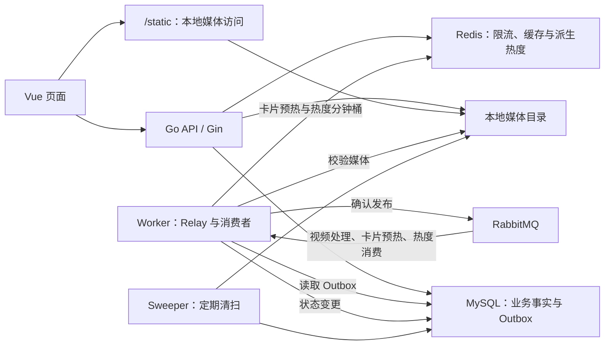
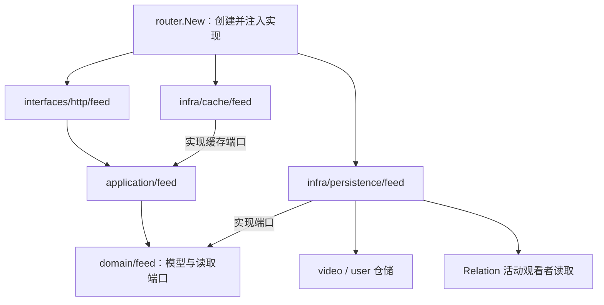
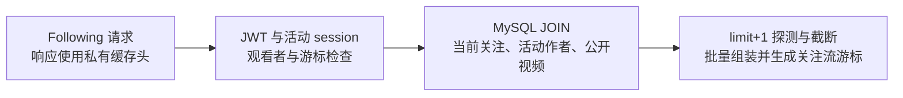
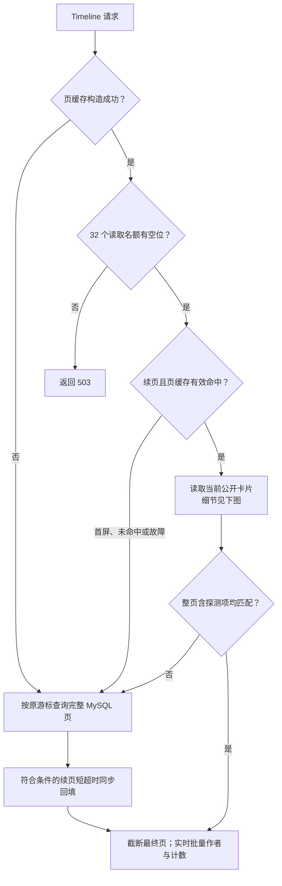
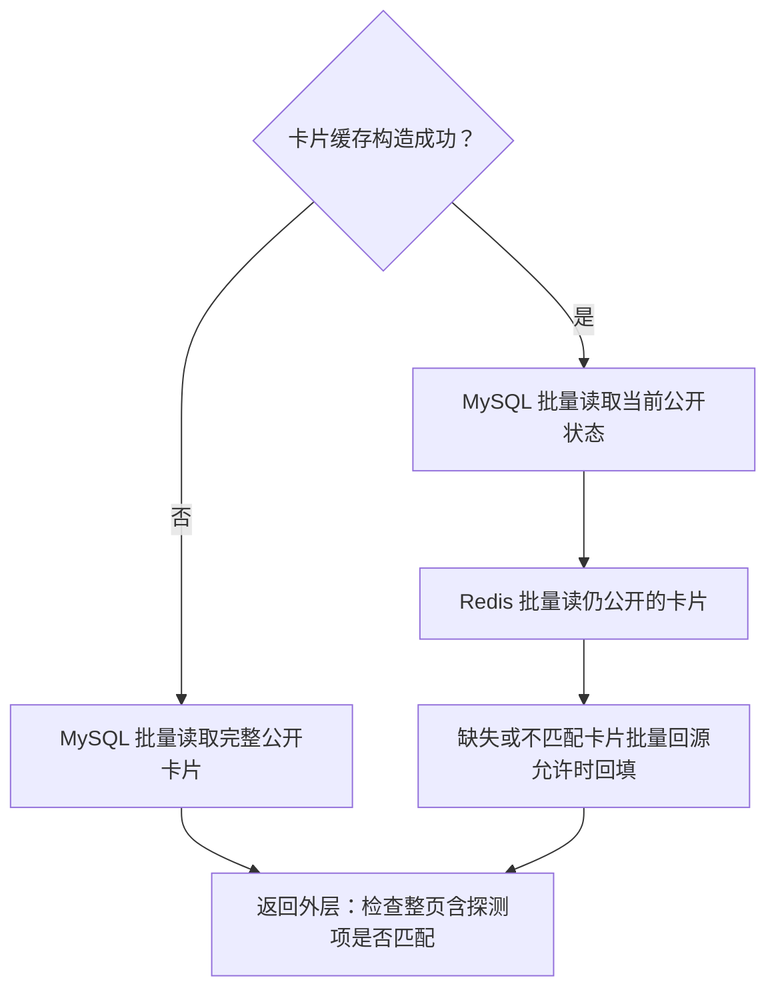
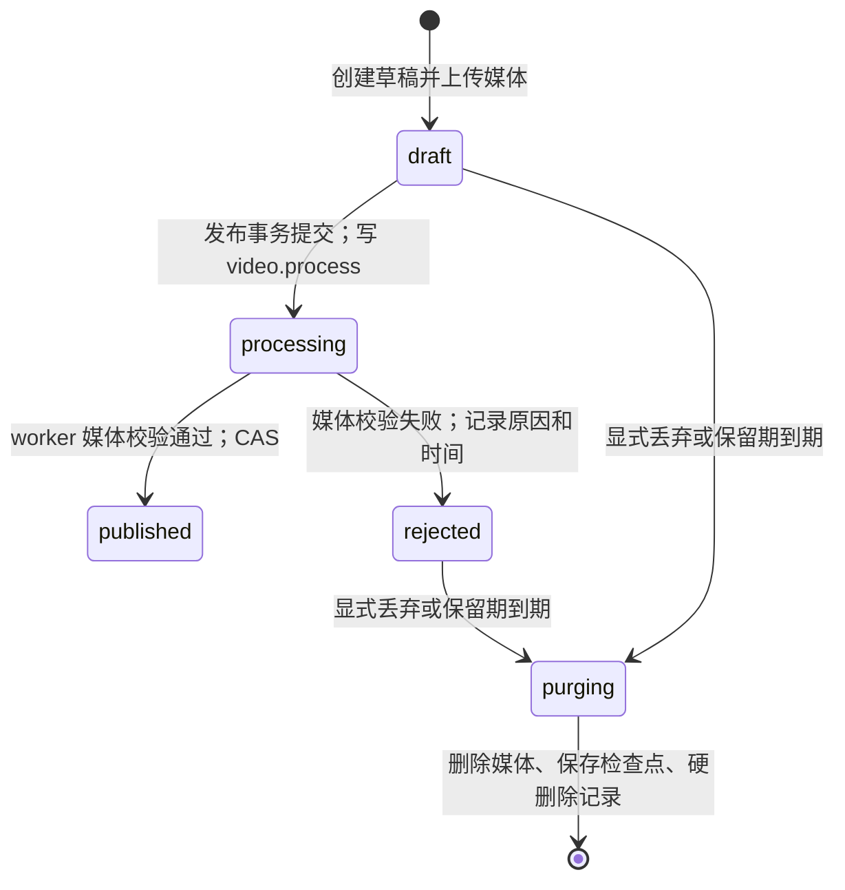
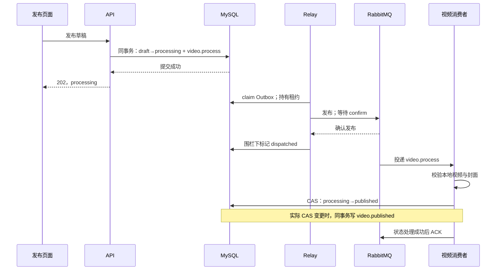
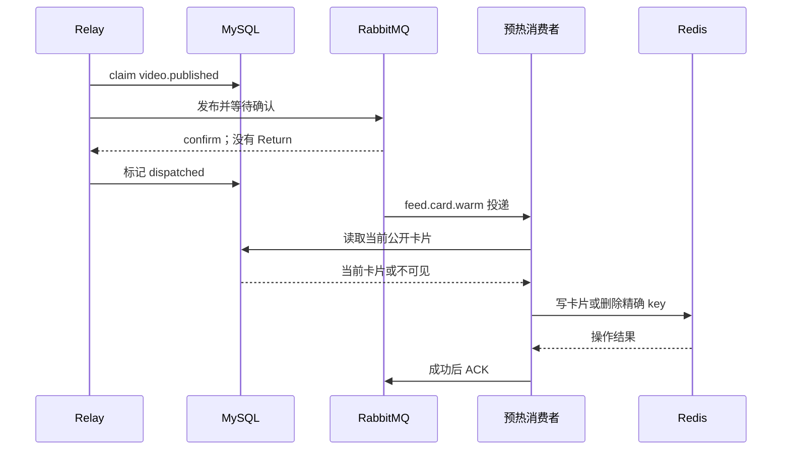
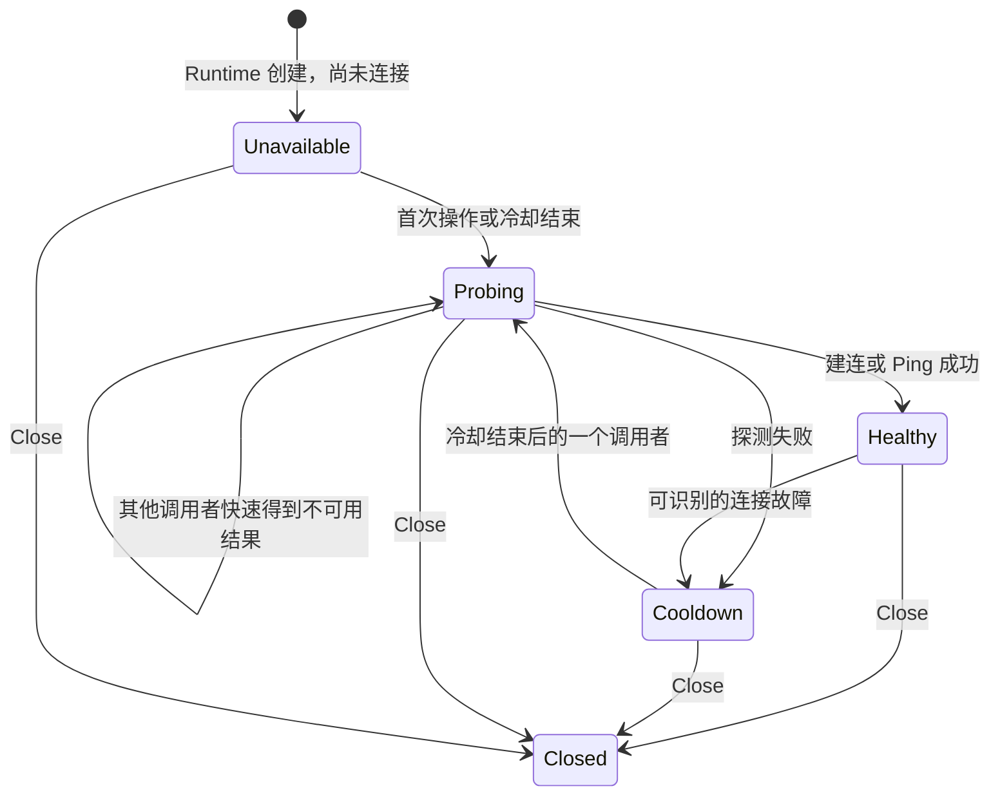
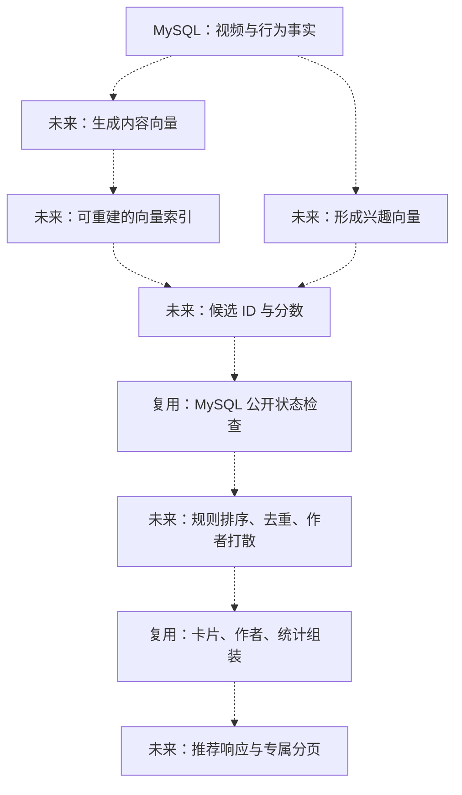

# GoFeed 源码导读

> 阅读基线：2026-10-07，`F:\work\Feed\GoFeed`。Interaction 已完成 HTTP、持久化及统计迁移，Relation 的五个 HTTP、用例与原 v1 游标已迁入四层，R2-B 后端/API 已提交为 `f9481b2`。R2-C 已迁关系 ORM/SQL、计数与 Following 活动观看者依赖并删除旧 social，后端为 `ea36d40`；Following 视频 SQL 仍在 Video。R3-A 三个匿名账户 GET 已迁入独立 Account 四层，后端/API 为 `35a6fe0`；R3-B 注册后端/API 已提交为 `a834d46`。R3-C 登录、刷新与退出的用例/HTTP 已迁入 Account，未提交，等待 review；会话/CAS/JWT 复用旧 Auth，其他写入仍在旧 User。实施边界见开发计划第 6.8–6.11 节，提交摘要见第 6.4 节，验证与缺口见第 5 节。本文从当前源码推导；Hot/Recommend、完整热度覆盖及指标出口尚未实现。
>
> 本文用于理解源码。运行与配置看 [README](../README.md)，接口字段看 [API](../API.md)，未完成设计与历史验收看 [开发计划](./DEVELOPMENT_PLAN.md)。本文中的“源码入口”均可直接点击。

## 阅读导航

- [1. 项目全貌与能力边界](#1-项目全貌与能力边界)
- [2. 目录、分层与依赖方向](#2-目录分层与依赖方向)
- [3. 数据模型与公开不变量](#3-数据模型与公开不变量)
- [4. Timeline：一次 Feed 请求怎样完成](#4-timeline一次-feed-请求怎样完成)
- [5. Following：关注关系如何变成视频流](#5-following关注关系如何变成视频流)
- [6. 多层缓存：页缓存、卡片缓存与实时数据](#6-多层缓存页缓存卡片缓存与实时数据)
- [7. 发布链路：事务、Outbox、消费与预热](#7-发布链路事务outbox消费与预热)
- [8. 抗风险亮点：降级、隔离、围栏与恢复](#8-抗风险亮点降级隔离围栏与恢复)
- [9. 账户、互动与媒体清扫](#9-账户互动与媒体清扫)
- [10. 前端：分页并发与播放生命周期](#10-前端分页并发与播放生命周期)
- [11. 观测、运行与验证边界](#11-观测运行与验证边界)
- [12. 向量与推荐：当前边界及未来接入位置](#12-向量与推荐当前边界及未来接入位置)
- [13. 建议阅读顺序与自检题](#13-建议阅读顺序与自检题)

## 1. 项目全貌与能力边界

GoFeed 是一个 Go/Gin + Vue 的短视频系统。它已覆盖账户会话、草稿上传、异步发布、视频流、关注、点赞、评论和后台回收。理解项目时，先记住三个职责：

1. **MySQL 保存业务事实**：用户、会话、视频状态、互动关系和待派发事件。
2. **Redis 加速或限制访问**：当前用于注册/登录限流、Timeline 页缓存、基础卡片缓存及热度分钟桶；热度是 MySQL 互动事实的派生结果，尚未用于 Hot 读取。
3. **RabbitMQ 承接异步处理**：当前用于视频媒体校验与发布后卡片预热，事件从 MySQL Outbox 派发；独立互动 Relay 向 `feed.heat` 投递事实，当前 worker 同时运行幂等热度消费者。

视频文件保存在本地媒体目录；MySQL 保存相对访问地址和关联信息。数据库中的媒体字段完整，不等于文件此刻一定可读。



### 1.1 哪些能力已经进入请求链路

| 内容                       | 当前状态                 | 阅读时应关注的边界                                        |
| -------------------------- | ------------------------ | --------------------------------------------------------- |
| Timeline 最新视频流        | 已实现，匿名读取         | MySQL 时间排序；首页使用 `/api/feed?scene=timeline`       |
| Following 关注视频流       | 后端与页面已实现         | 认证后查询当前关注关系；当前全部读 MySQL                  |
| Timeline 页缓存            | 已实现，直接装配         | 只读写带游标的后续页，首屏直接查询 MySQL                  |
| 基础卡片缓存               | 已实现，直接装配         | 与页缓存一起装配；只用于后续页的页缓存命中路径          |
| 发布事件与卡片预热         | 已实现，直接装配         | `video.published` → `feed.card.warm`；重读当前 MySQL 卡片 |
| 互动事实存储与可靠派发     | 已提交，直接装配         | `interaction_outbox_events` → Relay → `feed.heat`；派发不是覆盖完成 |
| 热度消费与分钟桶           | 已实现，直接装配         | 原创建分钟归属、Hash 去重及绝对分数 → ZSET；coverage 为 unverified |
| 注册/登录限流              | 已接入                   | Redis 固定窗口；Redis 故障时放行                          |
| Feed 指标与容量基线        | 仅配置及请求回调已提交   | 无采集器、监听装配或容量工具；第 11 节标明边界            |
| Following 混合推拉 / Inbox | 尚未实现                 | 当前关注流没有 Redis Inbox 或粉丝写扩散                   |
| Hot 热榜                   | 尚未实现                 | `scene=hot` 返回 501；已有分钟桶代码，没有重建或快照      |
| Recommend / 向量召回       | 尚未实现                 | `scene=recommend` 返回 501；没有向量模型、索引或检索链路  |

源码入口：[Feed 场景分派](../backend/internal/application/feed/service.go) · [实际路由装配](../backend/internal/router/router.go) · [运行参数配置](../backend/internal/config/config.go)。

## 2. 目录、分层与依赖方向

### 2.1 先找到三个进程入口

| 入口                                                          | 负责什么                                        | 主要依赖                                    |
| ------------------------------------------------------------- | ----------------------------------------------- | ------------------------------------------- |
| [backend/cmd/main.go](../backend/cmd/main.go)                 | API 启动、资源装配、HTTP 生命周期               | MySQL；可恢复 Redis Runtime；不建立 MQ 连接 |
| [backend/cmd/worker/main.go](../backend/cmd/worker/main.go)   | 视频与互动 Relay、视频/预热/热度消费者及队列观测 | MySQL、RabbitMQ、Redis、共享媒体 |
| [backend/cmd/sweeper/main.go](../backend/cmd/sweeper/main.go) | 到期用户、视频、草稿和孤儿媒体清扫              | MySQL、媒体目录；不建立 MQ 连接             |

三个入口可以独立运行。API 接受发布请求与 worker 完成发布是两个不同阶段。

worker 的 `main` 负责加载配置、连接 MySQL/视频 MQ、接收退出信号；`startWorkers` 负责组件构造和八个循环的统一启动与收尾。循环分别是视频 Relay/消费者/MQ 观测、卡片预热消费者/队列观测、互动 Relay、热度消费者/队列观测。热度规则和投影仍在既有 domain/application/infra 包中，入口只组合依赖，没有独立启动包。

这里参考的是 GCFeed 的 `cmd/worker/main.go:startWorkers` 编排方式。GCFeed 没有独立热度消费者，互动应用服务直接调用 Redis 计分；GoFeed 保留 MySQL 同事务事实 → Outbox → Relay → 热度消费，避免把参考项目的请求内 Redis 写入当成当前实现。

### 2.2 既有三层业务与 Feed 四层边界并存

```text
backend/
├─ cmd/                         API、worker、sweeper 入口
├─ db/migrations/               表、索引与状态机字段的版本迁移
└─ internal/
   ├─ router/                   HTTP 组合根：创建依赖、注册路由
   ├─ user/ video/             既有 controller → service → repository
   ├─ auth/                    JWT、数据库会话与刷新令牌
   ├─ domain/account/          公开账户/资料、注册规则、凭据/会话及小端口
   ├─ application/account/     匿名读取/原 v1 游标、注册、登录/刷新/退出编排
   ├─ infra/persistence/account/ 旧用户/统计/会话/JWT 适配及 bcrypt 哈希/比较
   ├─ interfaces/http/account/ 匿名读取、注册和会话的参数/DTO/错误
   ├─ domain/feed/             Feed 读模型、场景、读取端口、热度规则
   ├─ application/feed/        分页编排、缓存、卡片预热与热度事实映射
   ├─ infra/persistence/feed/  适配既有 MySQL 仓储
   ├─ infra/cache/feed/        Redis 键、编码、Lua 与超时
   ├─ interfaces/http/feed/    HTTP 参数、认证、响应 DTO
   ├─ domain/interaction/      互动规则、不可变事实与 Outbox 端口
   ├─ application/interaction/ 读写编排、评论游标与租约派发
   ├─ infra/persistence/interaction/ 读取适配、同事务业务/事实及派发状态
   ├─ interfaces/http/interaction/ 点赞状态、评论列表与四种写入口
   ├─ domain/relation/         关注规则、状态、独立列表/位置与读取端口
   ├─ application/relation/    关注读写编排、列表分页与 v1 游标
   ├─ infra/persistence/relation/ 唯一 Follow ORM、关系 SQL 与领域端口实现
   ├─ interfaces/http/relation/ 三个认证关注入口及两个匿名列表的 HTTP/DTO
   ├─ middleware/cache/        Redis Runtime 的故障与恢复状态
   ├─ middleware/ratelimit/    注册/登录限流策略
   ├─ mq/ worker/              MQ 拓扑、连接、确认与事件处理
   ├─ sweeper/                 数据和媒体回收
   └─ observability/ db/ error/ 日志、就绪检查、查询计数、错误映射
```

Feed 采取渐进拆层：通过读取边界和小接口复用已有仓储。互动事实写入、Relay 与热度消费直接装配；六个互动入口、ORM、直接读取及批量统计已归 Interaction。R1-B2 通过外层适配器将领域统计注入 Feed/Video，并组合用户获赞与关注计数；R2-A/B 已迁入五个关系 HTTP、用例及游标，R2-C 将 ORM/SQL 和计数收口到 Relation，并接管 Following 活动观看者检查。Following 的完整视频查询保留在 Video。



这里的箭头表示依赖/装配关系。应用层依赖接口，`router.New` 把实现注入进去；实际请求会调用注入的 SQL 或缓存适配器。Domain 不依赖 Gin、GORM 或 Redis 驱动。HTTP 的 JSON 字段集中在 [dto.go](../backend/internal/interfaces/http/feed/dto.go)，不由 Domain 实体承担。

重点读 [domain/feed/repository.go](../backend/internal/domain/feed/repository.go) 与 [legacy_reader.go](../backend/internal/infra/persistence/feed/legacy_reader.go)：后者复用 `video.Repository`，不会调用旧 `video.Service`，也不会把 Feed 外部游标转换成旧视频外部游标。

## 3. 数据模型与公开不变量

### 3.1 数据表解决什么问题

| 表                    | 保存的事实                                         | 关键源码 / 迁移                                                                                                                         |
| --------------------- | -------------------------------------------------- | --------------------------------------------------------------------------------------------------------------------------------------- |
| `users`               | 用户资料与软删除状态                               | [user/entity.go](../backend/internal/user/entity.go)                                                                                    |
| `auth_sessions`       | 会话、刷新令牌哈希、到期与撤销状态                 | [auth/session.go](../backend/internal/auth/session.go)                                                                                  |
| `videos`              | 作者、媒体引用、发布状态、排序时间、删除及清扫进度 | [video_entity.go](../backend/internal/video/video_entity.go)                                                                            |
| `video_likes`         | 哪个用户点赞了哪个视频                             | [000005](../backend/db/migrations/000005_social_interactions.up.sql)：`(video_id, user_id)` 唯一键                                      |
| `user_follows`        | 谁关注了谁                                         | [000005](../backend/db/migrations/000005_social_interactions.up.sql)：`(follower_id, followee_id)` 唯一键                               |
| `video_comments`      | 评论内容、作者与软删除状态                         | [interaction_model.go](../backend/internal/infra/persistence/interaction/interaction_model.go)                                            |
| `video_outbox_events` | 视频事务产生的待派发事件及派发租约                 | [000006](../backend/db/migrations/000006_video_outbox.up.sql)、[000009](../backend/db/migrations/000009_outbox_publishing_lease.up.sql) |
| `interaction_outbox_events` | 不可变互动事实及可变派发状态，无原对象级联删除外键 | [000010](../backend/db/migrations/000010_interaction_outbox.up.sql)；迁移文件存在不表示目标库已应用 |

点赞数、评论数由关系表按当前页视频 ID 聚合。[000006](../backend/db/migrations/000006_video_outbox.up.sql) 删除了 `videos` 中的冗余计数列，避免关系表与视频计数同时成为事实来源。

### 3.2 “公开”是一组条件

[PublicVideoQuery](../backend/internal/video/video_scope.go) 固定绑定 Video 模型，并同时要求：

- GORM 软删除作用域生效，`deleted_at` 为空。
- `status = published`，`published_at` 非空。
- 视频与封面的 URL、存储文件名、原始文件名均非空。

[IsPublicVideo](../backend/internal/video/video_service.go) 还提供内存结果检查。Feed 页读取、批量卡片、轻量公开状态以及公开统计相关查询复用这些规则。

**`published_at` 在接受发布请求、进入 `processing` 时就写入。** 视频只有在 worker 校验后进入 `published` 才可见，所以时间非空并不能单独证明发布完成。公开排序使用发布请求时刻，不是 worker 完成时刻。

当前统一公开规则没有自动排除已注销作者的所有视频：Timeline 作者读取可返回“已注销用户”占位资料；Following 的 SQL 额外 JOIN 活动作者。这两个场景的作者边界需要分别理解。

### 3.3 读索引时把排序与过滤一起看

以下是迁移声明的索引，不是本次查询真实数据库元数据后的结论：

| 索引                                                                               | 与读取行为的关系                             |
| ---------------------------------------------------------------------------------- | -------------------------------------------- |
| `idx_videos_published_id(published_at DESC, id DESC)`                              | 对应 Timeline 的时间与 ID 排序位置           |
| `idx_videos_author_published(author_id, published_at DESC)`                        | 对应作者历史视频与 Following 的作者候选读取  |
| `uq_user_follows_follower_followee(follower_id, followee_id)`                      | 防止重复关注，并支持当前观看者的关注关系查询 |
| `uq_video_likes_video_user(video_id, user_id)`                                     | 防止重复点赞，并以视频为前导列支持计数读取   |
| `idx_video_comments_video_visible(video_id, deleted_at, created_at DESC, id DESC)` | 对应可见评论与评论分页                       |
| `idx_video_outbox_events_claim(status, next_attempt_at, id)`                       | 对应待派发事件的状态、退避时间与限批位置     |

源码入口：[000001](../backend/db/migrations/000001_init.up.sql) · [000005](../backend/db/migrations/000005_social_interactions.up.sql) · [000009](../backend/db/migrations/000009_outbox_publishing_lease.up.sql)。

存在索引不表示优化器必定使用，也不表示 SQL 不需要扫描或排序。Following 同时过滤关系、作者和公开状态，关注规模及数据分布会影响计划；应对照真实 `EXPLAIN ANALYZE`，不能仅凭 keyset 或 SQL 条数给出容量结论。

## 4. Timeline：一次 Feed 请求怎样完成

先沿首屏直读 MySQL 的路径理解基础链路，再阅读第 6 节的续页缓存分支；当前没有关闭缓存的配置开关。

### 4.1 从页面一路追到 SQL

```text
FeedView.vue
  → usePublishedFeed.loadFirstPage / loadMore
  → listTimelineFeed
  → GET /api/feed?scene=timeline&limit=12&cursor=...
  → Handler.GetFeed
  → Service.GetFeed
  → readTimelinePage
  → Repository.ListTimelinePage
  → video.Repository.GetPublishedVideoList
  → 截断 limit+1 条记录
  → assembleFeedItems：批量统计 + 批量作者
  → feedItemsResponseFromResult
```

源码入口：[前端 API](../frontend/src/features/video/api.ts) → [HTTP Handler](../backend/internal/interfaces/http/feed/handler.go) → [应用 Service](../backend/internal/application/feed/service.go) → [SQL 适配器](../backend/internal/infra/persistence/feed/legacy_reader.go) → [视频仓储](../backend/internal/video/video_repo.go)。

Handler 只允许 `scene`、`limit`、`cursor` 三个单值参数，未知或重复参数会失败。缺省场景是 Timeline；后端缺省 `limit=20`，上限 50；首页显式传 12。`author_id` 不属于 Feed 接口，作者主页继续使用旧 `/api/video?author_id=...`。

### 4.2 分页采用 keyset

仓储按 `published_at DESC, id DESC` 排序。后续页的定位条件可概括为：

```sql
-- 示意条件；公开过滤由 PublicVideoQuery 追加
WHERE published_at < :last_time
   OR (published_at = :last_time AND id < :last_id)
ORDER BY published_at DESC, id DESC
LIMIT :limit_plus_one;
```

例如同一时刻的 ID 为 `105、104、103`，页大小为 2：查询得到 3 条，返回 `105、104`，游标绑定 `104`；下一页才从 `103` 继续。ID 是同时间记录的稳定排序补充。

多查一条用于判断是否还有下一页，避免另外执行总数查询。**探测记录参与页缓存与可见性校验，但不参与最终页的作者和互动批量读取。**

[cursor.go](../backend/internal/application/feed/cursor.go) 将版本、场景、排序版本和位置编码为 Base64URL JSON。它严格检查长度、字段与尾随 JSON；Feed 游标不能跨用到旧视频接口。

Base64 是编码，当前游标没有签名。服务端仍须检查范围、场景和公开条件，不能把游标当权限凭证。keyset 也不是冻结快照：分页过程中后发布完成、删除或关系变化的记录，可能改变可读取集合。

### 4.3 读模型分成三个部分

| 读模型                | 内容                           | 为什么这样拆                           |
| --------------------- | ------------------------------ | -------------------------------------- |
| `FeedPageItem`        | 视频 ID、作者 ID、发布时间     | 描述排序位置与一页成员，适合轻量页缓存 |
| `FeedCard`            | 标题、描述、媒体地址和文件名等 | 展示正文相对稳定，可独立按视频 ID 缓存 |
| `Author` / `FeedStat` | 作者资料、点赞数、评论数       | 经常变化，当前保持实时批量读取         |

`assembleFeedItems` 先校验条目与卡片的 ID、作者、发布时间一致，再对截断后的 ID 去重，调用 `BatchGetStats` 与 `BatchGetAuthors`，最后保持页条目的顺序组装。

在非空、直读 MySQL 的基础 Timeline 路径，源码对应约 4 条 SELECT：视频页 1 条、点赞聚合 1 条、评论聚合 1 条、作者 1 条。它解决逐视频/逐作者查询的 N+1 问题；**固定查询次数不代表固定扫描量或已经证明性能收益。**

## 5. Following：关注关系如何变成视频流

请求入口仍是 `/api/feed`，但 `scene=following` 进入独立分支。



源码入口：[following.go](../backend/internal/application/feed/following.go) → [following_reader.go](../backend/internal/infra/persistence/feed/following_reader.go) → [following_repo.go](../backend/internal/video/following_repo.go)。

### 5.1 关注流查的是当前关系

查询同时 JOIN：

- `user_follows`：`follower_id = viewerID`，`followee_id = videos.author_id`。
- `users`：作者仍未软删除。
- `videos`：完整公开条件和 keyset 位置。

因此新关注一个作者后可以读到该作者较早的视频；取关会影响后续请求。它不是只保留“关注以后新发的视频”的收件箱，也没有跨页关系快照保证。

### 5.2 观看者隔离贯穿后端与前端

Following 游标额外绑定 `viewer_id`。这个身份来自认证上下文，不能由查询参数指定。游标还校验规范 Base64URL，拒绝其他用户、其他场景或旧视频接口的游标。

`GetFeed` 在进入 Timeline 缓存逻辑之前分流到 `getFollowingFeed`，所以 Following **不使用 Timeline 页缓存、卡片缓存，也不占用它们的 32 个读取名额**。这不表示 Following 已有独立的全局并发保护。

认证响应使用 `Cache-Control: private, no-store` 和 `Vary: Authorization`。前端为两个场景保存独立游标，账户退出或切换后会清空状态。

非空 Following 正常路径约 6 条 SELECT：活动 session、活动观看者、视频 JOIN、两条统计聚合、作者批量查询；空页通常约 3 条。认证查询故障可能在 JWT 中间件被归为 401，应用读取失败通常映射为 503，不能假设所有 MySQL 故障都有同一个 HTTP 状态。

## 6. 多层缓存：页缓存、卡片缓存与实时数据

### 6.1 这里的“两层”分别缓存不同对象

当前没有实现进程内 LRU + Redis 的 L1/L2 数据缓存。可以把已有方案理解为**页条目缓存 + 视频基础卡片缓存**，两者都存 Redis，再搭配 MySQL 的实时事实读取。

| 层 / 数据  | 缓存内容                                                   | Key / 读取路径                                            | 默认约束                             |
| ---------- | ---------------------------------------------------------- | --------------------------------------------------------- | ------------------------------------ |
| 页缓存     | 有序 `FeedPageItem`，最多 `limit+1` 条；不存完整 HTTP 响应 | `gofeed:feed:page:v1:timeline:s1:l<limit>:<UTC时间>:<id>` | TTL 30 秒；操作 100ms；载荷 16 KiB   |
| 卡片缓存   | 单个 `FeedCard`；不包含作者详情和互动计数                  | `gofeed:feed:card:v1:<video_id>`                          | TTL 30 秒；操作 100ms；单卡片 16 KiB |
| 公开状态   | 当前可见 ID、作者 ID、发布时间                             | 每次缓存卡片读取前批量查 MySQL                            | 使用完整公开作用域                   |
| 作者与计数 | 当前资料与关系表聚合                                       | 最终页实时批量查 MySQL                                    | 不进入上述缓存                       |

源码入口：[页缓存应用编排](../backend/internal/application/feed/timeline_cache.go) · [缓存卡片读取](../backend/internal/application/feed/cached_card_reader.go) · [Redis 页适配](../backend/internal/infra/cache/feed/page_cache.go) · [Redis 卡片适配](../backend/internal/infra/cache/feed/card_cache.go)。

### 6.2 完整读取分支



API 直接构造页/卡片缓存：页缓存构造失败时使用 MySQL 基础路径；只有卡片缓存构造失败时，页缓存仍保留，卡片按公开规则批量回源。图中的判断是组件构造结果，不对应环境变量开关。页缓存有效命中的卡片读取如下：



图中的数据库步骤失败会返回错误，不会使用旧缓存掩盖。首屏和未装配缓存的基础路径不回填页缓存；当前正常装配时，首屏仍受 32 个 Timeline 读取名额限制。

### 6.3 为什么缓存命中还查 MySQL

Redis 里可能保留已删除视频或旧卡片。`CachedCardReader.BatchGetCards` 先查当前公开状态，只对仍公开的 ID 读取缓存，然后检查卡片与当前 ID、作者、发布时间一致。

页缓存命中后还会检查**整页及最后的探测记录**。只要成员缺失或排序字段不匹配，`readTimelinePage` 就按原游标整页回源，不是简单删除坏成员后凑一页。这样可以重新得到正确的页长度和下一页判断。

卡片缓存坏值或部分缺失则先只批量回源缺失卡片；如果最后仍不能匹配页条目，外层再整页回源。统计和作者继续实时读取，所以点一个赞不会因为卡片 TTL 而固定住计数。

这套检查也允许处理“删除后迟到的缓存写入”：旧值即使再次进入 Redis，后续请求仍通过 MySQL 公开状态挡住它。它不是对所有并发时刻的线性一致承诺，状态检查之后仍可能发生删除；一次请求内的多次 SQL 也没有包在统一快照事务中。

页校验只能确认缓存里的成员仍有效，不能证明缓存页已经包含所有新变得可见的成员。尤其视频的排序时间先于处理完成时间，后来完成的旧位置视频可能要等页缓存过期或重新读取后才能出现。

### 6.4 回填与容量限制的细节

- 缓存正常未命中、坏载荷或过期成员：允许同步、短超时回填。
- Redis 读取故障或缓存操作名额耗尽：直接回源，并跳过本次回填，减少故障期额外操作。
- 回填失败：记录观测，成功的 MySQL 结果仍可返回；请求已取消时遵循取消语义。
- 没有启动脱离请求的后台回填 goroutine。
- 页缓存和卡片缓存共享每个服务实例的 **16 个缓存操作名额**；满额时跳过缓存。
- 装配页缓存后，每个服务实例最多 **32 个 Timeline 读取请求**；满额快速返回 503。
- 卡片批量最多 51 个有效 ID。Lua 在 GET 返回字符串前检查长度，超大卡片跳过；页载荷在读取后的解码阶段检查大小，这两种边界不同。

这些是进程内容量约束，不是集群全局限额，也不是同一个缓存 key 的请求合并；当前没有 `singleflight` 回源合并。

### 6.5 缓存收益要怎样理解

页缓存减少重复排序取页，卡片缓存减少重复读取展示字段。它们仍保留公开状态、作者与统计 SQL；卡片未命中还可能增加一次完整卡片读取。因此不能把“缓存命中”推导成“零 SQL”，也不能只凭命中率证明整体更快。

比较时应区分首屏/续页、页缓存/卡片命中、冷缓存/热缓存，并一起看 SQL 次数、扫描量、返回字节、延迟和故障回源压力。当前缓存直接装配，收益与容量仍待测量。

## 7. 发布链路：事务、Outbox、消费与预热

### 7.1 视频状态机



已发布视频的删除采用软删除及后续清扫，是另一条路径，不是这里的草稿 `purging` 流转。

### 7.2 API 接受与实际完成分开

发布接口为 `POST /api/video/auth/drafts/:id/publish`。沿 [video_controller.go](../backend/internal/video/video_controller.go) → [video_service.go](../backend/internal/video/video_service.go) → [UpdateDraftPublication](../backend/internal/video/video_repo.go) 阅读：

1. 校验作者身份、当前草稿状态和媒体字段。
2. MySQL 事务内锁定草稿，条件更新 `draft → processing` 并写 `published_at`。
3. 同一事务创建 UUID 标识的 `video.process` Outbox 事件。
4. 提交成功后返回 **202**，表示接受异步处理。

API 不直接投递 RabbitMQ。MQ 故障时，只要 MySQL 事务成功，请求仍可接受；视频保持处理中，等待 worker 后续恢复。MySQL 事务失败则不能承诺发布已被接受。



视频消费者当前执行路径、大小、扩展名和文件头校验，见 [media_validation.go](../backend/internal/video/media_validation.go)。它还不是视频转码或内容审核流水线。

当前 worker 直接装配发布事件与预热消费，已提交的 `video.published` 继续走独立的派生链路：



### 7.3 Relay 的派发状态不是业务完成状态

`video_outbox_events` 的状态为 `pending → publishing → dispatched`。失败后回到 `pending` 并设置下一次尝试时间；租约到期的 `publishing` 可被接管。

`ClaimPendingOutboxEvents` 用短事务与 `FOR UPDATE SKIP LOCKED` 限批 claim。每次 claim 增加 `attempt`，后续标记派发或释放重试同时校验 `attempt` 与租约时间。**不要在数据库事务中等待 MQ 网络确认。**

Relay 默认每 2 秒一轮、每轮最多 32 条、租约 30 秒。发布失败指数退避至多 5 分钟；不支持的事件类型或不一致快照固定退避，避免热循环。源码见 [outbox_repo.go](../backend/internal/video/outbox_repo.go) 与 [worker.go](../backend/internal/worker/worker.go)。

普通派发确认后才标记 `dispatched`；被接管的 `video.process` 若已观察到对应视频为 `published/rejected`，路由可以按已完成结果收口。**`dispatched` 不是视频处理成功或 Redis 预热完成的消费水位。**

### 7.4 消息与队列边界

| 事件              | 载荷核心内容                                            | 消费队列 / QoS       | 消费职责                                   |
| ----------------- | ------------------------------------------------------- | -------------------- | ------------------------------------------ |
| `video.process`   | `schema_version`、`event_id`、`video_id`、视频/封面路径 | `video.process` / 16 | 校验媒体，CAS 为 `published` 或 `rejected` |
| `video.published` | `schema_version`、`event_id`、`video_id`                | `feed.card.warm` / 4 | 重读 MySQL 当前公开卡片，预热或删除缓存键  |

交换机为 `gofeed.events`；每个消费者都有独立的 `1s/5s/30s` 重试队列及 `<queue>.dead` 死信队列。TTL 到期经死信路由回主队列，不需要延迟消息插件。QoS 是未确认投递的预取上限，不能直接当作并行 worker 数量。

源码入口：[mq.go](../backend/internal/mq/mq.go) · [feed_spec.go](../backend/internal/mq/feed_spec.go) · [relay_route.go](../backend/internal/worker/relay_route.go) · [feed_card_warm.go](../backend/internal/worker/feed_card_warm.go)。

### 7.5 为什么允许重复消息

消息已经进 MQ，但 Relay 在确认或写回 `dispatched` 前断线，后续租约接管可能再次投递。消费者已经提交状态，但 ACK 丢失，也可能再次收到。

当前以“至少一次投递 + 幂等业务处理”应对：

- 视频状态只允许从 `processing` 条件更新；重复处理不会再次完成状态变更。
- 当前 worker 中，`processing → published` 与新增 `video.published` 在同一事务；CAS 未变更不新增事件。
- 卡片预热每次读取当前事实并覆盖同一 key，不依赖旧消息里的展示内容。
- 暂态失败先发布下一档重试消息，收到 broker 确认后才 ACK 原消息。
- 坏载荷、未知版本或消费重试耗尽进入 DLQ；DLQ 需要受控处理，不会自动变成成功。

这不是端到端“恰好一次”。UUID 唯一事件键也不能消除网络中重复投递的可能性。

## 8. 抗风险亮点：降级、隔离、围栏与恢复

### 8.1 Redis 的故障恢复由 Runtime 管理

[middleware/cache/runtime.go](../backend/internal/middleware/cache/runtime.go) 保存连接健康、探测、关闭及下一次重试时间。默认冷却 1 秒；恢复由后续操作触发，而不是后台定时重连任务。



它具备类似熔断与半开探测的作用，但源码没有通用熔断器的失败率窗口。`redis.Nil` 是未命中；Redis 服务端命令错误或当前请求取消，不应一律被当成断线并触发全局冷却。

限流与 Feed 使用不同 Runtime，隔离连接池和故障状态；页缓存与卡片共享一个 Feed Runtime。它们仍可能连接同一 Redis 实例，不能把这种进程内隔离描述成基础设施故障隔离。

### 8.2 RabbitMQ 恢复包括拓扑和信道

[mq/runtime.go](../backend/internal/mq/runtime.go) 在后续发布/取消费信道时发现连接失效，会重建连接、声明完整消费拓扑，并重新创建确认发布器；消费循环重新取得消费信道。旧发布器不能继续绑定已经失效的连接。

当前视频 MQ Runtime 首次连接及每次重连都声明视频处理与卡片预热两个规格，独立互动 Runtime 声明热度规格；两个入口装配都显式开启 mandatory/Return 检查。publisher confirm 表示 broker 确认发布，mandatory/Return 用于检测无法路由的消息，两者都不证明消费完成。Runtime 构造默认值仍是 `mandatory=false`，阅读时应以 worker 的实际装配为准。

worker 启动期连接失败有有限次数退避，耗尽会退出；运行期恢复也依赖持续调用与可用依赖。“自动恢复”不表示无限等待、无故障损失或无积压。

### 8.3 围栏处理旧持有者迟到

| 场景        | 围栏条件                                | 防止的问题                                         |
| ----------- | --------------------------------------- | -------------------------------------------------- |
| Outbox 派发 | `status + attempt + locked_until`       | 租约被新 Relay 接管后，旧 Relay 不能覆盖新派发状态 |
| 视频处理    | `status = processing` 的 CAS            | 重复消息再次发布视频或重复产生发布事件             |
| 草稿清扫    | 随机 `purge_token + lease`              | 失去租约的 sweeper 继续写检查点或删除记录          |
| 前端请求    | 场景 `generation + controller + cursor` | 迟到首屏/续页覆盖用户已经切换后的列表              |

租约主要协调当前持有者，不能阻止旧持有者已经发出的网络请求晚到。正确性仍需要状态围栏、可重复处理以及不可复用的媒体对象路径共同支持。

### 8.4 故障场景速查

| 触发条件                         | 当前处理                                | 代价 / 边界                           | 对应源码                                                                                                                                           |
| -------------------------------- | --------------------------------------- | ------------------------------------- | -------------------------------------------------------------------------------------------------------------------------------------------------- |
| Redis 不可用                     | Timeline 回源；注册/登录 fail-open      | MySQL 压力可能上升；限流暂时失效      | [timeline_cache.go](../backend/internal/application/feed/timeline_cache.go)、[ratelimit.go](../backend/internal/middleware/ratelimit/ratelimit.go) |
| 缓存坏值、视频删除、排序字段变更 | 校验卡片/整页，必要时整页回源           | 仍依赖 MySQL；没有全请求快照一致性    | [cached_card_reader.go](../backend/internal/application/feed/cached_card_reader.go)                                                                |
| Feed 缓存读取名额耗尽            | Timeline 快速返回 503                   | 当前保护只在装配页缓存时生效          | [service.go](../backend/internal/application/feed/service.go)                                                                                      |
| 缓存操作名额耗尽                 | 跳过缓存，读取 MySQL                    | 16 是单实例操作容量                   | [timeline_cache.go](../backend/internal/application/feed/timeline_cache.go)                                                                        |
| 发布时 MQ 不可用                 | 已提交 Outbox 保留，恢复后派发          | 视频暂时停在 processing，需要观测积压 | [worker.go](../backend/internal/worker/worker.go)                                                                                                  |
| Relay 中途退出                   | publishing 租约到期可接管               | 允许重复投递；需幂等消费者            | [outbox_repo.go](../backend/internal/video/outbox_repo.go)                                                                                         |
| 消费暂态失败                     | 确认重试副本后 ACK；最多三档重试        | 耗尽进入 DLQ，需要处置与重放          | [worker.go](../backend/internal/worker/worker.go)                                                                                                  |
| 媒体校验失败                     | CAS 为 rejected，保存原因及时间         | 已接受不等于最终发布成功              | [media_validation.go](../backend/internal/video/media_validation.go)                                                                               |
| 清扫一半失败                     | 保留 purging 与媒体检查点，后续接管重试 | 不把部分删除对象恢复成可发布草稿      | [draft_purge.go](../backend/internal/sweeper/draft_purge.go)                                                                                       |
| MySQL 不可用                     | 就绪检查 503；业务按各自错误映射失败    | 不靠缓存伪造当前业务事实              | [http.go](../backend/internal/observability/http.go)                                                                                               |

### 8.5 默认装配与回退边界

API 直接装配页缓存和卡片缓存，四种互动写入直接使用同事务事实存储；worker 直接装配发布事件/预热、互动 Relay、热度消费及队列观测。七项布尔配置与环境变量入口已经删除，旧配置副本中的同名项不再影响行为。热度窗口、权重、代际与容量继续使用原参数，不新增开关或配置字段。

Redis 缓存失败仍回源 MySQL。计划性回退使用对应代码版本，并保留认识已有事件类型的消费者处理存量；不能删除事实表或伪造派发/消费完成。启动前须应用迁移 `000010_interaction_outbox`。配置包只读取热度参数；[worker/main.go](../backend/cmd/worker/main.go) 的 `startWorkers` 在时间单位转换前检查整数溢出，热度索引构造时统一调用 [HeatPolicy.Validate](../backend/internal/domain/feed/heat.go) 校验窗口、去重保留、权重及容量。入口参照 GCFeed 集中装配视频处理、卡片预热、互动 Relay、热度索引/投影器/消费者及观测循环；主函数处理配置加载、连接和关闭信号，收到取消后调用返回的收尾函数，等待循环退出再关闭资源。

组件装配、队列声明与进程启动都不能证明窗口覆盖完整，Hot/Recommend 仍为 501。R1-A/R1-B1 均未执行部署或业务库迁移，也未作热度窗口完整性验收。

## 9. 账户、互动与媒体清扫

### 9.1 JWT 与数据库会话共同决定认证

[middleware/jwt/jwt.go](../backend/internal/middleware/jwt/jwt.go) 先解析 Bearer JWT，再用 `session_id + user_id` 校验数据库中的活动会话。JWT 签名有效不等于会话仍有效。

[auth/session.go](../backend/internal/auth/session.go) 只持久化刷新令牌的 SHA-256 哈希；刷新时用预期旧哈希条件更新成新哈希，避免同一个旧刷新令牌被重复轮换。退出登录可撤销当前会话；用户相关流程还会撤销其会话。

Following 另外检查观看者有效。匿名 Timeline 不会因携带 token 而自动返回“我是否点赞”等个性化字段；当前 DTO 返回的是公共作者与统计。

三个匿名账户 GET 从 [Account Handler](../backend/internal/interfaces/http/account/handler.go) → [Application](../backend/internal/application/account/service.go) → [Domain 读取/统计端口](../backend/internal/domain/account/repository.go) → [Infrastructure](../backend/internal/infra/persistence/account/legacy_reader.go) 读取。公开账户、资料统计和 ID 位置不携带 ORM/HTTP 标签；内层只依赖标准库及独立领域模型，旧 User、UserCursor、ProfileMetrics 和 GORM 错误仅在 Infrastructure 转换。

列表没有 limit/cursor 时继续复用 user.Repository 全量读取；任一参数存在即分页，Gin GetQuery 保留空值存在性，`?cursor=` 使用默认 20，`?limit=`/0/超出 1–50 先报 limit 错误。Application 保留 [v1 编解码](../backend/internal/application/account/cursor.go) 的 RawURLEncoding、v/k/i、version=1、kind=users、非零 ID 及原字段检查，再将独立位置交给旧仓储。原 SQL 的 id ASC/id > ID 不变，多读一条，以实际返回末条 ID 续页；[DTO](../backend/internal/interfaces/http/account/dto.go) 保持 user/users/account、资料 omitempty、四项零值统计、空数组和末页省略游标。

资料按账户→完整公开视频数→获赞→粉丝→关注读取并立即传播失败。视频计数继续调用 video.Repository 的 PublicVideoQuery，统计继续复用 Interaction 的旧资料适配器并转为独立 Account 指标；正常装配共五条 SQL，统计部分三条，未注入统计仍返回零值。旧读取 Controller/Service、pagination.go 与无用途读取类型已删除；头像仍用的 Service.GetByID 和其他共享响应保留，R3-C 已删除无用途 publicUser/旧登录响应，会话 DTO 归 Account。User/AuthSession ORM 与作者 GetByIDs 未变。现有流程覆盖详情/注销 404 和资料头像；账户旧 v1 为迁移前后源码兼容证据，固定旧账户 v1 续页、资料预算和逐步失败尚无持续断言，不能用关系列表 v1 代替，详见[开发计划第 6.9 节](./DEVELOPMENT_PLAN.md#69-r3-a-三个匿名账户读取已提交)。

注册走 [Account RegistrationHandler](../backend/internal/interfaces/http/account/registration.go) → [RegistrationService](../backend/internal/application/account/registration.go) → [Domain 注册规则/输入](../backend/internal/domain/account/registration.go) → [Creator](../backend/internal/infra/persistence/account/legacy_creator.go) → 原 user.Repository.Create。它与三个匿名读取复用 Account 包和公开 DTO，独立装配注册依赖。限流仍先执行；ShouldBindJSON 与原 required/min/max 标签先按 rune 校验，成功后才对用户名 TrimSpace 并按 Go len 字节长度检查 3–32，密码不 Trim、按字节检查 8–72。Application 的小 Hash 端口由 [BcryptPasswordHasher](../backend/internal/infra/persistence/account/password_hasher.go) 使用 GenerateFromPassword/DefaultCost 实现，始终先哈希再 Create，包括重名请求。

创建适配器只将独立 CreateInput 转为旧 User，复用原仓储的唯一键/1062 处理并将旧错误转换为领域错误；不预查重、不重读、不增加 SQL 或外层事务。大小写语义和软删除用户名占用不变。返回 201 + user 包装及原公开字段，avatar_url/bio 仍 omitempty；不返回密码/软删除字段，不创建会话/令牌。400/409/500 文案及原 Redis Key、5 次/小时、429/Retry-After/fail-open 均保留。确认引用后已删除旧注册 Controller/Service 方法与 CreateRequest；改名/改密仍使用的错误和 bcrypt、头像所需 Service.GetByID、仓储 GetByUsername 及 ORM 保留。以上为源码兼容证据，R3-B 实施轮完成 vet/build 与差异检查；提交轮代码未变，沿用该结果，没有运行 Go 测试或真实注册回归，剩余专项见[开发计划第 6.10 节](./DEVELOPMENT_PLAN.md#610-r3-b-注册接口已提交)。

登录、刷新和退出走 [Account SessionHandler](../backend/internal/interfaces/http/account/session.go) → [SessionService 用例](../backend/internal/application/account/session.go) → [独立会话/凭据端口](../backend/internal/domain/account/repository.go) → [会话适配](../backend/internal/infra/persistence/account/legacy_sessions.go)与[凭据适配](../backend/internal/infra/persistence/account/legacy_credentials.go)，后者复用原 User 仓储及 [SessionService/Repository](../backend/internal/auth/session.go)。密码比较和访问令牌签发分别由小端口委托 bcrypt 与 [原 JWT 签发](../backend/internal/auth/jwt.go)，内层仅依赖标准库和 Domain，旧类型与错误仅在 Infrastructure 转换。

登录仍先限流、binding，再只 TrimSpace 用户名、读取密码哈希并比较，先保存七天会话后签发十五分钟 JWT；没有复用注册的字节长度规则，密码保持原样。不存在用户或比较失败为 401，其他凭据读取错误为 500 failed to authenticate，会话创建阶段任意错误为 500 failed to create session。刷新原样使用 refresh_token，先查活动会话并以旧刷新哈希做 CAS 轮换，保留 session ID 和 expires_at，再读当前用户、签发 JWT；轮换阶段任意错误均为 401 invalid refresh token，读取用户失败仍尝试撤销后返回同一 401，签发失败为 500 failed to create access token。退出由原 [JWT 中间件](../backend/internal/middleware/jwt/jwt.go) 验证后只撤销当前会话，成功为空 204，身份缺失或任意撤销错误为 401 invalid or expired token。公开 user 保留原字段和 omitempty。

登录落库后的签发失败、刷新 CAS 后的读取/签发失败仍没有外层回滚。旧会话算法/SQL、JWT 中间件、注册与匿名读取未改；仅删除确认无引用的旧入口/DTO/助手，保留改密/注销事务和头像读取。以上为源码兼容证据，vet/build 已通过，未运行 Go 测试或真实 HTTP/MySQL/Redis 会话回归；尚未提交，等待 review，详见[开发计划第 6.11 节](./DEVELOPMENT_PLAN.md#611-r3-c-登录刷新与退出已实现待-review)。

### 9.2 互动先保存关系，再读取聚合

[Relation Handler](../backend/internal/interfaces/http/relation/handler.go) → [Application](../backend/internal/application/relation/service.go) → [Domain 端口](../backend/internal/domain/relation/repository.go) → [Relation Repository](../backend/internal/infra/persistence/relation/repository.go) → MySQL。

关注状态、关注与取关使用这条链路。Domain 先校验非零 ID 与自关注限制，Application 按当前用户→目标用户校验活动账户，再查询或修改关系并独立读取粉丝数；活动用户的 GORM 不存在结果在 Infra 转换为领域错误。200 响应仍为 `following`、`follower_count`，未知存储错误仍使用原 `social operation failed` 安全文案；写入成功后计数失败不撤销已完成的关系变更。

两个匿名粉丝/关注列表也从 Relation Handler 进入。独立 [领域模型](../backend/internal/domain/relation/entity.go) 包含公开资料、关系时间/ID 和分页位置，不携带 ORM/HTTP 标签；Domain/Application 不导入旧 social 或 Gin/GORM。HTTP 先解析路径 ID 和 limit 文本，Application 再依次检查活动目标、limit 范围及 [原 v1 游标](../backend/internal/application/relation/cursor.go)，默认/显式 0 为 20，上限 50，使用 `limit+1` 探测。游标保留 RawURL Base64 的 `v/k/r/p/i` 字段及顺序，绑定列表与目标用户，取实际返回页末条的关系时间和关系 ID。

[list_reader.go](../backend/internal/infra/persistence/relation/list_reader.go) 直接使用领域位置，将原 SQL 的扫描行映射为独立领域行，旧列表/位置转换已删除。目标校验 + 一次 JOIN 固定两条 SQL；按 `(follows.created_at DESC, follows.id DESC)` 严格 keyset 并过滤注销对端，时间不截断。[HTTP DTO](../backend/internal/interfaces/http/relation/dto.go) 保持 `user`/`followed_at`、资料 omitempty、关系 ID 隐藏、空数组与末页省略游标；列表保留旧 GORM 不存在错误的 404 文案映射，未知存储错误仍为安全 500。唯一 [Follow ORM](../backend/internal/infra/persistence/relation/follow.go) 与原关注 SQL 已迁入 Relation，生产与保留测试不再引用旧 social，旧包已删除。既有流程在真实 MySQL 下继续读取迁移前固定的两个 v1 游标，验证同时间 ID 边界、毫秒精度及与新游标一致的续页。

点赞与关注通过关系表唯一键处理重复创建，删除返回是否确实发生变更；取关物理删除，评论使用软删除。Feed 的点赞和评论数来自 [statistics.go](../backend/internal/infra/persistence/interaction/statistics.go) 的当前页批量聚合：非空 ID 批次固定执行点赞、评论两条 `IN (...) GROUP BY video_id`，预先为每个 ID 补零，评论聚合遵循软删除作用域；空批次返回非 nil 空 map 且不查询。R2-C 实施边界及提交状态见开发计划第 6.8 节。

点赞状态与评论列表从 [router.go](../backend/internal/router/router.go) → [Interaction handler](../backend/internal/interfaces/http/interaction/handler.go) → [Application service](../backend/internal/application/interaction/service.go) → Domain Reader → [reader.go](../backend/internal/infra/persistence/interaction/reader.go) 直接读取 MySQL，不再调用 social.Repository。点赞状态先复用 `video.PublicVideoQuery` 校验完整公开视频，再校验活动用户、查询关系及实时计数；认证仍先由 JWT/session 中间件校验。评论由 [cursor.go](../backend/internal/application/interaction/cursor.go) 处理原 v1 字段和视频范围，仓储按 `(created_at DESC, id DESC)` 多读一条，一次 LEFT JOIN 带出全部作者资料，注销作者保留原 ID 与占位名。默认 20、显式 0 和最大 50、空数组及安全错误契约保持不变。旧 social 互动 Controller/Service、评论游标和读取 SQL 已删除。

四种写操作直接走 [HTTP handler](../backend/internal/interfaces/http/interaction/handler.go) → [application/interaction/service.go](../backend/internal/application/interaction/service.go) → [writer.go](../backend/internal/infra/persistence/interaction/writer.go)，读写统一使用 [interaction_model.go](../backend/internal/infra/persistence/interaction/interaction_model.go) 的 `VideoLike`、`Comment`，持久化包与领域包区分同名类型。实际点赞/取消、评论创建/软删除与 `interaction_outbox_events` 在同一事务提交；创建/取消先锁活动用户，再锁并复核完整公开视频。删评只锁活动用户及当前未删除评论并复核归属，不额外要求视频公开。重复点赞/取消不追加事实，重复删评仍为 404，评论 POST 仍无请求幂等键。提交后的统计/作者读取失败不撤销已提交事实。

必要互动夹具直接使用 Interaction ORM。[legacy_reader.go](../backend/internal/infra/persistence/interaction/legacy_reader.go) 将独立领域统计转换为旧 `video.EngagementCounts`，router 同时注入 Video 与 Feed；资料适配器按获赞→粉丝→关注组合旧 `user.ProfileMetrics`。获赞使用完整 `video.PublicVideoQuery`，粉丝/关注通过 Relation CountReader 注入直接仓储，仍只统计活动对端账户；accountID=0 不查询，有效 ID 的统计部分仍为三条 SQL，出错即停止并返回零值和原错误。过渡的 user/video 类型转换留在外层，旧 user/video 不反向导入该持久化包。[FollowingReader](../backend/internal/infra/persistence/feed/following_reader.go) 通过窄接口调用 Relation RequireActiveUser，将不存在映射 Feed 401、其他依赖失败映射安全 503；会话校验、私有头与观看者游标保持原契约，非空六条/空页三条 SQL。完整视频与当前关系 JOIN 仍在 [video/following_repo.go](../backend/internal/video/following_repo.go)，Account/Video 剩余边界留给 R3/R4。迁移摘要见[开发计划第 6.4 节](./DEVELOPMENT_PLAN.md#64-已提交迁移摘要)，查询预算与未覆盖范围见第 5 节。

[domain/interaction/event.go](../backend/internal/domain/interaction/event.go) 固定 `event_id`、版本、类型、互动 ID、正负 delta、变更时间及原创建时间；[event_model.go](../backend/internal/infra/persistence/interaction/event_model.go) 的 `OutboxEvent` 映射 [000010](../backend/db/migrations/000010_interaction_outbox.up.sql) 的独立事实表，原视频/互动删除不会级联清理该表。2026-10-05 本机 feedsystem 已完成版本 9→10、dirty=false 的增量迁移及结构核对，摘要见开发计划第 5.1 节；其他部署目标仍须单独确认。

[worker/main.go](../backend/cmd/worker/main.go) 直接装配 [InteractionRelay](../backend/internal/worker/interaction_relay.go) → [Dispatcher](../backend/internal/application/interaction/dispatcher.go) → [Outbox 适配器](../backend/internal/infra/persistence/interaction/outbox.go)。每轮最多逐条派发 32 个已提交事实，领取使用数据库时钟、30 秒租约与递增 attempt；确认发布后仅在有效租约内标记 dispatched，失败退避，同事件可能重复投递。MQ 编码使用持久事实，不重新读取当前业务行拼装历史。

[interaction_spec.go](../backend/internal/mq/interaction_spec.go) 声明 `interaction.changed` → `feed.heat`、QoS 4、`1s/5s/30s` 重试和 DLQ；独立 Runtime 开启 mandatory/Return 检查。[HeatConsumer](../backend/internal/worker/feed_heat.go) 负责严格解码、有限重试/死信和成功后的 ACK，[HeatProjector](../backend/internal/application/feed/heat_projector.go) 将不可变事实映射到 [领域热度规则](../backend/internal/domain/feed/heat.go)，再调用 [Redis 热度适配器](../backend/internal/infra/cache/feed/heat_index.go)。

新增与撤销归属同一原创建分钟。Lua 状态 Hash 同时保存收据、绝对分数及容量计数，再把绝对分数写入 ZSET；重复投递读取当前分数补写 ZSET，不重复加分，撤销先到保留负贡献。桶过期由原创建分钟确定，不因重投延长，过期或已离开窗口且不存在的桶不重建。同代际规则指纹不一致、已有状态损坏或分钟容量超限均不伪造成功。

热度消费直接装配，处理上下文 5 秒、Redis 单次操作 100ms。Lua 的长度主要来自规则/类型/容量检查、event_id 去重、绝对分数补写及原分钟到期处理；这些逻辑用于处理重复与乱序，不在 API 请求中计算整张热榜。Hash 收据仍在时，重复投递可补写 ZSET；去重状态也丢失时不能据此保证恢复，属于后续 B2。

`coverage=unverified` 的含义是“窗口完整性尚未证明”。[heat_index.go](../backend/internal/infra/cache/feed/heat_index.go) 只在创建代际 meta 时写这个固定值，当前没有验证后更新它的代码；worker 日志也固定输出这个值。这是源码行为说明，本轮没有读取实时 Redis。

| 当前可观察的状态 | 能证明什么 | 仍不能证明什么 |
| --- | --- | --- |
| Redis 可连接、分钟 ZSET 有数据 | 某些操作可访问 Redis | 历史采集无缺口、整个窗口已消费 |
| Outbox 为 dispatched | broker 发布已确认且派发标记成功 | 事件已计分，或没有重试/DLQ 积压 |
| 单次消费成功、重复或过期跳过 | 此投递已按当前规则处理 | 窗口内其他事实齐全、索引可用于完整热榜 |

目前只有 `HeatIndex.ApplyHeat` 写入端口及处理结果、单事件 lag、队列深度，没有窗口榜读取、持久覆盖水位、事实重建或 MySQL 快照。`GetFeed` 仍将 Hot/Recommend 映射为 501；七项能力直接装配只覆盖已实现链路。下一步 B2 的扫描、重建和快照边界见 [开发计划第 3.8 节](./DEVELOPMENT_PLAN.md#38-f4-b2事实重建与-mysql-快照的下一步边界未实现)，真实故障与覆盖验收仍待补。

### 9.3 文件系统与数据库无法共用一个事务

[LocalStorage.Save](../backend/internal/video/storage.go) 将上传媒体放入受控目录，清洗文件名并追加随机对象标识，使用独占创建避免覆盖已有文件。原始展示名与存储对象名分别保存。

文件落盘后，数据库绑定可能失败；文件删除成功后，检查点写入也可能失败。项目分别用以下机制处理：

- **草稿清扫**：不可逆进入 `purging`；视频、封面各自保存删除检查点。重试只处理未完成槽位；不存在的文件按删除成功处理。
- **租约接管**：先校验/续约 token，失去租约就停止继续推进；不让旧持有者写回新任务。
- **孤儿文件回收**：只枚举当前本地存储规则生成的规范对象，默认宽限 24 小时、每批最多 100 个候选；查询用户头像及视频/封面引用，**包含软删除保留期内的记录**，失败对象留待下轮。
- **已发布视频与用户清扫**：软删除先改变可见性，到期后再回收媒体和记录，默认保留期均为 7 天。

源码入口：[draft_purge.go](../backend/internal/sweeper/draft_purge.go) · [media_orphan_purge.go](../backend/internal/sweeper/media_orphan_purge.go) · [media_reference_repo.go](../backend/internal/sweeper/media_reference_repo.go) · [video_purge.go](../backend/internal/sweeper/video_purge.go) · [user_purge.go](../backend/internal/sweeper/user_purge.go)。

孤儿回收的宽限期是在覆盖落盘与绑定之间的短暂窗口，并不是文件系统与数据库的原子事务。现有视频 Outbox 外键会在视频硬删除时级联删除事件，也不应被理解成永久事件审计库。

## 10. 前端：分页并发与播放生命周期

不要只看 [FeedView.vue](../frontend/src/views/FeedView.vue) 的模板。列表正确性主要在 [usePublishedFeed.ts](../frontend/src/features/video/usePublishedFeed.ts)，HTTP 契约在 [api.ts](../frontend/src/features/video/api.ts)。

### 10.1 每个场景都有独立状态

Timeline 和 Following 各自保存视频、游标、首屏/续页加载状态、错误和 `loaded` 标志；另有各自的请求 `generation` 与 AbortController。

首屏重新加载、场景切换、退出/更换账户都会使旧请求失效。接收响应时不仅看请求是否成功，还检查 controller 归属、generation 和续页游标是否仍是当前值。因此浏览器取消之后晚到的响应也不能覆盖新状态。

同一场景续页正在加载时拒绝重复发起；合并按视频 ID 去重，重复 ID 更新已有位置。有限自动重试使用 300ms、900ms 两档；到达上限后显示可重试错误，不无限循环。续页遇到 400 会作废旧游标，后续重新读首屏。

### 10.2 身份变化不等于 token 变化

前端以 user ID 判断观看者切换。正常刷新 token 不清空分页；用户退出或换号会清空两个场景。Following 每次重新进入时刷新服务端列表，以反映关注变化。

页面场景以 URL 查询参数为来源：`/?scene=following` 可直达关注流，未登录时展示登录入口并保留回跳位置。关注请求通过 `withAuthenticatedSession` 获取访问令牌和处理会话恢复。

### 10.3 播放与发布恢复也是生命周期问题

`FeedView.vue` 用 IntersectionObserver 管理可见视频，离开路由、页面隐藏或组件卸载时暂停播放，并释放观察器与请求。

发布页面的恢复入口是 [PublishVideoView.vue](../frontend/src/views/PublishVideoView.vue) 与 [publishResume.ts](../frontend/src/features/video/publishResume.ts)：上传响应丢失不等于服务端上传失败，客户端会读取草稿事实确认媒体状态；202 后再查询处理结果。客户端记住的草稿信息不能替代服务端当前状态。

## 11. 观测、运行与验证边界

### 11.1 已有观测回答哪些问题

| 入口 / 事件                           | 能回答什么                                  | 不能据此推导什么                                |
| ------------------------------------- | ------------------------------------------- | ----------------------------------------------- |
| `/health`                             | API 进程是否存活                            | MySQL、MQ、Redis 或发布闭环是否正常             |
| `/ready`                              | 2 秒内 MySQL 探测是否成功                   | Redis/MQ 健康、表结构齐全、消费积压或媒体完整性 |
| `X-Request-ID`、`http_request`        | 路由、HTTP 状态、耗时与本次数据库查询数     | 完整业务追踪或指标告警已经建立                  |
| `feed_page_cache` / `feed_card_cache` | 命中、回源、坏值、超大跳过、失败与容量结果  | 命中一定带来性能收益                            |
| worker Outbox / 队列快照              | pending/publishing 数量、最老事件与队列深度 | dispatched 即消费完成，或队列深度含全部在途工作 |
| `interaction_relay`                    | 互动单事件派发、重试、租约丢失与标记失败     | 已有热度消费、覆盖水位或热榜积压告警             |
| `feed_heat` / `feed_heat_queue`         | 热度处理、重复、跳过、当前事件 lag 与队列深度 | 最老积压、完整覆盖、重建完成或自动告警           |
| sweeper 事件                          | 每项清扫结果、耗时、删除与失败数            | 所有文件已永久正确回收                          |

源码入口：[observability/http.go](../backend/internal/observability/http.go) · [db/query_counter.go](../backend/internal/db/query_counter.go) · [worker/observability.go](../backend/internal/worker/observability.go) · [sweeper/runner.go](../backend/internal/sweeper/runner.go)。

### 11.2 当前指标回调与容量工作的边界

现有 [Observe 配置](../backend/internal/config/config.go) 与 [Feed Handler](../backend/internal/interfaces/http/feed/handler.go) 的 `RequestObserver` 回调已作为两个生产文件提交为 `2ff0364`。Handler 可在请求完成时报告场景、首屏/续页、状态、条数及耗时；相关测试由其他任务提交为 `d056fe2`，本轮未触碰或运行。

当前 `router.New` 未注入该请求回调，API 入口没有指标采集器或独立监听装配，仓库也没有 `observability/metrics.go` 或 `internal/baseline`。Observe 字段和环境覆盖存在，不表示配置已对外提供 `/metrics`，也不表示 Prometheus、容量工具或 pprof 已实现。页/卡片缓存继续使用现有 stdout 观测。

后续指标模块需补齐有限标签采集、默认关闭的独立回环监听及资源关闭；容量测量继续暂缓。恢复测量时应记录源码、硬件、数据分布、关注规模、并发、p50/p95/p99、错误率、SQL、EXPLAIN 和资源消耗，并在同一环境下比较。当前不据此决定 Following 混合推拉阈值或缓存开启范围，实际计划见 [开发计划](./DEVELOPMENT_PLAN.md)。

### 11.3 阅读运行配置时的顺序

从 [config.go](../backend/internal/config/config.go) 看字段与环境覆盖，再看 [config.example.yaml](../backend/configs/config.example.yaml) 和 [.env.example](../backend/.env.example)，最后看进程入口是否确实装配。YAML 出现字段不代表已接入运行链路。

本地 API 从 `backend` 目录运行 `go run ./cmd`，worker 与 sweeper 分别用 `go run ./cmd/worker`、`go run ./cmd/sweeper`；前端从 `frontend` 运行 `pnpm.cmd dev`。先准备私有配置、创建数据库并显式迁移。应用不自动建库建表，Compose 的建库/迁移属于独立启动服务。

阅读异步发布必须同时考虑 API、worker 与 sweeper 的媒体根目录/共享挂载。独立启动三个进程但访问不同媒体目录，会破坏校验与回收链路。

### 11.4 用测试理解契约，不把测试文件当通过证据

| 要理解的行为                                  | 建议读的测试                                                                                                                                                        |
| --------------------------------------------- | ------------------------------------------------------------------------------------------------------------------------------------------------------------------- |
| 缓存命中、载荷损坏与 MySQL 回源               | [e2e_test.go](../backend/internal/router/e2e_test.go)                                                                                                                |
| 当前关注关系、认证与跨用户游标                | [e2e_test.go](../backend/internal/router/e2e_test.go)                                                                                                                |
| 旧关系 v1 兼容、列表/用户绑定与 Following 关系/认证/预算 | [e2e_test.go](../backend/internal/router/e2e_test.go) |
| MySQL/Redis 下实际卡片读取                    | [e2e_test.go](../backend/internal/router/e2e_test.go)                                                                                                                |
| MySQL → Relay → RabbitMQ → 预热消费者 → Redis | [integration_test.go](../backend/internal/worker/integration_test.go)                                                                                               |
| 草稿部分回收、失去租约与断点继续              | [draft_purge_test.go](../backend/internal/sweeper/draft_purge_test.go)                                                                                              |
| 前端迟到响应、场景与分页                      | [usePublishedFeed.spec.ts](../frontend/src/features/video/__tests__/usePublishedFeed.spec.ts)、[FeedView.spec.ts](../frontend/src/views/__tests__/FeedView.spec.ts) |

当前保留 5 个 Go 测试文件、36 个函数；Feed service_test.go 的 4 个缓存专项与 Video video_repo_test.go 的 11 个专项由独立提交 `a483843` 删除。原 repo_test.go 的六个互动/关注流程与预算函数也不再保留，不将历史通过当作持续覆盖。后续按用户指令不运行 Go 单元测试或包含它们的全量/race 命令；本提交轮只有 vet/build 与差异检查，不能称为真实依赖回归。保留文件可用于源码阅读，历史证据与未覆盖项见开发计划第 5 节；未运行不能算 PASS 或 SKIP。

## 12. 向量与推荐：当前边界及未来接入位置

### 12.1 当前没有 GoFeed 向量实现可供追踪

在当前 GoFeed 的业务源码、迁移、配置及依赖中，没有 embedding 生成、向量字段/索引、相似度检索或兴趣向量更新链路。`SceneRecommend` 只是预留场景值，`GetFeed` 当前返回 `ErrSceneNotEnabled`，HTTP 为 501。

开发计划的顺序是：先收集请求归因、曝光、有效观看和完播事实，再做规则推荐，数据与效果基线成立后评估向量召回。以下内容是**帮助理解扩展位置的概念说明，不是当前已实施方案或接口契约**。

### 12.2 向量解决的是候选召回

可以把内容或用户兴趣表示为若干维度的数值向量。相似度用于从大量视频中找出一批可能相关的候选，例如采用余弦相似度：

```text
similarity(user, video) = dot(user, video) / (norm(user) × norm(video))
```

这里的内容表示来自什么输入、使用什么模型、兴趣怎样由观看行为形成，都需要另外设计。向量召回只提供候选及相关性信号；它不能单独决定内容是否公开、用户是否有权限，也不能替代去重、作者打散、新鲜度与最终排序。

Timeline 当前按时间取候选，Following 当前按关注关系取候选。未来向量的接入位置应主要在**候选来源与推荐策略**，可复用现有卡片、作者和统计组装边界；当前 `Service` 仍直接分派场景，并没有已经建好的通用召回插件体系。



整张图的虚线表示尚未接入的推荐链路；“可复用”表示源码已有基础能力，不表示已经存在推荐调用。

### 12.3 后续设计需要解决的几个问题

| 问题               | 为什么影响正确性                                     | 与 GoFeed 现有机制的关系                                |
| ------------------ | ---------------------------------------------------- | ------------------------------------------------------- |
| 事实与索引的归属   | 索引丢失后应能重建，不能只在向量库保存业务可见性     | 延续 MySQL 事实源与派生系统边界                         |
| 内容/模型版本      | 旧生成任务晚到时可能覆盖新内容的向量                 | 类似 Outbox attempt 围栏，但需要独立内容及模型版本      |
| 删除与失效         | 相似搜索可能召回已删除的视频                         | 复用 MySQL 当前公开状态检查，不仅依靠索引删除事件       |
| 曝光归因与幂等     | 没有可靠行为事实，兴趣更新与效果评估会失真           | 需要新增行为事实契约，当前未实现                        |
| 候选不足、检索超时 | 需要对规则候选或 Timeline 定义显式降级               | 复用非权威依赖故障的思路，冻结推荐专属响应契约          |
| 分页稳定性         | 推荐分数及用户兴趣变化后，时间游标不足以保持分页语义 | 需要绑定策略/候选快照等版本，不能直接沿用 Timeline 游标 |

同样，Hot 需要分钟桶热度、MySQL 快照与独立分页；当前只实现了分钟桶消费，快照和 Hot 读取仍在计划中。Following 混合推拉是未来的派生 Inbox/作者索引。它们与向量召回分别解决热度、关注分发和相关候选问题，不能把三者混为一个功能。

## 13. 建议阅读顺序与自检题

### 13.1 用八站串起完整系统

| 顺序 | 阅读文件 / 方法                                                                                                                                                                                                                                     | 读完应能回答                                              |
| ---- | --------------------------------------------------------------------------------------------------------------------------------------------------------------------------------------------------------------------------------------------------- | --------------------------------------------------------- |
| 1    | [router.go](../backend/internal/router/router.go)、[cmd/main.go](../backend/cmd/main.go)                                                                                                                                                            | 哪些接口匿名，哪些认证？缓存到底在什么条件下被装配？      |
| 2    | [domain/feed/entity.go](../backend/internal/domain/feed/entity.go)、[repository.go](../backend/internal/domain/feed/repository.go)                                                                                                                  | 页条目、卡片、作者、统计各自承载什么？                    |
| 3    | [Service.GetFeed / assembleFeedItems](../backend/internal/application/feed/service.go)、[cursor.go](../backend/internal/application/feed/cursor.go)                                                                                                 | 场景如何分派？为什么多查一条？在哪一步截断？              |
| 4    | [legacy_reader.go](../backend/internal/infra/persistence/feed/legacy_reader.go)、[video_repo.go](../backend/internal/video/video_repo.go)、[video_scope.go](../backend/internal/video/video_scope.go)                                               | SQL 如何实现排序、公开过滤与批量读取？                    |
| 5    | [following.go](../backend/internal/application/feed/following.go)、[following_repo.go](../backend/internal/video/following_repo.go)                                                                                                                 | 关注流怎样绑定身份，怎样反映当前关系？                    |
| 6    | [timeline_cache.go](../backend/internal/application/feed/timeline_cache.go)、[cached_card_reader.go](../backend/internal/application/feed/cached_card_reader.go)、[cache/runtime.go](../backend/internal/middleware/cache/runtime.go)               | 缓存命中为什么仍查 DB？哪里回源、哪里 503、哪里快速放行？ |
| 7    | [UpdateDraftPublication](../backend/internal/video/video_repo.go)、[outbox_repo.go](../backend/internal/video/outbox_repo.go)、[worker.go](../backend/internal/worker/worker.go)、[feed_card_warm.go](../backend/internal/worker/feed_card_warm.go) | 事务、确认、ACK、CAS 与预热分别提供什么保证？             |
| 8    | [draft_purge.go](../backend/internal/sweeper/draft_purge.go)、[usePublishedFeed.ts](../frontend/src/features/video/usePublishedFeed.ts)、[FeedView.vue](../frontend/src/views/FeedView.vue)                                                         | 后台删除与前端请求怎样跨失败恢复并避免旧状态覆盖？        |

第一遍顺着无缓存 Timeline 和正常发布链路读；第二遍再逐个追失败分支；第三遍对照测试检查自己的理解。每个复杂方法优先看输入、事实读取、状态条件、外部副作用和错误返回。

### 13.2 带着具体场景复述源码

1. **页大小 12，MySQL 返回 13 条：** 哪条生成下一页游标？哪条只用于探测？作者与统计是否读取第 13 条？看 `GetFeed` 和 `TestGetFeedProbeRecordExcludedFromBatches`。
2. **缓存页最后的探测视频被删除：** 是否只丢弃这条？沿 `pageCardsMatch` 找到整页按原游标回源。
3. **两层缓存全命中：** 还会查哪些表？沿公开状态、两条统计聚合和作者读取核对。
4. **用户 A 的 Following 游标交给 B：** 哪一步拒绝？身份从哪里来？看 `decodeFollowingCursor` 和 Handler 的 JWT 装配。
5. **MQ 在发布请求时宕机：** API 是否已经接受？视频在哪个状态？谁负责重放？看发布事务和 Relay。
6. **MQ 已确认但 dispatched 写回失败：** 后续为什么可能重复？旧 Relay 为什么不能覆盖新租约？看 `attempt` 围栏。
7. **视频已 published，但消费者 ACK 丢失：** 重投会不会新增第二个发布事件？看 `CompleteVideoProcessing` 的 CAS 与事务。
8. **预热消息晚到，视频已经软删除：** 消费者会信消息还是重新查事实？晚写缓存又由哪里挡住？看 `CardWarmer.WarmCard` 与 `CachedCardReader`。
9. **封面删除失败，但视频文件已经删除：** 下一轮从哪里继续？是否可以把对象恢复成 draft？看 purging 和两个媒体检查点。
10. **快速切换 Timeline/Following，旧首屏最后返回：** 为什么不会覆盖当前页？看 `generation`、AbortController 与场景独立状态。

### 13.3 最容易读错的边界

| 容易混淆的判断                   | 应采用的判断依据                                  |
| -------------------------------- | ------------------------------------------------- |
| 有 SceneRecommend 就有推荐系统   | 看 `GetFeed` 实际分支、配置装配和请求结果         |
| 有两层缓存就几乎不查数据库       | 看公开状态、作者、计数与冷缓存额外读取            |
| HTTP 202 就说明发布完成          | 202 是接受；`published` 才是公开可见状态          |
| Outbox dispatched 就说明预热完成 | 它记录派发；消费及 Redis 写入需要另外的证据       |
| UUID、CAS、ACK 就是恰好一次      | 网络确认有不确定窗口；设计允许重复并保证处理幂等  |
| keyset 就是分页快照              | 它定位排序位置；当前事实与可见集合仍会变化        |
| fail-open 就是防滥用能力更强     | 它优先业务可用性，故障期 Redis 限流能力会失效     |
| 缓存单探针就是每个 key 单次回源  | 单探针协调 Redis 恢复；当前没有 key 级请求合并    |
| `/ready` 成功就是整个系统健康    | 当前只证明 MySQL 可探测，不证明异步链路与媒体状态 |
| 工作树已有指标代码就有容量结论   | 需要匹配提交、环境、数据和实际测量报告            |
